# 1. 前言

一般安服在做项目的时候，经常会遇到需要做应急响应的工作，所谓应急响应就是当网站出现异常的时候，根据相关的问题对其进行溯源分析，发现问题，解决问题。

# 2. 网络安全异常特征

这里大概汇总一下网络安全异常的一些特征，不一定是标准的，具体的特征有时候还需要针对不同的木马或环境来进行分析。

```
主机安全：CPU内存满负载、服务器重启、异常日志等
网站安全：网页挂马、黑链、webshell、文件篡改等
流量安全：网络堵塞、异常流量等
数据安全：数据泄露、数据篡改等
文件安全：文件丢失、文件篡改、文件加密、文件被锁等
设备告警：防火墙告警、杀毒软件告警、态势感知、IPS告警等
```

# 3. 应急响应流程

应急响应分为六个阶段：

**准备**—**检测**—**遏制**—**根除**—**恢复**—**跟踪**，但是在真实的应急响应中通常很难按照这个流程来进行应急响应，往往是根据问题来具体的分析处理，例如，按照这个流程第二阶段是判断事件是否还在运行，谁真的去做准备，估计第一件事就是拔网线。

## 3.1. 阶段分析

根据不同阶段排列各项所需去做的事。

**准备阶段**：分析资产的风险、组建管理 人员团队、风险加固、保障资源储备、技术支持资源库

**检测阶段**：日常运维监控、事件判断、事件上报

```
事件等级判定：一般事件、较大事件、重大事件、特别重大事件

事件类型：恶意程序事件、网络攻击事件、Web攻击事件、业务安全事件

恶意程序事件包括：计算机病毒事件、特洛伊木马事件 、勒索软件、蠕虫事件、僵尸网络程序、挖矿程序等等
网络攻击事件包括：拒绝服务攻击事件、漏洞攻击事件、网络钓鱼事件、后门攻击事件、网络扫描窃听事件、干扰事件
WEB攻击事件包括：WebShell、网页挂马事件、网页篡改事件、网页暗链事件
业务安全事件包括：薅羊毛事件、数据泄漏事件、权限泄漏事件
```

**遏制阶段**：控制事件蔓延、遏制效应、遏制监测

```
控制事件蔓延：
1)采取有效的措施防止事件的进一步扩大。
2)尽可能减少负面影响。

遏制效应：
1)采取常规的技术手段处理应急事件。
2)尝试快速修复系统，消除应急事件带来的影响。

遏制监测：
1)确认当前的抑制手段是否有效。
2)分析应急事件发生的原因，为根除阶段提供解决方案。
```

**根除恢复阶段**：启动应急预案、根除监测、持续监测

```
启动应急预案:
1)协调各应急响应小组人员到位
2)根据应急场景启动相关预案

根除监测:
1)根据应急预案的执行情况确认处置是否有效
2)尝试恢复信息系统的正常运行

持续监测：
1)当应急处置成功后对应急事件持续监测
2)确认应急事件已根除
3)信息系统运行恢复到正常状况
```

**跟踪阶段**：应急响应报告、应急事件调查、应急响应总结

```
应急响应报告:
1)由应急响应实施小组报告应急事件的处置情况
2)由应急响应领导小组下达应急响应结束的指令

应急事件调查:
1)对应急事件发生的原因进行调查
2)评估应急事件对信息系统造成的损失
3)评估应急事件对单位、组织带来的影响

应急响应总结:
1)对存在的风险点进行加固和整改
2)评价应急预案的执行情况和后续改进计划
3)对应急响应组织成员进行评价,表彰立功人员
```

## 3.2. 事件分类

大概对事件进行分类，不准确。

**网络攻击事件：**

```
安全扫描攻击：黑客利用扫描器对目标进行漏洞探测,并在发现漏洞后进一步利用漏洞进行攻击
暴力破解攻击：对目标系统账号密码进行暴力破解,获取后台管理员权限
系统漏洞攻击：利用操作系统、应用系统中存在漏洞进行攻击
WEB漏洞攻击：通过SQL注入漏洞、上传漏洞、 XSS漏洞、 授权绕过等各种WEB漏洞进行攻击
拒绝服务攻击：通过大流量DDOS或者CC攻击目标,使目标服务器无法提供正常服务
其他网络攻击行为
```

**恶意程序事件：**

```
恶意程序主要类型及危害：
病毒、蠕虫：造成系统缓慢,数据损坏、运行异常
远控木马：主机被黑客远程控制
僵尸网络程序：主机对外发动DDOS攻击、对外发起描攻击行为(肉鸡行为)
挖矿程序：造成系统资源大量消耗
```

**WEB恶意代码：**

```
网站恶意代码常见类型及危害：
Webshell后门：黑客通过Webshell控制主机
网页挂马：页面被植入待病毒内容，影响访问者安全
网页暗链：网站被植入恶意链接、游戏等广告内容
```

**信息破坏事件：**

```
系统配置遭篡改：系统中出现异常的服务、进程、启动项、账号等等
数据库内容篡改：业务数据遭到恶意篡改,引起业务异常和损失
网站内容篡改事件：网站页面内容被黑客恶意篡改
信息数据泄露事件：服务器数据、会员账号遭到窃取并泄露
```

**其他破坏事件：**

```
账号被异常登录：系统账号在异地登录,可能出现账号密码泄露
异常网络连接：服务器发起对外的异常访问,连接到木马主控端、矿池、病毒服务器等行为
```

## 3.3. 现场处置

很多时候在真实处理过程中，往往在处理前甲方或者相关管理人员就已经将设备下架了，而这时候，通常我们需要做的是，了解事件发送的时间、地点、人物，三要素。也就是说先获取相关的事件信息，然后准备相关的工具。

比如说主机被人远控，那你考虑的多数是是不是被种木马了或者内存马等等，那你拿勒索解密工具有啥用，所以要确定好相关的事件，再去做相关的准备。

大概流程为(不一定，每家安全厂商或者公司有不同的理解与思路)：

```
准备阶段：获取相关的事件信息、针对事件准备相关的工具。
保护阶段：断网（之前说了，很多时候业主都已经提前断网了）、备份数据文件、物理隔离、主备切换（有些公司会有主备情况）。
检测阶段：事件分析。
取证阶段：确定攻击事件、确定攻击时间、确定攻击过程、确定攻击对象。
处置阶段：复现安全问题、提出安全问题、提供解决方案（打补丁、安杀毒软件、开防火墙等）、业务恢复
总结阶段：出具事件报告。
```

## 3.4. 日志存储

在对事件进行分析中，往往日志能够在处理过程中提供很大的帮助，当然这也是基于攻击者并未将日志删除的前提下，基于不同的中间件、数据库、系统等所存放的位置往往也是不相同的，所以这里可以咨询相关人员或者自行上服务中查找，而这里就不提供具体服务的路径了，百度一搜就大概知道了。

# 4. 事件分析

这里根据事件列举几个事件来进行分类，以下环境均处于理想状态，实际处理中可能会需要分析很多的内容，这里只是介绍一些基本的分析过程，仅做参考。

## 4.1. 基于时间应急响应

这里基于时间应急响应，就是用户能够准确的或者大差不差的能够提供出现异常的时间，而根据这个思路能够更快的解决事件！而在这个基础上需要提前知道这个网站的组成架构，例如是使用什么数据库、中间件、系统等......然后查询相应的日志存放位置，而利用时间就是通过在相应的日志中查询是否存在一些攻击记录，例如获取IP地址、异常流量、UA头、访问方法、请求文件、状态码等....

### 4.1.1. 背景状态

关于时间的应急响应就是基于查看日志来判断攻击者的相关信息。

### 4.1.2. 查看网站

这里就是一个很正常的网站，这里我们准备对这个网站进行目录扫描。

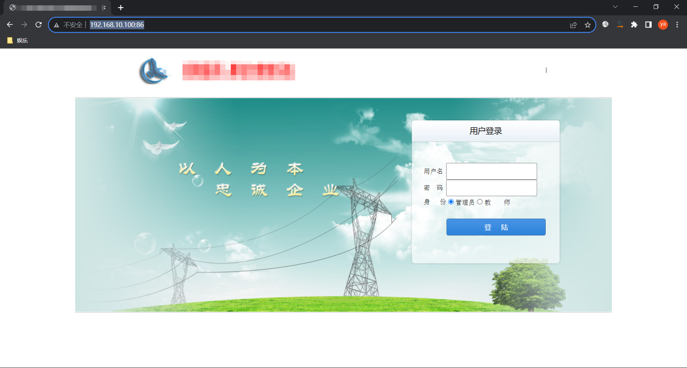

### 4.1.3. 产生记录

针对这个网站进行扫描后确实扫描到一些内容，但是我们这里只是测试，并非是真的对其进行扫描，只是要让网站上留存访问记录，以便后续的分析。

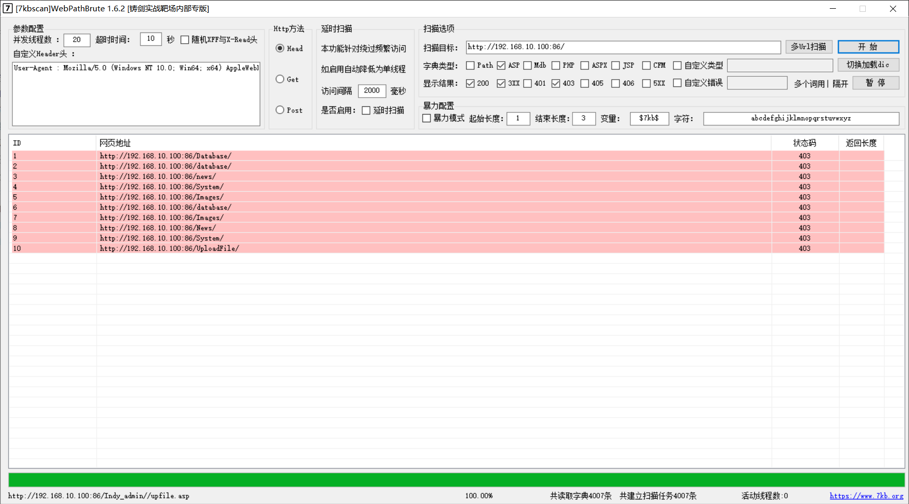

同样这里使用sqlmap也让其产生记录。

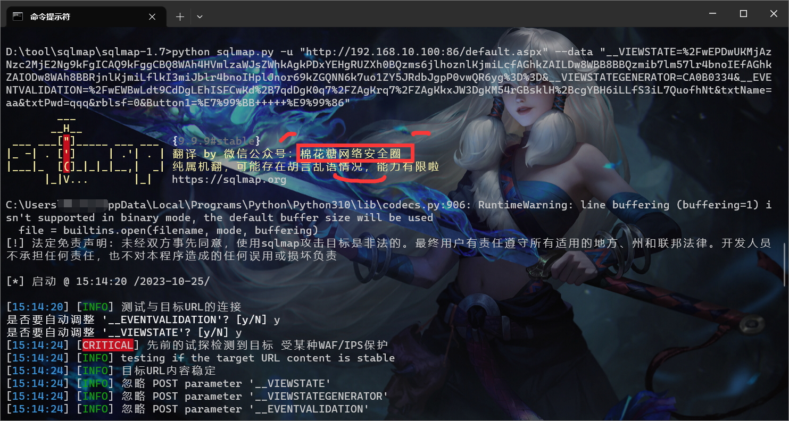

### 4.1.4. 应急响应

这里我们不做复杂的测试，假设就出现了攻击，甲方人员很快的发现了此类的攻击，这里我们也说了是针对时间这个概念进行判断的，那么基本上肯定是去看日志。

这里假设我们通过用户得知是10月25日出现的日志，那么这里我们就基于这个日志进行搜索查看，一般情况下正常去访问的话基本上不太可能在一个页面中出现大量的访问日志，往往都是等待几秒才有下一次的操作，而你看下面的日志，明显就是在一段时间内并发导致的。

同时基于下列的日志中，也能够看到get请求了很多目录，像这类的日志明显就是在进行目录扫描，而下面的post请求，通常人为去访问页面的时候，基本上都是get请求，只有使用到登陆的时候会出现post请求，而这里的post请求有很多，并且一个最显眼的UA头是sqlmap，那么一看就是工具进行扫描，同时后面的状态码还是200.......

那基于上面的分析，可以确定了攻击行为、攻击者IP地址、攻击事件、攻击的目标，那么三要素齐了，剩下的就是针对IP进行溯源了，这个就是另外的话题。

后续就是让甲方的相关人员对这个网站程序进行修复了。

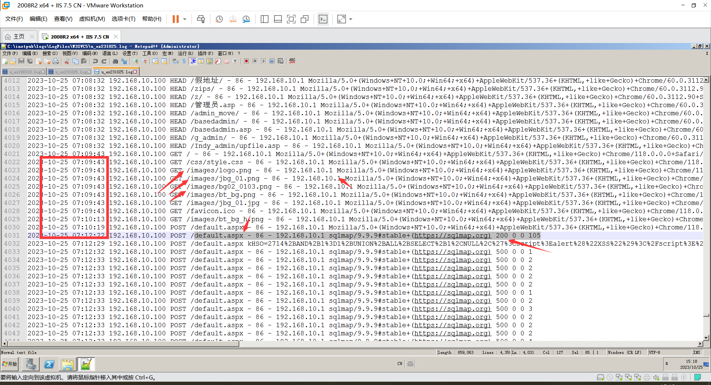

## 4.2. 基于漏洞应急响应

所谓基于漏洞应急响应就是当甲方发现网站被篡改或者出现异常的时候，甲方也不知道具体的攻击时间，而同时这个网站平常又有大量的人访问，这就会导致在日志中查找起来比较麻烦，例如几千条还好，上万条、上百万条日志你该如何一个个排查呢。

这时候就需要用到红队思路了，例如，思考假设你是红队针对这个网站该如何进行攻击获取权限。

### 4.2.1. 背景状态

关于漏洞应急响应就是当日志量太多无法一天天筛选的时候，或者说日志丢失，无法追踪攻击者，只能先解决问题，那么就可以基于红队的思路先将漏洞修复起来，后续再日志中查找关键字来排查，亦或者说优先修复漏洞。

### 4.2.2. 查看网站

这里查看网站后发现是一个joomla内容管理系统版本为3.2.45版本，那么假设这个网站被攻击，那么攻击者是如何针对这个网站发起攻击的，其实有一个最简单的办法就是看看这个平台及版本是否存在nday。

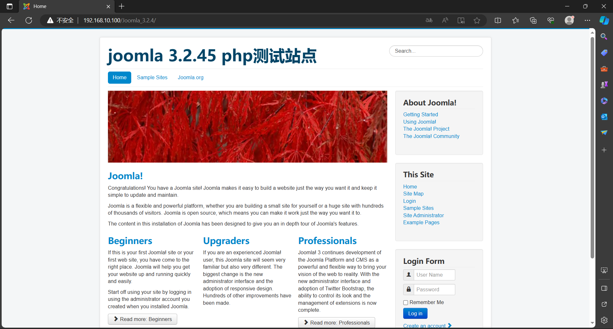

### 4.2.3. 寻找nday

这里通过网站搜索，搜索到joomla3.2.45存在远程执行代码漏洞，这里利用工具上传了一个木马。

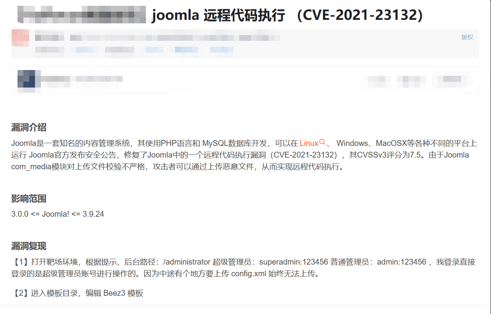

这里使用公开的EXP进行远程命令执行，当然这个有点不专业这里，但是主要是了解一个过程，由于我这里没有安装python2.0版本，所以使用的exp并不会在日志中出现记录。

而这里我们就大概了解一下。

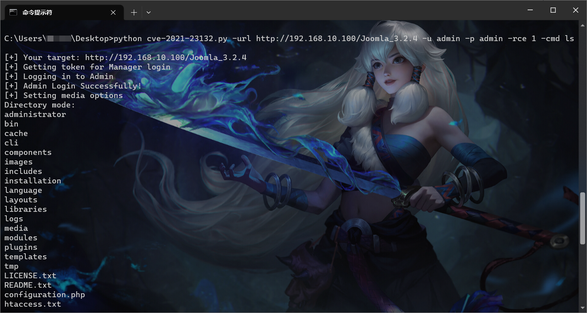

### 4.2.4. 应急响应

同样基于上述提到的在几千条日志或者上万条日志中如何查询到攻击者的日志，这里我们在之前已经相当于使用红队的思路来复现了这个攻击流程，而我们模拟的整理流程就是依靠远程代码执行来实现的，那么是否可以在日志中排查一下常用的代码执行的命令。

而这里我使用并未执行成功，是由于我这个exp有问题，所以我这里就假设搜索一下200状态码来举例子，倘若我这里exp执行成功了，那么是不是我搜索cmd或者ls或者一些其它的参数呢？？？？

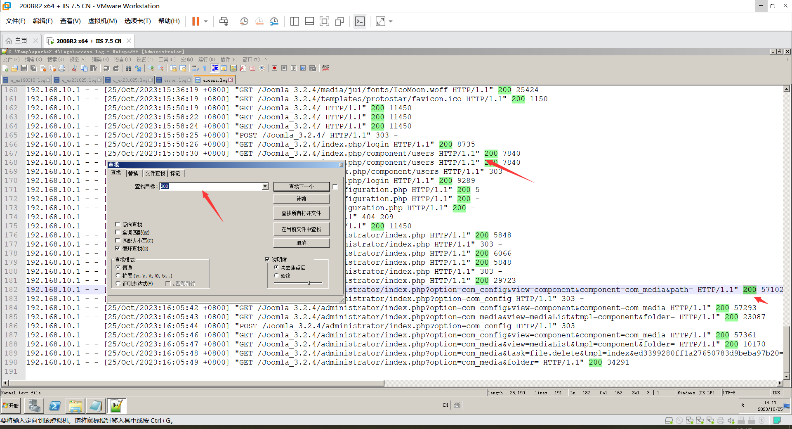

## 4.3. 基于后门应急响应

基于后门应急响应主要就是再完全没思路，但是通过木马查杀查出后门，然后基于这个后门来查找日志，同时还原攻击者的攻击手法，其次基于攻击手法来修复相关漏洞。

### 4.3.1. 背景状态

同时是由于手足无措的时候，没有任何的时间、地点、人物等信息的时候，需要应急响应人员及时思考该网站使用什么服务搭建的，可能会出现哪些漏洞，而基于后门也就是说，可以优先先查杀一下webshell，然后根据路径查询一下日志中是否存在访问记录。

### 4.3.2. 查看网站

可以看到，这个是一个默认的Tomact页面，而这个地方是存在一个弱口令的，如果猜对了，那么可以对其上传文件的。

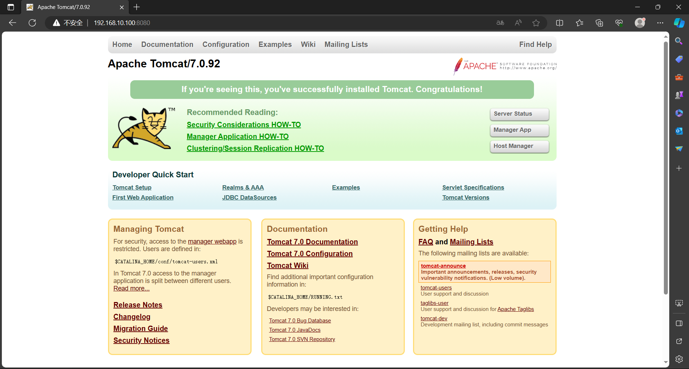

### 4.3.3. 创建木马

这里我们使用哥斯拉生成一个木马，然后将木马上传上去。

这里我们已经上传上去了。

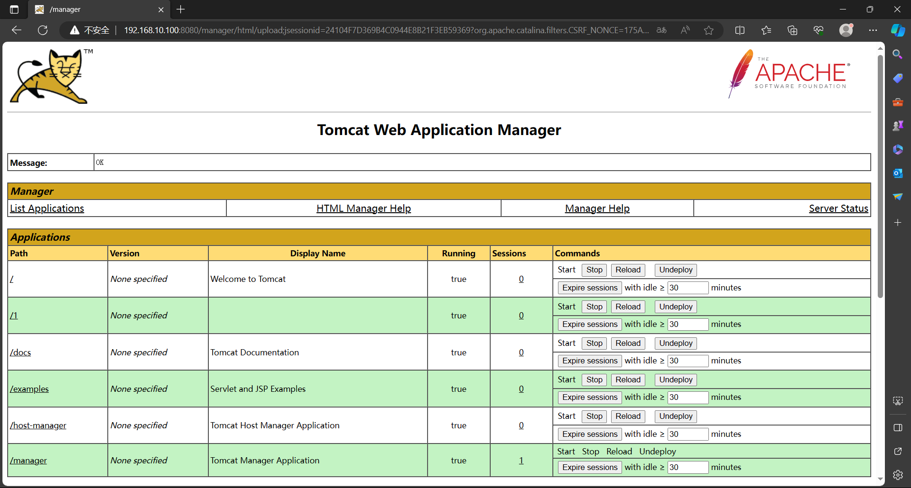

### 4.3.4. 测试链接

可以看到这里我们能够正常的连接上去。

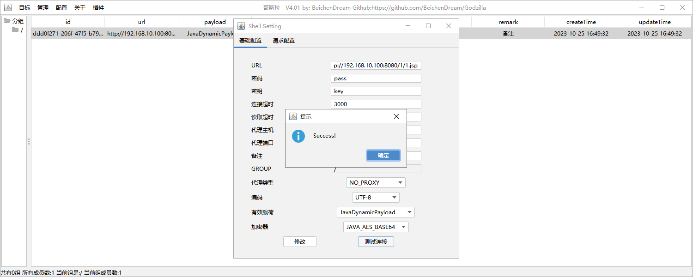

### 4.3.5. 应急响应

到这里我们就可以测试应急响应了，首先按照之前的思路是，日志太多我们无法分析，而我们可以通过后门木马来进行判断。

这里我们通过河马webshell进行查杀，判断出木马，并且是哥斯拉的木马，那么也获取到木马的路径，这里我们就可以通过查看日志中该路径是否有人访问过。

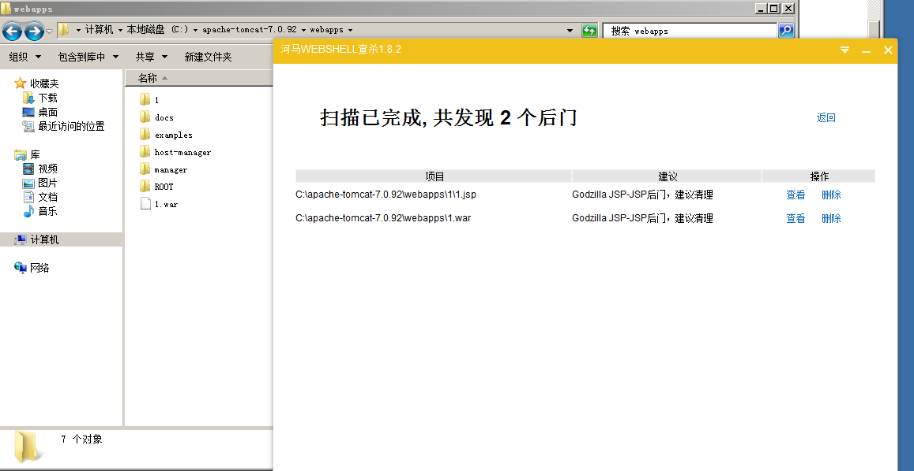

通过查看日志发现，确实是存在访问记录，同时获取到攻击者的IP。

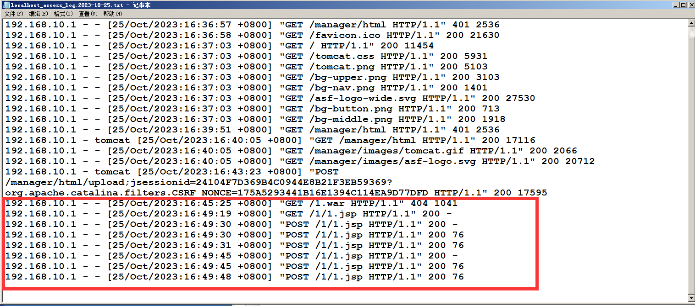

# 5. WEB查杀—常规后门&内存马

这里主要了解一下常规后门与内存马该如何查杀，对于一些专业的厂商都会有自己的查杀工具，而对于我们普通人在日常的应急响应中可以使用以下的工具对其进行查杀。

当然这里很多都是在线查杀，而这里查杀通常需要将文件上传，如果说是单个文件查杀也还好，如果是整个文件夹查杀，那么最好的办法就是本地部署，而本地部署就是一些杀毒软件了，或者使用河马、D盾都是不错的选择。

```
1。阿里伏魔
https://ti.aliyun.com/#/webshell
2、百度 WEBDIR+
https://scanner.baidu.com/#/pages/intro
3、河马
https://n.shellpub.com/
4、CloudWalker(牧云)
https://stack.chaitin.com/security-challenge/webshell
5、在线 webshell 查杀-灭绝师太版
http://tools.bugscaner.com/killwebshell/
6、WebShell Detector WebShell 扫描检测器
http://www.shelldetector.com/
7、D 盾
http://www.d99net.net
8、微步
https://threatbook.cn/next/product/sandbox
9、各类杀毒
火绒，管家，X60，Defender，Nod32 等
```

## 5.1. 内存马查杀

内存马是无文件落地webshell中最常见的攻击手段，随着攻防演练对抗强度越来越高，流量分析、EDR等专业安全设备被蓝方广泛使用，传统的文件上传的webshll以及文件形式的后门容易被检测到，文件shell明显气数已尽，而内存马因其隐蔽性等优点从而越来越盛行。

由客户端发起的Web请求后，中间件的各个独立的组件如Listener、Filter、Servlet等组件会在请求过程中做监听、判断、过滤等操作，内存马就是利用请求过程在内存中修改已有的组件或动态注册一个新的组件，插入恶意的shellcode，达到持久化控制服务器的目的。内存马可以通过访问存在漏洞的url加上命令执行参数，即可让服务器返回结果也可通过webshell管理工具例如：蚁剑、冰蝎、哥斯拉等进行远程连接后攻击目标。

同时内存马还有很多是种类，而内存马也是目前来说较为难检测的，不使用专业的工具或者说不用工具，单单依靠人为手工的分析还是较为难检测的。

并且内存马检查工具，目前很多都是个人开发针对某一种语言来检测的，很少做出一个集合。

## 5.2. 结尾

关于内存马，不想想要演示的，但是本地的环境好像存在一些问题，同时网上的内存马检测工具好像在加载后一直都存在问题，这里我就暂时不写如何查杀内存马了，后续会统一汇总再说吧。

