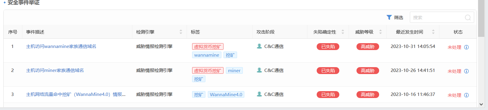
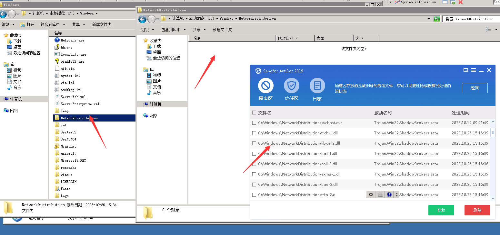
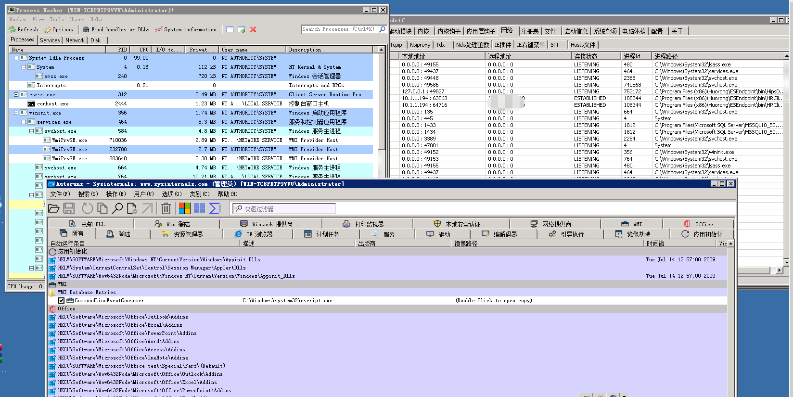
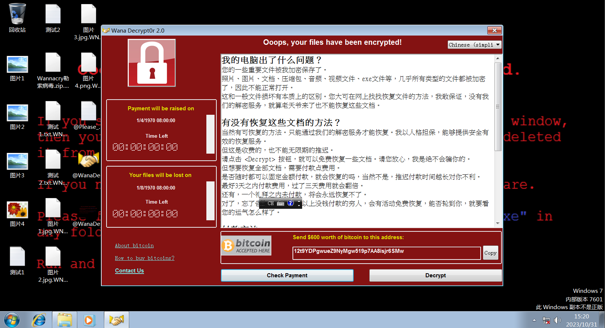
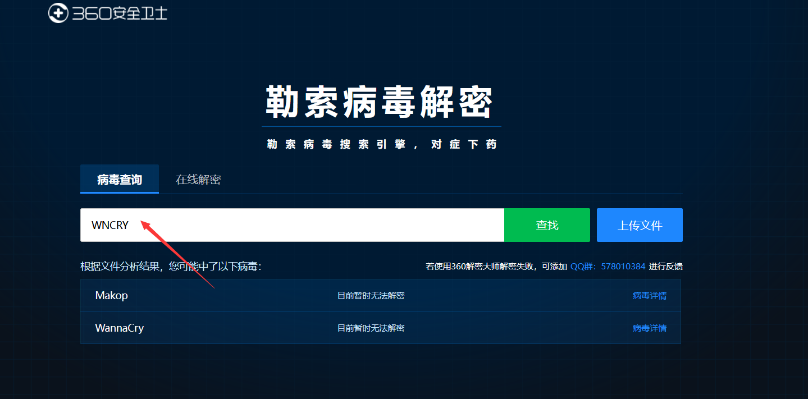
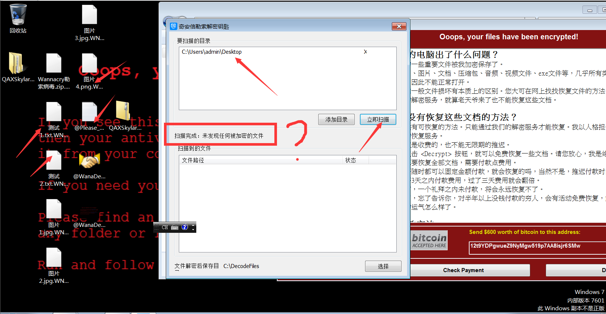

# 前言

个人理解，大佬就别喷了，了解一下就可以了，真正遇到这些问题的时候，有时候也不一定能够解决，最终都有可能回归到重装系统上面。

包括说什么装杀毒软件、打补丁、升级系统，这些都应该是再事件发生前做的工作，而不是发生后做的工作，如果这些工作在事件发生前就做好的话，大概率也不会被这些病毒感染。

# 挖矿病毒

挖矿病毒是一种利用计算机算力来帮助交易达成共识从而赚取奖励的病毒。随着比特币的出现，挖矿这种赚钱方式慢慢流行起来，而挖矿病毒就是黑客利用个人电脑的漏洞，盗取电脑计算力来挖矿获得收益的病毒。

挖矿病毒是一段代码或者一个软件，伪装成一个正常文件进入受害者的电脑。病毒利用主机或者操作系统的高危漏洞，并结合高级攻击技术在局域网内传播，控制电脑进行大量的计算机运算来获取虚拟货币。挖矿病毒会消耗大量的计算机处理资源，使得电脑经常十分卡顿，重启后也无法解决，电脑上没有打开软件，但CPU使用率几乎到达100%，电脑温度升高，风扇噪声增大。

## 挖矿病毒传播方式

- 利用漏洞：利用操作系统或主机的高危漏洞进行传播。
- 弱口令攻击：利用用户设置的弱口令进行攻击。
- 文件传播：伪装成正常文件，通过邮件附件、QQ文件、捆绑软件安装包等被用户下载到电脑。
- 网络资源传播：伪装成火爆新闻、色情内容、隐私资料、诈骗技巧、破解软件、网络资源等文件，通过网页挂马等方式被用户访问并下载到电脑。

## 挖矿病毒危害

- 资源占用：挖矿病毒会大量占用计算机的CPU和内存资源，导致计算机运行缓慢，甚至出现死机、崩溃等问题。
- 网络带宽占用：挖矿病毒会大量占用计算机的网络带宽，导致网络连接变慢，甚至断线。
- 数据安全威胁：挖矿病毒可能会窃取计算机中的敏感数据，如用户密码、个人文件等，从而对用户的数据安全造成威胁。
- 恶意软件传播：挖矿病毒可能会与恶意软件结合，通过感染其他计算机进行传播，从而扩大其危害范围。
- 系统崩溃：挖矿病毒可能会对计算机的系统造成破坏，导致计算机无法正常启动或运行。

## 挖矿病毒防范

- 及时更新系统和软件，保持最新的安全补丁。
- 使用复杂且不易被猜测的密码，定期更换密码。
- 限制不必要的网络共享和访问权限，避免病毒传播。
- 安装杀毒软件，定期进行全盘扫描和病毒查杀。
- 不下载未知来源的软件和文件，不打开陌生邮件和链接。

##  威胁情报中心

挖矿病毒可以通过些情报中心可以查询到该挖矿病毒的一些处理方式，以及一些解决办法，通常来说挖矿病毒更多的情况下是利用计算机的性能计算而去挖矿，主要是用于挖矿，而不是去搞破坏，甚至部分挖矿病毒还能够针对其它啊挖矿病毒进行拦截，例如你主机上存在一个挖矿病毒A，结果你又感染一个挖矿病毒B，那么病毒B可能会自动去删除病毒A，来确保自己的独立性，不过也有可能是病毒A会去自动拦截病毒B，这些都是有可能的，也不排除并存。

```
深信服情报中心：https://ti.sangfor.com.cn/analysis-platform
微步在线情报中心：https://x.threatbook.com/
奇安信情报中心：https://ti.qianxin.com/
venuseye：https://www.venuseye.com.cn/
安恒情报中心：https://ti.dbappsecurity.com.cn/
360情报中心：https://ti.360.net/
绿盟威胁情报中⼼：https://ti.nsfocus.com/
AlienVault：https://otx.alienvault.com/
RedQueen 安全智能服务平台：https://redqueen.tj-un.com/IntelHome.html
Virustotal：https://www.virustotal.com/gui/home/upload
IBM X-Force Exchange：https://exchange.xforce.ibmcloud.com/
ThreatMiner：https://www.threatminer.org/index.php
腾讯哈勃：https://habo.qq.com/
```

# 勒索病毒

勒索病毒是一种恶意软件，它通过加密文件、威胁删除文件等方式，迫使受害者支付一定的赎金以解密文件或恢复数据。这种恶意软件通常是通过电子邮件、社交媒体等渠道传播，并要求受害者支付一定数额的赎金。

勒索病毒是一种严重的网络安全威胁，它可以通过多种方式传播，包括电子邮件、社交媒体、网络钓鱼等。它会对受害者的数据和隐私造成严重破坏，并可能导致严重的财务损失。

## 勒索病毒传播方式

- 文件共享：使用共享文件夹或共享文件系统，可以轻松地传播勒索病毒。
- 电子邮件：通过电子邮件传播勒索病毒是一种常见的手段。
- 社交媒体：社交媒体平台也可以成为传播勒索病毒的途径。
- 恶意软件：许多恶意软件都可能包含勒索病毒，这些恶意软件可以通过各种途径传播。
- 互联网漏洞：许多互联网漏洞都可能成为传播勒索病毒的途径。

## 勒索病毒危害

- 破坏数据和隐私：勒索病毒会窃取用户的个人信息和敏感数据，并可能将这些数据泄露给第三方。这可能导致严重的隐私泄露和数据安全问题。
- 威胁企业安全：勒索病毒可以感染企业的计算机系统，破坏其数据备份、恢复和安全系统，导致业务中断和生产效率下降。
- 破坏个人财务安全：勒索病毒可以威胁用户的财务安全，迫使他们支付赎金以恢复被窃取的数据或解密被加密的文件。这可能导致经济损失和财务困境。
- 破坏社会信任：勒索病毒的传播可能导致公众对网络环境的信任下降，加剧对网络安全的担忧和恐慌。
- 加密数据：勒索病毒会对系统中所有的文件或图片进行加密，索要赎金。

## 勒索病毒防范

- 安装安全防护软件并保持防护开启状态。
- 及时安装系统漏洞补丁。
- 不轻易点击陌生邮件，尤其是打开或者运行其中的附件，如果必须要查看，可先对其进行病毒查杀。
- 不点击不明链接、广告，并对弹窗广告进行屏蔽、阻拦。
- 使用复杂且不易被猜测的密码，并定期更换密码。
- 做好数据备份。

## 勒索病毒家族及识别

这里只是列举一些勒索病毒，并不齐全，遇到勒索病毒还是需要寻找专业的人员进行排查，但是基本上如果遇到勒索病毒，基本上是很难解密的，只能重装系统。

- **WannaCry**：WannaCry 是一种非常著名的勒索病毒，于 2017 年爆发并影响了全球范围内的系统。它使用 RSA-2048 加密算法对文件进行加密，并要求受害者支付赎金以获得解密密钥。
- **Petya**：Petya 勒索病毒于 2016 年爆发，它与 WannaCry 类似，但使用了不同的加密算法和传播方式。Petya 主要通过感染 Windows 系统的 Master Boot Record (MBR) 来传播，并要求受害者支付赎金以恢复系统。
- **Cryptolocker**：Cryptolocker 是一种非常流行的勒索病毒，它使用 AES-256 加密算法对文件进行加密，并要求受害者支付赎金以获得解密密钥。它通常通过感染电子邮件附件和恶意网站进行传播。
- **Crysis**：Crysis 勒索病毒于 2018 年爆发，它使用 RSA+AES 加密算法对文件进行加密，并主要通过 RDP 爆破的方式进行植入。CrySiS 还不断出现新的变种，其加密后缀也不断变化。
- **GandCrab**：GandCrab 是一种非常流行的勒索病毒，它使用 RSA-2048 加密算法对文件进行加密，并主要通过恶意软件、色情网站、盗版软件等渠道进行传播。
- **globeimposter**：次出现于2017年，通过垃圾邮件、远程桌面协议（RDP）暴力破解（以下简称“RDP暴力破解”）和恶意软件等方式进行传播。为了提高加密速度，GlobeImposter使用了对称加密算法AES加密文件，并使用本地生成的RSA公钥，将AES算法的密钥加密。其开发者也在黑客论坛中开启了RaaS（勒索即服务）模式。GlobeImposter勒索软件家族已经出现了许多变种版本，包括十二主神系列和十二生肖系列等版本
- **Phobos**：勒索家族于2019年初被发现，并不断更新病毒变种，通过RDP暴力破解+人工投放和钓鱼邮件等方式扩散到企业与个人用户中，感染数量持续增长。据说此勒索软件变种使用“RSA+AES”算法加密文件，暂时没有解密工具。值得关注的是，该勒索病毒在运行过程中会进行自复制，并在注册表添加自启动项，如果没有清除系统中残留的病毒体，很可能会遭遇二次加密。
- **MedusaLocker**：是一种勒索病毒家族，用户系统一旦被感染，就可能被要求支付赎金以恢复数据。该病毒具有一些独特的功能，它不仅会感染本地计算机，而且还会通过网络进行扩散，对其他主机进行加密。为了最大程度地在受感染机器上成功加密文件，并且保证用户能够支付赎金，MedusaLocker勒索病毒不会对可执行文件进行加密。其使用AES和RSA-2048的组合，使得加密的文件解密变成不太可能。
- **Magniber**：是一种利用IE漏洞的无文件勒索病毒，它此前对众多韩国用户造成严重损害。如果相关安全部门无法在漏洞发生初期发现并加以阻断，则很难防止其进一步感染，这使得安全软件难以检测。Magniber勒索软件自2021年3月15日以来使用CVE-2021-26411漏洞进行分发，直到最近被发现改为CVE-2021-40444漏洞。
- **Tellyouthepass**：勒索病毒主要通过某OA系统框架的Log4j2漏洞以及某企业管理软件反序列化漏洞进行入侵攻击，在5月7日-9日持续发起批量攻击。Tellyouthepass勒索病毒最早出现于2020年7月，因其使用RSA+AES的方式对受害服务器文件进行加密，目前该勒索家族暂无公开的解密工具，加密后数据无法直接解密，用户将面临高额的勒索赎金和业务影响。
- **Burn**：勒索病毒在2019年8月首次在国内出现，被发现该勒索病毒主要通过爆破远程桌面，拿到密码后进行手动投毒。同时在受害者机器上发现大量工具。从工具看 该勒索病毒传播在还在不断攻击内网其他机器以及想通过抓取密码的方式获取更多机器的密码。
- **Crysis**：勒索病毒从2016年开始具有勒索活动，加密文件完成后通常会添加“ID+邮箱+指定后缀”格式的扩展后缀，例：`id-编号.[gracey1c6rwhite@aol.com].bip`，其家族衍生Phobos系列变种在今年2月开始也有所活跃。该病毒通常使用弱口令爆破的方式入侵企业服务器。

## 解密工具下载

勒索病毒更多的时候是以勒索为主，通过缴纳赎金来进行解密，但是往往勒索病毒是很难解密的，可以说百分之90以上的勒索病毒都是无法解密的，除了制作方主动交出密钥，否则很难解密，你用这个方式来进行获取利益，怎能让你轻易的解开呢？网上确实有很多公开的解密工具，但是多数都是无法解密的，就算存在解密方式，也有可能是存在部分人手里。

同时勒索病毒更多时候是感染Windows系统，通常Linux是很少会感染的，一方面Windows的软件运行方式基本上都是鼠标点击一下就能够实现运行了，而Linux系统需要输入命令才能够运行，那么个人很少会使用Linux来作为主系统，Linux通常都是服务器，而在服务器上运行程序，基本上都是运维人员，而专业的运维人员很少去运行未知程序，而Windows不同，个人主机也可以运行。

并且Linux系统相较于Windows系统更为的安全，同时上面也提到过，使用Linux系统的更多的是服务器，而服务器中的数据通常是有备份的，所以就算感染就，重装系统恢复一下就可以了......而个人电脑就比较麻烦了.....

### 勒索病毒搜索平台

```
360：https://lesuobingdu.360.cn/
腾讯管家：https://guanjia.qq.com/pr/ls/
启明星辰：https://lesuo.venuseye.com.cn/
奇安信：https://lesuobingdu.qianxin.com/
深信服：https://edr.sangfor.com.cn/#/information/ransom_search
```

### 解密工具平台

```
腾讯哈勃：https://habo.qq.com/tool/index
火绒安全：https://bbs.huorong.cn/thread-65355-1-1.html
瑞星安全：http://it.rising.com.cn/fanglesuo/index.html
nomoreransom：https://www.nomoreransom.org/zh/decryption-tools.html
卡巴斯基：https://noransom.kaspersky.com/zh/
avast：https://www.avast.com/zh-cn/ransomware-decryption-tools#pc
emsisoft：https://www.emsisoft.com/en/ransomware-decryption/
```

### 单项解密集

来源：[github](https://github.com/jiansiting/Decryption-Tools)这里不一定能够保证成功解密，毕竟目前病毒都是在不断的变种中。

```
[777 Ransom] Trend Micro Ransomware解密器用来解密777勒索软件加密的文件 https://success.trendmicro.com/solution/1114221

[AES_NI Ransom] Rakhni解密器用来解密AES_NI勒索软件加密的文件 http://media.kaspersky.com/utilities/VirusUtilities/EN/rakhnidecryptor.zip

[Agent.iih Ransom] Rakhni解密器用来解密Agent.iih勒索软件加密的文件 http://media.kaspersky.com/utilities/VirusUtilities/EN/rakhnidecryptor.zip

[Alcatraz Ransom] Alcatraz解密器用来解密Alcatraz勒索软件加密的文件 https://files.avast.com/files/decryptor/avast_decryptor_alcatrazlocker.exe

[Alpha Ransom] Alphadecrypter解密器用来解密Alpha勒索软件加密的文件 https://www.bleepingcomputer.com/download/alphadecrypter/dl/329/

[Amnesia Ransom] Amnesia解密器用来解密Amnesia勒索软件加密的文件 https://decrypter.emsisoft.com/download/amnesia

[Amnesia2 Ransom] Amnesia2解密器用来解密Amnesia2 勒索软件加密的文件 https://decrypter.emsisoft.com/download/amnesia2

[Annabelle Ransom] BDAnnabelleDecryptTool解密器用来解密Annabelle勒索软件加密的文件 http://download.bitdefender.com/am/malware_removal/BDAnnabelleDecryptTool.exe 

StupidDecryptor解密器用来解密Annabelle勒索软件加密的文件 https://www.bleepingcomputer.com/download/stupiddecryptor/dl/351/

[Aura Ransom] Rakhni解密器用来解密Aura勒索软件加密的文件 http://media.kaspersky.com/utilities/VirusUtilities/EN/rakhnidecryptor.zip

[Aurora Ransom] AuroraDecryptor解密器用来解密Aurora勒索软件加密的文件 https://www.bleepingcomputer.com/download/auroradecrypter/dl/379/ 

Aurora解密器用来解密Aurora勒索软件加密的文件 
https://decrypter.emsisoft.com/download/aurora

[AutoIt Ransom] Rakhni解密器用来解密AutoIt勒索软件加密的文件 http://media.kaspersky.com/utilities/VirusUtilities/EN/rakhnidecryptor.zip 

Rannoh解密器用来解密AutoIt勒索软件加密的文件 http://media.kaspersky.com/utilities/VirusUtilities/EN/rannohdecryptor.zip

[AutoLocky Ransom] Trend Micro Ransomware解密器用来解密AutoLocky勒索软件加密的文件 https://success.trendmicro.com/solution/1114221

[BTCWare Ransom] BTCWare解密器用来解密BTCWare勒索软件加密的文件 https://files.avast.com/files/decryptor/avast_decryptor_btcware.exe

[BadBlock Ransom] Trend Micro Ransomware解密器用来解密BadBlock勒索软件加密的文件 https://success.trendmicro.com/solution/1114221

[BarRax Ransom] BarRax解密器用来解密BarRax勒索软件加密的文件 http://blog.checkpoint.com/wp-content/uploads/2017/03/BarRaxDecryptor.zip

[Bart Ransom] Bart解密器用来解密Bart勒索软件加密的文件 https://files.avast.com/files/decryptor/avast_decryptor_bart.exe http://download.bitdefender.com/am/malware_removal/BDBartDecryptor.exe

[BigBobRoss Ransom] Bigbobross fix解密器用来解密BigBobRoss勒索软件加密的文件 https://files.avast.com/files/decryptor/avast_decryptor_bigbobross.exe

[Bitcryptor Ransom] Coinvault解密器用来解密Bitcryptor勒索软件加密的文件 http://media.kaspersky.com/utilities/VirusUtilities/EN/CoinVaultDecryptor.zip

[CERBER V1 Ransom] Trend Micro Ransomware解密器用来解密CERBER V1勒索软件加密的文件 https://success.trendmicro.com/solution/1114221

[Chimera Ransom] Rakhni解密器用来解密Chimera勒索软件加密的文件 http://media.kaspersky.com/utilities/VirusUtilities/EN/rakhnidecryptor.zip

[Coinvault Ransom] Coinvault解密器用来解密Coinvault勒索软件加密的文件 http://media.kaspersky.com/utilities/VirusUtilities/EN/CoinVaultDecryptor.zip

[Cry128 Ransom] Cry128解密器用来解密Cry128勒索软件加密的文件 
https://decrypter.emsisoft.com/download/cry128

[Cry9 Ransom] Cry9解密器用来解密Cry9勒索软件加密的文件 
https://decrypter.emsisoft.com/download/cry9

[CrySIS Ransom] Rakhni解密器用来解密CrySIS勒索软件加密的文件 http://media.kaspersky.com/utilities/VirusUtilities/EN/rakhnidecryptor.zip

[Cryakl Ransom] Rakhni解密器用来解密Cryakl勒索软件加密的文件 http://media.kaspersky.com/utilities/VirusUtilities/EN/rakhnidecryptor.zip

[Crybola Ransom] Rannoh解密器用来解密Crybola勒索软件加密的文件 http://media.kaspersky.com/utilities/VirusUtilities/EN/rannohdecryptor.zip

[Crypt888 Ransom] Crypt888解密器用来解密Crypt888勒索软件加密的文件 https://files.avast.com/files/decryptor/avast_decryptor_crypt888.exe

[CryptON Ransom] Crypton解密器用来解密CryptON勒索软件加密的文件 https://decrypter.emsisoft.com/download/crypton

[CryptXXX V1/2/3/4/5 Ransom Rannoh解密器用来解密CryptXXX V1/2/3/4/5勒索软件加密的文件 https://success.trendmicro.com/solution/1114221

[CryptoMix Ransom] CryptoMix解密器用来解密CryptoMix勒索软件加密的文件 https://nomoreransom.cert.pl/static/cryptomix_decryptor.exe

[Cryptokluchen Ransom] Rakhni解密器用来解密Cryptokluchen勒索软件加密的文件 http://media.kaspersky.com/utilities/VirusUtilities/EN/rakhnidecryptor.zip

[DXXD Ransom] Trend Micro Ransomware解密器用来解密DXXD勒索软件加密的文件 https://success.trendmicro.com/solution/1114221

[Damage Ransom] Damage解密器用来解密Damage勒索软件加密的文件 
https://decrypter.emsisoft.com/download/damage

[Democry Ransom] Rakhni解密器用来解密Democry勒索软件加密的文件 http://media.kaspersky.com/utilities/VirusUtilities/EN/rakhnidecryptor.zip

[Derialock Ransom] Derialock解密器用来解密Derialock勒索软件加密的文件 
http://blog.checkpoint.com/wp-content/uploads/2016/12/Derialock-Decryptor.zip

[Dharma Ransom] Rakhni解密器用来解密Dharma勒索软件加密的文件 http://media.kaspersky.com/utilities/VirusUtilities/EN/rakhnidecryptor.zip

[EncrypTile Ransom] EncrypTile解密器用来解密EncrypTile勒索软件加密的文件 https://files.avast.com/files/decryptor/avast_decryptor_encryptile.exe

[Everbe 1.0 Ransom] InsaneCryptDecrypter解密器用来解密Everbe 1.0勒索软件加密的文件 https://www.bleepingcomputer.com/download/insanecrypt-desucrypt-decrypter/dl/369/

[FenixLocker Ransom] FenixLocker解密器用来解密FenixLocker勒索软件加密的文件 https://decrypter.emsisoft.com/download/fenixlocker

[FilesLocker v1 and v2 Ransom] FilesLockerDecrypter解密器用来解密FilesLocker v1 and v2勒索软件加密的文件 https://www.bleepingcomputer.com/download/fileslockerdecrypter/dl/378/

[Fury Ransom] Rannoh解密器用来解密Fury勒索软件加密的文件 http://media.kaspersky.com/utilities/VirusUtilities/EN/rannohdecryptor.zip

[GandCrab (V1, V4 and V5 up to V5.2 versions) Ransom] BDGandCrabDecryptTool解密器用来解密GandCrab (V1, V4 and V5 up to V5.2 versions)勒索软件加密的文件 http://download.bitdefender.com/am/malware_removal/BDGandCrabDecryptTool.exe

[GetCrypt Ransom] 解密器用来解密GetCrypt勒索软件加密的文件 https://www.emsisoft.com/decrypter/download/getcrypt

[Globe1/2/3Ransom] Globe1/2/3解密器用来解密Globe勒索软件加密的文件 https://decrypter.emsisoft.com/download/globe 
https://decrypter.emsisoft.com/download/globe2
https://decrypter.emsisoft.com/download/globe3

[GlobeImposter Ransom] GlobeImposter解密器用来解密GlobeImposter勒索软件加密的文件 https://decrypter.emsisoft.com/download/globeimposter

[Gomasom Ransom] Gomasom解密器用来解密Gomasom勒索软件加密的文件 https://decrypter.emsisoft.com/download/gomasom

[HKCrypt Ransom] HKCrypt解密器用来解密HKCrypt勒索软件加密的文件

[Globe/Purge Ransom] Trend Micro Ransomware解密器用来解密Globe/Purge勒索软件加密的文件 https://success.trendmicro.com/solution/1114221

[HiddenTear Ransom] HiddenTear解密器用来解密HiddenTear勒索软件加密的文件 https://files.avast.com/files/decryptor/avast_decryptor_hiddentear.exe

[InsaneCrypt Ransom] InsaneCryptDecrypter解密器用来解密InsaneCrypt 勒索软件加密的文件 https://www.bleepingcomputer.com/download/insanecrypt-desucrypt-decrypter/dl/369/

[JSWorm 2.0 Ransom] JS WORM 2.0解密器用来解密JSWorm 2.0勒索软件加密的文件 https://www.emsisoft.com/decrypter/download/jsworm-20

[Jaff Ransom] Rakhni解密器用来解密Jaff勒索软件加密的文件 http://media.kaspersky.com/utilities/VirusUtilities/EN/rakhnidecryptor.zip

[Jigsaw Ransom] Jigsaw解密器用来解密Jigsaw勒索软件加密的文件 
https://blog.checkpoint.com/wp-content/uploads/2016/07/JPS_release.zip

[LECHIFFRE Ransom] Trend Micro Ransomware解密器用来解密LECHIFFRE勒索软件加密的文件 https://success.trendmicro.com/solution/1114221

[LambdaLocker Ransom] LambdaLocker解密器用来解密LambdaLocker勒索软件加密的文件 https://files.avast.com/files/decryptor/avast_decryptor_lambdalocker.exe

[Lamer Ransom] Rakhni解密器用来解密Lamer勒索软件加密的文件 http://media.kaspersky.com/utilities/VirusUtilities/EN/rakhnidecryptor.zip

[Linux.Encoder.1 Ransom] Linux.Encoder.1解密器用来解密Linux.Encoder.1勒索软件加密的文件 http://labs.bitdefender.com/wp-content/plugins/download-monitor/download.php?id=Decrypter_0-1.3.zip

[Linux.Encoder.3 Ransom] Linux.Encoder.3解密器用来解密Linux.Encoder.3勒索软件加密的文件 https://labs.bitdefender.com/wp-content/plugins/download-monitor/download.php?id=encoder_3_decrypter.zip

[Lortok Ransom] Rakhni解密器用来解密Lortok勒索软件加密的文件 http://media.kaspersky.com/utilities/VirusUtilities/EN/rakhnidecryptor.zip

[MacRansom Ransom] MacRansom解密器用来解密MacRansom勒索软件加密的文件 https://esupport.trendmicro.com/media/13801530/Trend%20Micro%20Ransomware%20Decryptor_V1.0.1.zip

[Marlboro Ransom] Marlboro解密器用来解密Marlboro勒索软件加密的文件 https://decrypter.emsisoft.com/download/marlboro

[Marsjoke aka Polyglot Ransom] Rannoh解密器用来解密Marsjoke aka Polyglot勒索软件加密的文件 http://media.kaspersky.com/utilities/VirusUtilities/EN/rannohdecryptor.zip

[MegaLocker Ransom] MegaLocker解密器用来解密MegaLocker勒索软件加密的文件 https://www.emsisoft.com/decrypter/download/megalocker

[Merry X-Mas Ransom] Merry X-Mas解密器用来解密Merry X-Mas勒索软件加密的文件 https://decrypter.emsisoft.com/download/mrcr http://blog.checkpoint.com/wp-content/uploads/2017/03/MXM_Decryptor-3.7z

[MirCop Ransom] Trend Micro Ransomware解密器用来解密MirCop勒索软件加密的文件 https://success.trendmicro.com/solution/1114221

[Mole Ransom] Mole解密器用来解密Mole勒索软件加密的文件 
https://nomoreransom.cert.pl/static/mole_decryptor.exe

[Nemucod Ransom] Nemucod 解密器用来解密Nemucod勒索软件加密的文件 https://decrypter.emsisoft.com/download/nemucod

[NemucodAES Ransom] NemucodAES解密器用来解密NemucodAES勒索软件加密的文件 https://decrypter.emsisoft.com/download/nemucodaes

[Nmoreira Ransom] Nmoreira解密器用来解密Nmoreira勒索软件加密的文件 https://decrypter.emsisoft.com/download/nmoreira

[Noobcrypt Ransom] Noobcrypt解密器用来解密Noobcrypt勒索软件加密的文件 https://files.avast.com/files/decryptor/avast_decryptor_noobcrypt.exe

[Ozozalocker Ransom] Ozozalocker解密器用来解密Ozozalocker勒索软件加密的文件 https://decrypter.emsisoft.com/download/ozozalocker

[PHP ransomware Ransom] PHP ransomware解密器用来解密PHP ransomware勒索软件加密的文件 http://blog.checkpoint.com/wp-content/uploads/2016/12/PHP-ransomware-decryptor.zip

[Pewcrypt Ransom] Pewcrypt解密器用来解密Pewcrypt勒索软件加密的文件 https://decrypter.emsisoft.com/download/pewcrypt

[Philadelphia Ransom] Philadelphia解密器用来解密Philadelphia勒索软件加密的文件 https://decrypter.emsisoft.com/download/philadelphia

[Planetary Ransom] Planetary解密器用来解密Planetary勒索软件加密的文件 https://decrypter.emsisoft.com/download/planetary

[Pletor Ransom] Rakhni解密器用来解密Pletor勒索软件加密的文件 http://media.kaspersky.com/utilities/VirusUtilities/EN/rakhnidecryptor.zip

[Popcorn Ransom] Popcorn解密器用来解密Popcorn勒索软件加密的文件 https://www.elevenpaths.com/downloads/RecoverPopCorn.zip

[Pylocky Ransom] pylocky_decryptor解密器用来解密Pylocky勒索软件加密的文件 
https://github.com/Cisco-Talos/pylocky_decryptor 
https://www.cybermalveillance.gouv.fr/nos-articles/outil-de-dechiffrement-du-rancongiciel-ransomware-pylocky-versions-1-et-2/ 
https://www.cybermalveillance.gouv.fr/wp-content/uploads/2019/02/PyLocky_Decryptor_V1_V2.zip

[Rakhni Ransom] Rakhni解密器用来解密Rakhni勒索软件加密的文件 http://media.kaspersky.com/utilities/VirusUtilities/EN/rakhnidecryptor.zip

[Rannoh Ransom] Rannoh解密器用来解密Rannoh勒索软件加密的文件 http://media.kaspersky.com/utilities/VirusUtilities/EN/rannohdecryptor.zip

[Rotor Ransom] Rakhni解密器用来解密Rotor勒索软件加密的文件 http://media.kaspersky.com/utilities/VirusUtilities/EN/rakhnidecryptor.zip

[SNSLocker Ransom] Trend Micro Ransomware解密器用来解密SNSLocker勒索软件加密的文件 https://success.trendmicro.com/solution/1114221

[Shade Ransom] Shade解密器用来解密Shade勒索软件加密的文件 http://media.kaspersky.com/utilities/VirusUtilities/EN/ShadeDecryptor.zip http://www.mcafee.com/us/downloads/free-tools/shadedecrypt.aspx

[Simplocker Ransom] Simplelocker解密器用来解密Simplocker勒索软件加密的文件 https://download.eset.com/com/eset/tools/decryptors/simplocker/latest/eset-simplocker-decryptor.apk

[Stampado Ransom] Stampado解密器用来解密Stampado勒索软件加密的文件 https://decrypter.emsisoft.com/download/stampado

[Teamxrat/Xpan Ransom] Trend Micro Ransomware解密器用来解密Teamxrat/Xpan勒索软件加密的文件 https://success.trendmicro.com/solution/1114221

[TeslaCrypt V1/2/3/4 Ransom] TeslaDecrypt 解密器用来解密TeslaCrypt V1/2/3/4勒索软件加密的文件 https://github.com/Cisco-Talos/TeslaDecrypt

[Thanatos Ransom] Thanatos解密器用来解密Thanatos勒索软件加密的文件 
https://github.com/Cisco-Talos/ThanatosDecryptor

[Trustezeb Ransom] Trustezeb.A解密器用来解密Trustezeb勒索软件加密的文件 https://download.eset.com/com/eset/tools/decryptors/trustezeb_a/latest/esettrustezebadecoder.exe

[Wildfire Ransom] Wildfire解密器用来解密Wildfire勒索软件加密的文件 http://media.kaspersky.com/utilities/VirusUtilities/RU/WildfireDecryptor.zip http://www.mcafee.com/us/downloads/free-tools/wildfiredecrypt.aspx

[XData Ransom] Rakhni解密器用来解密XData勒索软件加密的文件 http://media.kaspersky.com/utilities/VirusUtilities/EN/rakhnidecryptor.zip

[XORBAT Ransom] Trend Micro Ransomware解密器用来解密XORBAT勒索软件加密的文件 https://success.trendmicro.com/solution/1114221

[XORIST Ransom] Xorist解密器用来解密XORIST勒索软件加密的文件 
https://decrypter.emsisoft.com/download/xorist

[ZQ Ransom] ZQ解密器用来解密ZQ勒索软件加密的文件 
https://www.emsisoft.com/decrypter/download/zq
```

# 挖矿病毒/勒索病毒处理

关于这两种病毒处理方式，网上有很多相关的处理方式以及应急的手段，而这里不可能说通过一篇简短的文章就能够了解怎么处理这些问题。

这里大概使用简单的语言说一下吧。

## 挖矿病毒

关于挖矿病毒，很多时候，在开始挖矿之前，这些病毒会先对内网进行扫描，不断的扩张，以获取到更多的内网主机实现挖矿。这里我给各位看一下，我这边通过深信服的异常流量检测系统看一下我们内网的情况，这里我们都进行查杀过了，不过可能还存在遗留问题。



这个主机目前已经基本解决了，解决办法就是通过网上的文章来处理的，刚开始看到的时候就莫名其妙的，根本不知道怎么解决，这里我就大概截个图给各位看看，这个病毒的执行过程。

同时这个问题现在的状态就是在连接，目前还在解决，但是，并未执行，CPU、内存等均为占用。

### 病毒文件夹

这个文件夹就是病毒的文件夹，已经被清除了，这里为什么还把文件夹留着呢，是由于该病毒会自动再恢复，相当于还是未处理完全，所以创建了一个病毒文件夹将这个文件夹设置成禁止访问，占用病毒释放的权限。



### 具体的处理方式

这里处理方式其实就是查看WannaMine4.0挖矿病毒处置，这里确实，之前的整体的流程的有的，但是一直没真正处理好，结果就是处理一般截图不对被删除，处理处理就没有了，最好发现还没解决，但是没攻击行为了，尴尬了，这里应该保留整体的流程的，小心被追溯.....参考下面的文章吧。

[WannaMine4.0挖矿病毒处置](https://bbs.sangfor.com.cn/forum.php?mod=viewthread&tid=152179)

这里提供相关的工具名，然后去下载吧，用法网上有很多，说实话不然火绒剑一个就能解决。

```
Process Hacker：https://processhacker.sourceforge.io
PChunter工具https://www.52pojie.cn/thread-1037841-1-1.html
火绒剑：https://www.huorong.cn/
Autonus：https://learn.microsoft.com/zh-cn/sysinternals/downloads/autoruns
```



### 划水原因

确实是找不到样本呀，找了半天找不到样本，然后我不想找了，普通的挖矿木马，都很简单，就是杀毒查杀就欧克了，所以就懒得去演示哪些很简单的样本。

## 勒索病毒

这个我到没再实际的环境中遇到过，前面也说了，遇到勒索病毒，首先你要知道勒索病毒是什么家族的，当然如果是最新的勒索病毒，可能也不好判断，但是如果是历史勒索病毒，那基本还算好查。

### 永恒之蓝勒索病毒

这里我就下载一个永恒之蓝勒索病毒吧，运行完就是这个样子的，这里我们假设不知道是属于什么病毒。



### 判断勒索病毒家族

这里通过将文件的后缀或者文件提取出来上传到相关的网站上就能够查询，这里我就使用个后缀来判断，360这边反馈的就是WannaCrt家族的勒索，但是显示无法解密。



这里到奇安信上面查询是能够解密的，同时给了一个下载解密工具的连接，这里我们尝试下载解密工具，然后运行解密，看看能不能成功解密。


### 尝试解密

我扫描了，然后无法解密，这里也尝试了很多，均无法解密........所以也不想折腾了。



## 最终解决办法

对于挖矿病毒，通常来说很多都是挖了挖矿，并不会对你服务器上的文件造成影响，那么如果能够看到相关文章或者能够处理干净，那最好不过了，如果处理不干净，那么可以直接将重要的文件拷贝出来，直接重新装系统，不要觉得装系统有多丢人，解决不了了，还能仍在那不管吗？

对于勒索病毒，前面也说了，勒索病毒勒索服务器的话，通常有点意识的企业都会再日常做好备份工作，基本上被勒索了，直接恢复即可，至于说没备份，那么一般来说，勒索病毒人家是为了要钱，可能设置一些简单的加密方式吗，多数勒索病毒都是使用复杂的加密方式，包括可以自己去查询，截至目前依旧很多几年前的勒索病毒依旧是无法解决的。

那么如果实在没备份的只能找专业的人处理，通常有这样处理水平的都是一些大型的安全企业，而且可能这种技术都是不会外泄的，人家要靠这个赚钱。