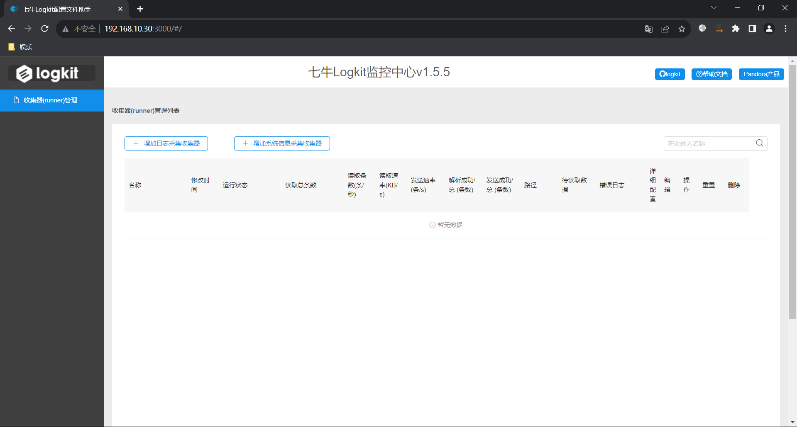
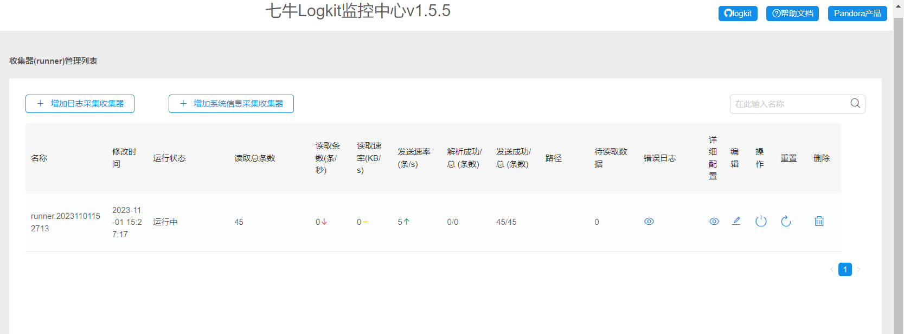
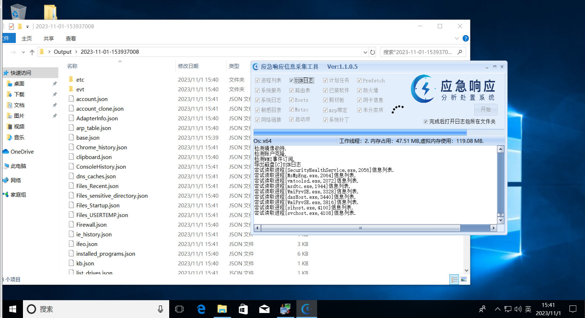
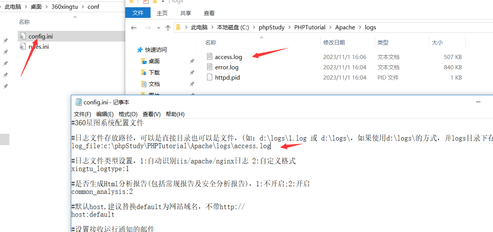
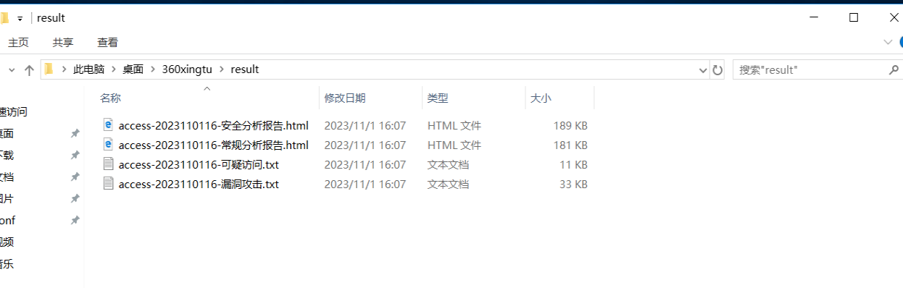
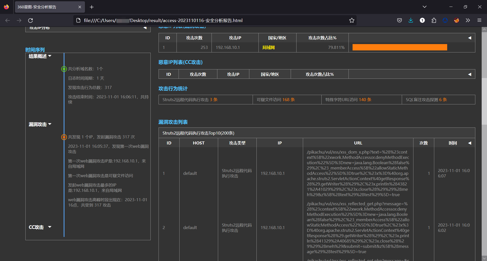
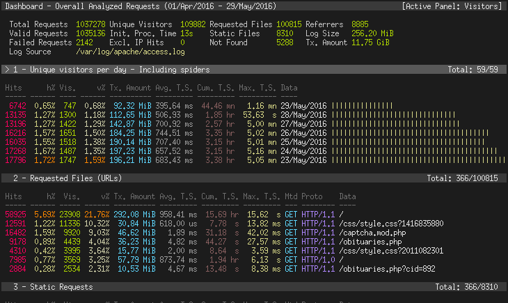
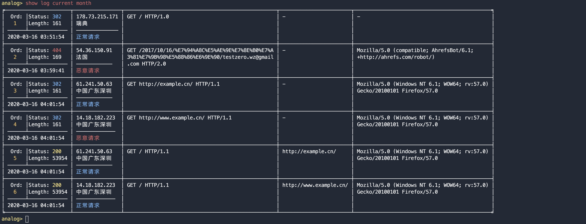

# 1. 工具提供

所有工具关注公众号`“剁椒鱼头没剁椒”`回复`“应急响应”`获取，不过需要注意的是，有的工具下载下来会报毒哦！

# 2. 日志提取工具

日志提取工具以方便系统监控、故障排查和性能优化等方面进行关键信息分析和处理的。这些工具可以处理不同类型的数据源，包括日志文件、数据库和事件日志等。它们具备多种功能，如关键词匹配，可以根据用户定义的关键词从日志文件中提取与之相关的信息。用户可以指定关键词的匹配规则，如精确匹配、模糊匹配或正则表达式匹配，以满足不同的需求。

## 2.1. 七牛Logkit

logkit-community（社区版）是七牛智能日志管理平台开发的一个配套的日志收集工具，支持海量的数据源，方便地发送到七牛智能日志管理平台以及其他常见的数据存储服务进行分析，同时也，除了基本的数据发送功能，logkit还有容错、并发、监控、删除等功能。

### 2.1.1. 优点

- GO 语言编写，性能优良，资源消耗低，跨平台支持。
- Web 支持，提供 页面 对数据收集、解析、发送过程可视化
- 插件式架构，扩展性强，使用灵活，易于复用。
- 定制化能力强，可以仅使用部分 logkit 包，以此定制专属收集工具。
- 配置简单，易于上手，可通过 页面 进行操作管理。
- 原生中文支持，没有汉化烦恼。
- 功能全面，涵盖了包括 grok 解析、metric 收集、字段变化 (transform) 在内的多种开源软件特点。
- 生态全面，数据发送到七牛的 Pandora 大数据平台支持包括时序数据库、日志检索以及压缩永久存储等多种数据落地方案。
- 数据收集安全稳定，拥有磁盘队列、内存队列、错误重试、压缩传输、限速限流等多种机制，数据发送不重不漏。
- 集群化，可以通过一个logkit 作为master 在 web 管理众多logkit，对整体集群进行管理。

### 2.1.2. 支持类型

- 系统支持：Windows、Linux、mac。
- File: 读取文件中的日志数据，包括csv格式的文件，kafka-rest日志文件，nginx日志文件等,并支持以grok的方式解析日志。
- Elasticsearch: 读取ElasticSearch中的数据。
- MongoDB: 读取MongoDB中的数据。
- MySQL: 读取MySQL中的数据。
- MicroSoft SQL Server: 读取Microsoft SQL Server中的数据。
- Postgre SQL: 读取 PostgreSQL 中的数据。
- Kafka: 读取Kafka中的数据。
- Redis: 读取Redis中的数据。
- Socket: 读取tcp\udp\unixsocket协议中的数据。
- Http: 作为 http 服务端，接受 POST 请求发送过来的数据。
- Script: 支持执行脚本，并获得执行结果中的数据。
- Snmp: 主动抓取 Snmp 服务中的数据。

### 2.1.3. 下载地址

使用方式在官方我文本介绍中均有，这里就不再赘述。

[七牛Logkit](https://github.com/qiniu/logkit/blob/master/READMECN.md)

### 2.1.4. 使用方式

这里我下载的是Windows系统，直接解压完后进入文件夹中，首先配置相关参数，如果你不想配置，默认也可以。

#### 2.1.4.1. 修改配置

logkit.conf是logkit-community工具基础配置文件，主要用于指定logkit-community运行时需要的资源和各个runner配置文件的具体路径。

打开 `logkit.conf`, 典型的配置如下：

```
{
    "max_procs": 8,
    "debug_level": 1,
    "clean_self_log":true,
    "bind_host":"localhost:3000",
    "static_root_path":"./public",
    "confs_path": ["confs*"]
}
```

初步使用，您只需要关注并根据实际需要修改其中三个选项：

- `bind_host` logkit页面绑定的端口号，启动后可以根据这个页面配置logkit。
- `static_root_path` logkit页面的静态资源路径，**强烈建议写成绝对路径** 注意：老版本的移动到了 "public-old"文件夹。
- `confs_path` 除了通过页面配置添加以外，logkit还支持直接监控文件夹添加runner。（如果您只通过页面添加logkit runner，那么无需修改此配置）

列表中的每一项都是一个runner的配置文件夹，如果每一项中文件夹下配置发生增加、减少或者变更，logkit会相应的增加、减少或者变更runner，配置文件夹中的每个配置文件都代表了一个runner。该指定了一个runner的配置文件夹，这个配置文件夹下面每个以.conf结尾的文件就代表了一个运行的runner，也就代表了一个logkit正在运行的推送数据的线程。

#### 2.1.4.2. 启动工具

这里由于我是Windows，可以直接点击文件夹中的exe文件进行运行。

```
访问地址，默认：http://IP:3000
```



#### 2.1.4.3. 使用测试

这里是有一个是专注于采集日志的，也就是一些服务类的日志，还有就是采集系统日志，这里我直接添加系统日志，由于其它的服务日志我这边暂时没有，所以就添加自身的系统日志来检测吧，具体操作自己去了解吧，不懂的直接无脑下一步。

可以看到我这里已经读取到45条，这里就自行测试吧。



## 2.2. 观星应急工具

这个工具就只能支持Windows系统，并且自动将文件备份，同时将文件转换成json格式，方便其它工具打开。



# 3. 日志分析工具

日志分析工具通常可以处理不同类型和来源的日志数据，包括系统日志、应用程序日志、网络日志等。它们可以提供强大的查询和分析功能，帮助用户发现和解决问题，同时还可以提供实时监控和预警功能，及时发现和解决潜在的问题。

此外，日志分析工具还可以帮助用户进行系统性能优化和故障排查。通过对日志数据的分析和监控，用户可以更好地了解系统的运行情况和性能瓶颈，及时进行优化和调整。同时，当系统出现故障时，日志分析工具可以帮助用户快速定位和解决问题。

## 3.1. 360星图

360星图仅支持iis/apache/nginx日志，并且目前官方已停止更新了，所以针对现有很多的新的手法可能无法分析出来了。

### 3.1.1. 使用方式

将工具解压出来后，进入配置文件夹打卡配置文件，将日志存放的路径添加进去。



#### 3.1.1.1. 开始运行

这里点击start.bat，稍等一会就会自动运行分析，并且会在星图目录下出现一个html文件。


#### 3.1.1.2. 查看分析

在目录中能够看到360星图根据不同的类型给出了不同的文件，帮助分析。



#### 3.1.1.3. 具体分析报告

通过报告能够很快的锁定相关的攻击IP，行为等内容。



## 3.2. GScan

为安全应急响应人员对Linux主机排查时提供便利，实现主机侧Checklist的自动全面化检测，根据检测结果自动数据聚合，进行黑客攻击路径溯源。    

执行时间：默认安全扫描大概执行时间为4～6分钟，完全扫描在1～2小时之间，程序执行时间的长度由检测文件的多少决定，有可能会存在较长的时间，请耐心等待。

兼容性：目前程序只针对Centos进行开发测试，其他系统并未做兼容性，检测结果未知

### 3.2.1. 下载地址

这个工具已经有几年没更新了，所以基本上可能还能将就用着，倘若想完整的使用可能，还是有点小问题的，并且该工具就支持centos系统。

[GScan](https://github.com/grayddq/GScan)

### 3.2.2. 使用方式

自己去研究吧，很简单，基本上就是下载后脚本运行一下就可以了。


## 3.3. GoAccess

GoAccess是一个实时的网络日志分析器和交互式查看器，可以在 *nix系统的终端中运行，也可以通过浏览器运行，这个工具确实好用，同时支持的类型很多，但是要求的配置很高，这里我也不部署了，同时在部署上也会出现很多的问题。

### 3.3.1. 下载地址

[GoAccess](https://github.com/allinurl/goaccess)

### 3.3.2. 使用方式

[官方文档](https://goaccess.io/man)



## 3.4. analog

一款基于机器学习的Web日志统计分析与异常检测命令行工具。

### 3.4.1. 下载地址

[analog](https://github.com/Testzero-wz/analog)

### 3.4.2. 使用方式

[官方手册](https://analog.testzero-wz.com/%E7%AE%80%E4%BB%8B.html#id2)



# 4. 总结

在网上当然还是有很多的日志分析，但是多数都是针对流量的日志分析，很少是针对安全的分析，同时现阶段的安全日志分析工具要不是去购买厂商的技术，要不就是单项的分析，例如360星图，很少有开源的综合性分析的。