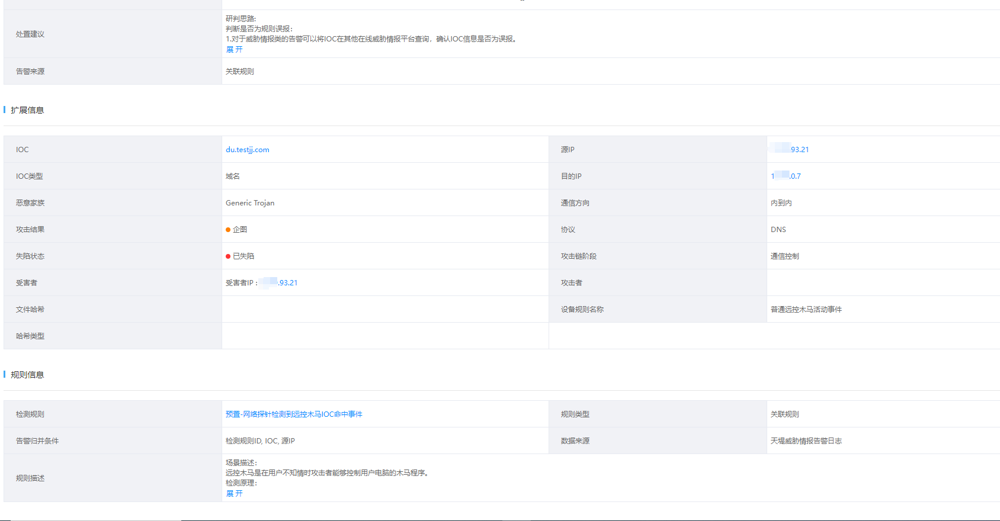
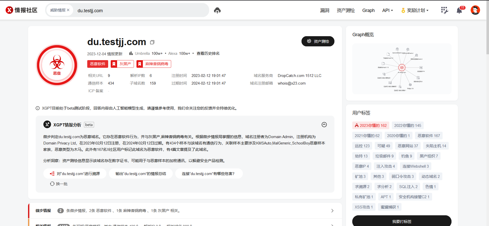
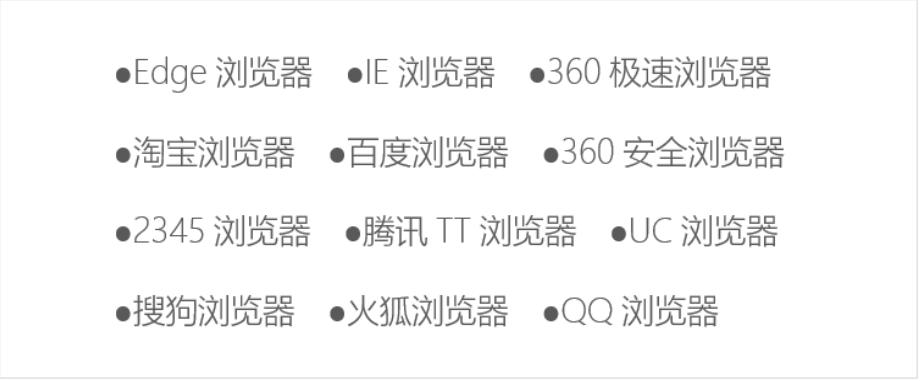

# 1. 前言

今天早上正忙着，上级领导通知，说态势感知发现`2023-12-05 18:40:50` 主机`X.X.93.21`遭受攻击，攻击者为`X.X.0.7`后迅速开展检查，核实确认。



# 2. 原因分析

这里我从态势感知上看是I`P：X.X.93.21`去攻击`IP：X.X.0.7`，这里我后来分析完下面才知道原因。

首先，我们内部是不对外开放的，也就是物理上隔离，同时内部策略都是我自己针对服务进行放通互相访问，基本上不存在外部能轻易的访问到内部，而这个地址是内到内，那就不经过想过的策略，而这里`X.X.93.21`去访问`X.X.0.7`是由于，`X.X.0.7`是之前做某个项目的时候设定的域服务，所以这个主机的DNS就是`X.X.0.7`，导致`X.X.93.21`去触发对外请求的时候，需要将流量中转到`X.X.0.7`，也就是这个原因导致出现攻击。

而且这个病毒查询了时间还是再若干年前，我干..........至今没被触发，不知道前天是由于什么原因导致触发了，但确实通过态势感知查看，次数很少，只有两次，这事已经过去两天了，这两天期间并未再次出现。

# 3. 病毒处置过程

这里的处置过程，少了一张第一次使用杀毒软件直接查杀的结果，这个确实查到了`麻辣香锅`这个病毒了，结果被我手贱，直接点清除了，导致截图还没截。

[病毒分析—火绒](https://huorong.cn/info/1589940017463.html)

## 3.1. 病毒分析过程

### 3.1.1. 域名分析

通过对域名进行分析，该域名指向的是一款为`麻辣香锅`病毒，而该病毒主要是用于篡改浏览器界面，实现广告宣传从中获取利益。

传播方式通过`小马激活器`、`暴风激活器`、`KMS激活器`等。

 

### 3.1.2. 浏览器影响范围



## 3.2. 病毒排查

### 3.2.1. 查看进程

这里通过进程发现存在一个为`R`的进程，通过匹配`麻辣香锅`病毒的特征，完全匹配，同时可以看到该进程下挂载一个名为`JB52.exe`的程序，这个程序名是随机的，但是我查了一下网上的资料好像多数都是`J`开头的。


这里查看创建时间21年，算了一下确实符合业主这边的电脑使用时间的范围，也就意味着这个病毒确实好长时间没有运行过了，有时候当初使用某个激活器激活后就删除了，可能连绑激活器，激活器不运行，这个程序可能也就不运行了吧。

 

### 3.2.2. 查看驱动模块

通过`麻辣香锅`病毒的其它特征在`%localappdata%\Microsoft\WindowsApps`下发现两个驱动模块，不过这里你们还可以去以下几个目录找找异常文件，这里面也会存在的：

```
恶意程序目录：C:\Users\admin\AppData\Local\Temp（有一个xiaoma.exe，还有一个R服 务对应的exe） 
恶意驱动目录：C:\Windows\System32\drivers（四个随机名驱动） 
恶意程序目录：C:\Users\admin\AppData\Local\Microsoft\Event Viewer(有四个exe需要删 除）
```

 

同时`C:\Windows\System32\drivers`下还发现两个异常模块，这两个模块我怎么看都不像，但是我发现我把`R`服务关闭后再删除，这两个也删除后，`R`服务虽然没启动，但是挂载的程序又出现，同时这两个时间也一直。

 

### 3.2.3. 执行模块

在`麻辣香锅`病毒的另外一个特征中发现4个执行模块，名为：`wrme.exe`、`wdlogin.exe`、`wccenter.exe`、`wuhost.exe`。

 

## 3.3. 病毒处理

这里最好进入电脑的安全模式来操作，因为在`C:\Users\Administrator\AppData\Local\mlxg_km`或者`C:\Users\mlxg_km`这两个文件夹中都是`麻辣香锅`的病毒，同时又是隐藏起来的，你关闭隐藏，依旧看不见，进入安全模式后直接删除这`mlxg_km`文件夹，由于我是远程，我就使用工具直接删除了，但是不保险呀！不过后面确实再次扫描，就没有扫描到这文件夹了。

### 3.3.1. 删除进程

将`R`进程删除，同时观察进程是否又自动重启，通过观察进程表，并未重启。

 

 

同时删除`JB52.exe`的程序。


### 3.3.2. 删除系统回调

#### 3.3.2.1. 查看回调文件

使用`pchunter`查看系统回调，再去查看文件回调。

 

 

#### 3.3.2.2. 删除回调文件

将这些回调文件都删除，同时删除回调文件的文件夹。

 

 

 

### 3.3.3. 删除异常筛选项

这里使用命令`fltmc`查看异常筛选项，再将这两个异常筛选项删除。

```
sc query R    //搜索服务是否存在
sc stop R     //停止服务
sc delete R   //删除服务
```

 

### 3.3.4. 删除执行模块

这里将四个执行模块删除，这个模块就是调用模块启动的程序。

 

### 3.3.5. 专杀工具

这里再使用专杀工具对系统进行专杀一下，并未发现`麻辣香锅`病毒，这里我确实缺少了一个操作，就是火绒查杀前的截图，确实是查杀到了，忘记截图了。

 

# 4. 总结

这里我分析一下全过程，这个过程中确实，有不少是参考别人文章来处理的，不过，我发现，删除完后，依旧这些程序还是会存在，比如回调文件、执行模块都会存在，但是杀毒软件却查杀不出来。

可能是由于是有一定的随机性的，杀毒软件无法识别出来，但是主要目录确实都杀了。

## 4.1. 参考文章

[麻辣香锅病毒手杀思路](https://blog.csdn.net/m0_46203901/article/details/128071398)

[麻辣香锅病毒处置](https://blog.csdn.net/weixin_43075257/article/details/128075396)

[浏览器劫持事件处置(麻辣香锅)](https://blog.csdn.net/a2788656708/article/details/121960281)

## 4.2. 查杀工具

[pchunter](https://www.52pojie.cn/thread-1037841-1-1.html)

[process hacker](https://processhacker.sourceforge.io/)

[火绒专杀](https://bbs.huorong.cn/thread-18575-1-1.html)

[火绒剑独立版](https://www.52pojie.cn/thread-1358296-1-1.html)