# 前言

之前遇到Windows10忘记登录密码，查询网上很多办法都无法解决，不过最近看到一个国外的视频，用跳过验证的方式进行解决，这里我并未采用实机去实验，使用的是虚拟机。

## 环境准备

- 一台需要破解密码的Windows10系统电脑
- 微软官方PE安装系统

## 官方PE安装系统

这里我就不进行赘述了，之前我写过一篇关于这个安装的流程，可以参考这篇文章！

[制作windows10系统盘](https://blog.csdn.net/weixin_44268918/article/details/124686621?spm=1001.2014.3001.5502)

# 虚拟机配置

这里我们已经提前准备好了Windows10系统电脑以及pe安装系统，如果你直接实际环境去操作，就不需要看虚拟机配置了，可以直接跳过。

## 编辑虚拟机

需要提前将装有PE系统的U盘插入电脑中，然后编辑虚拟机》添加》添加硬盘》选择IDE类型》选择使用物理磁盘(适用于高级用户)》选择设备，设备编号就是U盘的硬盘编号，可以自己去看。》选择使用整改磁盘》完成

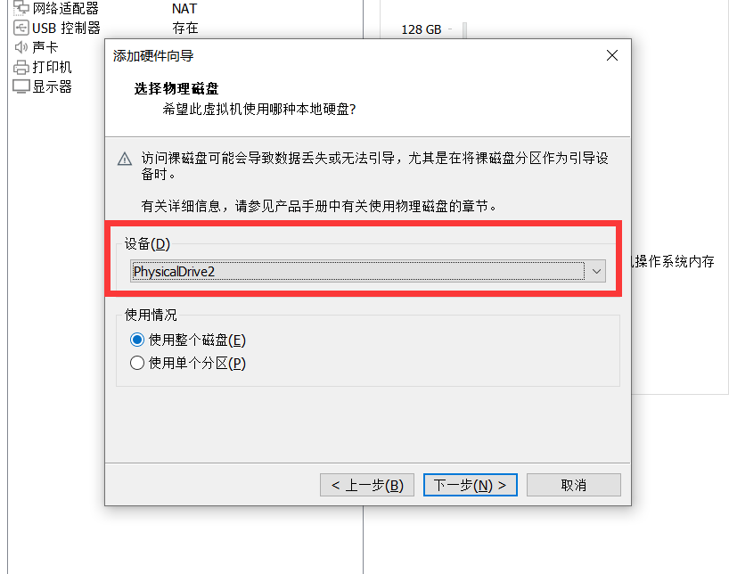

## 进入固件

选择虚拟机》电源》选择打开电源时进入固件

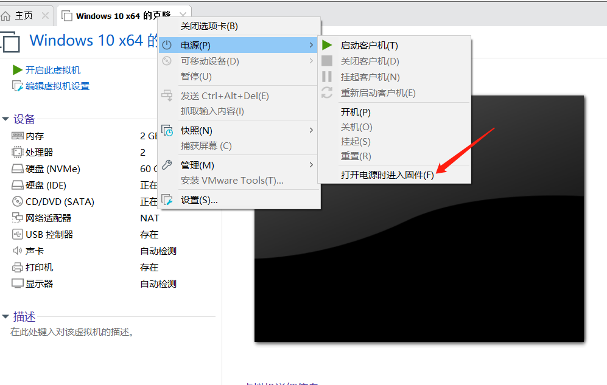

## 编辑启动项顺序

选择Boot》将hard Driue中的VMware Uirtual IDE Hard-(PM)调整到第一位》然后将Hard Drive也调整到第一位》F10保存重启。

这里需要注意我这是修改后的状态，使用"shift和+"就可以调整，如果使用"shift和-"也可以调整。如果是笔记本的话保存需要同时按Fn+F10进行保存。

然后重启就能进入PE系统了。

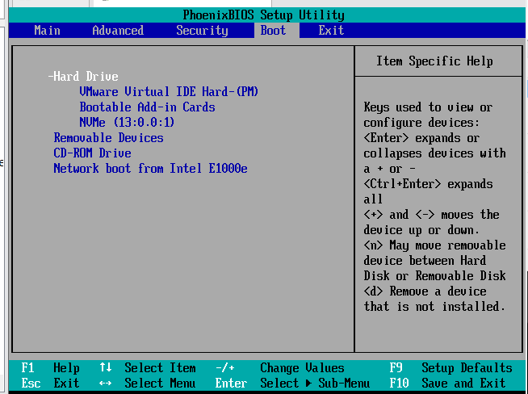

## 进入PE系统

这里保存完后，就会自动进行PE系统。

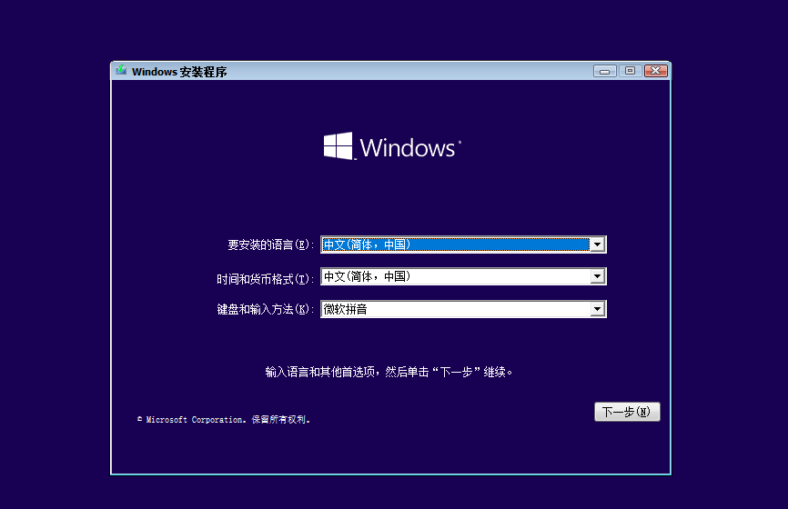

## 恢复原系统

恢复原系统最近的办法就是将启动项还原至原来的状态，操作还是一样，开机进入固件，调整后按F10保存重启，下图就是我原先启动项顺序的样子。

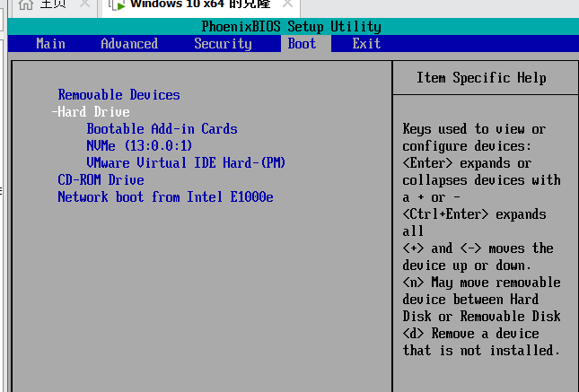


# 修改程序操作步骤

这里简单来说就是通过修改程序，然后让程序调用cmd.exe程序来实现修改Windows10系统密码。

## 调用cmd程序

我们进入PE系统后，就是我们常见的安装系统页面了，在这个页面中按"shift+F10"调出cmd页面。如果是笔记本需要shift+Fn+F10才可以哦。

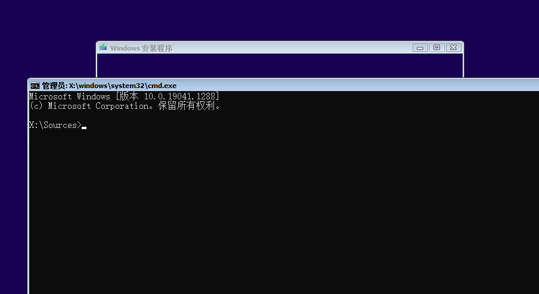

## 查看所有磁盘信息

执行命令后就能够看到所有的分区信息，这里的C盘不代表就是原来电脑中的C盘，需要一个一个进入去看，来确认到底原来系统中C盘是在这个页面中那个盘符中。

```
wmic logicaldisk get name
```

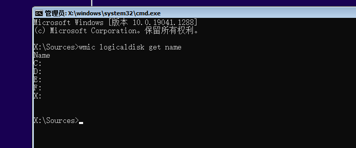

## 进入原系统C盘

这里我通过查找，我系统中原先的C盘，在这个盘符中是E盘。

```
e：   ##直接输入盘符加冒号就可以切换分区了
```

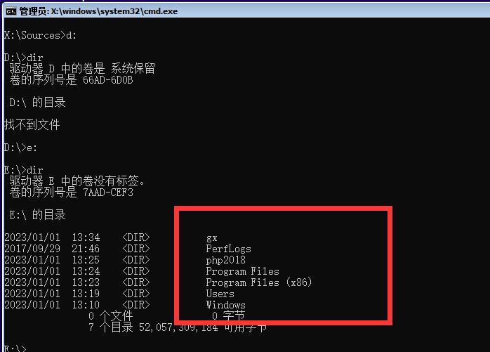

## 重命名程序

目录可以直接输入cd Windows/System32，然后把里面的一个程序重命名，这个程序我们后面会提到，本来应该在之前提到的，忘记写了。

```
cd Windows  
cd System32
ren utilman.exe utilman1.exe  ##将utilman.exe程序重命名为utilman1.exe，后面的是1
```

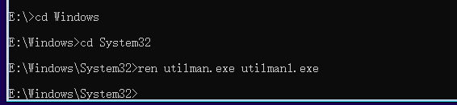

## 替换程序

这里将cmd.exe程序替换原有的utilman.exe程序。

```
copy cmd.exe utilman.exe
```

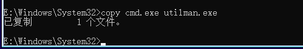

## 退出安装程序

如果是是系统退出安装程序后，就会自动进入原来的操作系统的页面，如果是虚拟机请更改启动项。

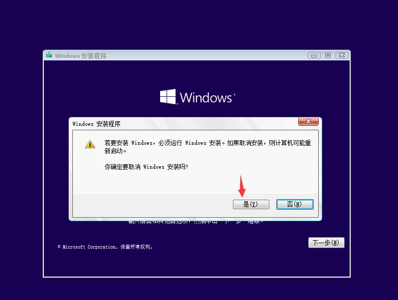

## 点击右下角时钟图标

可以看到点击下面的时钟图标，砰！！！成功出现cmd，而且还是system权限，Windows中最高的权限。

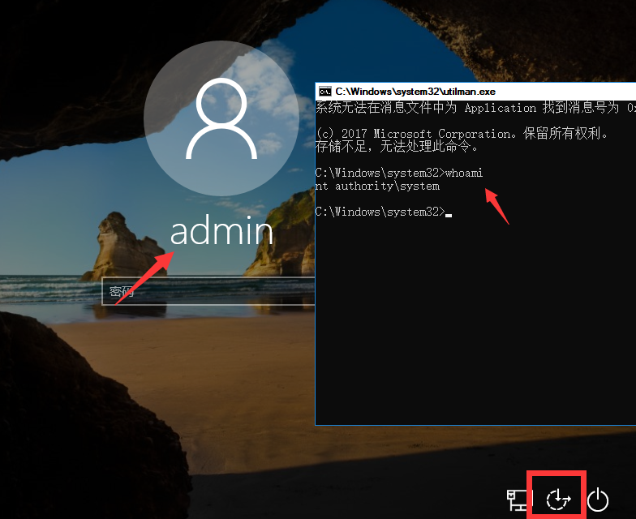

## 修改密码

```
net user admin password ##前面是账户名 后面是密码
```

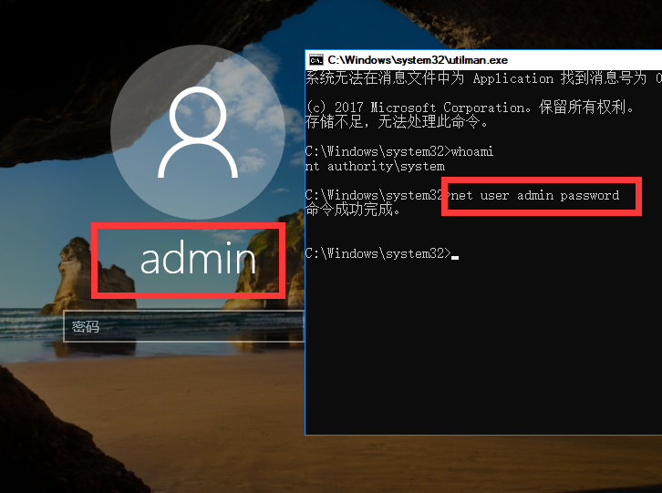

## 尝试登录

输入密码后即可成功登录。

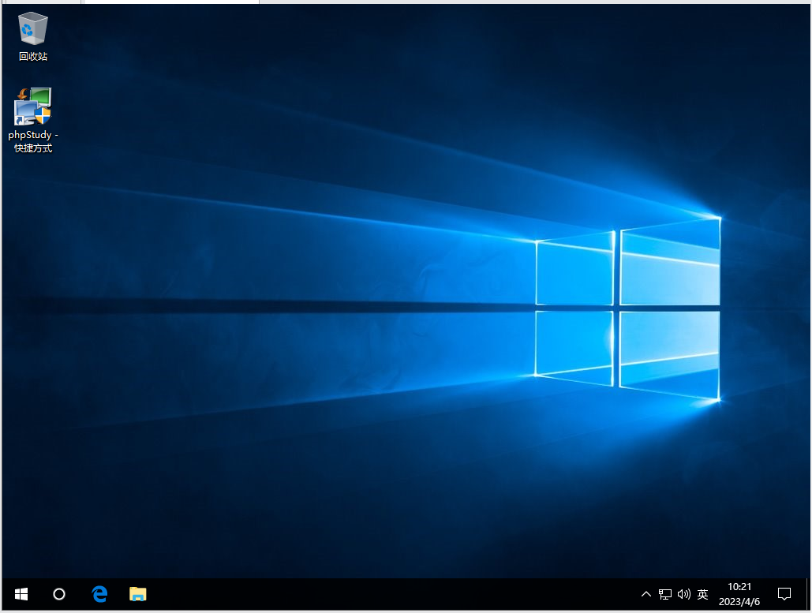

# 恢复配置

这里恢复是还是有点问题。

## 恢复原程序

注意这里需要使用管理员程序执行cmd程序哦。

这里我想着把原来重命名后的程序修改回原先的名字，但是被拒绝了，那么就只好将程序复制一份了，如果不恢复其实整体影响也不大。

我这里被拒绝了，其实如果提权知道的话，可以直接拷贝回程序中，就不删除了，不过这里突然想起来，可以拷贝后在删除也行呀，忘记操作了。

```
del utilman.exe     ##删除
ren utilman1.exe utilman.exe   ##重命名失败
copy utilman1.exe utilman.exe  ##拷贝成功
del utilman1.exe   ##删除
```

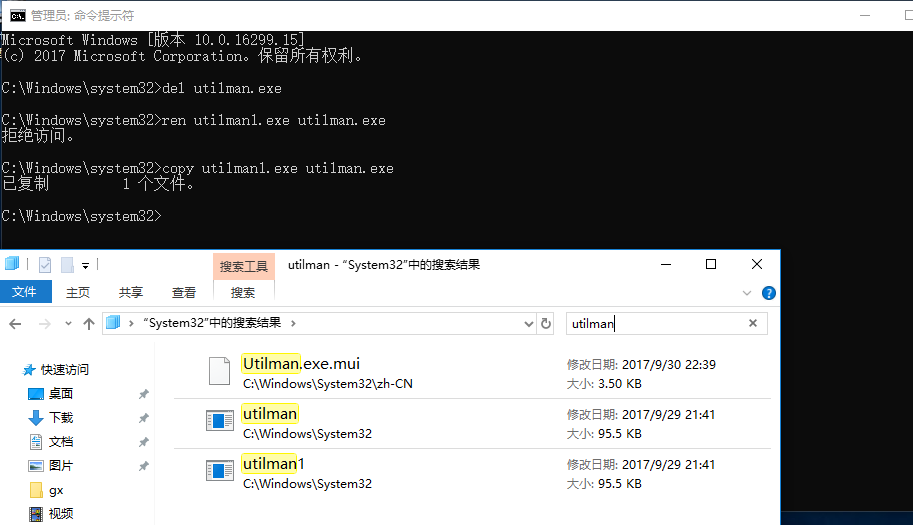

## 是否恢复正常

点击下面的时钟图标测试是否恢复成功，这里测试后是恢复成功了。

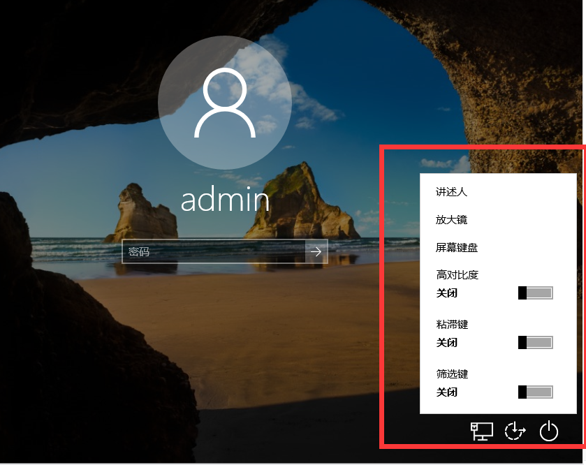
