# 1. 系统要求

目前暂不支持Windows，初次体验可采用Docker方式运行，长期使用建议采用源码安装方式运行。系统配置建议：CPU:4线程 内存:8G 带宽:10M。

由于自动资产发现过程中会有大量的的发包，建议采用云服务器可以带来更好的体验。

# 2. ARL灯塔安装

我这里这里使用的是云服务器配置是2h2g3带宽。

## 2.1. docker环境安装

这里采用docker环境安装，所以需要先准备一下docker环境，如果有docker环境，就不需要再去安装docker环境了。

### 2.1.1. 更新yum包

这里可以提前使用root权限更新一下yum包，在生产环境中需要注意别乱升级，如果是学习环境无所谓。

```
yum -y update：升级所有包同时也升级软件和系统内核
```

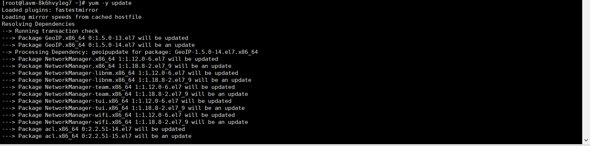

### 2.1.2. 卸载老版docker

这些卸载也是怕现有的环境中有些一些老旧的docker，倘若你主机中有再用的，完全是不需要再次安装的，最多就更新一下。

```
yum remove docker docker-client docker-client-latest docker-common docker-latest docker-latest-logrotate docker-logrotate docker-engine
```

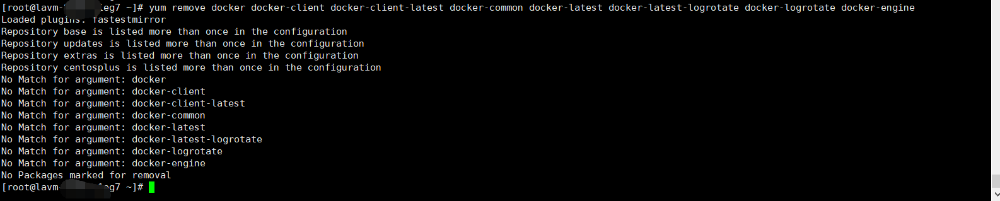

### 2.1.3. 安装docker所需要的依赖包

 yum-util 提供yum-config-manager功能，另外两个是devicemapper驱动依赖的。

```
yum install -y yum-utils device-mapper-persistent-data lvm2
```

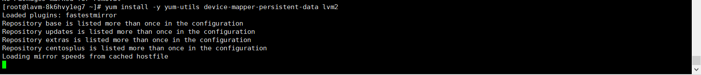

### 2.1.4. 设置yum源

这里设置一下yum源，这两个随便选择一个吧，同时设置的时候不要将后面的备注也添加上去了。

```
yum-config-manager --add-repo http://download.docker.com/linux/centos/docker-ce.repo #（中央仓库）
yum-config-manager --add-repo http://mirrors.aliyun.com/docker-ce/linux/centos/docker-ce.repo #（阿里仓库）
```

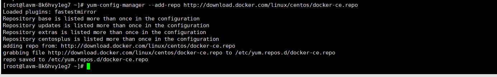

### 2.1.5. 查看仓库中docker版本

这里主要是看看可选的docker版本。

```
yum list docker-ce --showduplicates | sort -r
```

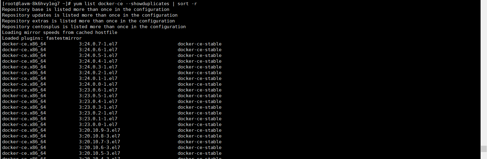

### 2.1.6. 安装docker最新版

这里我就直接默认安装了，反正好像也没什么限制，同时，这里需要稍微等等。

```
yum install -y docker-ce      #默认安装
yum install docker-ce-版本号   #指定安装
```

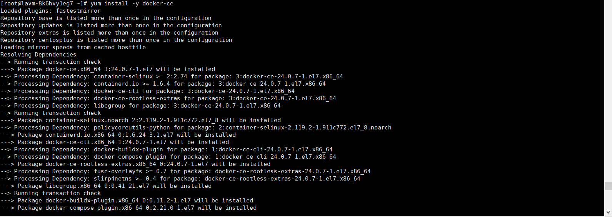

### 2.1.7. docker设置

这里检查一下docker是否安装完成，同时可以设置docker开机自启，启动等等。

```
docker version ##查看版本
systemctl start docker  ##启动docker
systemctl enable docker  ##开机自启docker
systemctl status docker  ##docker运行状态
```

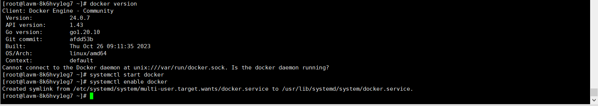

### 2.1.8. docker其它命令

```
docker ps            #查看当前正在运行的容器
docker ps -a         #查看所有容器的状态
docker start/stop id/name    #启动/停止某个容器
docker images        #查看本地镜像
docker rm id/name    #删除某个容器
docker rmi id/name   #删除某个镜像
```

## 2.2. 安装docker-compose

这里我推荐直接离线下载吧，我这里安装了半天也不行。

[GitHub地址](https://github.com/docker/compose/releases)

### 2.2.1. 离线安装

这里下载64位即可,这里的是v2.22.0版本的，v2.23.0看不懂是啥意思。

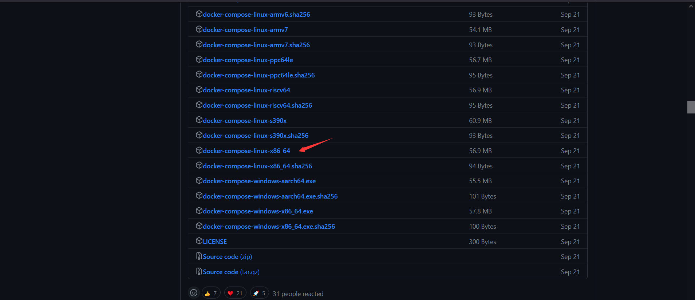

### 2.2.2. 修改文件名

这里下载后，需要将这个文件名改为`docker-compose`，然后将该文件上传到Linux的`/usr/local/bin/`目录下，这里可以使用xsehll上自带的ftp进行上传，也可以使用命令上传。

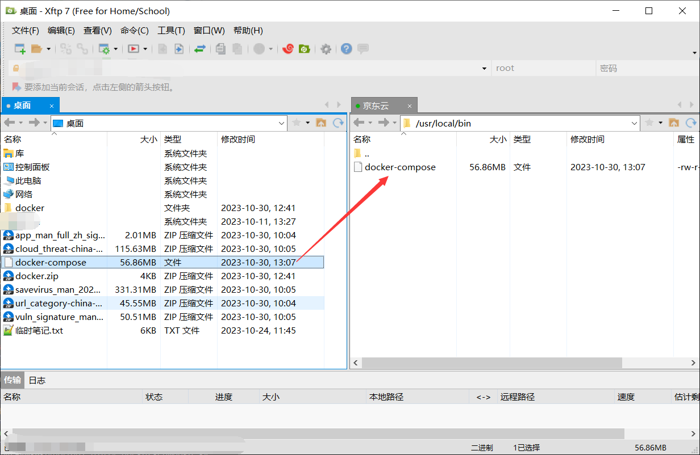

### 2.2.3. 修改权限

这里修改权限一定要使用root权限，如果是使用普通用户，请使用`sudo`。

```
chmod +x /usr/local/bin/docker-compose
docker-compose -v
```

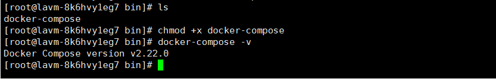

## 2.3. ARL安装

### 2.3.1. 基础安装

这里我建议先从github上将docker包下载下来，同时解压，因为后面还是要解压的，然后将这个解压包上传到服务器中。

[github地址](https://github.com/TophantTechnology/ARL/releases/tag/v2.6)

```
cd /opt
mkdir docker_arl
docker-compose pull  ##这里是要好久的
docker volume create arl_db ##数据卷
```

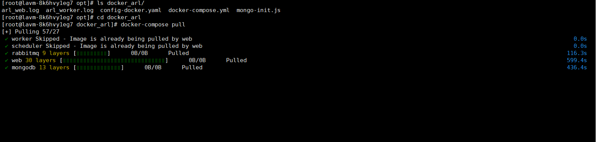

### 2.3.2. 启动

这里的启动需要在刚刚创建的docker_arl目录下启动，这里需要注意，如果出现报错，请去开启5003端口，尤其是云服务器一定要开启。

```
docker-compose up -d   ##启动
docker-compose down    ##关闭
docker ps     ##查看进程
```

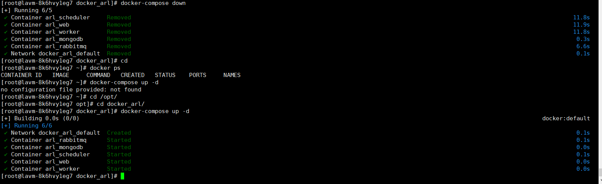

### 2.3.3. 环境卸载

这里我就不尝试了，直接看官方的命令吧。

```
docker-compose down
docker rmi tophant/arl:latest
docker volume rm arl_db （不执行这个可以保留mongo中的数据）
```

# 3. ARL修改

这里就是介绍一下简单的使用。

## 3.1. 页面登陆

这里建议如果是云服务器的话，尽量使用完就关闭，同时修改登陆密码，避免成为公开的灯塔，别其它人恶搞。

```
URL：https://ip:5003
账号密码：admin arlpass
```

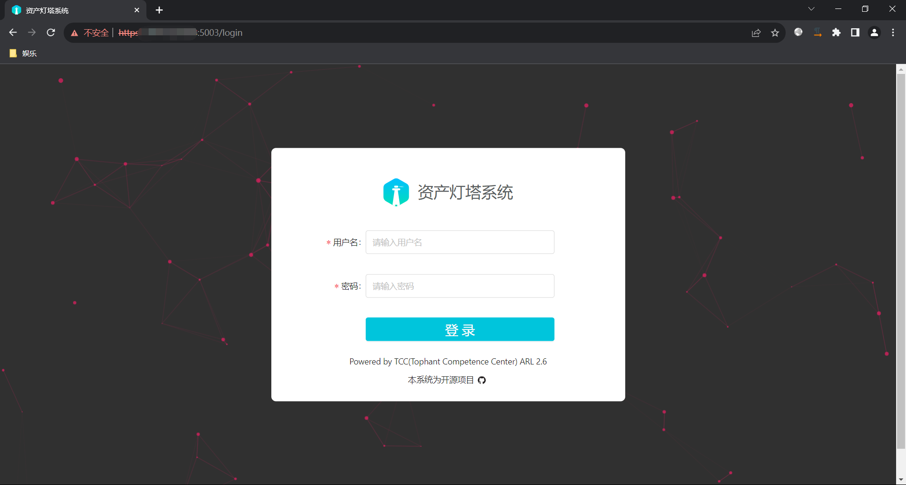

## 3.2. 指纹添加

这里默认情况下是没有指纹的，需要自己配置或者收集，这里从github上找到一共开源的，但是这个指纹呢有两年没更新了，那么怎么办，我们可以使用`ARL-Finger-ADD`的脚本，但是却使用其它资产收集的json文件。

这里下载到本地就可以了，反正远程连接的，我使用Windows去执行脚本吧，这里需要挺久的。

[指纹脚本](https://github.com/loecho-sec/ARL-Finger-ADD)

[json文件](https://github.com/lemonlove7/EHole_magic/blob/main/finger.json)

```
 python3 ARl-Finger-ADD.py https://IP:5003/ admin password
```

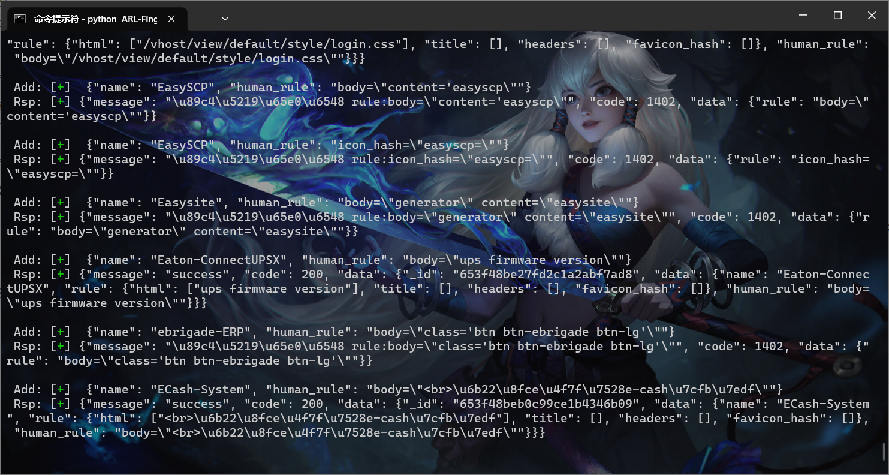

### 3.2.1. 查看添加情况

一共是3508条数据。

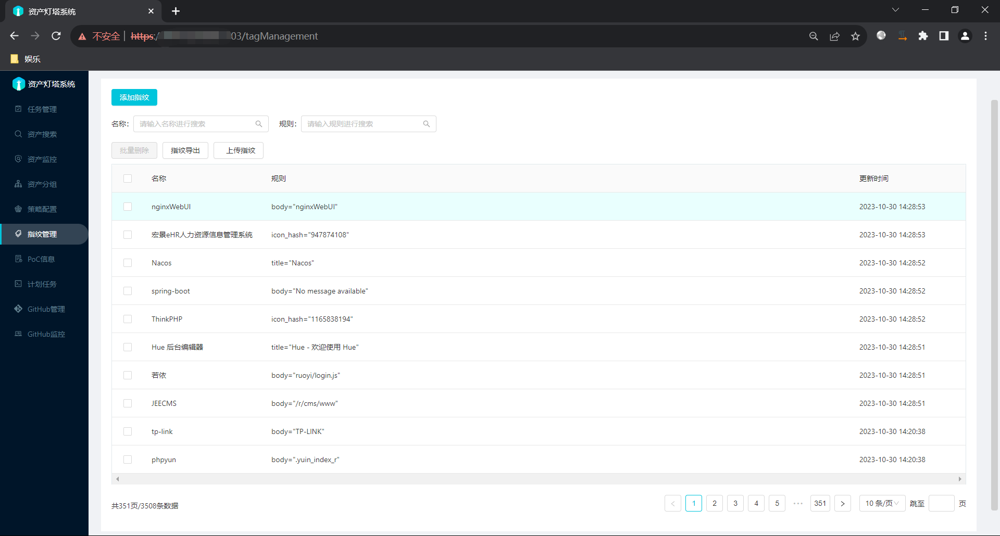

## 3.3. 子域名替换

这里子域名替换，原先自带的是2w的字典，但是在github上有很多公开的很多子域名的字典，直接替换就可以了，其实这里，不单单是子域名能够替换，还有很多文件都可以替换。

### 3.3.1. 导入字典

这里需要提前将文件导入进去，这里提前导入进去，这个dicts里面放置的基本上都是字典。

```
docker cp 15w.txt arl_web:/code/app/dicts/
```

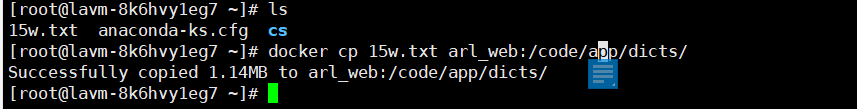

### 3.3.2. 进入容器

这里通过命令查看一下docker的进程，看看有没有那个是进程是映射5003端口，主要关注这个端口的名字，记录下来，然后进入这个容器中。

这里注意，我截图截错了，输错文件了。

```
docker-compose ps  ##查看进程
docker exec -it arl_web /bin/bash  ##进入容器
cd /code/app/dicts  ##切换目录
cat 15w.txt | tee -a domain_2w.txt  ###替换字典，当然你也可以直接将这个文件删除，替换你自己的文件，把名字修改一下即可。
```

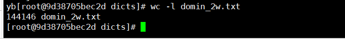

## 3.4. 解除封禁域名

这里修改配置文件中的配置即可，然后重启服务

```
config-docker.yaml  ##这是在容器外的配置文件。
app/config.py    ##这是容器内的配置文件。
```


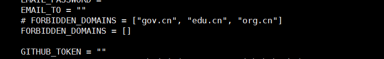

# 4. 其它

有些我也搞不到，想修改或者加强还需自己添加呀，这里也附上官网地址，具体的使用就不说了，基本上都是输入IP或者域名后自动化扫描的，没什么好说的。

[官网](https://tophanttechnology.github.io/ARL-doc/function_desc/)

官网里面基本上使用的教程都有了。