# 1.**AWVS**

## 1.1.**AWVS介绍**

Acunetix Web Vulnerability Scanner（简称AWVS）是一款知名的自动化网络漏洞扫描工具，它通过网络爬虫测试你的网站安全，检测流行安全漏洞。它可以扫描任何可通过Web浏览器访问的和遵循HTTP/HTTPS规则的Web站点和Web应用程序。适用于任何中小型和大型企业的内联网、外延网和面向客户、雇员、厂商和其它人员的Web网站。WVS可以通过检查SQL注入攻击漏洞、XSS跨站脚本攻击漏洞等漏洞来审核Web应用程序的安全性。

## 1.2.**AWVS下载**

该工具可在官方网站下载，但免费下载的是14天试用版本。

官网下载：https://www.acunetix.com/

百度云下载：https://pan.baidu.com/s/1UO7GzL0CMemJ_TMQnHNOuA?pwd=g1bm 提取码：g1bm 

# 2.**AWVS安装**

AWVS的安装下载下来是.exe文件，可以安装在你想要存在的文件夹下。当然我给的百度云中是有PJ的。

## 2.1.**AWVS安装流程**

这里安装过程中我只会介绍一下必须的，其它的都可以默认，或者按照自己的需求来进行按照，尽量安装我下面说的的修改，否则会影响PJ激活。

### 2.1.1.**运行安装**

首先这里需要对文件进行安装，直接双击即可进行安装。

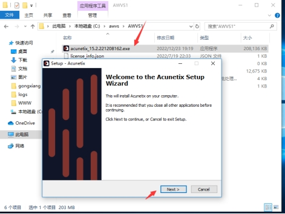 

### 2.1.2.**安装位置**

这里使用默认的位置，不然需要修改bat破解程序，最好都使用虚拟机安装，当然实际环境下，还是需要根据实际情况来定。

这里我就直接默认安装了。

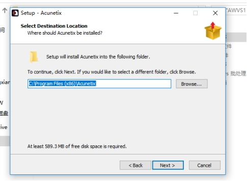 

### 2.1.3.**设置账号密码**

这里的账号密码，可以随便设置，自己能记住就好，密码需要满足大小写+数字以及满8位即可。

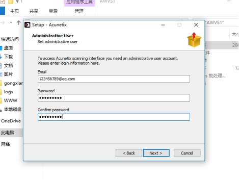 

### 2.1.4.**端口设置**

这里默认的端口是3443，如果你有端口冲突了，就可以进行修改，剩下的默认安装即可，一直下一步就可以了。

 

### 2.1.5.**远程设置**

这里在端口的下面有一个选项，勾选上然后设置物理主机地址即可，例如我虚拟机是192.168.10.50，而虚拟网卡设置的是192.168.10.1，那么我这里就设置192.168.10.1，我这里的截图是盗别人的，我忘记了，你们只需要根据自己主机虚拟机网卡的地址设置即可。

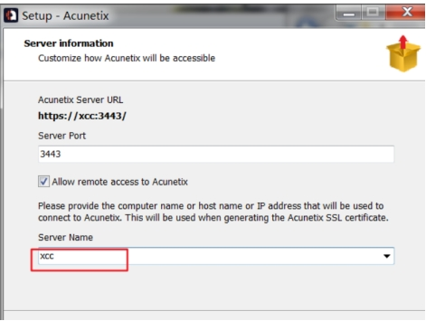 

### 2.1.6.**安装证书**

这里其实还有一个安装证书的界面，我忘记截图了，这里点击是，进行证书的安装。

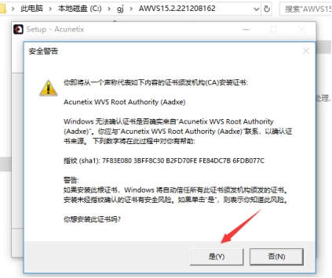 

## 2.2.**AWVS激活**

这里的激活可以运行到2027年，足够使用了。

### 2.2.1.**激活软件设置**

如果这里你是默认安装的，直接跳过，若是自定义安装的，需要把你的安装位置，粘贴到下面，然后再运行。

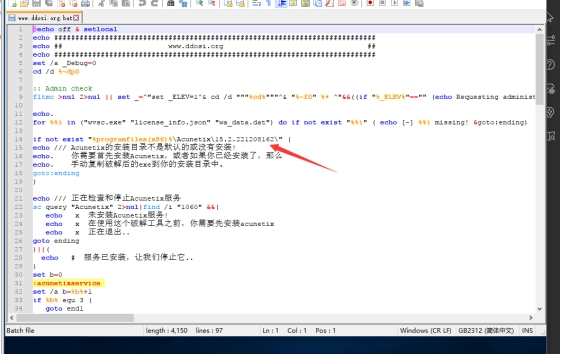 

### 2.2.2.**运行激活软件**

修改过，或者默认安装的，就可以运行激活软件了。

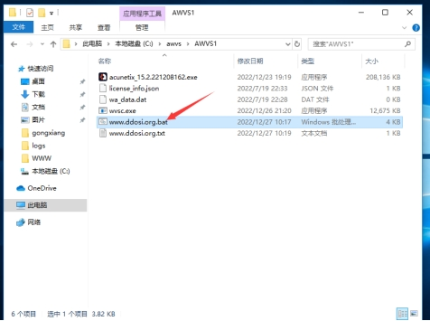 

### 2.2.3.**成功过程**

当运行激活后，成功破解的界面应该是这样的。

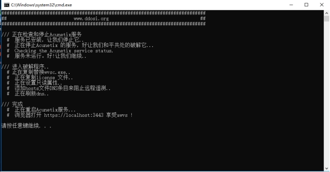 

### 2.2.4.**失败过程（成功跳过）**

若激活失败请参考下面的txt文档的教程。

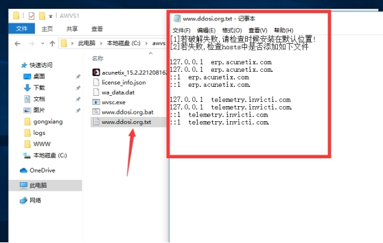 

## 2.3.**AWVS登录**

### 2.3.1.**AWVS正常访问**

安装完成后，就可以进行登录了，在浏览器中输入https://127.0.0.1:3443即可访问成功。若使用虚拟机搭建的，此时是无法使用物理机访问的。当访问后输入之前设定的账号和密码即可。

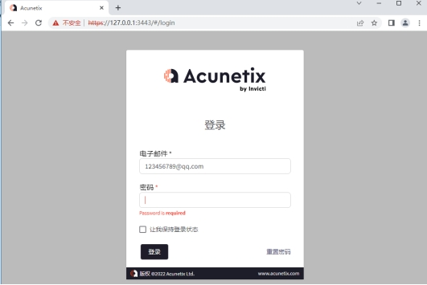 

### 2.3.2.**AWVS非正常访问**

这里所说的非正常访问是指，使用其它浏览器出现一下情况，若出现下面的图片请切换至Google浏览器，即可正常访问。

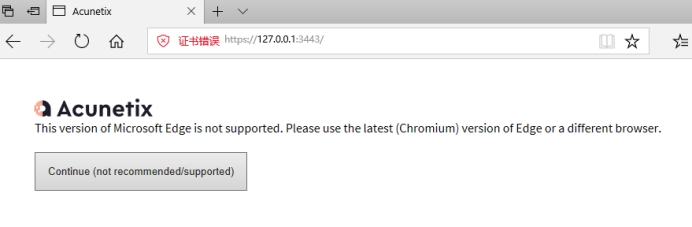 

## 2.4.**关于汉化**

关于汉化，我这个包看别人都是中文的，不知道为什么我这个激活后是英文的，使用edge浏览器设置页面翻译还是比较好用的，其它的不是太行。尤其是现在Google翻译对国内不支持的情况下，更不好了，这里直接右击页面，然后选择翻译为中文。

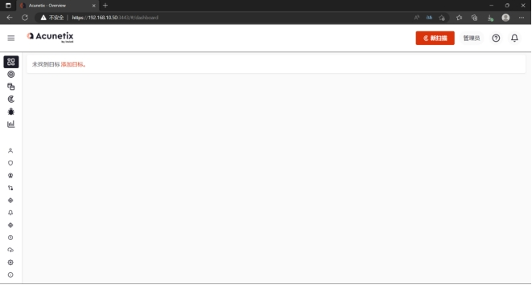 

# 3.**AWVS使用**

## 3.1.**AWVS功能模块介绍**

这里只对主要模块进行介绍，因为其它的用到的也少，很多都是调试用的模块，在日常中用到的比较少。

### 3.1.1.**Dashboard功能**

翻译意思仪表盘（监视器），可以对扫描对扫描完成目标进行排列，可以单独点击进去查看详细的扫描信息；

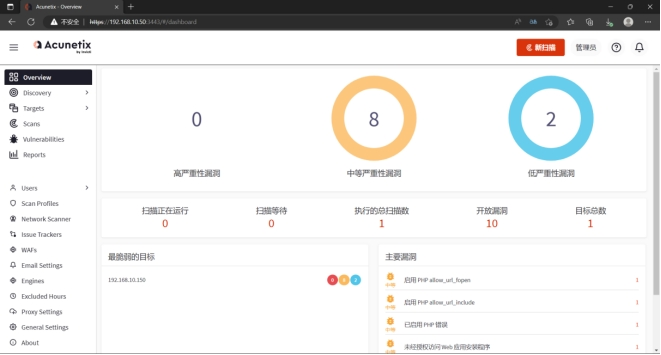 

### 3.1.2.**Targets功能**

意思就是目标，可以对扫描的目标进行添加，可以单个添加，可以多个添加或者按组添加。

在添加目标的界面中，下面可以添加其它的地址，点击后就会弹出另外一行，添加需要扫描的地址即可，在完成添加目标后，会自动跳转到扫描设置界面。

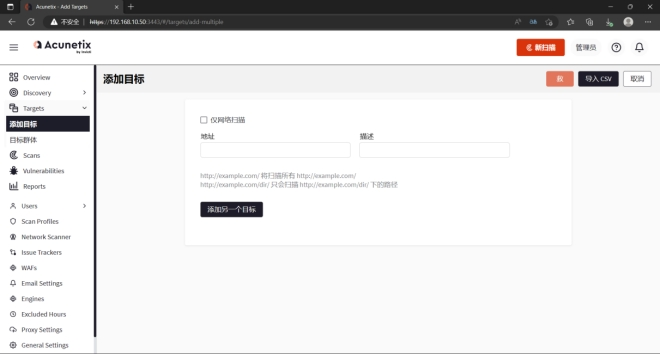 

### 3.1.3.**Vulnerabilities功能**

漏洞排序功能，对扫描出来的漏洞从高危到低位降序排列。

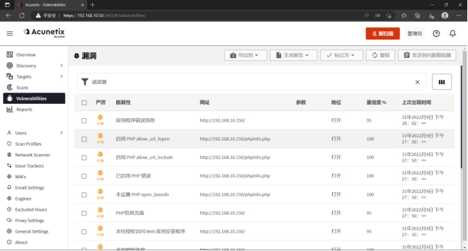 

### 3.1.4.**Scans功能**

扫描功能，可以新建扫描（自己可以配置扫描的参数），可以直接看到扫描记录，并且可以在扫描过的记录上勾选后重新扫描，其实前几个都是点击扫描的位置，有时候并非需要到这个界面，例如在添加地址后就可以直接跳转进行扫描操作。

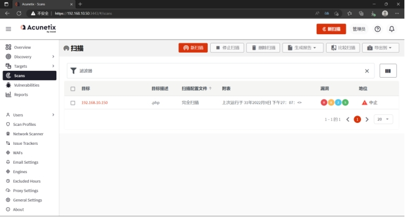 

### 3.1.5. **Reports功能**

可以对扫描的报告进行导出，有三种类型，可以直接选择，当选中后，会自动将刚刚扫描任务的结果进行输出。

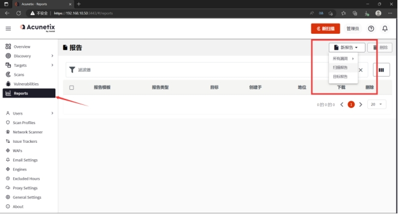 

### 3.1.6.**Discovery功能**

字面意思是发现，可以进行设置，有包含一些地址和组织的功能需要自己手动添加，也有排除一些地址和组织的功能，需要自己手动添加。

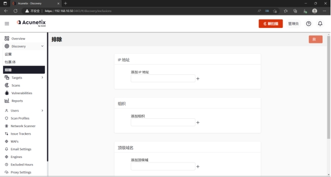 

### 3.1.7.**其它功能**

至于其它功能，这里就不一样介绍了，感兴趣的可以去了解一下，这里就只是大概描述一下作用。

Users功能：可以添加用户和删除用户，比如在企业内使用，可能还需要设置三权。

Scan Profiles功能：扫描配置功能，可以选择对那些漏洞扫描，默认都选不用管，当然这里还可以其它的内容。

Network Scanner功能：网络扫描，这里就需要设置扫描的地址端口，账号和密码。

Issue Trackers功能：问题追踪器，如果扫描失败，进行配置，然后这个功能会尝试链接目标地址看出现什么问题。

WAFs功能：防火墙设置，可以配置web应用程序防火墙。

Email Settings功能：邮件设置，如果设置自动扫描，那么当一个任务扫描完后，会将信息通过邮件进行发送。

Engines功能：引擎，不需要管这个东西。

Excluded Hours功能：这里就是设置自动扫描是时间，可以选择什么时间进行扫描。

Proxy Settings功能：代理功能，可以设置代理。

General Settings功能：常规设置，设置日志存储时间，扫描任务的数量等等，都可以进行设置。

## 3.2.**AWVS扫描使用**

这里就简单介绍一下整个扫描的流程。

### 3.2.1.**添加扫描地址**

这里可以在添加地址的位置进行添加，然后进行配置扫描，或者在仪表盘中直接添加，都可以，因为点击添加后会自动跳转，无需自己点。

 

### 3.2.2.**添加目标**

这里添加一个扫描目标，当然不单单只能添加一个，在界面下方有添加另一个目标，点击后，就可以添加另外一个了。描述就看你写不写了，随意，这里我就写一个测试。

添加完成后，点击右上角的save，我这里翻译成救？？？

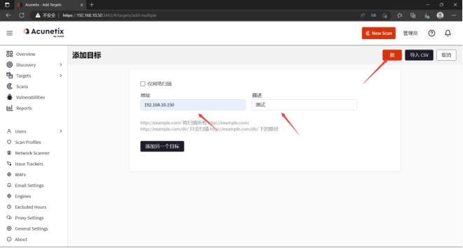 

### 3.2.3.**目标设置介绍**

在保存后，会自动跳转到目标设置，这里有一些信息是可选的，我就简要的提一下重要的内容，或者你直接选择默认扫描也行。这里我放一个界面，由于后面的展示会覆盖，可以让其方便看。

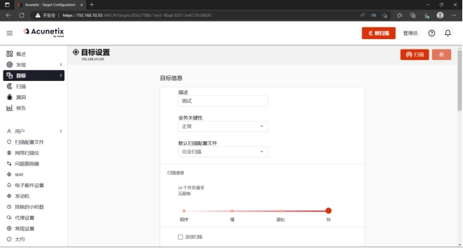 

#### 3.2.3.1.**业务关键性**

这里的业务关键性其实也就是说，业务的重要性，这个不太清楚，设置不同有什么区别，是不是说，越重要扫描的就越认真呢？

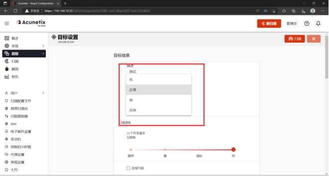 

#### 3.2.3.2.**默认扫描配置文件**

这个就是看你想要选择扫哪些了，可以设置单项的也可以设置第一个完全扫描，也就是默认扫描。

当然这里也是取决于Scan Profiles功能中定义的，可以直接去了解一下，通常是不需要设置的，直接默认。

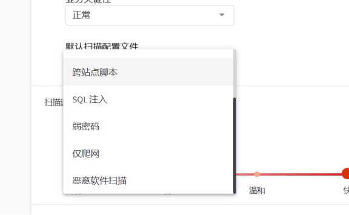 

#### 3.2.3.3.**扫描速度**

这里就是设置扫描的速度了，简单来说就是需要考虑，如果选择快，是不是把你的服务器搞挂了，或者崩了，很简单的理解。

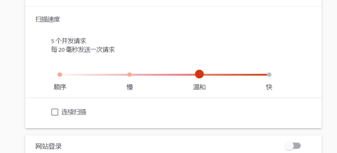 

#### 3.2.3.4.**网站登录**

这里的网站登录，我的理解就是当扫描到可以登录的网站的时候，对其进行登录，用来扫描网站内部的情况。个人理解，一起按照官方解释为准。

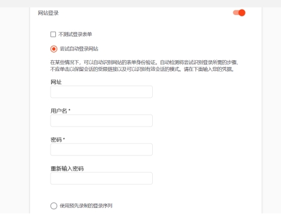 

#### 3.2.3.5.**其它选项**

关于其它选项，没用过，不太清楚。可以自行了解，不过正常的话，也很少用到，一般都是遇到一些特殊情况，例如有证书才能访问，那么给AWVS发个证书让其能够扫描到等等。

### 3.2.4.**目标设置完成**

这里我就简单一点，都是默认，当设置好后，先点击save保存，然后点击扫描，不然会提示有任务未保存。

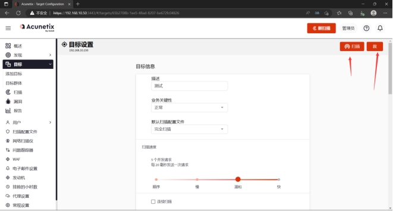 

### 3.2.5.**扫描选项**

这里选择默认也行，具体的自己去了解吧，像报告都是可以后期设置的，无所谓，简单来说就是省一步而已，设置完后点击创建扫描，就开始进行扫描了，只需要耐心等待结果即可。

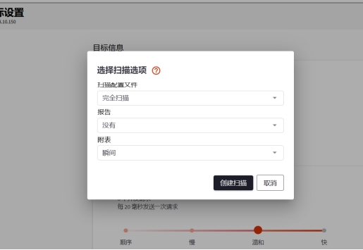 

### 3.2.6.**扫描界面**

点击创建扫描后，会自动跳转到这个界面，在这个界面中能够看到一些详细的信息。

比如危险等级、扫描进度、扫描时间、请求次数、漏洞情况、目标基础信息等详情。

 

### 3.2.7.**扫描结束**

扫描结束后就可以查看了，但是肯定各位更关注漏洞，那么就可以去漏洞页面去查看相关漏洞了。

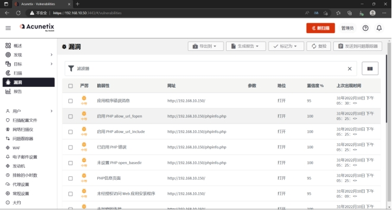 

### 3.2.8.**漏洞相关**

当你觉得这个漏洞有问题的时候可以，对当漏洞进行复检。

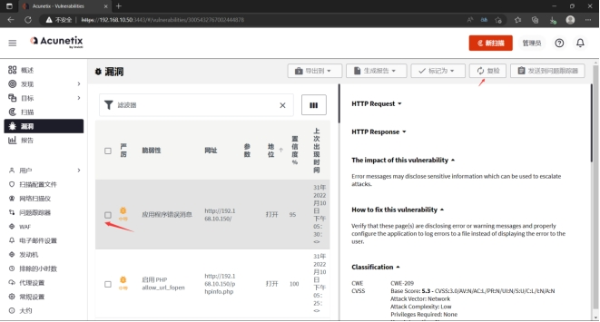 

### 3.2.9.**创建报告**

若你觉得没有什么问题了，那么就可以创建报告了，来到报告位置，点击上面的新报告，选择一个类型报告就可以了，我这里直接选择扫描报告，选择好后，就可以在页面上看到刚刚的任务报告了。

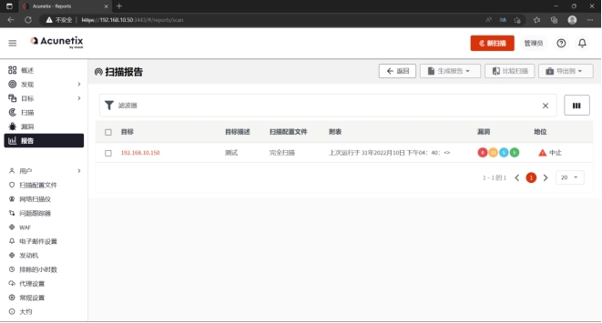 

### 3.2.10.**导出报告**

这里也有很多的格式选择，但是这里的类型基本上都是表格形式，点击后会过个几秒钟就会自动下载。

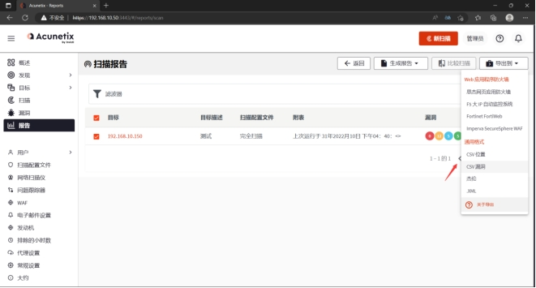 

