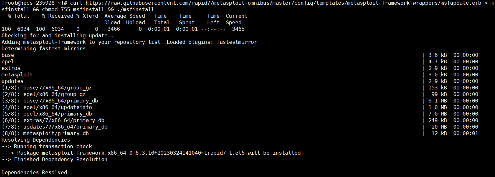
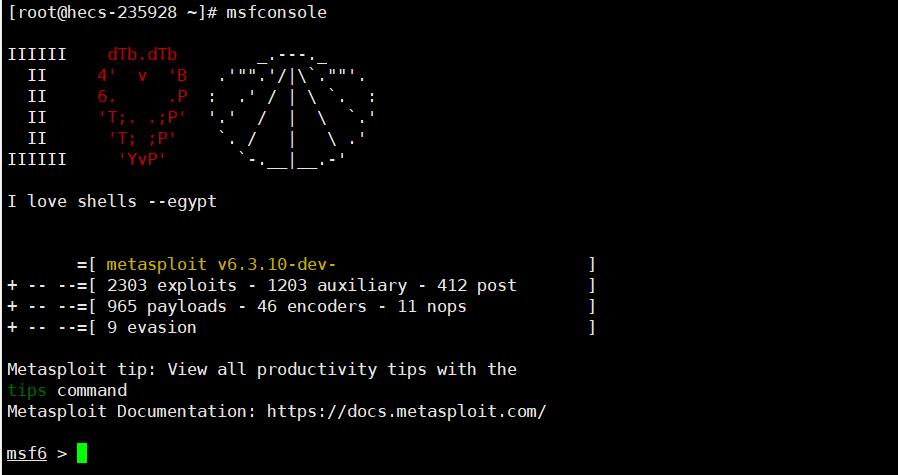
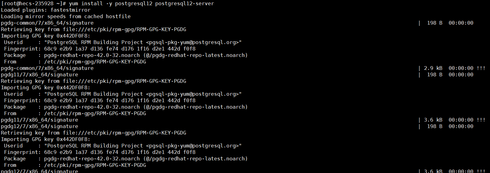
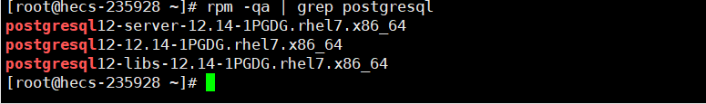
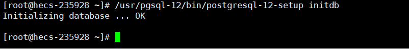
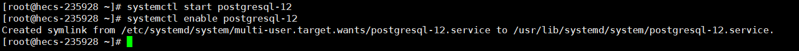
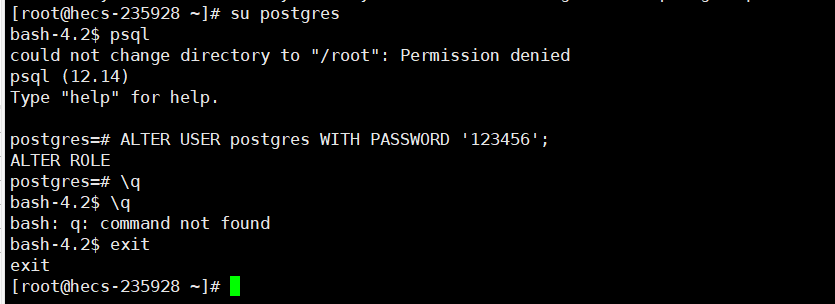
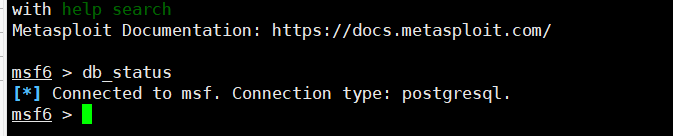

# 1. 前言

在日常使用中，模拟攻击以及测试的时候都是直接使用本地虚拟机kali中的msf工具，但是在一些测试环境中需要使用到公网，但是目前的所有的云服务商，并不会提供kali镜像，那么当使用到msf工具的时候就需要自行安装了。

网上的很多关于centos安装msf工具的教程，多多少少都存在一些问题，所以，这里就总结一篇关于centos7中安装msf工具的文章。

前期准备：

- 一台云服务器
- centos 7.X版本

## 1.1. MSF介绍

Metasploit（MSF）是一个免费的、可下载的框架，通过它可以很容易地获取、开发并对计算机软件漏洞实施攻击。

它本身附带数百个已知软件漏洞，是一款专业级漏洞攻击工具。

当H.D. Moore在2003年发布Metasploit时，计算机安全状况也被永久性地改变了，仿佛一夜之间，任何人都可以成为黑客。

因为只要掌握MSF的使用方法，每个人都可以使用MSF来攻击那些未打过补丁或者刚刚打过补丁的漏洞。

也因此软件厂商再也不能推迟发布针对已公布漏洞的补丁了，因为Metasploit团队一直都在努力开发各种攻击工具，并将它们贡献给所有Metasploit用户。

## 1.2. MSF使用

关于MSF使用，这里可以去参考我之前写的两篇关于MSF的使用教程，同时也可以关注一下我的网络安全文章汇总(持续更新)，这个里面的文章很适合新人入门。

# 2. MSF安装

这里直接使用MSF提供的一键安装脚本，都已经使用云服务器了，干嘛还使用离线安装，离线安装更多的是在本地搭建虚拟机环境去安装，那么又出现一共问题，都本地虚拟机搭建了，那为什么不直接按照kali系统呢？

## 2.1. MSF安装脚本

使用一键脚本按照很方便，并且能够省去很多的操作失误。

这里需要一段时间的下载，同时云服务器在访问github的时候也不是有什么特殊加速的，所以可以暂停，然后重新执行命令，多执行几次速度就正常了，总共就300多M。

```bash
curl https://raw.githubusercontent.com/rapid7/metasploit-omnibus/master/config/templates/metasploit-framework-wrappers/msfupdate.erb > msfinstall && chmod 755 msfinstall && ./msfinstall
```



## 2.2. MSF测试

这里测试一下是否安装成功，这里输入命令然后看看能否正常出现MSF界面即可。

```
msfconsole
```



# 3. 安装Postgresql数据库

关于安装Postgresql数据库可能是这里最麻烦的一件事，可能会出现很多问题，但是跟着一步一步操作应该就不会出现问题。

## 3.1. 查询Postgresql数据库

这里我查询我的云服务器是不存在的，如果有先卸载，重新安装。

```
yum remove postgresql*      ##卸载
rpm -qa | grep postgresql    ##查看是否卸载完成
```

## 3.2. 安装Postgresql数据库

在安装postgresql数据库的时候，其实版本好像不是那么重要。

```
yum install -y https://download.postgresql.org/pub/repos/yum/reporpms/EL-7-x86_64/pgdg-redhat-repo-latest.noarch.rpm   ##导入yum源
yum install -y postgresql12 postgresql12-server  ##安装Postgresql数据库客户端与服务端，这里的12是版本，如果是9.5，那么就是95
```



## 3.3. 查询是否安装成功

使用命令查询一下即可。

```
rpm -qa | grep postgresql
```



## 3.4. 初始化数据库

这里需要将数据库先初始化一下。

```
/usr/pgsql-12/bin/postgresql-12-setup initdb 
```



## 3.5. 启动postgresql服务

启动一下服务，并设置开机自启。

```
systemctl start postgresql-12 ##启动服务
systemctl enable postgresql-12 ##设置开机自启
```



## 3.6. 设置数据库(好像可以不用设置)

主要设置好像不用设置，可以跳过，如果不放心就设置吧，操作到后面我才发现不用设置，但为了完整性，我还是将该步骤放上来。

PostgreSQL安装成功之后，会默认创建一个名为postgres的Linux用户，初始化数据库后，会有名为postgres的数据库，来存储数据库的基础信息。

这里密码简单无所谓，反之是给msf用的，端口也不对外开放，所以无所谓。

```
su postgres  ##通过su命令切换linux用户为postgres会自动进入命令行
psql   ##启动SQL Shell
ALTER USER postgres WITH PASSWORD '设置的密码';   ##修改密码
```



# 4. MSF连接postgresql

## 4.1. 连接数据库设置

这里就需要设置MSF去连接postgresql数据库了，主要这里不能使用root用户去初始化数据库，所以这里创建一个用户去初始化数据库。

```
cd /opt/metasploit-framework/bin/   ##注意不要使用root用户去初始化数据库
useradd msf   ##创建msf用户
su msf        ##切换用户
./msfdb init  ##初始化数据库
```

 

## 4.2. 覆盖配置文件

创建完成后在msf用户目录会生成一个.msf目录里面会有一个database.yml文件，然后，我们这时从msf账户切换到root用户，执行以下操作将原配置文件覆盖。

```
cp /home/msf/.msf4/database.yml /opt/metasploit-framework/embedded/framework/config/
```

## 4.3. 启动MSF

这里执行命令启动以下MSF，并且使用密码查询以下数据库连接的状态，命令第二行是可选哦，当执行命令看数据库连接状态的时候，如果看到后面是postgresql，那么就证明连接成功了。

更新MSF是可选的，如果就觉得安装的不是最新可以执行以下，让MSF更新一下，注意不是在MSF服务里面执行。

完成这些操作后，就可以愉快的使用MSF工具了。

```
msfconsole ##启动msf
db_connect postgres:密码@127.0.0.1/test ##可选项，如果未操作4.1连接数据库设置，那么就可以直接在这里使用命令连接。
db_status ##查看数据库连接状态
msfupdate  ##更新MSF  可选，注意不是在MSF服务里面执行，注意不是在MSF服务里面执行，注意不是在MSF服务里面执行。
```



# 5. 参考文献

[centos搭建msf](https://blog.csdn.net/m0_52400001/article/details/123727855)

[在CentOS 7上安装&配置PostgreSQL 12](https://cloud.tencent.com/developer/article/1592808)