# 1.**Goby简介**

## 1.1.**Goby介绍**

Goby是一个不需要安装的一款攻击面测绘工具，它能够针对一个目标企业梳理最全的攻击面信息，同时能进行高效、实战化漏洞扫描。

并快速地从一个验证入口点，切换到横向,实现快速安全应急，以及用新一代网络安全技术建立一个完整的资产数据库,并能够输出更具生命力的工具，能够对标黑客的实际能力，帮助企业来有效地理解和应对网络攻击。

## 1.2.**Goby下载**

Goby访问网站就能够下载下来，并且是免安装的，只需要将下载下来的压缩包进行解压即可使用。

[下载链接](https://gobies.org/)

# 2.**Goby使用**

关于Goby具体的使用手册可参考官方问题手册。

[FAQ](https://gobysec.net/faq)

注意若在windows中使用Goby漏扫，一定要把杀毒软件退出，应该说不单单使用Goby需要推出，所有都应该推出，因为会被检测到攻击，杀毒软件会对其进行拦截。

## 2.1.**切换语言**

在刚下载下来的Goby是英文的，可以点击左下角进行切换语言。

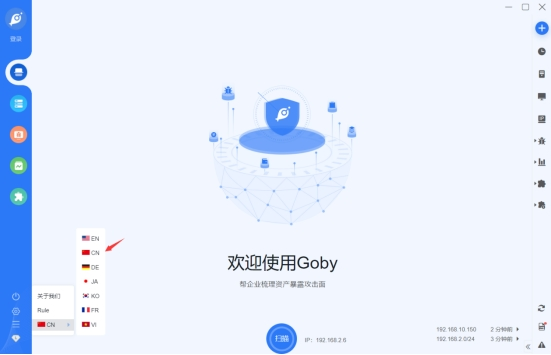 

## 2.2.**新建扫描**

### 2.2.1.**设置扫描地址**

在设置扫描地址位置，可以添加当个IP地址、多个IP地址、IP地址段、域名、带端口IP等，均可以添加设置，具体的规则可以看页面提示。

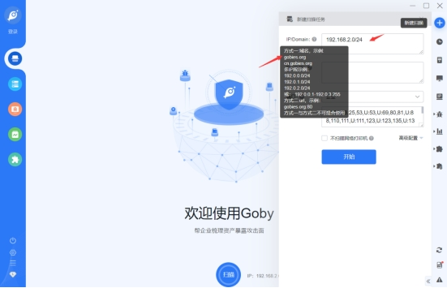 

### 2.2.2.**设置端口**

在端口位置可以选中Goby官方已设置好的端口，或者自己添加相应的端口，均可以，可扩展性较好。

#### 2.2.2.1.**选中默认端口**

如果想要使用默认设定好的端口，可以直接选择，同时这些默认端口，根据不同需求，划分了多种类型的端口。

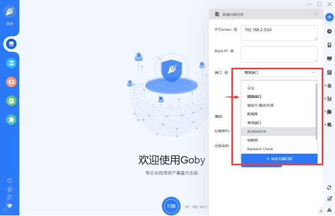 

并且在选中的默认端口中，可以查看含有哪些端口，也可以直接删除，或者手动添加不足的端口。

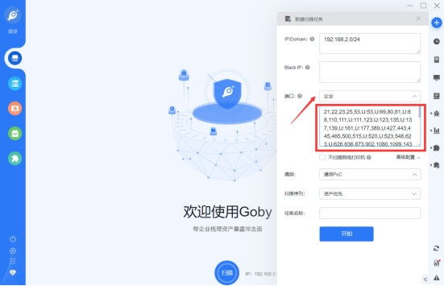 

#### 2.2.2.2.**自定义端口**

若默认的端口都不符合你想要的，也可以在选择框最下面选择自定义端口设置。

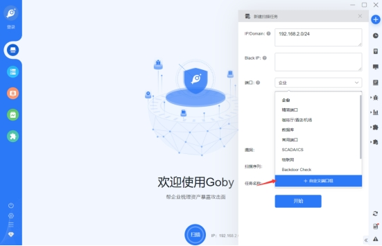 

给组定义的一个名字，然后输入你想要的端口号，默认直接输入的数字为TCP协议端口，而U:数字，则代表UDP协议端口，同时端口之间需要使用英文逗号进行隔断，然后点击保存，就可以在窗口中选择了。

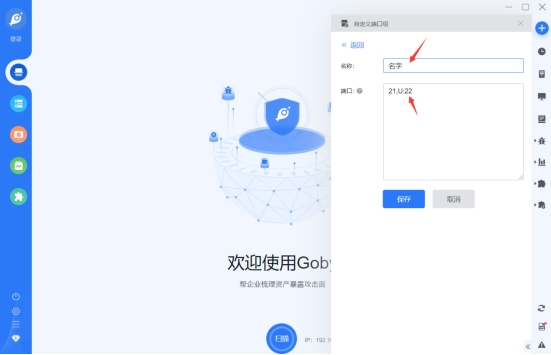 

### 2.2.3.**漏洞**

漏洞，这个地方需要点击高级配置才会出现，在漏洞这里可以选择，通用Poc、暴力破解、全部漏洞、单个漏洞、禁用漏洞。

#### 2.2.3.1.**通用Poc**

如果选择通用Poc，可以在漏洞>Poc管理中查看有哪些漏洞。

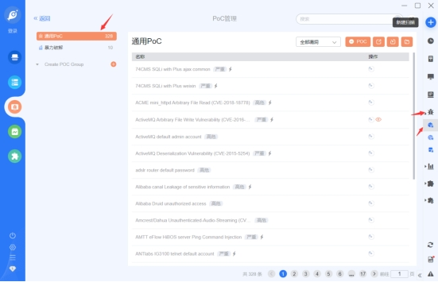 

#### 2.2.3.2.**暴力破解**

暴力破解也是一样的，但是暴力破解主要是对密码进行爆破，而通用Poc也回对密码进行爆破，但是没有暴力破解那么专一。

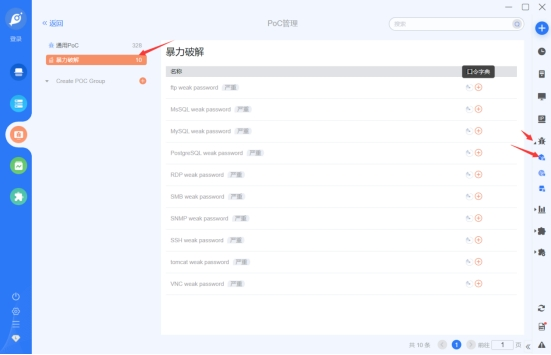 

同时暴力破解可以设置字典库，默认的字典库内容很少可以自己设定，并添加，格式为账号:密码。

例如admin:123456

在页面的后面有个浅粉色加号点击后即可添加。

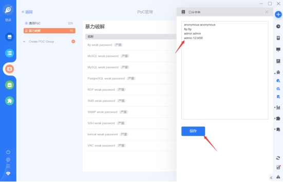 

#### 2.2.3.3.**全部漏洞**

全部漏洞就是暴力破解与通用Poc一起测试，这里就不截图了没什么好说的。

#### 2.2.3.4.**自定义Poc**

关于自定义Poc，可以参考官方的格式，这里我也不是太懂这个。

### 2.2.4.**开始扫描**

当都设置好后，在设置一个任务名字，或者不设置也可以，然后就可以点击开始了。

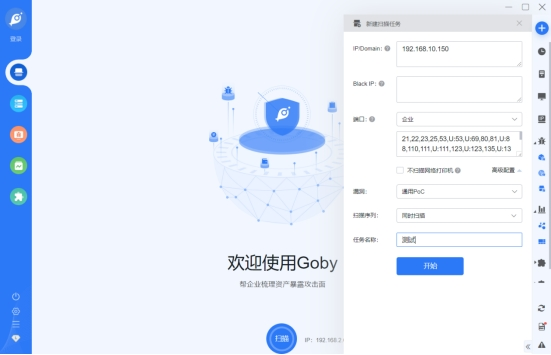 

## 2.3.**扫描情况**

在点击开始扫描后，就可以看到，页面上会实时显示相关的内容，英文版切换成中文，看到后也就能够理解了，这里就不解释了。

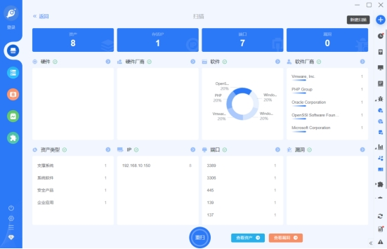 

### 2.3.1.**查看漏洞**

当点击下面的查看漏洞后，会自动跳转到漏洞界面，这里我扫描了一个我的虚拟机，可是没扫到漏洞，尴尬了，我以为能扫到的，我虚拟机上也没有杀毒软件拦截，这里的普通版功能相对红队版来说还是比较少的，漏洞检测也不是太准。

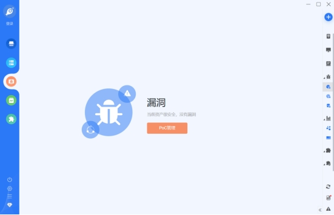 

### 2.3.2.**查看资产**

点击下面的查看资产，也是会自动跳转到资产界面，通过资产界面可以看到服务器中使用了什么服务，什么型号，有点像指纹。

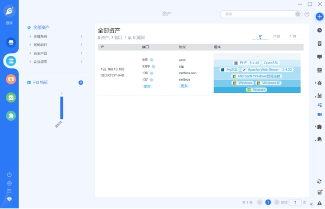 

## 2.4.**查看报告**

点击左边的第四个可以查看当前扫描的相关报告，也挺好的。

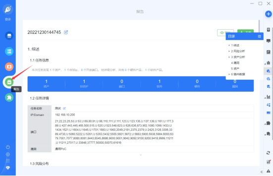 

## 2.5.**插件相关**

在插件库中，也包含了很多有趣的插件，不过有很多插件都需要联动起来进行操作，并且一些还需要下载一些其它的附带的软件。

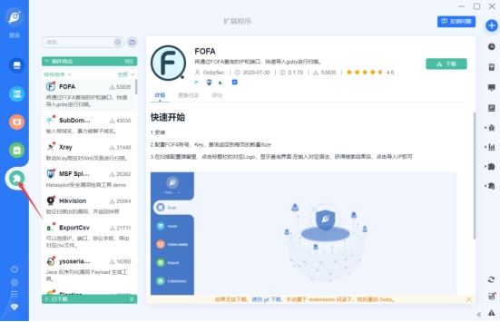 

### 2.5.1.**插件案例**

比如这里我下载了一个子域名爆破插件，根据插件介绍进行使用，并且能够直接导入到扫描任务中，挺好的。

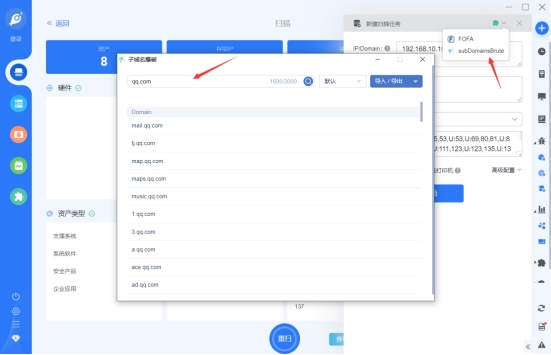 

# 3.**总结**

个人感觉Goby在个人版方面，使用上还有有很多的不方便的，并且漏洞扫描也并不是那么很准确，我搭建的windows7靶机是有永恒之蓝漏洞的，但是Goby并未扫到，但是Goby是支持扫描永恒之蓝的。并且我什么拦截软件都没开启，就是一台裸机。可能主要的重心都在红队版上面吧。

 

 