# 1.**Godzilla介绍**

这里介绍可以直接看作者的对软件的介绍，这里就不复述了，复述也是类似抄一遍，没准还没说对。

# 2.**Godzliia下载与安装**

## 2.1.**Godzilla下载**

[godzilla](https://github.com/BeichenDream/Godzilla)

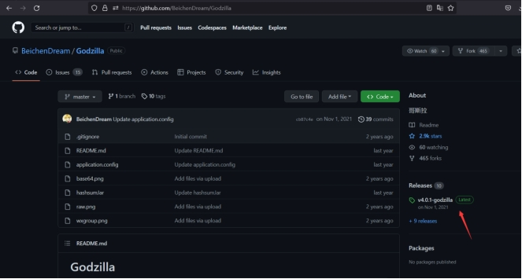 

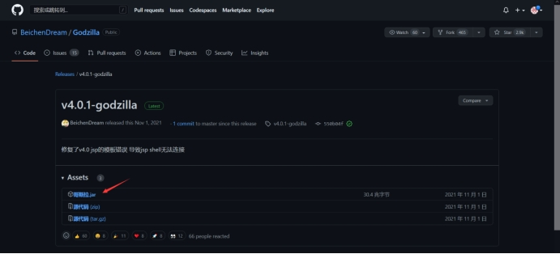 

## 2.2.**运行环境**

这里自己提前准备一下这些运行环境，不过正常安装各类软件的话，这些应该都不需要安装，就会存在自己的电脑上。

1) JavaDynamicPayload -> java1.0及以上
2) CShapDynamicPayload -> .net2.0及以上
3) PhpDynamicPayload -> 4.3.0及以上
4) AspDynamicPayload -> 全版本

## 2.3.**Godzilla安装**

### 2.3.1.**执行文件**

这里只需要执行一下godzilla.jar文件，就会自动生成一个data.db数据库存放数据。

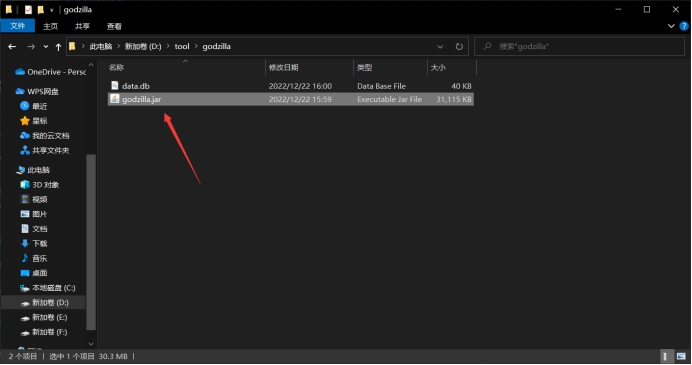 

### 2.3.2.**安装完成**

与其说安装，还不如说直接是免安装的，打开就可以执行，前提是运行环境需要准备好，这里如果不确定有没有运行环境，可以先执行，若正常执行了，就OK了，若不行在去排查。

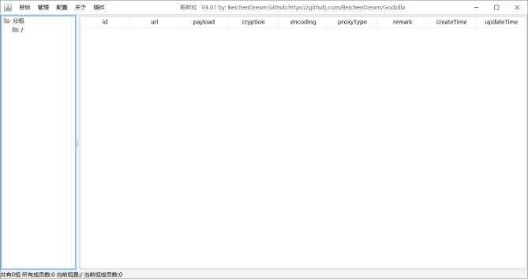 

# 3.**Godzliia**

## 3.1.**Godzliia使用**

### 3.1.1.**生成木马**

流程：输入密码>密钥>有效载荷>加密器

简单来说生成木马需要先设置密码和密钥然后选有效载荷，在载荷中有PHP、JAVA、ASP、CSHAP，在选择好载荷后，就需要选择加密器了，至于加密形式可以参考作者的解释。这里我选择密码和密钥默认的，载荷选择PHP的，加密选择php的base64。这里一定要记住自己的选择，后面需要用到。

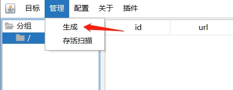 

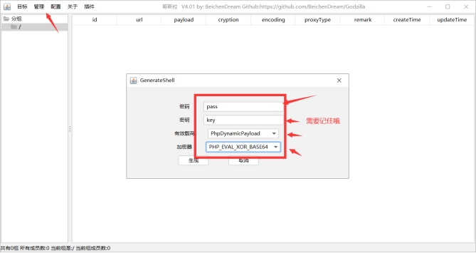 

### 3.1.2.**存储木马**

在选择好后，点击生成木马，然后就会让你选择一个保存位置，并且设定文件名称。

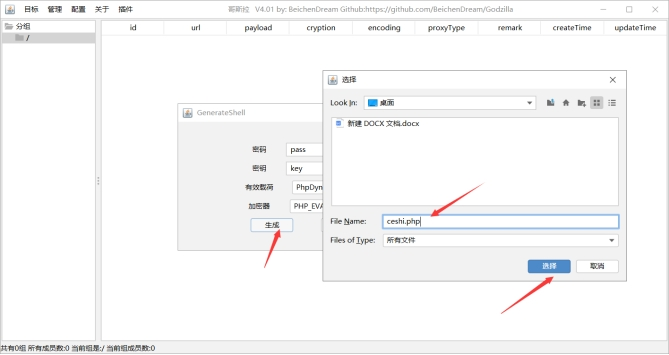 

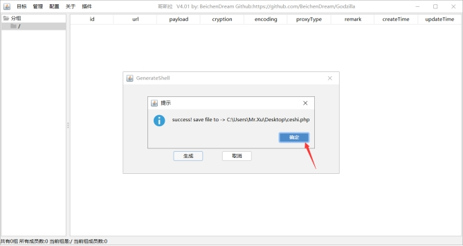 

### 3.1.3.**放入木马**

这里我就不找实例进行测试了，直接放入我的虚拟机。

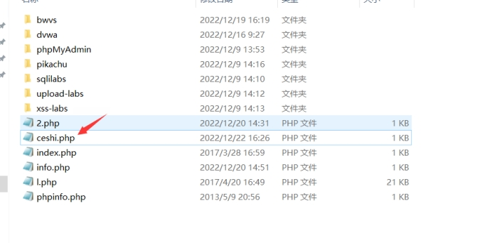 

### 3.1.4.**访问木马**

这里我就测试了一下木马是否能够正常访问，然后输入一个pass=phpinfo()；就显示了php配置文件，当然你也可以不访问。

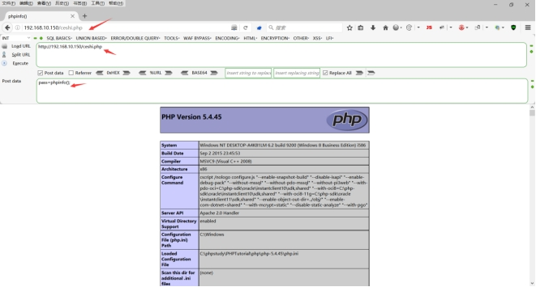 

### 3.1.5.**连接木马**

这里就正式开始连接木马，首先我们需要点击目标进行添加。

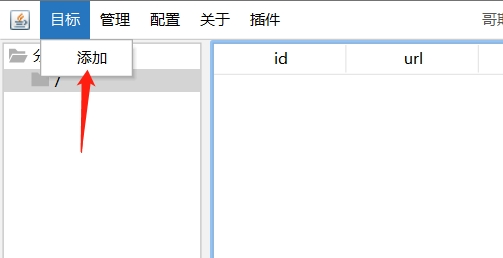 

URL需要输入刚刚访问的连接地址，当然不同情况下访问的URL肯定也是不同的，所有需要自己判断。

密码、密钥、有效载荷、加密器均需要和生成木马时填入的内容要保持一直，不能有错，否则无法连接成功。

至于其他的，正常情况下不需要修改。

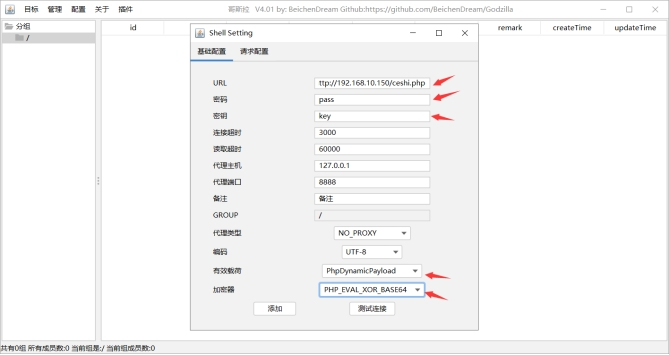 

### 3.1.6.**测试连接**

当出现success！的时候就证明测试连接成功，当然这个是测试连接，不建议不使用测试连接就直接添加，不然会误以为成功了，实则是未成功。当测试成功后就可以点击添加了。

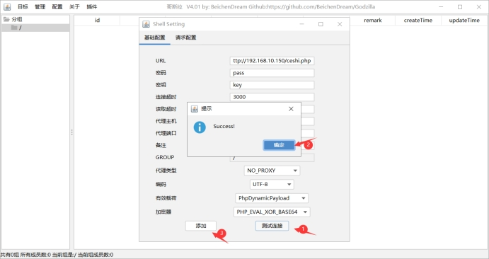 

### 3.1.7.**连接进入**

右击shell然后就可以选择进入了。

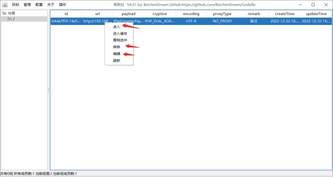 

在窗口中存在很多的功能可以自行了解一下。

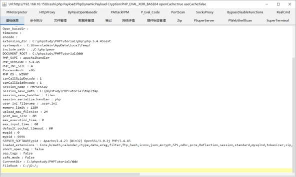 

## 3.2.**Godzliia特性**

为什么我放着冰蝎、蚁剑还有什么天蝎不用而要用你的哥斯拉？ 

1) 哥斯拉全部类型的shell均过市面所有静态查杀 
2) 哥斯拉流量加密过市面全部流量waf 
3) 哥斯拉的自带的插件是冰蝎、蚁剑不能比拟的 

静态免杀就不说了，工具放出来之后可能会免杀一段时间就不行了，当然随便改改就能继续过

 

 