# 1.**Nmap简介**

## 1.1.**Nmap介绍**

nmap是一个网络连接端扫描软件，用来扫描网上电脑开放的网络连接端。确定哪些服务运行在哪些连接端，并且推断计算机运行哪个操作系统（这是亦称 fingerprinting）。它是网络管理员必用的软件之一，以及用以评估网络系统安全。

正如大多数被用于网络安全的工具，nmap 也是不少黑客及骇客（又称脚本小子）爱用的工具 。系统管理员可以利用nmap来探测工作环境中未经批准使用的服务器，但是黑客会利用nmap来搜集目标电脑的网络设定，从而计划攻击的方法。

Nmap 常被跟评估系统漏洞软件[Nessus](https://baike.baidu.com/item/Nessus?fromModule=lemma_inlink) 混为一谈。Nmap 以隐秘的手法，避开闯入检测系统的监视，并尽可能不影响目标系统的日常操作。

## 1.2.**Nmap功能介绍**

Nmap可以用于对服务器的主机探测、端口扫描、版本检测、同时也支持探测脚本的编写。

## 1.3.**Nmap下载**

Nmap可以在Windows与linux上运行，Windows中需要下载Windows版本的Nmap，而Linux中，可以下载也可以直接使用kail系统，在kail系统中Nmap是自带的，无需下载。

[官网](http://nmap.org)

## 1.4.**Nmap端口状态**

```
1．Open：端口开启，有程序监听此端口。

2．Closed：端口关闭，数据能到达主机，但是没有程序监听此端口。

3．Filtered：数据未能到达主机。

4．Unfiltered：数据能到达主机，但是Nmap无法判断端口开启还是关闭。

5．Open | filtered：端口没返回值，主要出现在UDP，IP，FIN，NULL和Xmas扫描。

6．Closed | filtered：只出现在IP ID idle 扫描。
```


# 2.**Nmap基本使用**

## 2.1.**Nmap基础扫描**

使用基本扫描也就是说，不带任何的参数，直接扫描，通常默认探测目标主机在1至10000范围中开放的端口情况。

```
命令：nmap 192.168.10.150
```

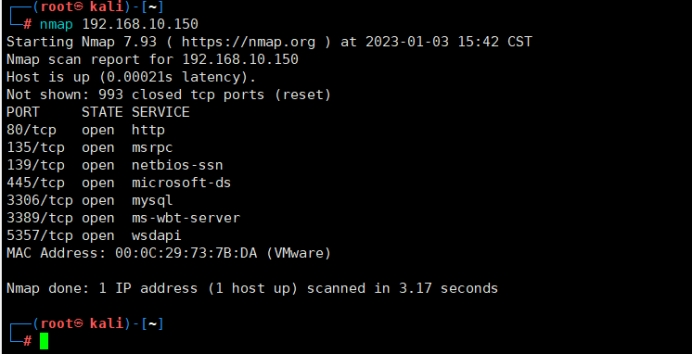 

## 2.2.**Nmap基础扫描多个目标**

这里由于我第二个虚拟机没开，所以显示第二个IP不通，但能证明是进行扫描了。

```
命令：nmap 192.168.10.150 192.168.10.50

命令：nmap 192.168.10.1-192.168.10.10
```

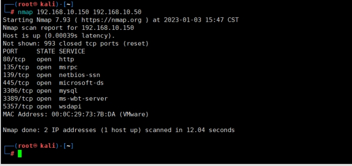 

## 2.3.**Nmap详细扫描输出**

简单扫描，并对返回的结果详细描述输出，这种扫描就是能够看到扫描的百分比，以及一些详细的信息。

同时-v与-vv都是一样的，都能够输出详细的扫描过程。

```
命令：nmap -v 192.168.10.150 
```

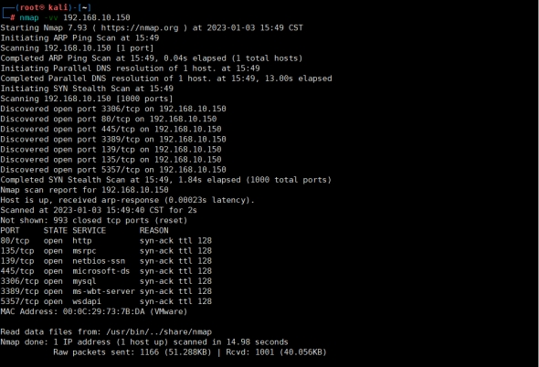 

## 2.4.**Nmap指定端口扫描**

在使用nmap的时候默认扫描的端口是1到10000，当我们想指定某个端口或者某一段端口进行扫描的时候就可以使用-p参数来设定扫描的端口。

### 2.4.1.**单端口扫描**

```
命令：nmap -p 3389 192.168.10.150
```

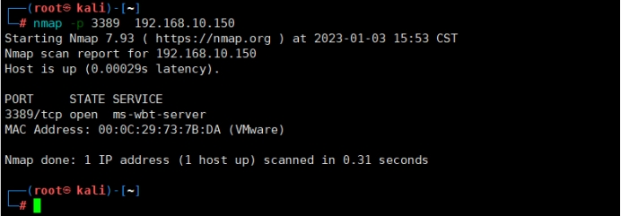 

### 2.4.2.**端口范围扫描**

```
命令：nmap -p 1-3000 192.168.10.150
```

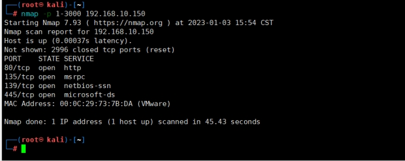 

### 2.4.3.**端口组合扫描**

这里的组合扫描就是有单端口和多端口一起的。

```
命令：nmap -p 3389,1-3000 192.168.10.150 
```

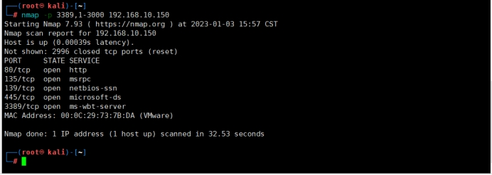 

## 2.5.**Nmap扫描排除**

这里的排除就是在当扫描某一个网段的时候，不扫描这个主机，或者不扫描这个文件中存在的IP地址。

### 2.5.1.**排除一个主机**

其实通过下图就能发现，当我扫描整个网段的时候，我排除了192.168.10.150这台靶机，所以扫描的时候并未扫192.168.10.150。

```
命令：nmap 192.168.10.0/24 -exclude 192.168.10.150
```

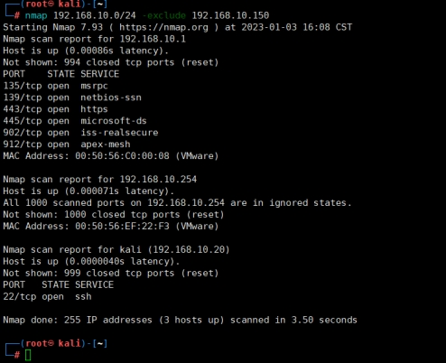 

### 2.5.2.**排除文件中的主机**

这里文件中的主机就是，文件中写到的IP，这里我创建一个文件夹叫IP.txt，里面还是写我的192.168.10.150，来看看结果吧。

```
命令：nmap 192.168.10.0/24 -excludefile ip.txt 
```

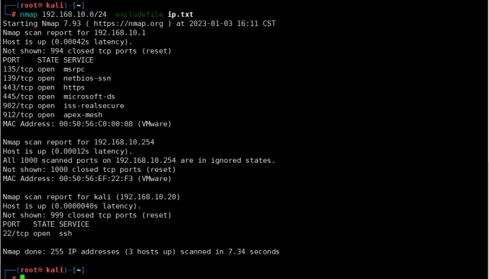 

## 2.6.**Nmap中Ping扫描**

这里所谓的Ping扫描其实就是去探测主机的，用于主机发现，并非是去探测端口开放。

```
命令：nmap -sP 192.168.10.0/24
```

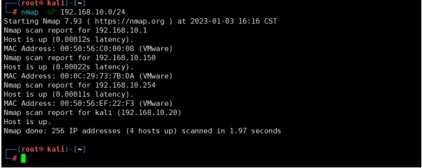 

## 2.7.**Nmap中SYN半放开式扫描**

其实这个Tcp SYN Scan (sS) 这是一个基本的扫描方式,它被称为半开放扫描，由于采用这种方式可以使得Nmap不需要通过完整的握手，就能获得远程主机的信息，并且不会产生会话，因此也不会在主机上产生任何日志记录。就因为未形成会话，才是这个方式的优势。

```
命令：nmap -sS 192.168.10.150
```


## 2.8.**Nmap中TCP/UDP扫描**

### 2.8.1.**TCP扫描**

```
命令：nmap -sT 192.168.10.150 
```

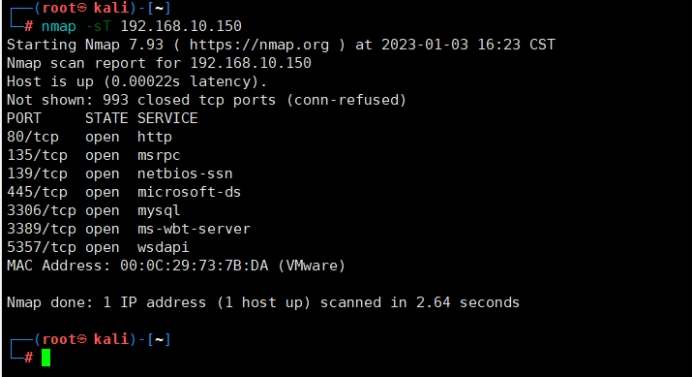 

### 2.8.2.**UDP扫描**

我这个没开放UDP，所以根本就没测试出来。

```
命令：nmap -sU 192.168.10.150
```

 

## 2.9.**Nmap版本扫描**

所谓的版本扫描就是用于检测目标主机上的端口中运行的软件的版本，它不是用于扫描主机和端口的，但是它需要通过开放的端口去获取信息进行判断。并且这个扫描比较慢，最好在测试之前去获取一下开放了哪些端口，针对端口进行扫描。

```
命令：nmap -sV 192.168.10.150
```

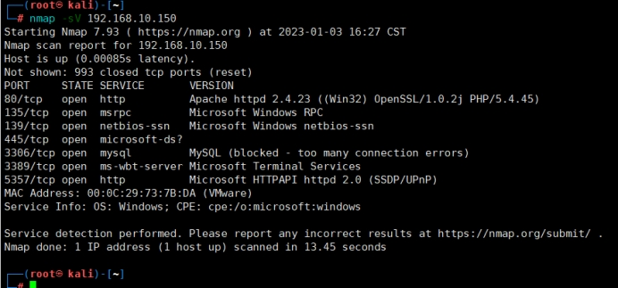 

## 2.10.**Nmap操作系统扫描**

### 2.10.1.**远程检测操作系统**

远程检测操作系统和软件，Nmap的OS检测技术在[渗透测试](https://cloud.tencent.com/product/wpt?from=10680)中用来了解远程主机的操作系统和软件是非常有用的，通过获取的信息你可以知道已知的漏洞。Nmap有一个名为的nmap-OS-DB[数据库](https://cloud.tencent.com/solution/database?from=10680)，该数据库包含超过2600操作系统的信息。

```
命令：nmap -O 192.168.10.150
```

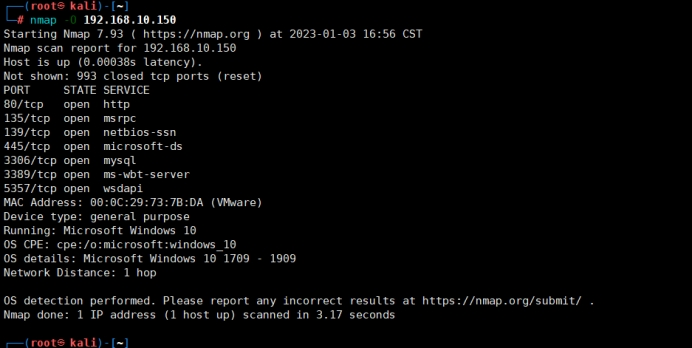 

### 2.10.2.**猜测匹配操作系统**

通过Nmap准确的检测到远程操作系统是比较困难的，需要使用到Nmap的猜测功能选项,–osscan-guess，通过猜测匹配最接近的操作系统。

```
命令：nmap -O -osscan-guess 192.168.10.150
```

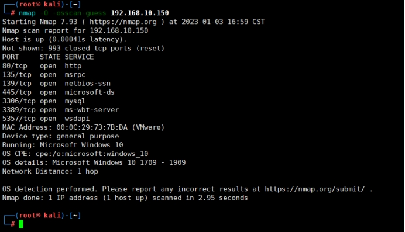 

## 2.11.**Nmap不用ping远程主机**

如果远程主机有防火墙，IDS和IPS系统，你可以使用-PN命令来确保不ping远程主机，因为有时候防火墙会阻止掉ping请求，-PN命令告诉Nmap不用ping远程主机，使用-PN参数可以绕过PING命令,但是不影响主机的系统的发现。

```
命令： nmap -O -PN 192.168.10.150  
```

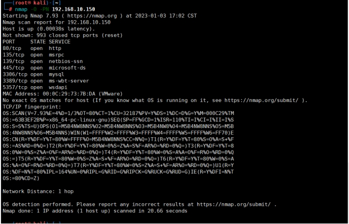 

## 2.12.**Nmap从文件中读取扫描**

这个就是通过从文件中读取需要扫描的IP列表。

```
命令：nmap -iL ip.txt 
```

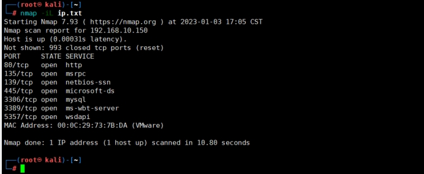 

## 2.13.**Nmap路由跟踪扫描**

路由器追踪功能，能够帮网络管理员了解网络通行情况，同时也是网络管理人员很好的辅助工具！

通过路由器追踪可以轻松的查看从我们电脑所在地到目标地之间所经过的网络节点，并可以看到通过各个节点所花费的时间。

```
命令：nmap -traceroute 192.168.10.150
```

 

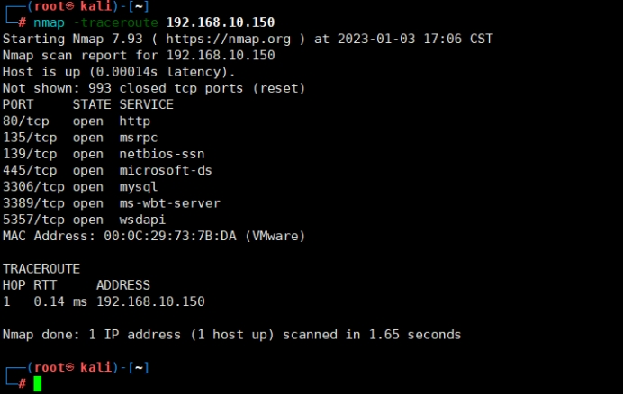 

## 2.14.**Nmap其它扫描**

### 2.14.1.**综合扫描**

A OS识别,版本探测,脚本扫描和traceroute综合扫描。

此选项设置包含了1-10000的端口ping扫描，操作系统扫描，脚本扫描，路由跟踪，服务探测。

```
命令：nmap -A 192.168.10.150
```

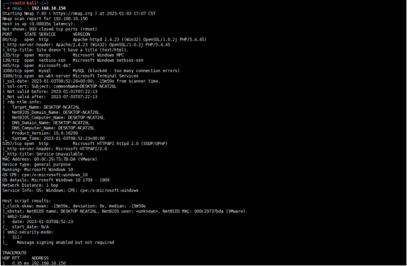 

### 2.14.2.**命令综合扫描**

命令混合扫描，可以做到类似参数-A所完成的功能，但又能细化到我们所需特殊要求。所以一般高手选择这个混合扫描。

```
命令：nmap -vv -p1-100,3306,3389 -O -traceroute 192.168.10.150
```

 

## 2.15.**Nmap输出格式**

扫描的结果输出到屏幕,同时会存储一份到jg.txt。

```
命令：nmap -p 3389 -oG jg.txt 192.168.10.150
```

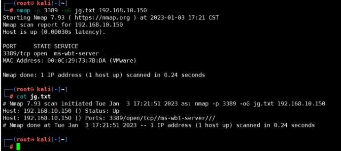 

# 3.**Nmap脚本**

## 3.1.**Nmap脚本简介**

### 3.1.1.**Nmap脚本介绍**

虽然NSE有一个复杂的实现来提高效率，但它非常容易使用。只需指定-cC即可启用最常见的脚本。或者指定--script选项，通过提供类别、脚本文件名或要执行的脚本目录的名称来选择要执行的自己的脚本。您可以通过--script args和--script-args文件选项为某些脚本提供参数来自定义它们。--script帮助显示每个所选脚本的作用描述。剩下的两个选项--script trace和--script updatedb通常只用于脚本调试和开发。脚本扫描也是-A（主动扫描）选项的一部分。

脚本扫描通常与端口扫描结合进行，因为脚本可以根据扫描发现的端口状态运行或不运行。使用-sn选项，可以在不进行端口扫描的情况下运行脚本扫描，只进行主机发现。在这种情况下，只有主机脚本才有资格运行。要在既不进行主机发现也不进行端口扫描的情况下运行脚本扫描，请将-Pn-sn选项与-sC或--script一起使用。将假设每个主机都已启动，但仍将只运行主机脚本。这种技术对于whois-ip这样只使用远程系统地址而不需要启动的脚本非常有用。

脚本不是在沙盒中运行的，因此可能会意外或恶意地损坏您的系统或侵犯您的隐私。除非您信任作者或自己仔细审核了脚本，否则不要运行第三方的脚本。

[官方文档](https://nmap.org/book/nse-usage.html#nse-categories)

### 3.1.2.**Nmap脚本类别介绍**

Nmap允许用户自己编写脚本进行自动化扫描操作,或者扩展Nmap现有的功能脚本文件的默认目录为: /usr/share/nmap/scripts，如图大概近600个不同分类不同功能的脚本。

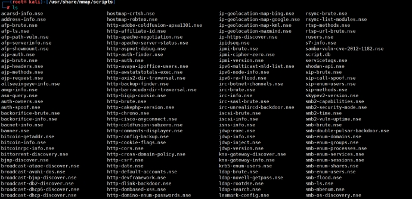 

| ***\*类别名称\**** | ***\*类别解释\****                                           |
| ------------------ | ------------------------------------------------------------ |
| auth               | 负责处理鉴权证书（绕开鉴权）的脚本 。                        |
| broadcast          | 在局域网内探查更多服务开启状况，如dhcp/dns/sqlserver等服务。 |
| brute              | 提供暴力破解方式，针对常见的应用如http/snmp等。              |
| default            | 使用-sC或-A选项扫描时候默认的脚本，提供基本脚本扫描能力。    |
| discovery          | 对网络进行更多的信息，如SMB枚举、SNMP查询等。                |
| dos                | 用于进行拒绝服务攻击。                                       |
| exploit            | 利用已知的漏洞入侵系统。                                     |
| external           | 利用第三方的数据库或资源，例如进行whois解析。                |
| fuzzer             | 模糊测试的脚本，发送异常的包到目标机，探测出潜在漏洞。       |
| intrusive          | 入侵性的脚本，此类脚本可能引发对方的IDS/IPS的记录或屏蔽。    |
| malware            | 探测目标机是否感染了病毒、开启了后门等信息。                 |
| safe               | 此类与intrusive相反，属于安全性脚本。                        |
| version            | 负责增强服务与版本扫描（Version Detection）功能的脚本。      |
| vuln               | 负责检查目标机是否有常见的漏洞（Vulnerability），如是否有MS08_067。 |

### 3.1.3.**Nmap脚本参数**

```
1．--script-args=<n1=v1,[n2=v2...]>#为脚本提供默认参数。

2．--script-args-file=filename#使用文件来为脚本提供参数。

3．--script-updated#更新脚本数据库。

4．--script-trace#显示脚本执行过程中所有数据的发送与接收。

5．--script-help=<scripts>#显示脚本的帮助信息。
```


### 3.1.4.**Nmap脚本基础扫描**

```
命令：nmap --script 脚本类别 主机
```

 

## 3.2.**Nmap脚本扫描案例**

这里对Nmap脚本相关的扫描，举一些扫描实例。

### 3.2.1.**Nmap漏洞扫描**

Nmap的漏洞扫描并不是很好的选择，在扫描的靶机中，我放置了很多个存在漏洞的靶场，之前我在使用awvs扫描的时候，扫出来几十个漏洞，但是Nmap却没扫出来，所以Nmap漏洞扫描只能是辅助作用。

```
命令：nmap --script=vuln 192.168.10.150
```

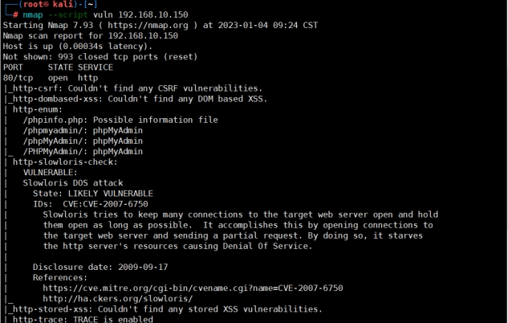 

### 3.2.2.**Nmap信息收集**

```
命令：nmap --script=http-enum 192.168.10.150
```

 

### 3.2.3.**Nmap子域名爆破**

```
命令：nmap --script=dns-brute www.baidu.com
```

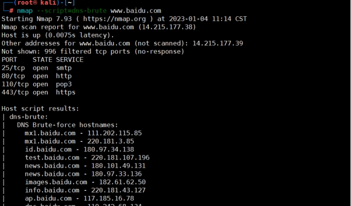 

## 3.3.**Nmap服务爆破案例**

### 3.3.1.**Nmap中SSH爆破**

```
命令： nmap -p 22 --script=ssh-brute --script-args userdb=user.txt,passdb=passwd.txt 192.168.10.30

解释：-p 指定端口号 --script 指定协议类型 --script-args 指定用户及密码的字典。
```

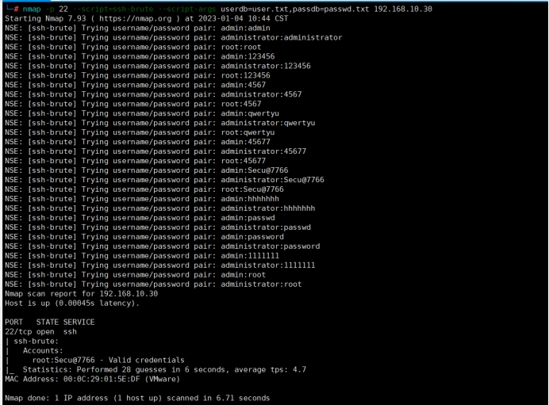 

### 3.3.2.**Nmap中MYSQL数据库爆破**

这里我在实际的环境中以及虚拟机中测试，均未爆破成功，这里可能与数据库的设置有关。

```
命令：nmap -p 3306 --script=mysql-brute.nse --script-args userdb=user.txt,passdb=passwd.txt 192.168.10.50
```

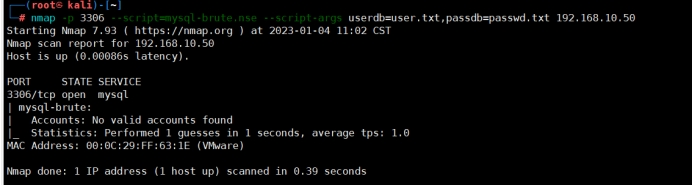 

### 3.3.3.**其它爆破案例**

这里我没有实际的环境，直接写命令吧！

#### 3.3.3.1.**爆破TELNET服务**

```
命令：nmap -p 23 --script=telnet-brute.nse --script-args userdb=user.txt,passdb=passwd.txt 192.168.10.50
```

#### 3.3.3.2.**爆破SMB服务**

```
命令：nmap -p 445 --script=smb-brute.nse --script-args userdb=user.txt,passdb=passwd.txt 192.168.10.50
```

#### 3.3.3.3.**爆破FTP服务**

```
命令：nmap -p 21 -sT --script=smb-brute.nse --script-args userdb=user.txt,passdb=passwd.txt 192.168.10.50
```

# 4.**总结**

在Nmap中还有很多有趣的脚本，并且也支持自定义脚本，所以有未总结到位的，可以自行百度搜索。 