# 1. VMware虚拟机安装运行MacOS系统

需要用到MacOS，但是又不常用，不值得再买一台笔记本怎么办，那就用虚拟机装一个MacOS系统。

## 1.1. 前期准备

虚拟机软件：VMware Workstation Pro，版本16.0.0 。

MacOS套件：Unlocker

MacOS系统IOS镜像

# 2. 解锁虚拟机MacOS

由于默认情况下虚拟机是没有MacOS选项的，这里我们可以下载unlock进行解锁。

[unlock](https://github.com/DrDonk/unlocker/releases/tag/v4.2.5)

如果是在Windows系统中，则进入解压后目录下的windows目录，以管理员方式运行`unlock.exe`，该程序会将patches自动添加到VMware中，完成后可以使用`check.exe`检查VMware的patch安装状态。

一定要再虚拟机关闭的状态下运行，不要打开虚拟机。

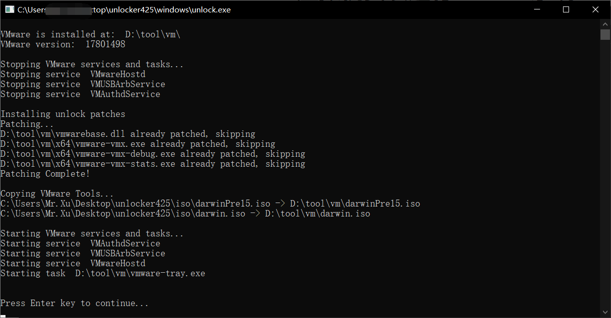

## 2.1. 解锁后效果

解锁在虚拟机中就能够看到MacOS系统的选项了。

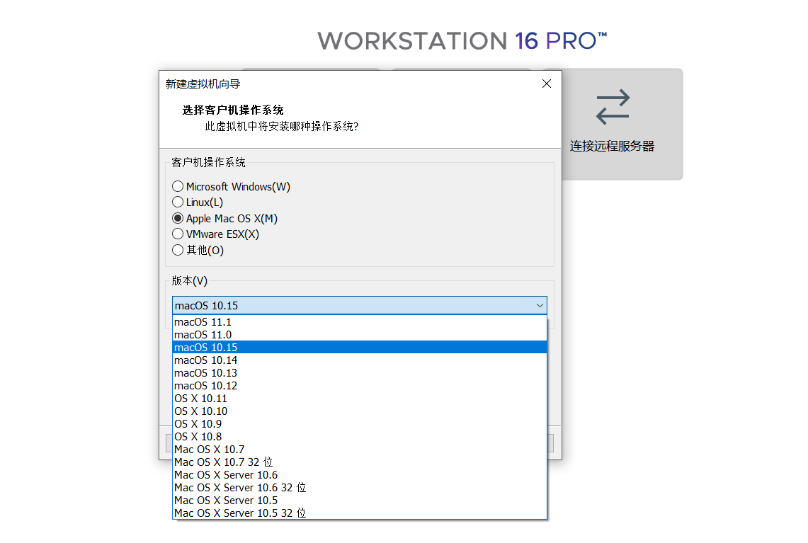

# 3. 开始安装MacOS系统

这里前面的和安装Windows虚拟机是一样的，所以这里只介绍一些关键的操作，想必安装过虚拟机Windows系统的都应该是知道的，所以我就不解释过多了。

[MacOS系统](https://pan.baidu.com/s/16_qs0F4qnB7j0LgQuEwuVQ?pwd=cn3n )提取码：cn3n 

## 3.1. 选择系统

这里最高就是11.1，那么我们直接就选择最高的即可。

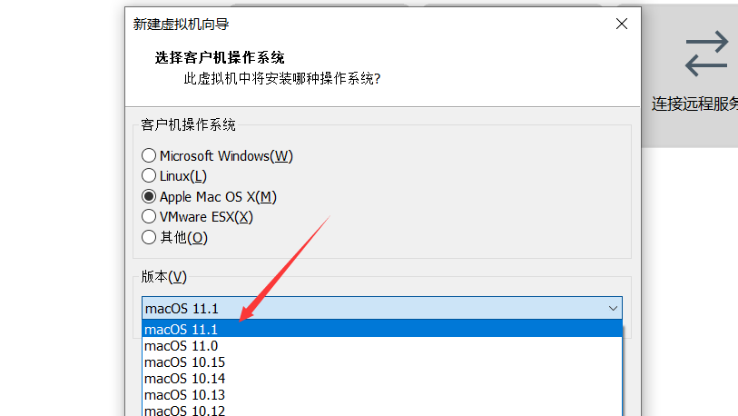

## 3.2. 虚拟机磁盘

对于MacOS推荐是80G，所以需要自行准备好磁盘空间。

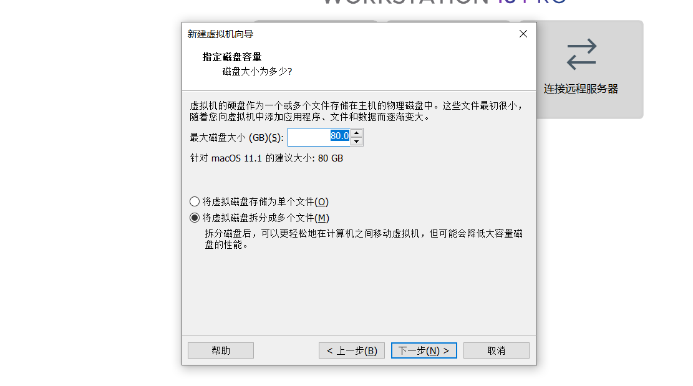

## 3.3. 镜像

这里配置一下镜像。

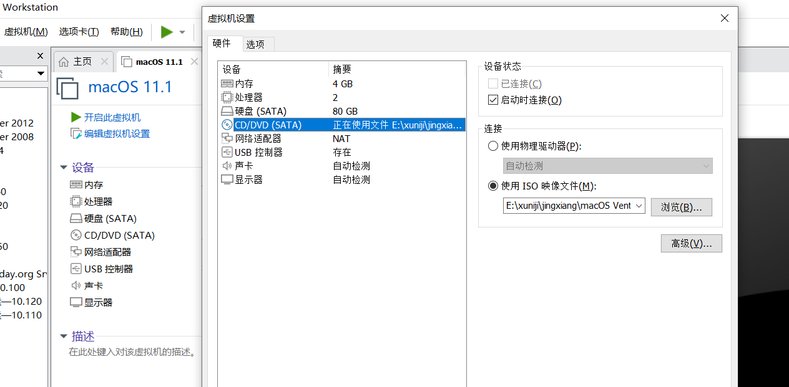

# 4. 开机配置

这里主要就是系统上的配置一些内容了，同样这里只是介绍比较难理解或者需要配置的，其它的能看懂的，比如选择语言，这还要说么？

## 4.1. MacOS图标

当出现这个界面的时候就证明成功调用ISO镜像了。

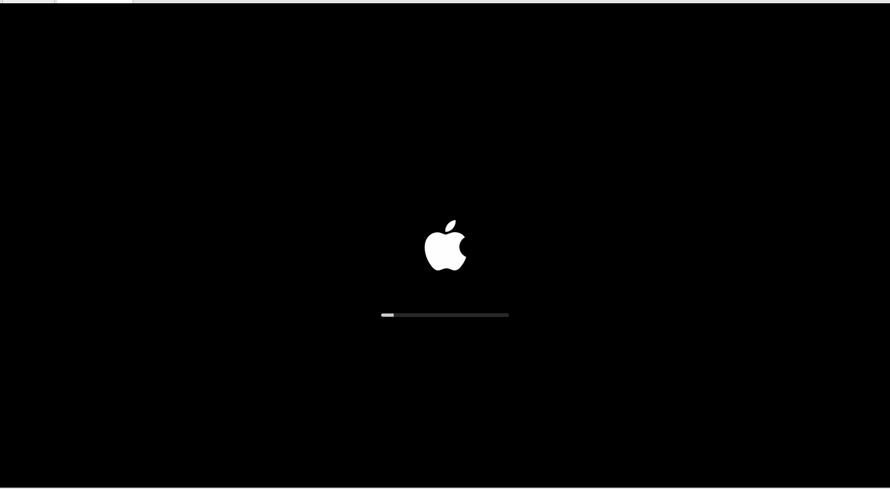

## 4.2. 磁盘

这里选择磁盘工具。

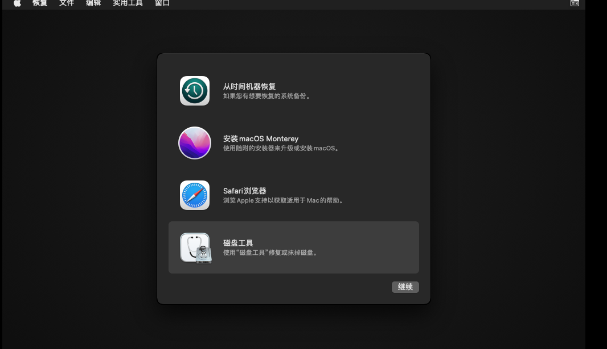

### 4.2.1. 磁盘配置

这里安装流程来操作。

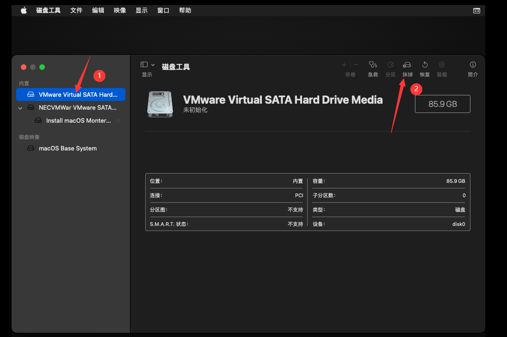

### 4.2.2. 抹掉数据

这里名称随便，其它默认即可，然后点击确认，再去点击左上角红色的叉号，关闭。

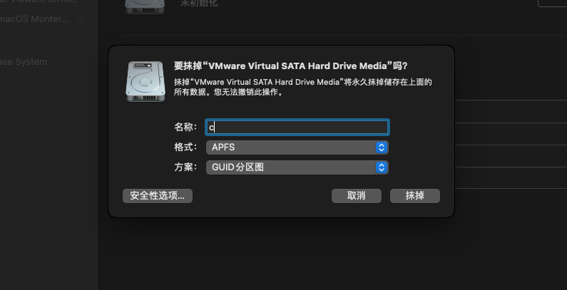

## 4.3. 安装系统

到这里关闭刚刚的界面后，选择安装系统，点击继续，后一个界面依旧选择继续。

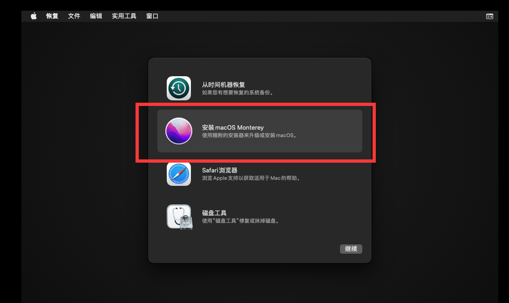

### 4.3.1. 安装到磁盘

这里选择刚刚你创建的磁盘，接下来就是漫长的等待。

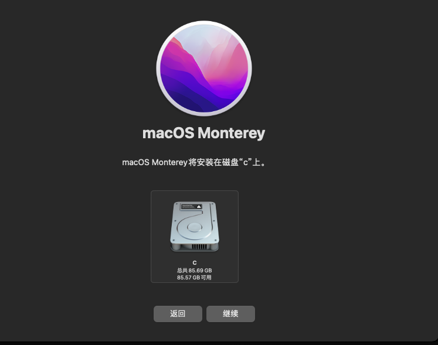

## 4.4. 系统内

经过七七四十九分钟后，是真实的49分钟，终于进去了，后面就和Windows差不多了。

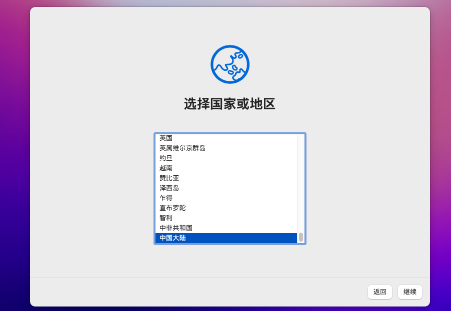
