# 1.**前提准备**

[JDK](https://pan.baidu.com/s/12wT0JftNVvd1am31WiOg5w?pwd=spn1)提取码：spn1 

[Burpsuite](https://pan.baidu.com/s/14PNxQGYStnJdLSyPaR__UA?pwd=ebwd)提取码：ebwd 

# 2.**JDK安装与配置**

## 2.1.**JDK安装**

这里需要说明一下我提供的是17版本的，而我安装的是19的，不影响一样的操作，17是能用的。这里我打开JDK一点小慢，可能需要稍等那么，实体机不太清楚，如果也迟迟不出现，那么就稍等一下。

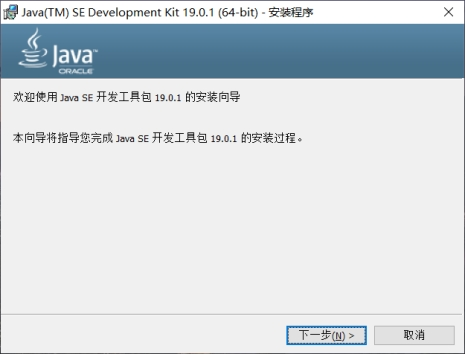 

出来界面后，我建议直接一直默认下一步安装，弹出什么都下一步，如果需要调整文件夹的话，那么一定要全英文的，不能含有中文，否则就会出现安装失败的情况，这种就需要你查一下是不是路径存在中文了。

稍等一会就安装完成了。

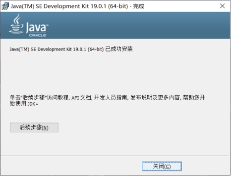 

若是默认安装的话安装路径是C:\Program Files\Java下。

## 2.2.**JDK配置**

右击我的电脑点击属性，进入系统高级设置，当然这里Windows10一些版本不一样可能弹出的界面也不一样，位置也不同，但是名字都是叫系统高级设置。

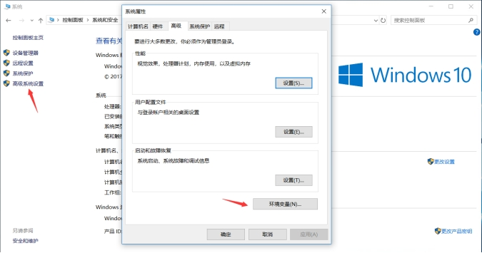 

### 2.2.1.**系统变量配置**

#### 2.2.1.1.新建JAVA_HOME

变量名：JAVA_HOME

变量值：C:\Program Files\Java\jdk-17.0.5

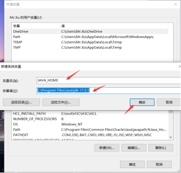 

#### 2.2.1.2.**新建****CLASSPATH**

变量名：CLASSPATH

变量值：.;%JAVA_HOME%\lib\dt.jar;%JAVA_HOME%\lib\tools.jar

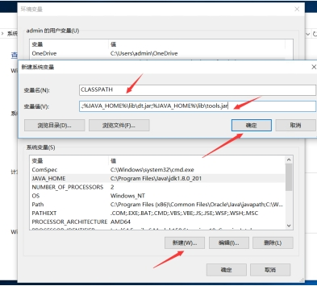 

#### 2.2.1.3.**配置****path变量**

在path变量后面添加。

添加1：%JAVA_HOME%\bin

添加2：%JAVA_HOME%\jre\bin

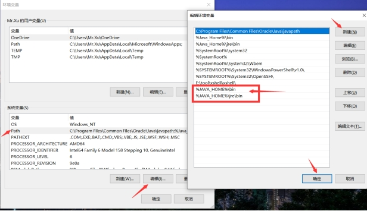 

#### 2.2.1.4.**安装测试**

打开CMD以管理员启动，输入：java -version，若显示版本则证明安装成功。

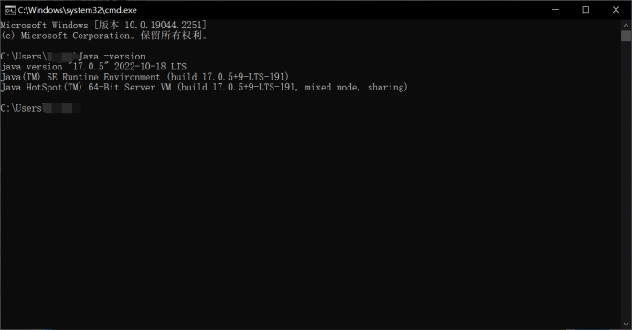 

# 3.Burpsuite安装

## 3.1.**手动激活**

首先对压缩包进行解压，然后双击打开BurpLoaderKeygen.jar，然后点击Run，会自动弹出页面，当然这个前提是配置好JDK的情况下，若出现什么报错，那么可能存在JDK环境没有配置好，或者和JDK版本不匹配。

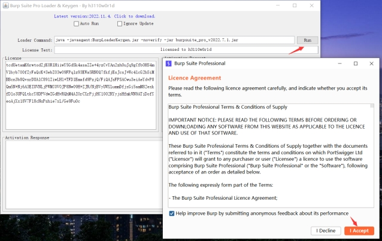 

然后将左边的内容复制到右边点击下一步。

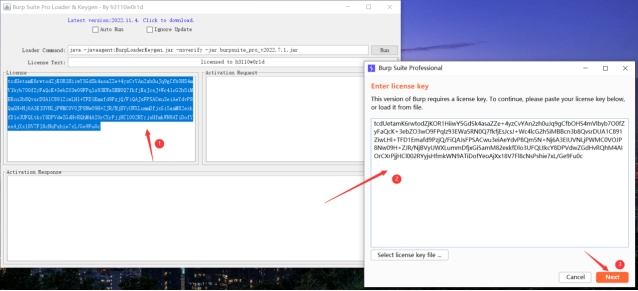 

选择手动激活。

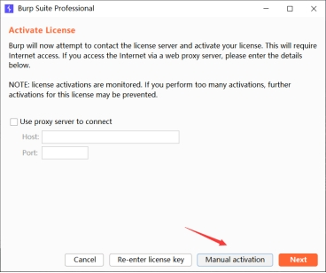 

然后将右边的内容复制到左边第二行中，当复制过去后，就会出现第三行，然后把第三行内容再复制到右边窗口的最后一行，点击下一步就能够激活了。

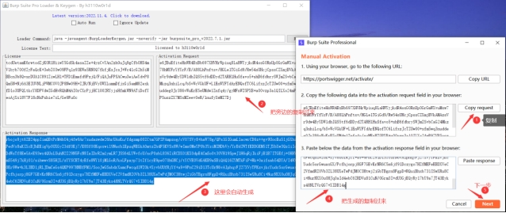 

## 3.2.**打开测试**

正常在关闭后，想要再次打开只需要点击BurpLoaderKeygen.jar，然后点击Run就可以了，这里不会出现激活。不过好像新版会闪退，暂时还不太清楚，之前一直用的都是老版本。

 

 

# 4.Burpsuite使用

参考链接：BurpSuite全套使用教程（超实用超详细介绍）https://blog.csdn.net/qq_53577336/article/details/122393296

## 4.1.**设置代理**

### 4.1.1.Burpsuite代理设置

在Burpsuite中默认代理是127.0.0.1:8080。当然你也可以设置其它的端口代理。位置：proxy>Options。

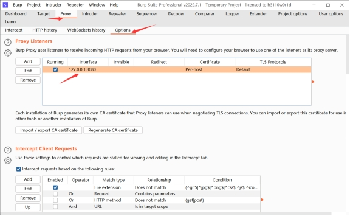 

### 4.1.2.**浏览器代理设置**

我这里以火狐举例子，直接进入设置搜索代理，设置代理，这里的代理ip和端口要和Burpsuite一样就可以了。

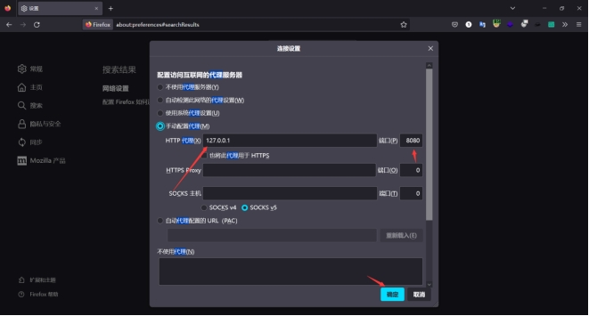 

### 4.1.3.**抓包测试**

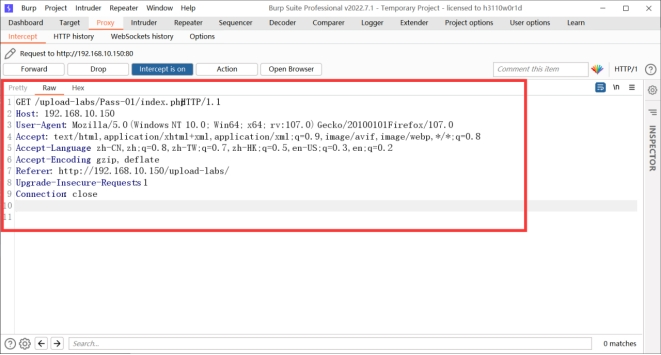 

## 4.2.**界面调整**

刚打开软件会发现界面很大，同时字也比较大。这里就可以去user options>Display去调整到自己合适的界面。

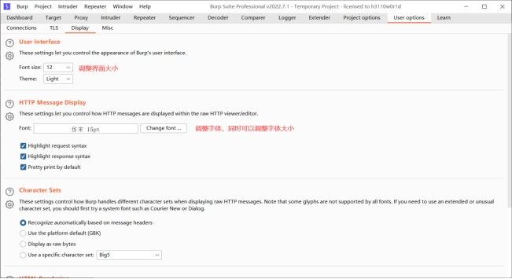 

## 4.3.**Proxy界面使用**

### 4.3.1.**intercept界面使用**

这个界面会是我们最常用的界面，能够对http发送的流量进行拦截分析。

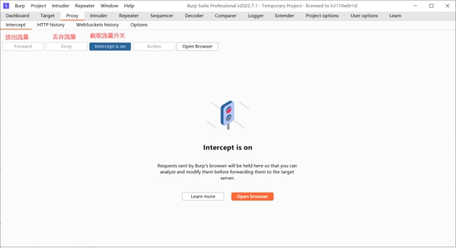 

### 4.3.2.**右键使用**

当然这里还右键还有很多其它的功能。

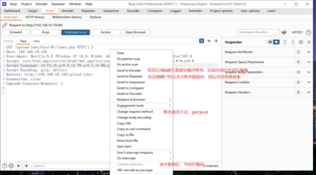 

### 4.3.3.**http hitsory界面使用**

这个界面主要是用来记录请求过的链接。

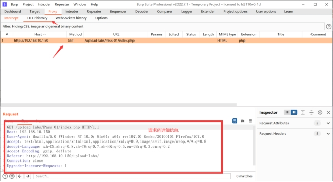 

### 4.3.4.**Options界面使用**

这个界面就是之前提到的修改代理的界面，这个界面的主要功能也就是修改代理这个了。

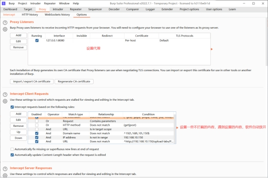 

## 4.4.**Target界面使用**

### 4.4.1.**Site map界面使用**

这个界面主要是用于在抓取流量后，查看这个页面内的其它链接，属于一个辅助作用。

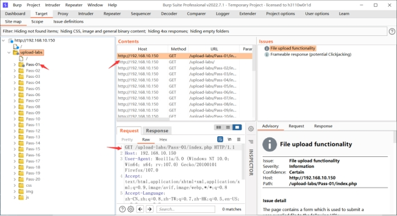 

## 4.5.**intruder界面使用**

### 4.5.1.**发送数据**

这里首先需要将数据包发送到intruder界面。

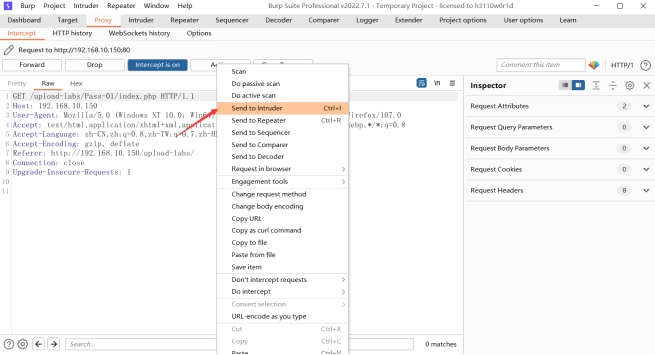 

### 4.5.2.**攻击类型使用**

Sniper：狙击手单点模式，将数据逐一填充到指定位置。

Battering ram：将数据同时填充到多个指定位置，例A字典的数据同时填充到两个位置。

Pitchfork：将每个字典逐一对称匹配，例如A字典的1号位与B字典的1号位匹配，绝不相交匹配。

Cluster bomb：将每个字典逐一交叉匹配，例如A字典的所有位与B字典的所有位都匹配。

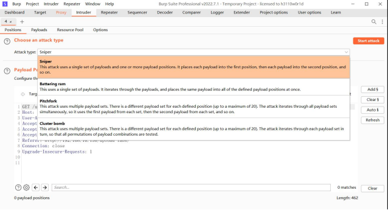 

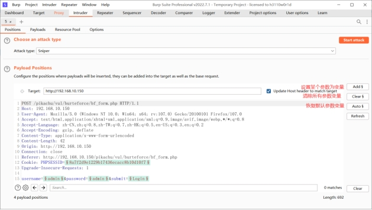 

参考链接：Burpsuite Intruder（测试器）爆破的4种方式说明https://blog.csdn.net/doulicau/article/details/120366357

 

## 4.6.**Decoder加解密界面**

### 4.6.1.**基础页面**

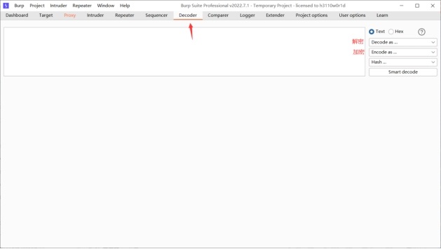 

### 4.6.2.**使用操作**

默认只有一个框，当输入编码内容后，会自动生成另外一个框，用于显示解密后的内容。

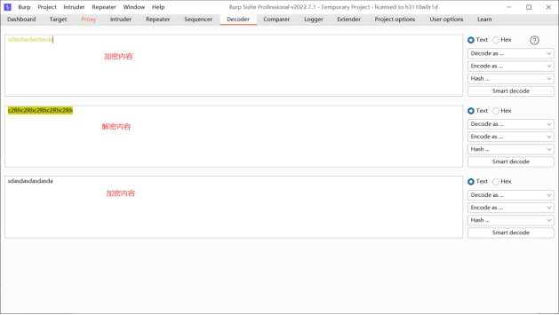 

 

 

 

 