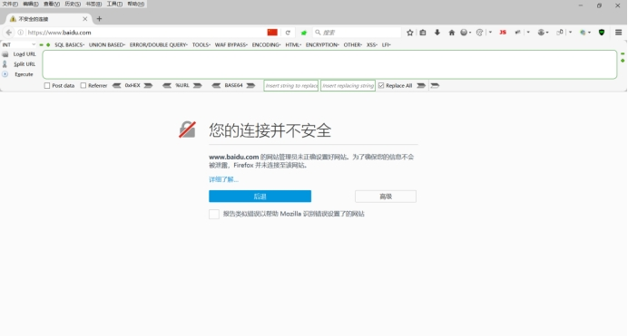
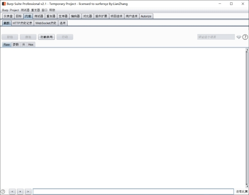
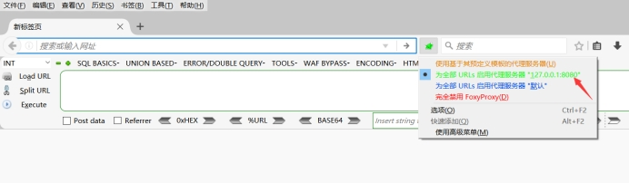
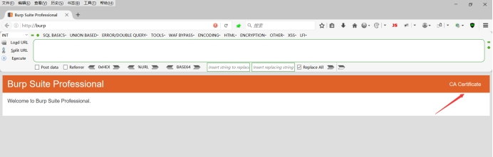
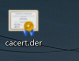
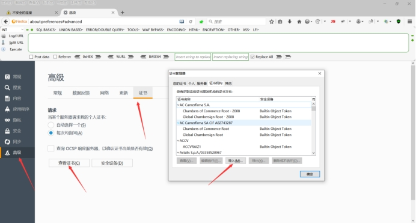
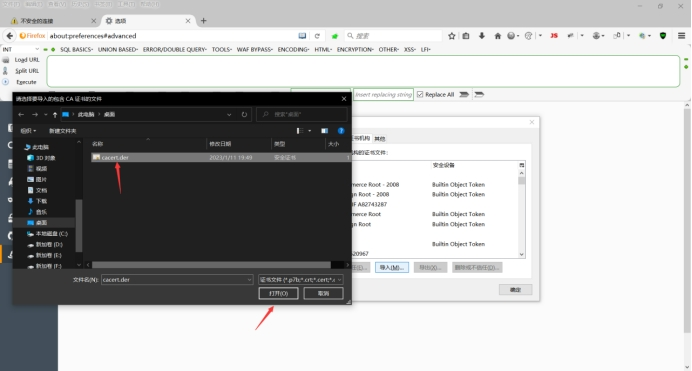
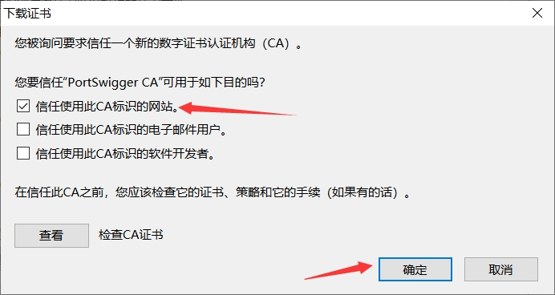
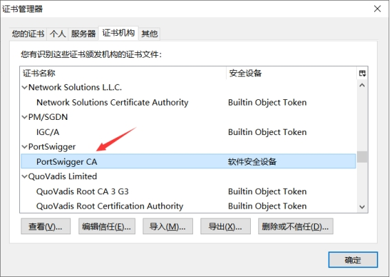
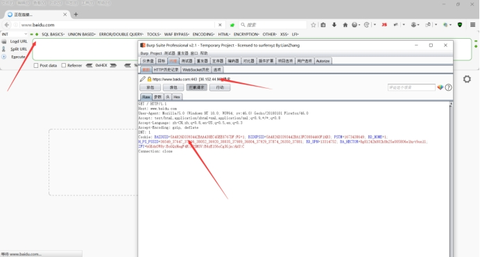

# 1.**Burpsuite介绍**

Burp Suite 是用于攻击web 应用程序的集成平台。它包含了许多工具，并为这些工具设计了许多接口，以促进加快攻击应用程序的过程。

所有的工具都共享一个能处理并显示HTTP 消息，持久性，认证，代理，日志，警报的一个强大的可扩展的框架。

Burp Suite是一个集成化的渗透测试工具，它集合了多种渗透测试组件，使我们自动化地或手工地能更好的完成对web应用的渗透测试和攻击。在渗透测试中，我们使用Burp Suite将使得测试工作变得更加容易和方便，即使在不需要娴熟的技巧的情况下，只有我们熟悉Burp Suite的使用，也使得渗透测试工作变得轻松和高效。

## 1.1.**Burpsuite安装**

这里的安装我就不再介绍了，可以看我另外的一篇文章。

# 2.**https证书介绍**

在burp中可以抓http的流量，但是当去抓https的流量的时候就会出现不信任的情况，那么我们就需要在浏览器上安装一个证书，让其能够信任我们这个流量。

例如在开启拦截https流量就会出现如下图的提示。

 

## 2.1.**证书下载步骤**

### 2.1.1.**打开burp软件**

这里打开burp软件，但是不要开启拦截，注意不要开启拦截。

 

### 2.1.2.**开启代理**

这里开启浏览器的代理，至于代理地址，需要看你设置的是什么，如果是从零开启，并且是看我的安装文章并且更具步骤进行安装的，那么就是127.0.0.1:8080，正常设置也都是这个地址。

 

### 2.1.3.**下载证书**

这里就需要在开启代理的浏览器中输入http://burp即可跳出一个窗口，然后点击CA Certificate即可下载证书，这里如果打不开，需要注意burp软件是否开启的拦截。

 

### 2.1.4.**证书**

通过上面的下载你会得到一个证书。

 

## 2.2.**证书安装步骤**

### 2.2.1.**打开证书页**

这里需要打开浏览器的设置，并且搜索证书，然后导入证书。这里我拿火狐浏览器渗透版进行安装，这里其它的浏览器安装都是一样的。

 

### 2.2.2.**导入证书**

这里只需要选择我们之前下载下来的证书即可，然后勾选信任即可，当然你全勾选上也可以。

 

 

### 2.2.3.**确认安装**

这里只需要在证书列表中看到有PortSwigger CA即可。

 

## 2.3.**抓包测试**

这里我们再去测试抓包，这里直接就看效果吧，也没什么好说的，流程和抓http流量都是一样的。

这里我们可以看到已经成功抓到https的流量了。

 

 

 

 