# 1. 前期准备

这里准备ubuntu系统64位，虚拟机要求肯定是配置越大越好，我个人没有大规模扫描的需求，但是我给的配置是4H4G，但是还是有点不行，如果你需要使用大规模的操作，那么最好是专门搞一台虚拟机来安装，或者专门准备一台电脑来安装，不建议在实体机中安装，由于Nessus每次启动都需要重新加载插件，所以会很麻烦。

而使用虚拟机的话，直接挂起状态，这样每次就不需要加载插件了。

关注公众号"`剁椒鱼头没剁椒`"回复 "`nessus`"获取安装包、插件及解压密码，文章最下面有公众号二维码。

# 2. nessus前期安装

这里的安装是很简单的，不是太复杂。

## 2.1. 下载nessus

这里使用ubuntu的64位的，所以我们下载的时候也需要使用到这个amd64位，至于ubuntu的系统看这个下载上的amd64位支持的型号：14.04、16.04、17.10、18.04和20.04版本。

[下载地址](https://www.tenable.com/downloads/nessus?loginAttempted=true)

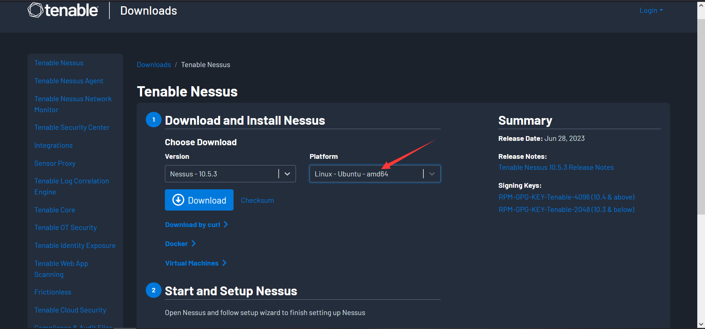

## 2.2. 安装nessus

这里的安装是很快的，基本上20多秒吧。

```
dpkg -i Nessus-10.5.3-ubuntu1404_amd64.deb
```

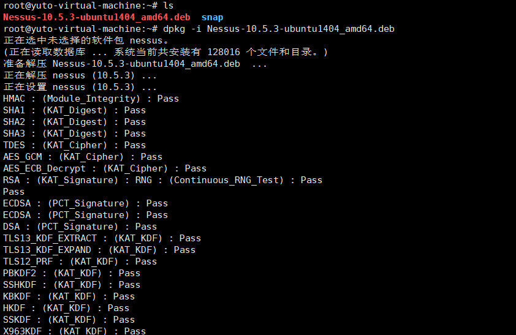

## 2.3. 运行nessus

安装完后，需要运行nessus，运行完就可以输入IP+8834打开页面了。

```
systemctl start nessusd
```

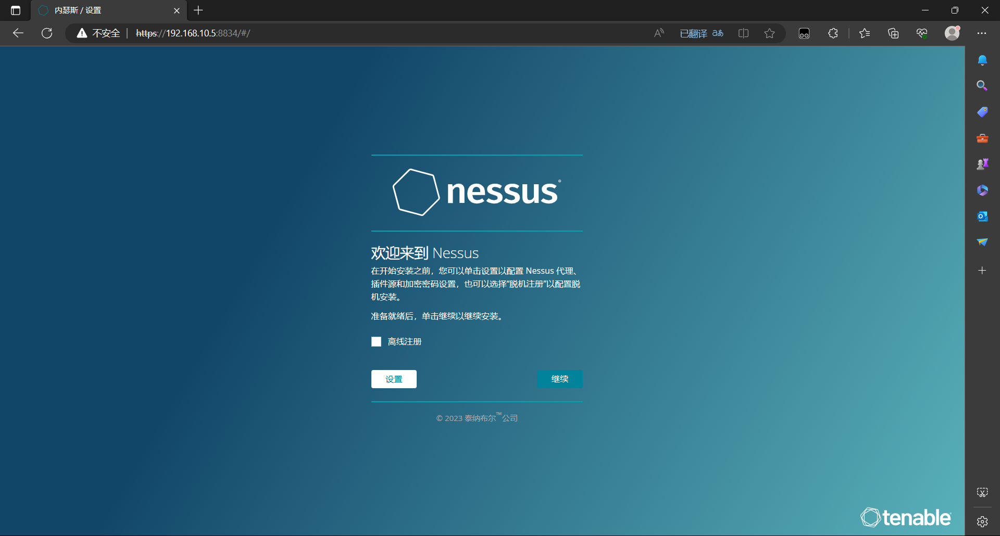

# 3. 设置nessus

这里的设置最好是跟着一步一步操作，否则可能会出现错误或者无法使用的情况。

## 3.1. 初始化设置

这里我就不一步一步介绍了，这里我直接口述吧，把重要的地方截图，不懂的使用Edge浏览器打开，可以进行翻译，以下是页面顺序从第一页面开始：

勾选Register offline》选择managed scanner》选择tenable.sc》设定账号密码》等待安装完成。

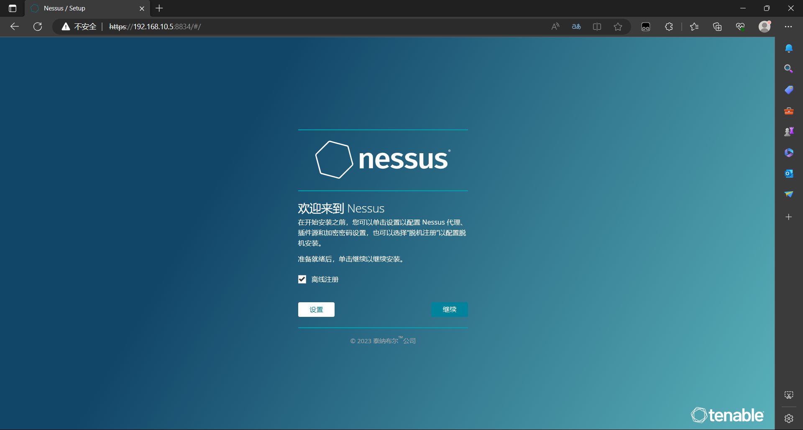

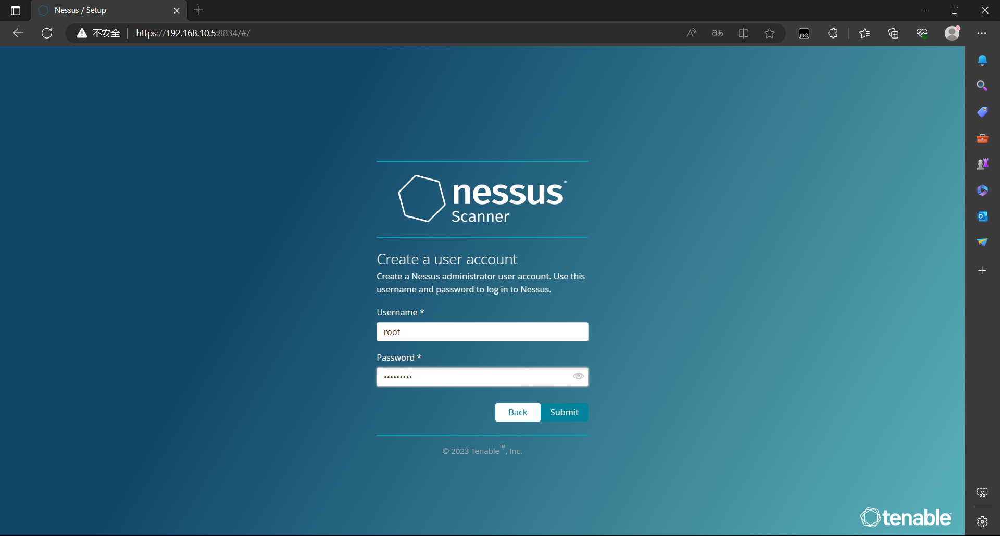

## 3.2. 无插件

登陆进去后，会发现右上角有提示，显示没有插件，不要问我怎么有中文，翻译插件懂么？

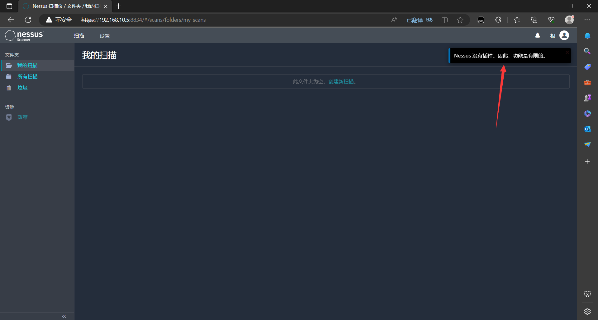

## 3.3. 获取更新插件

这里，可以自行百度搜索，我这里是使用..........提前准备好的PJ，可以关注公众号回复"Nessus"获取，由于该PJ也不是我的，只是获取资源，非法使用与博主无关。

```
systemctl stop nessusd
/opt/nessus/sbin/nessuscli update /root/nessus/all-2.0.tar.gz
```

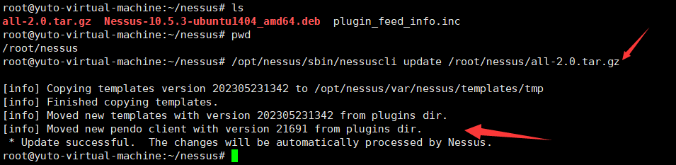

## 3.4. 设置目录权限及插件信息

### 3.4.1. 设置plugins目录权限

这里是为了能够修改插件信息使用的，由于目录中文件较多，所以这里比较慢。

```
find /opt/nessus/lib/nessus/plugins/ -name "*.*" | xargs -i chattr +i {}   #设置plugins全文件只读
```

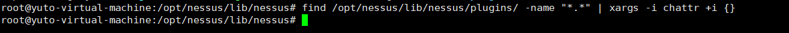

### 3.4.2. 设置plugin_feed_info.inc权限

```
chattr -i /opt/nessus/lib/nessus/plugins/plugin_feed_info.inc   #取消inc文件的只读
```

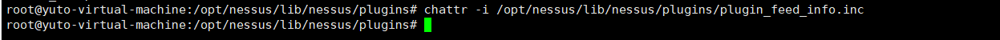

### 3.4.3. 查看插件信息

```
cat /opt/nessus/lib/nessus/plugins/plugin_feed_info.inc
```

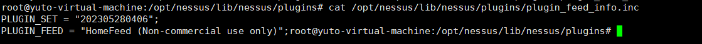

### 3.4.4. 更改插件信息1

在提供的PJ中会有一个一模一样的插件信息文件，主要看看里面的那一串数字是什么，我的那个插件信息需要可能没修改，但是修改成下面的插件信息即可，不过如果插件版本不一样，就不要设置成这个了，根据你获取到的插件版本信息来设置。我这个仅局限于我提供的插件。

```
修改插件：vim /opt/nessus/lib/nessus/plugins/plugin_feed_info.inc

插件信息：
PLUGIN_SET = "202305280406";
PLUGIN_FEED = "ProfessionalFeed (Direct)";
PLUGIN_FEED_TRANSPORT = "Tenable Network Security Lightning";
```

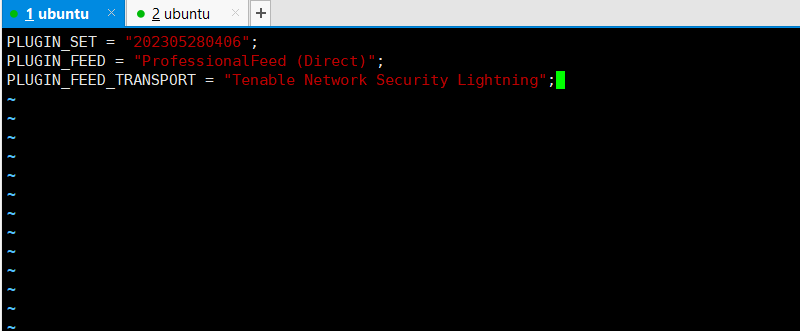

### 3.4.5. 更改插件信息2

默认这个插件信息里面是什么都没有的，需要自己输入，将上面的信息复制进去即可。

```
修改插件：vim /opt/nessus/var/nessus/plugin_feed_info.inc

插件信息：
PLUGIN_SET = "202305280406";
PLUGIN_FEED = "ProfessionalFeed (Direct)";
PLUGIN_FEED_TRANSPORT = "Tenable Network Security Lightning";
```

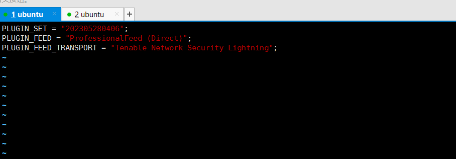

### 3.4.6. 设置plugin_feed_info.inc权限

这里也是设置成只读。

```
chattr +i /opt/nessus/var/nessus/plugin_feed_info.inc   #设置只读
```

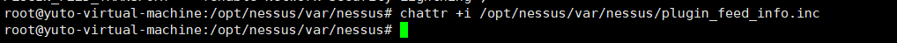

### 3.4.7. 复制文件

默认在下面的这个目录中是没有plugins的，所以我们需要创建这个目录，然后再复制一份刚刚上面修改的那个文件到这个目录中。

```
mkdir /opt/nessus/var/nessus/plugins
cp /opt/nessus/var/nessus/plugin_feed_info.inc /opt/nessus/var/nessus/plugins
```

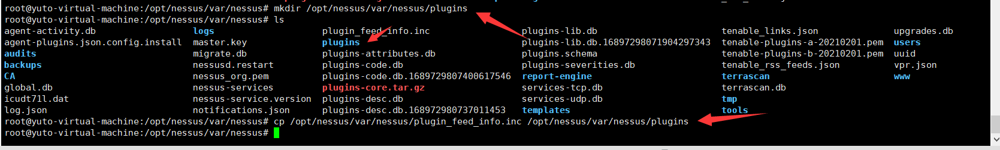

### 3.4.8. 开启服务

```
systemctl start nessusd
```

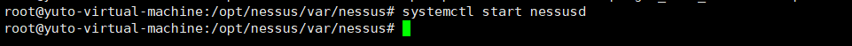

## 3.5. 查看更新进度

这里再去登陆进去后，再右上角会有一个小圆圈，鼠标放上去就能够看到进度是多少了，等待吧，短则半小时，长则1个小时。

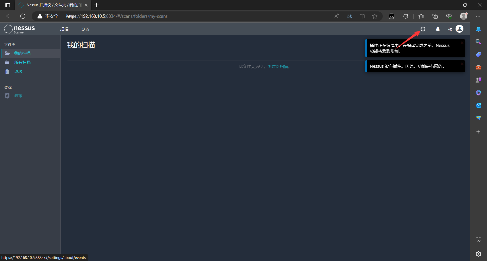

## 3.6. 编译完成

编译完成后就会显示插件完成编译。

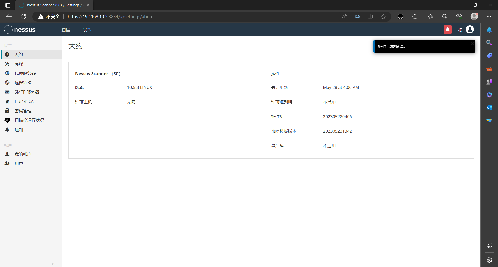

# 4. 基本使用

这里只介绍常用的扫描，也就是高级扫描，其它的不介绍，具体使用可自行搜索学习。

## 4.1. 创建扫描

这里创建扫描后，通常都是选择高级扫描。

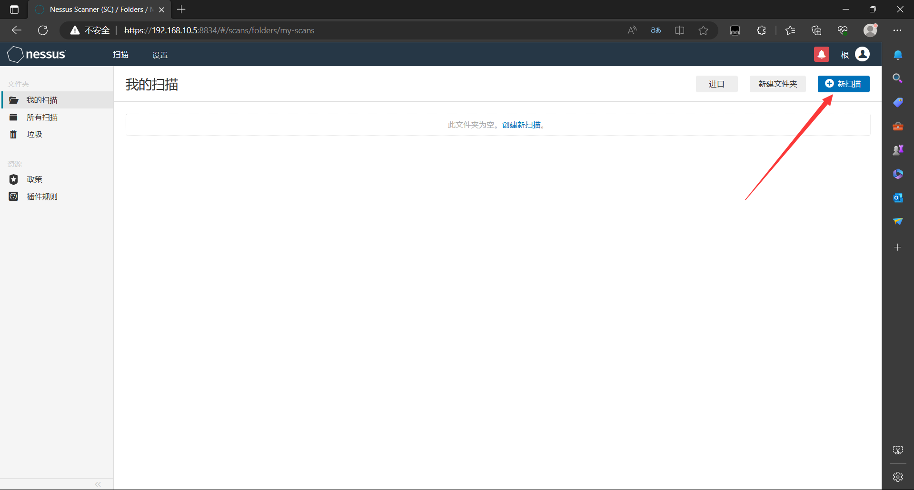

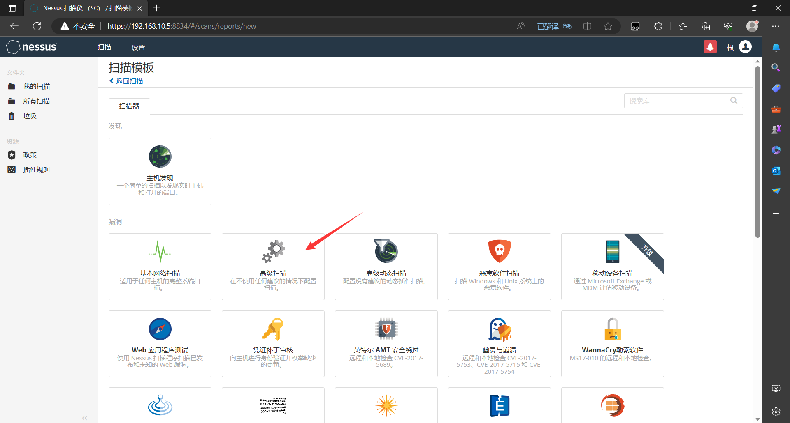

## 4.2. 开始扫描

这里输入名字，描述无所谓要不要输入，输入目标的IP地址即可，下面那个可以下来直接扫描，也可以点击保存，自动跳转后页面点击类似暂停的图标就可以开始扫描了。

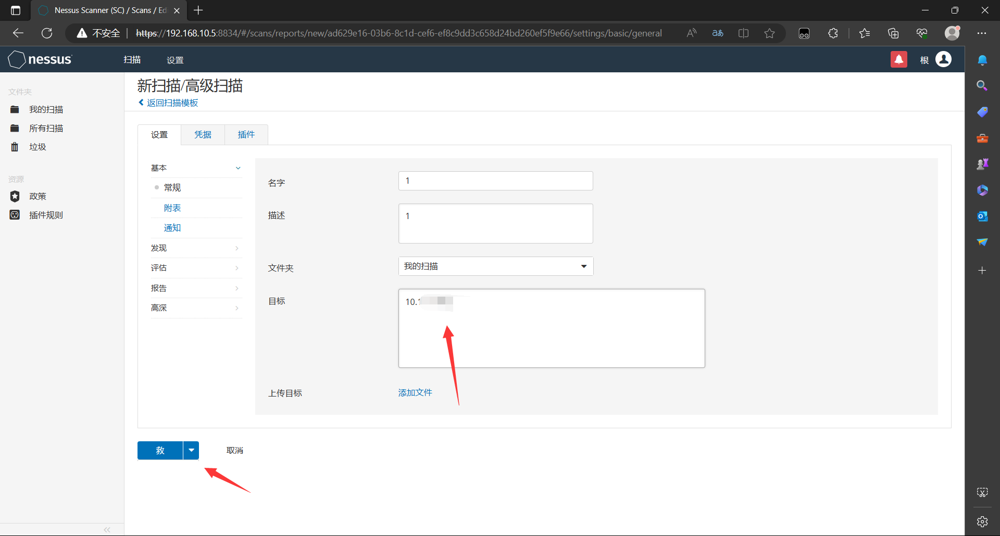

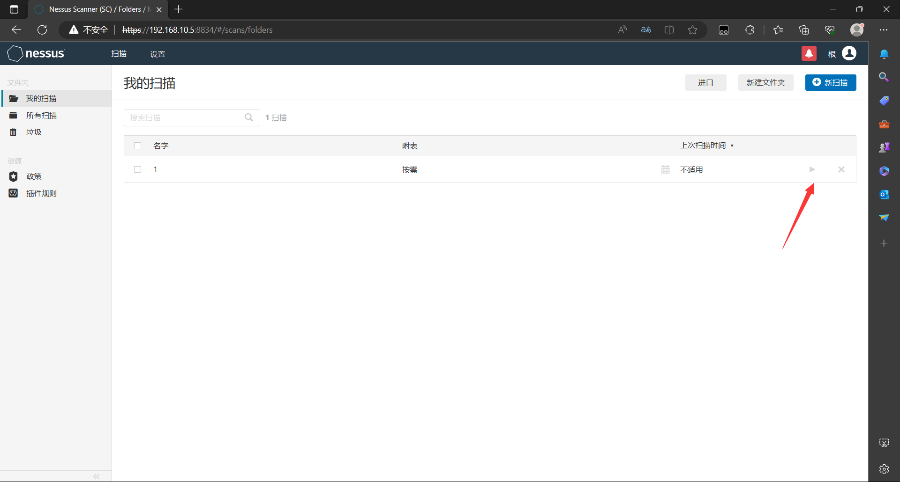

## 4.3. 扫描结果

点进去后就可以看到漏洞情况了，这里自行学习吧，而且nessus是根据版本来进行基本判断是否存在漏洞，所以有时候，就算有漏洞，也可能存在无法利用的情况，可以手动复测等。

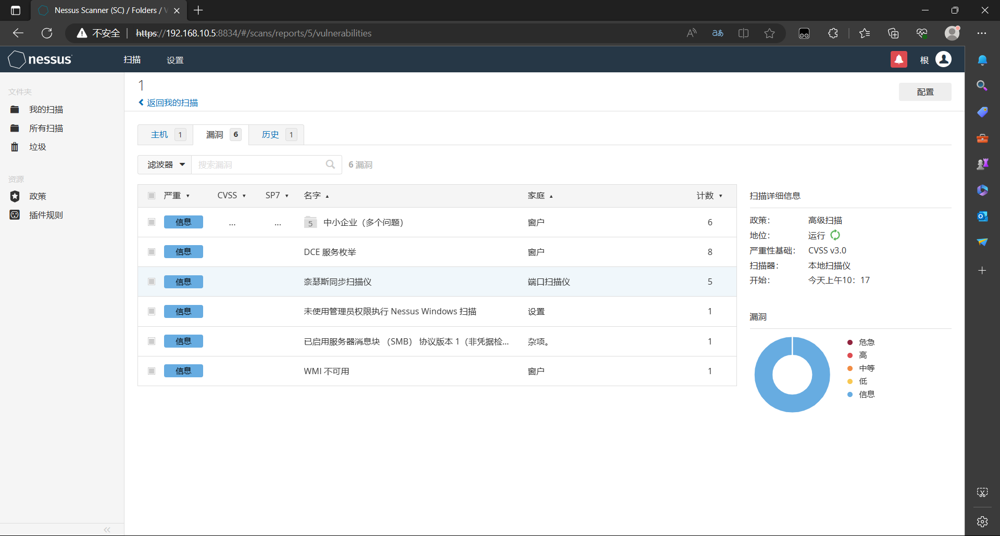

## 4.4. 最后

一定要将虚拟机挂起而不是关闭，一定要将虚拟机挂起而不是关闭，一定要将虚拟机挂起而不是关闭，否则下次开机就需要重新加载插件，会比较麻烦，而且可能会出现意想不到的的其它情况，这个也是使用其它办法解决的，好像官方的也是这样的情况。