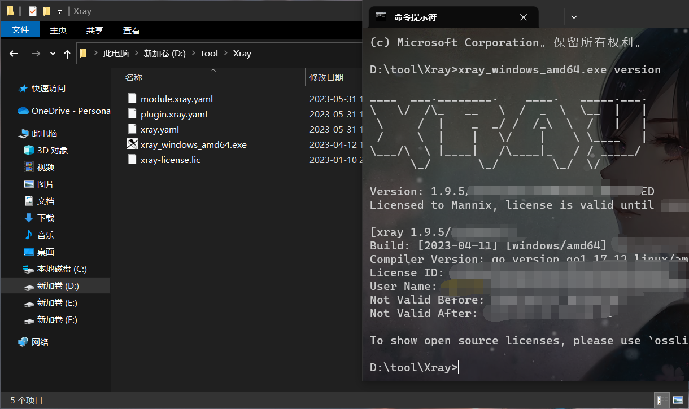
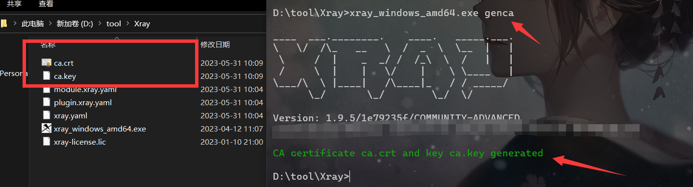
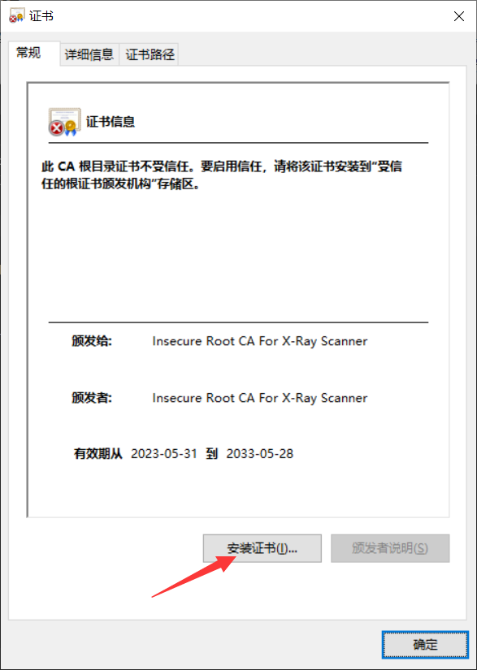
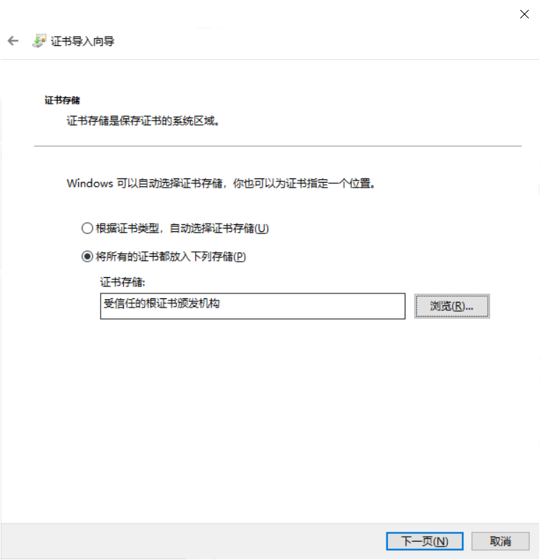
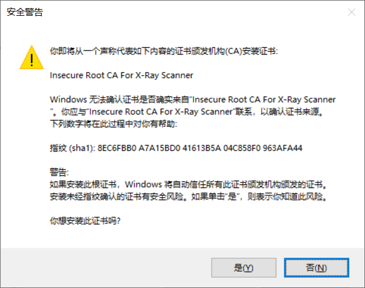
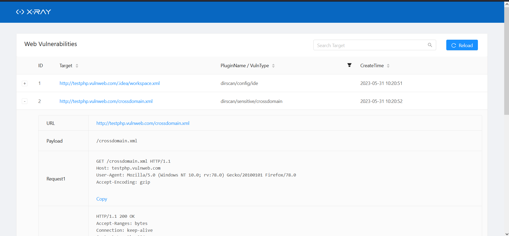

# 1. Xray介绍

`Xray`是长亭科技推出的一款功能强大的安全评估工具，由多名经验丰富的一线安全从业者呕心打造而成，支持主动、被动等多种扫描方式，支持`Windows`、`Linux`、`macOS`多种操作系统，同时支持用户自定义`POC`。

目前xray分为：社区版、高级版、企业版。

其中社区版是为免费版本，高级版需要为社区提供贡献获取金币、抽奖、商业销售进行获取，而企业版则只能通过商务购买进行获取。

## 1.1. 支持漏洞检测类型

下列这些漏洞，在通过扫描获取到一个报告的时候，会在每一行后面体现出名字，其中`POC`框架默认是内置`github`上贡献的`POC`，当然用户也可以自定义构建`POC`运行。

- XSS漏洞检测 (key: xss)
- SQL 注入检测 (key: sqldet)
- 命令/代码注入检测 (key: cmd-injection)
- 目录枚举 (key: dirscan)
- 路径穿越检测 (key: path-traversal)
- XML 实体注入检测 (key: xxe)
- 文件上传检测 (key: upload)
- 弱口令检测 (key: brute-force)
- jsonp 检测 (key: jsonp)
- ssrf 检测 (key: ssrf)
- 基线检查 (key: baseline)
- 任意跳转检测 (key: redirect)
- CRLF 注入 (key: crlf-injection)
- Struts2 系列漏洞检测 (高级版，key: struts)
- Thinkphp系列漏洞检测 (高级版，key: thinkphp)
- XStream 系列漏洞检测 (key: xstream)
- POC 框架 (key: phantasm)

## 1.2. 官网地址

官网上的技术文档肯定写的更全，当然有些情况，还是比较难理解的，不过Xray的技术文档写的很全，里面包含了Windows、Linux、macOS不同系统的使用方式。

[技术文档](https://docs.xray.cool/#/tutorial/introduce)

[github](https://github.com/chaitin/xray)

# 2. 常用扫描模式

通过`github`上下载下来后，只会有一个`exe`文件，当使用`CMD`或者`PowrShell`运行的时候，会自动在文件夹下发生成其它所需要文件，这里我就以`Windows`为例子，当然你们生成的肯定不是我这个样子，由于我是使用了高级版会多出一个`xray-license.lic`文件。

```
CMD运行：
xray_windows_amd64.exe version  ##查看版本
PowrShell运行：
./xray_windows_amd64.exe version  ##查看版本
```



## 2.1. 生成证书

之前可能都了解过当使用各类工具去扫描HTTPS的时候会显示证书异常，必须要得到客户端的信任，才能够进行建立通信，所以这里就需要使用到证书，而在Xray中也自带证书，这里时候我们将证书生成，然后把证书安装到浏览器中即可。

当然如果你的目录下存在这个两个证书的话，那么再次运行就会出现报错，删除即可。

```
xray_windows_amd64.exe genca ##生成证书
```



嗯~~我在想需要介绍浏览器如何安装证书吗？还是介绍一下吧！

### 2.1.1. 浏览器安装证书

这里我们直接在刚刚生成的文件夹中寻找到那个证书，双击安装证书。



这里点完默认下一步，到这里的时候需要注意一定要选择受信任的根证书颁发机构，然后就是下一步了，然后点击完成后就会弹出一个界面。



这里弹出的界面点击是进行安装，安装后就会显示导入证书成功。



## 2.2. Xray基础主动扫描

这个模式总体来说不是太好，由于在针对一个URL进行扫描的时候，`Xray`只会对这个url的界面进行扫描，例如：`http://127.0.0.1:8090/?id=10`,那么在扫描的时候就只会对这个`ID=10`的页面扫描，例如这个页面下存在输入框，那么就会进行`XSS`等测试，`URL`进行`sql`注入测试等等，那么`id=9`的页面就无法进行测试。

### 2.2.1. 基础主动扫描命令

这里稍后还会介绍其它的扫描方式进行弥补，这里先介绍单`URL`如何扫描，同时这里比较尴尬的是我使用帮助命令，帮助命令介绍的还是比较简单，还是建议去官网的手册看看案例，不过好像也没啥要记的命令，都挺简单的。

`http://testphp.vulnweb.com/`这个地址是`AWVS`的一个漏洞靶场，可以用来进行测试。

```
xray_windows_amd64.exe webscan --url http://testphp.vulnweb.com/ --html-output 111.html

--url 指定目标的url
--html-output 扫描结果导出为html
111.html 扫描结果的文件名称
```


### 2.2.2. 基础主动扫描结果

前面的+是能够显示更详细的信息，`Target`是存在漏洞的`URL`，`Name`就是前面支持漏洞检测的类型名称，像我这个两个都是目录枚举，后面就是时间。



## 2.3. Xray代理模式扫描

`Xray`代理模式扫描就是扫描器作为中间人，当你访问`URL`某个页面的时候`Xray`就会自动去扫描，例如上面我举例子的，当你去访问`id=10`页面的时候，就会自动去扫描，当你去访问`id=9`页面的时候，也会去自动扫描，这样就实现了，整个页面的扫描。只要你访问到的页面均会被扫描。

### 2.3.1. 代理模式配置代理

这里我使用火狐浏览器进行配置代理，可以使用一个插件进行配置，这个之前应该都会我就会进行介绍了。


### 2.3.2. 代理模式扫描命令

当运行后，你访问一个页面就会对这个页面进行扫描，简单来说，你访问一百个页面，`Xray`就会对这个一百个页面进行扫描，这样就能够实现在你访问某个页面的过程中就把漏洞给挖了。

```
xray_windows_amd64.exe webscan --listen 127.0.0.1:7777 --html-output 222.html

--listen 指定本地的代理
127.0.0.1:7777 配置的代理
```


### 2.3.3. 代理模式扫描结果

这里可以看到有很多的漏洞，当然这是靶场，我也就点击了几下就出现那么多漏洞，自然点击的多肯定漏洞就不止这些了，当然要点击的多才行，比如我之前测试的时候应该还有一个`xss漏洞`，这里没扫到，是由于我没点击，或者点击太快，还没扫描完就被我暂停了。

当然`+`下面有详细的请求包，你可以进行验证，漏扫多多少少会出现一些误报。


## 2.4. Xray基础爬虫模式扫描

`Xray`的爬虫模式简单来说就是模拟人工去点击网页的链接，然后去进行分析扫描，和上面代理模式不同的是，爬虫模式不需要人工的介入，访问速度也要快很多，但是也存在一些缺点，那就是无法处理`js`渲染的界面，当然如果想要实现这个功能就需要更高级的版本。

[版本功能对比](https://docs.xray.cool/#/generic/compare)

### 2.4.1. 基础爬虫模式扫描命令

这里就只是需要输入命令即可，但是这个会存在一个问题，那么就是登陆模式，在使用代理模式扫描的时候，如果网站是登陆模式的，那么扫描所收到的请求都是登陆状态的请求，但是对应爬虫来说，就没那么智能化了，但是可以通过配置`Cookie`的方式来实现登陆后的扫描。

```
xray_windows_amd64.exe webscan --basic-crawler http://testphp.vulnweb.com/ --html-output 333.html
```


### 2.4.2. 基础爬虫模式配置Cookie

这里就是介绍如何添加`Cookie`。

#### 2.4.2.1. 查看Cookie

这里我只介绍了一种方式，当然还有很多查看`Cookie`的方式，这里使用的办法就是`F12`开发者工具去找请求包，在请求包中会存在`Cookie`值，然后记录下来。


#### 2.4.2.2. 添加Cookie

在`Xray`运行目录下会有一个文件为`config.yaml`，这个就是配置文件夹，使用记事本或者其它工具打开就可以了，在`http`配置部分中的`headers`项中修改`Cookie`值或者添加一条即可，下面的`Cookie`是默认，可以删除，同时前面的#是不生效这个应该不会不知道吧。


### 2.4.3. 基础爬虫模式扫描结果

使用爬虫模式扫描，这边通过扫描发现了50个漏洞，这里我们就验证一个漏洞来看看情况。


#### 2.4.3.1. 漏洞验证

这里我们就拿41项来验证`XSS`，首先我们查看一下介绍，它的意思是在这个`URL`中存在一个`XSS`漏洞，同时给了验证的`payload`，那么我们先来访问这个页面。


根据提供的数据包，触发弹窗的是在`GET`请求中，那么`GET`请求不就是`URL`中么，当然这里的数据包我没截到图，你们可以自行测试，那么这里我就将这个`payload`输入到`URL`中，可以看到成功触发了XSS弹窗。

如果这是一个真实的网站，或者你去给业主做漏扫，是不是就出现了一条可提交的漏洞呢？


## 2.5. 服务扫描

这里就使用官方的介绍：

`Xray` 中最常见的是` web`扫描，但是`xray` 将会逐渐开放服务扫描的相关能力，目前主要是服务扫描相关的`POC`。老版本升级的用户请注意配置文件需要加入服务扫描的相关`POC`名字，目前只有一个`tomcat-cve-2020-1938 ajp`协议任意文件检测`POC`。

当然这里我也没服务进行测试，所以就引用官网的技术文档了。

### 2.5.1. 服务扫描命令

这个服务扫描其实就是针对你使用的一些服务进行扫描，比如中间件等服务。

```
1.快速检测单个目标
xray_windows_amd64.exe servicescan --target 127.0.0.1:8009 --html-output 444.html

--target 后面跟着的是一个地址，同时也可以添加端口

2.批量检查的 1.file 中的目标, 一行一个目标，带端口
xray_windows_amd64.exe servicescan --target-file 1.file --html-output 444.html

--target-file 后面跟着的是一个文件，当然你输入文件路径也是可以了，只要能够读取到就可以了，但是后面的后缀好像要同步。
```

其中`1.file`的格式为一行一个，如：

```
127.0.0.1:8080
127.0.0.1：8090
192.168.1.1:8080
~~~~~~~
```

# 3. 配置文件常用操作

Xray的很多操作并不像其它的那样在命令中决定的，有很多都是通过配置文件来设定的，就像之前设置Cookie一样，有些扫描器都是在命令中设定或去指定，而Xray则需要去配置文件中去配置。

配置文件生成在当前命令下，文件名为：`config.yaml`。

这里我只介绍一些常用了，很多更高超的功能还请去官方的技术文档中查阅。

## 3.1. 配置测试目标站

像使用上面的代理扫描的时候，如果浏览器打开的页面多，可能就会出现非授权扫描，比如你要扫描`www.123.com`，这个是你得到授权的，但是你使用浏览器在查阅其它资料的时候，去扫描了你查资料的网站，那么这个就出现了非授权的扫描，如果想要避免这个事情发生，可以在配置文件中设定需要测试的目标站，当点击到其它网站的时候，`Xray`就不会去扫描了。

修改地址：`mitm` 中 `restriction` 中 `hostname_allowed` 增加 `你要测试的网站地址`。

支持：`xx.com`、`*.xx.com` 、`IP地址`、`IP地址网段`等


## 3.2. 删除全局禁止测试目标

其实我这里的标题我觉得是不对的，但是意思差不多，在配置测试目标站的下面还有一列就是禁止测试，这些看截图中的结尾应该就知道是什么了，`edu`不清楚么？`gov`不清楚么？

这些默认是不允许扫描的，相当于你去点击这些域名下的网页是不会执行扫描的，如果得到授权可以去扫描该怎么办呢？其实很简单就是删除相应的地址即可。

修改地址：`mitm` 中 `restriction` 中 `hostname_disallowed` 增加/删除 `你要测试的网站地址的域名地址`。

支持：`xx.com`、`*.xx.com` 、`IP地址`、`IP地址网段`等


## 3.3. 设定发包数

在`Xray`中默认是允许`30个`并发数量，如果你设定`50个`并发数，那么一百个`POC`两秒验证完成，当然这是理论上的。


## 3.4. 总结

这里确实本来想好好总结一下，但是写着写着，发现确实配置文件都是中文，而且非常好理解，同时`Xray`官方文档写的也很好，所以想了想算了，还是不总结了，有需要去访问`Xray`官方文档吧。

# 4. Xray与Burp联动

在部分情况下，虽然`Xray`可以直接进行扫描但是可能还是会存在一些遗漏或者需要手动进行复测的情况下，如果再去抓包就比较麻烦了，而`Xray`提供了与`Burp`联动的功能。

## 4.1. Xray建立监听

其实这里的建立监听命令和代理模式扫描是一样的，只是通过不同的方式将这个`Xray`流量引导到`burp`上而已。

```
xray_windows_amd64.exe webscan --listen 127.0.0.1:7777 --html-output 555.html
```


## 4.2. 设置Burp代理

这里就需要我们去设置`Burp`的代理，当然你也可以直接先设置`Burp`的上游代理服务器。

设置选项位置：`设置`>`Network`>`connection`>`Upstream Proxy Server`>`add`

```
其实这里配置的就是和上面监听的保持一致即可。
代理主机：127.0.0.1
代理端口：7777
```


## 4.3. 设置Burp代理

其实这个是最简单的，为什么这么说，你平常这么使用`Burp`进行抓包的就是这么设置，在浏览器中开始`Burp`抓包即可。


## 4.4. 查看联动效果

这里就能够看到联动成功了，但是这个我莫名其妙的好像抓到了`qq翻译`的的数据包，后面我查看了一下，好像是访问的英文页面然后`qq翻译`自动运行就导致，`Burp`在拦截的时候，也将这个翻译的数据包也拦截了，那么通过`burp`进行抓包发送，那么这样就可能会出现非法测试，所以在使用中尽量保持环境的干净，避免抓到不必要的包，导致非法测试。


## 4.5. 注意事项

在联动结束后一定要关闭上游代理服务器，可以直接把前面的勾号取消也可以，不然可能会出现下次使用`Burp`的时候无法使用的情况。

这个勾号取消即可。

