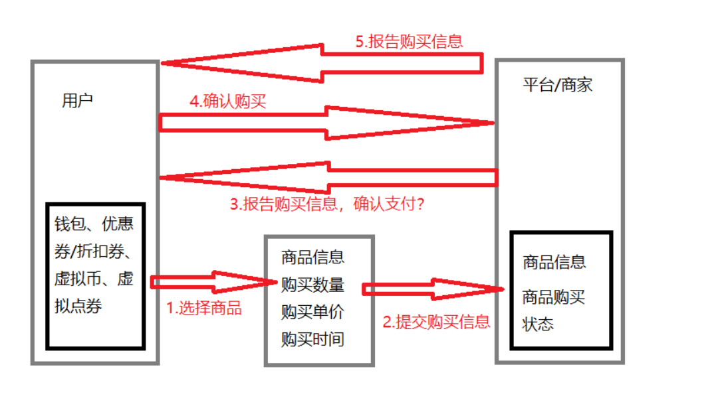

# 漏洞介绍

涉及一个网站中所有的购买、支付等方面的功能处，都可能存在支付漏洞。

## 漏洞原理

图片来源网上。

总体来说，整个支付流程就是，当用户购买物品后，可能会涉及到一些购买数量、购买单价、购买时间、是否使用优惠券、折扣、虚拟币（类似咸鱼币）等，当将这些信息提交给平台后当商家或平台确认无误后，再次将购买信息返回用户，确认是否购买，当确认后，用户付款，然后平台或商家返回相关的购买信息。

在这个过程中，所有确认过程、物品信息、用户支付等都可能会存在支付漏洞。

## 漏洞危害

关于支付漏洞的维护，不单单是影响用户，更会影响商家与平台，所以总体来说危害比较大。

# 漏洞挖掘

这个漏洞挖掘，主要需要网站中存在支付系统、相关的支付功能点等，功能越多，漏洞的可能性越多。

## 修改支付价格

这里通过抓包来判断，具体的金额，通常来说购买商品分为三个步骤：订单信息、确认信息、付款信息。这三个在没有漏洞的情况下一定是相互校验的，比如你在提交订单信息的时候，是6元，而确定信息经过比较后，发现不应该是6元，那么你修改完后，就会出现错误，无法正确下单，但是有可能是，前两步都有校验，但最好支付信息位置没有校验，那么你修改最后一步，也能够实现利用，所以，总体来说这几个步骤都涉及到的金额都可以去尝试修改，第一步位置不行就修改第二步位置，再不行修改第三步。

至于修改的数字，原价是100元，你可以修改成50元，也可以修改成负数，就实现免费购买了。

## 修改支付状态

这里修改支付状态，就是有些网站在点击支付后，会去判断用户是否真实支付了，而这时候可以通过抓包来修改决定性的参数的值，从而实现达到支付成功，这个问题主要是由于支付的状态没有与订单实际支付的状态进行校验，从而导致修改支付状态就实现购买了。

但是还是个别站会有，在点击购买之后抓返回包，一般看返回包中包含 flase 或者0之类的可以改成 true 或者1。就有可能绕过前端验证，购买成功。

## 修改购买数量

修改购买数量，在支付过程中，通常你购买1个物品是100元或者100积分，那么购买两个物品就是200元，而如果你将购买数量修改为负数，那么金钱也会对应变成负数，最后就会导致订单出现异常。

## 重复购买

在购买的时候，生成多个订单，由于在试用类型的订单，去查看订单号的格式，尝试生成多个订单，然后一个个去支付，如果支付后出现多个道具，或者会员天数叠加，那么就实现了刷单，但是如果你支付了多个但是只生成一个，那么你就比较悲哀了，被吞钱了。

还有就是，有些是需要你扫描二维码来实现支付的，有些网站在会员首次开通的时候，可能第一个月是10元，第二个月就是20元了，那么你可以使用微信生成一个订单，支付宝生成一个订单，全部支付后，如果开通了两个月就证明有漏洞，但是如果是第二个订单显示订单超时、退款、只生效一个月，那就是没漏洞。

## 余额充值

有些网站是需要提前对余额充值才能够进行购买，那么就可以对这个余额进行修改，比如四舍五入，你充值0.019元，但是目前最小只是分，所以可能你只会扣0.01元，但是网站在校验的时候可能是会对其进行四舍五入，到账0.02元。

## 整数溢出

一般在开发当中，商品的金额都会用int 型来定义，那么 int 的最大值为2147483647，可以尝试修改为2147483648。看是否造成整数溢出，有可能支付状态异常，从而导致支付成功。

溢出就是一个简单的循环，-2147483648到2147483647如果超过这个最大值就会从0开始。那么如果支付的金额是2147483649，就会使用-2147483648-2147483649等于1元。

## 最低限制

最低限制就是，有些网站最低充值就是6元，可以尝试修改数据包，是否能够实现只购买1元，不单单是充值，比如有些网站开通会员，要求只能开通一个月，你可以尝试是否能够实现只购买7天，当然这里有个问题哦，可能你支付的金额还是一个月的.....

## 越权支付

在购买的时候，数据包中可能会存在UID，可以尝试将UID修改成其它人的，看看是否能够实现越权购买，像这里多数适用于不需要输入支付密码的或者是使用余额购买、积分购买的情况下，如果是使用银行卡支付的，那大概率会报错。但是也有可能变相的帮别人生成订单。

## 并发购买

并发购买，简单来说就是在购买一个物品的时候，抓支付操作的包，然后再高并发下实现多次购买，就有可能造成，只支付一次，可能购买了多次，但是也有一种可能就是，你有100余额，物品单价是1元，而你高并发100次后发现余额没有了......

## 优惠券

这里确实和修改价格是一样的，但是要学会计算，这里的折扣逻辑需要搞明白，比如外卖满20减2元，一次只能用一张，结果你不修改优惠券的金额，修改数量，那如果做了校验，那订单肯定是无法生成成功的，当然如果成功了，那这也是一个漏洞，所以这里需要对其计算。最终目标就是实现更便宜购买或者0元购。同样不单单适用于优惠券，也可以适用于积分抵扣上。

优惠券也可以使用并发购买，比如你使用优惠券生成订单，然后关闭订单，优惠券会返回，然后使用优惠券再次创建订单，然后去支付第一个订单，就可能会出现一张优惠券能够购买两次。不过目前遇到的很多在关闭订单后，是显示重新购买，无法直接支付。

## 替换商品ID

有些网站在计算余额的时候会去读取该商品的ID对应的金额来进行计算，那么这里可以将商品的ID替换成便宜的，那么计算后就实现了小金额购买，当然也有可能会出现，购买后，是小金额的那个商品。

## 锁定购买

锁定购买就是，我遇到过的真实操作就是，我在咸鱼上架一个物品是10个，但是咸鱼的机制是，只要你下单了，就算不支付，库存也减1，同时支付过期后，也不会恢复数量，这就会导致如果有10个来人同时下单，但就不支付，那么就会让我的商品下架，因为库存没了，别人就无法购买。那如果使用并发，修改订单编号或者一直重放数据包，使其商家库存消失，那就会影响其它正常的买家，但是这个问题吧，很多都是不会认的，因为整体来说没太大的损失。

## 支付密码

购买物品的时候需要输入支付密码，而如果能够对支付密码进行爆破呢，目前支付密码通常都是6位数，而正常来说密码开头越小被爆破的概率越大，那么如果你是密码是000009，那么你密码第九次就会被爆破到，而支付密码爆破，我们要测试的不是能获取到支付密码，而是是否能够被爆破，一般来说正常支付密码输错3次就会被锁一段时间，如果能过千次、万次，那么就存在爆破漏洞。

还有返回值，你将0改成1、true、200等等。

## 并发签到

利用Fiddler，到签到页面，点击签到抓包，然后复制多个签到的数据包，然后共同的发送签到数据包，就有可能会导致签到多次。适用于使用签到获得积分或者礼品的处。

## 并发提现

简单来说就是有些网站会给一些奖励，比如邀请人，消费后，给邀请人一部分的奖励，一般需要自己提现，这里提现可能没什么验证码，而且前期绑定过提现位置，那么提现可能还是秒到账，并非需要审批，那么你如果余额有10元，如果你每次只提现1元，那么你可以提现10次，而你如果复制100个数据包一同提现，哪怕到账11元，就算是漏洞。

## 修改运费

这里确实和修改支付价格是一个道理，有些网站针对支付的金额进行了非常精细的计算，但是可能在运费这里就忽略了，或者说未进行严格的校验，就会导致原价10元运费20元的物品，一共30元，但是你将运费修改为1元，那么最终就实际支付就是11元。

# 支付漏洞涉案金额

0元购或者低价钱购买都属于薅羊毛，但是，薅羊毛分为是否为恶意，如果你1万元的物品，1元购，涉案金额为9999元，自己查查到时候需要关多少年吧。